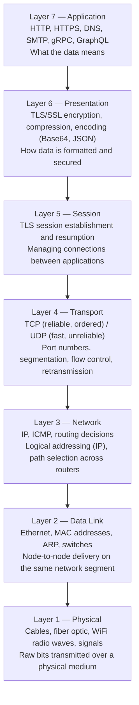
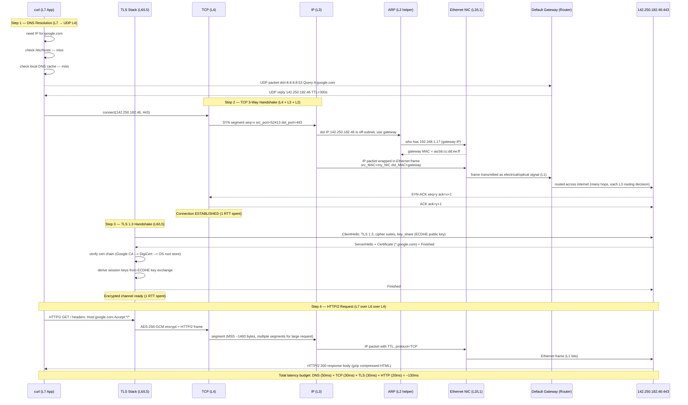

# OSI Model & Request Flow: `https://google.com`

## The 7 OSI Layers



| # | Layer | PDU name | Address type | Devices |
|---|-------|---------|--------------|---------|
| 7 | Application | Message/Data | URL, domain name | API Gateway, App Server |
| 6 | Presentation | Data | — | TLS terminator, CDN |
| 5 | Session | Data | Session ID | — |
| 4 | Transport | Segment (TCP) / Datagram (UDP) | Port number (0–65535) | Firewall, Load Balancer |
| 3 | Network | Packet | IP address | Router |
| 2 | Data Link | Frame | MAC address | Switch |
| 1 | Physical | Bit | — | Cable, NIC, WiFi |

**Practical note:** In real systems, L5 and L6 are absorbed by TLS. Think of it as: **Application → TLS → TCP/UDP → IP → Physical**.

---

## Full Request: `curl https://google.com`

This walks through every layer with every step.



---

## Layer-by-Layer What Actually Happens

### Layer 7 — Application

`curl` constructs:
```
GET / HTTP/2
Host: google.com
User-Agent: curl/8.4.0
Accept: */*
```

Initiates DNS resolution via OS `getaddrinfo()` syscall.

### Layer 6 — Presentation (TLS)

After TCP is up, TLS:
1. Negotiates cipher suite (e.g. `TLS_AES_256_GCM_SHA384`)
2. Exchanges ephemeral ECDH keys (X25519) — forward secrecy
3. Server presents certificate: `*.google.com`, signed by DigiCert
4. Client verifies: is the cert signed by a trusted CA in `/etc/ssl/certs/`? Is it expired? Does CN match `google.com`?
5. Both sides derive symmetric session keys — from this point all data is AES-256-GCM encrypted

### Layer 5 — Session

TLS manages session ID / session ticket for resumption. On reconnect, `TLS 1.3 0-RTT` can skip the handshake entirely using a pre-shared session ticket.

### Layer 4 — Transport (TCP)

```
Source port:      52413 (ephemeral, kernel picks from 32768-60999)
Destination port: 443
Sequence number:  randomised (SYN flooding protection)
Window size:      65535 bytes (receive buffer)
Flags:            SYN (connect), ACK (acknowledge), FIN (close), RST (reset)
```

TCP breaks HTTP request into **segments** of MSS ≈ 1460 bytes (1500 MTU - 20 IP header - 20 TCP header).

### Layer 3 — Network (IP)

```
Source IP:      192.168.1.50 (your machine)
Destination IP: 142.250.182.46 (google.com)
TTL:            64 (decremented at each router hop, drop at 0)
Protocol:       6 (TCP)
```

Routing table decision: `142.250.182.46` is not on local subnet → send to default gateway `192.168.1.1`.

### Layer 2 — Data Link (Ethernet)

Your machine doesn't know the MAC of `192.168.1.1` (the gateway). It sends an **ARP broadcast**:
```
"Who has IP 192.168.1.1? Tell 192.168.1.50"
Gateway replies: "192.168.1.1 is at aa:bb:cc:dd:ee:ff"
```

Frame structure:
```
Dst MAC: aa:bb:cc:dd:ee:ff (gateway)
Src MAC: 11:22:33:44:55:66 (your NIC)
EtherType: 0x0800 (IPv4)
Payload: IP packet
FCS: checksum
```

The **switch** uses MAC address table to forward the frame only to the correct port (not broadcast).

### Layer 1 — Physical

The Ethernet frame is serialized to:
- **Copper (Cat6):** voltage differences (0V = 0, +/-2.5V = 1) at 1 Gbps
- **Fiber:** light pulses (on = 1, off = 0) at 10-400 Gbps
- **WiFi:** radio waves modulated with QAM encoding

---

## Encapsulation / Decapsulation

Each layer wraps the layer above in its own header:

```
[L7: HTTP GET /]
[L6: TLS record header] [encrypted HTTP]
[L4: TCP header: src:52413 dst:443] [TLS record]
[L3: IP header: src:192.168.1.50 dst:142.250.182.46] [TCP segment]
[L2: Eth header: src_MAC dst_MAC] [IP packet] [FCS]
[L1: bits 0101101010...]
```

On the receiving side, each layer strips its header and passes the payload up.

---

## Why This Matters for Debugging

| Symptom | Which layer | Debug tool |
|---------|-------------|-----------|
| DNS resolution fails | L7 | `dig google.com`, `nslookup` |
| Connection refused (port closed) | L4 | `nc -zv host 443`, `ss -tlnp` |
| Connection timeout (no route) | L3 | `traceroute google.com`, `ping` |
| Packet loss (physical/link issue) | L1/L2 | `ping -c 100` (check loss %), `ethtool eth0` |
| TLS certificate error | L6 | `openssl s_client -connect google.com:443` |
| HTTP 4xx/5xx | L7 | `curl -v`, application logs |
