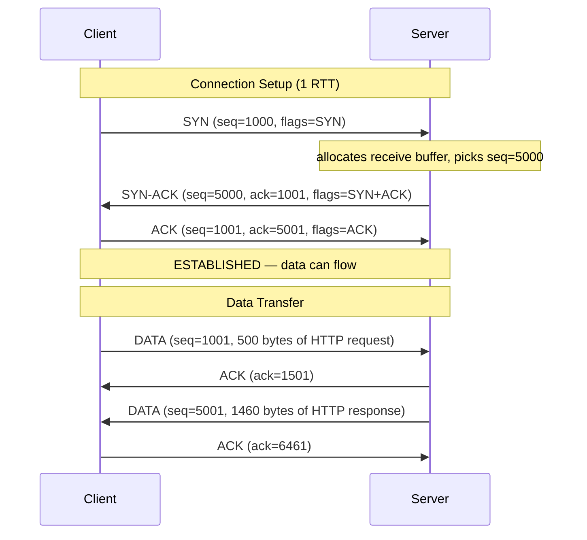
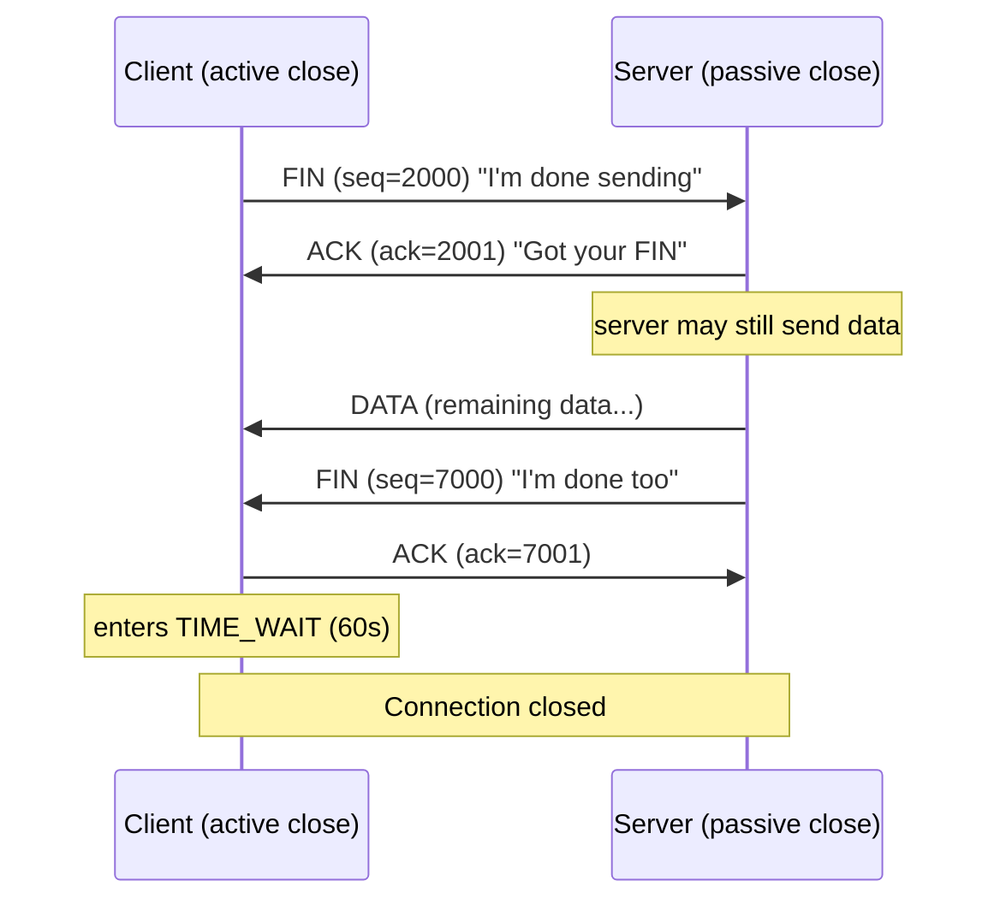
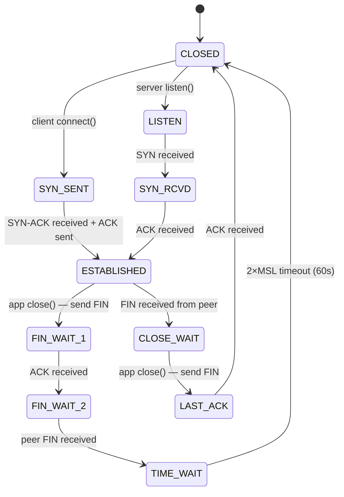
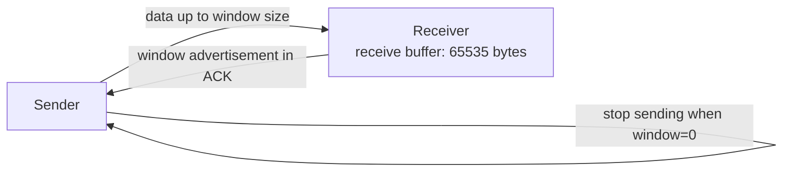
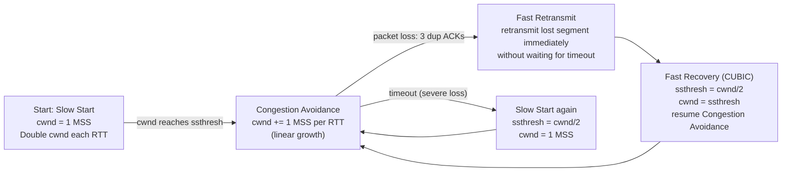
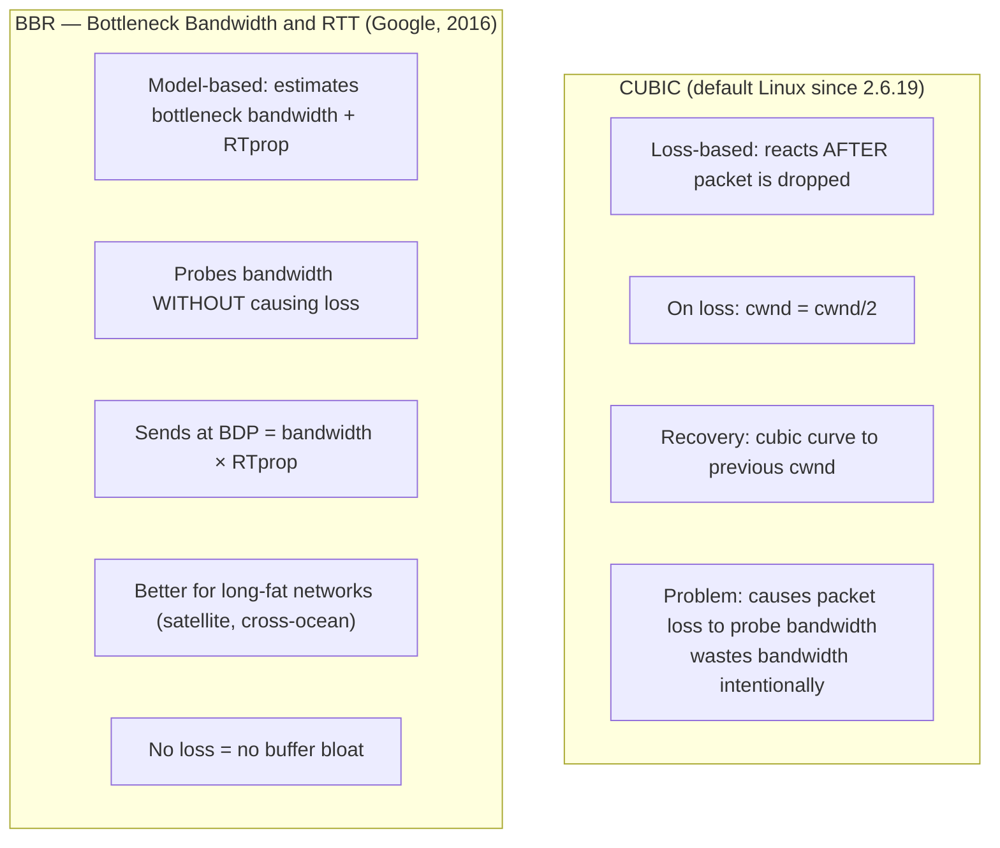
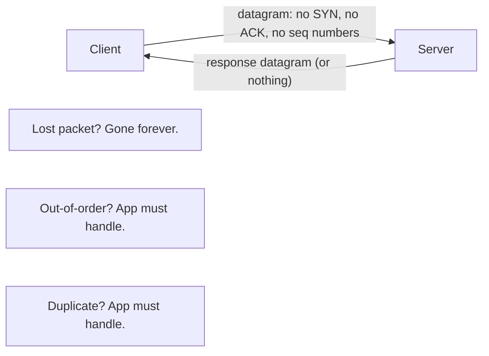
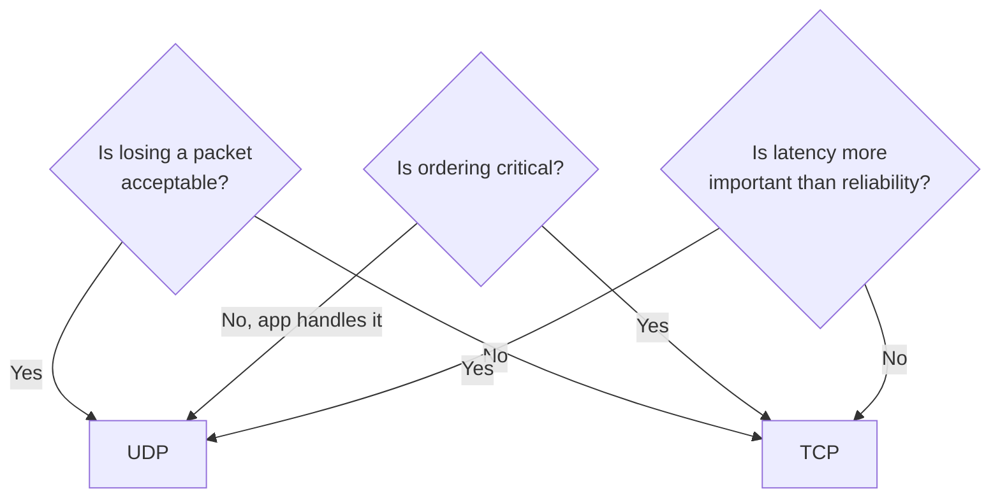

# TCP and UDP

## TCP — Transmission Control Protocol

TCP provides **reliable, ordered, error-checked** delivery of a byte stream between two endpoints. It guarantees every byte arrives exactly once and in order.

### 3-Way Handshake



**Sequence numbers** are byte offsets, not packet numbers. `seq=1001` means "this segment starts at byte 1001". `ack=1501` means "I received up to byte 1500, give me byte 1501 next".

### 4-Way Teardown



**Why 4-way?** FIN closes one direction only. Both sides must FIN independently. Half-close is valid — server can receive your FIN and keep sending data.

**TIME_WAIT (60s):** Client stays in TIME_WAIT after sending the last ACK. Prevents old packets from a dead connection being accepted by a new connection on the same port pair.

### TCP State Machine



### Flow Control — Receive Window



The receiver advertises how much buffer space it has (window size). Sender never sends more unacknowledged bytes than the window. If the app is slow to read, the buffer fills, window shrinks to 0 → sender stops. **Backpressure all the way to the source.**

### Congestion Control — CUBIC / BBR

Congestion control prevents a sender from overwhelming the network. The sender maintains a **congestion window (cwnd)** — the maximum number of unacknowledged bytes in flight.



**Phase 1 — Slow Start:**
```
cwnd starts at 1 MSS (Maximum Segment Size, ~1460 bytes)
Each ACK received → cwnd += 1 MSS
Effect: cwnd doubles every RTT (exponential)
Stops when cwnd >= ssthresh (slow start threshold, initially 64KB)
```

**Phase 2 — Congestion Avoidance:**
```
Each ACK → cwnd += (MSS × MSS) / cwnd
Effect: cwnd increases by 1 MSS per full RTT (linear)
Continues until packet loss detected
```

**Loss detection:**
- **Timeout:** No ACK for 1 RTO (Retransmission Timeout). Severe — resets cwnd to 1 MSS.
- **3 Duplicate ACKs:** Receiver keeps ACKing last good segment. Moderate loss — Fast Retransmit without full slow start.

**Concrete example (CUBIC):**
```
RTT 0: cwnd=1 (1 MSS = 1460 bytes in flight)
RTT 1: cwnd=2
RTT 2: cwnd=4
RTT 3: cwnd=8  (slow start, ssthresh not hit yet)
RTT 4: cwnd=16
RTT 5: cwnd=32
RTT 6: cwnd=64 = ssthresh → switch to congestion avoidance
RTT 7: cwnd=65
RTT 8: cwnd=66  (linear now)
...
RTT N: packet loss detected (3 dup ACKs)
     ssthresh = cwnd/2 = 33
     cwnd = 33 (fast recovery, not back to 1)
RTT N+1: cwnd=34 (resume linear growth from ssthresh)
```

### CUBIC vs BBR



| | CUBIC | BBR |
|--|-------|-----|
| Trigger | Packet loss | Bandwidth model |
| On loss | cwnd halved | No direct response to loss |
| Buffer bloat | Yes (fills buffers) | No |
| Cross-ocean links | Underperforms | Excellent |
| LAN / datacenter | Good | Can be aggressive |
| Default Linux | Yes (since 2.6.19) | Opt-in |

```bash
# Check current algorithm
sysctl net.ipv4.tcp_congestion_control
# tcp_congestion_control = cubic

# Enable BBR
modprobe tcp_bbr
sysctl -w net.ipv4.tcp_congestion_control=bbr
sysctl -w net.core.default_qdisc=fq   # required for BBR

# Persist
echo "net.core.default_qdisc=fq" >> /etc/sysctl.conf
echo "net.ipv4.tcp_congestion_control=bbr" >> /etc/sysctl.conf

# Verify BBR is active
ss -i | grep bbr
```

### CWND and BDP (Bandwidth-Delay Product)

```
BDP = bandwidth × RTT

Example: 1 Gbps link, 100ms RTT
BDP = 1,000,000,000 bits/s × 0.1s = 100,000,000 bits = 12.5 MB

The sender must have up to 12.5 MB of unacknowledged data in flight
to fully utilize a 1 Gbps link with 100ms RTT.

If cwnd < BDP → sender is artificially limited → underutilizing the link.
This is why TCP buffer sizes matter:
sysctl -w net.ipv4.tcp_rmem="4096 87380 134217728"  # 128MB max
```


### Key TCP Tuning

```bash
# Accept queue — how many completed handshakes kernel queues before app calls accept()
sysctl -w net.core.somaxconn=65535

# SYN queue — incomplete handshakes
sysctl -w net.ipv4.tcp_max_syn_backlog=65535

# TIME_WAIT reuse — allow outbound connections to reuse TIME_WAIT sockets
sysctl -w net.ipv4.tcp_tw_reuse=1

# Keepalive — detect dead connections (default 7200s = terrible)
sysctl -w net.ipv4.tcp_keepalive_time=60
sysctl -w net.ipv4.tcp_keepalive_intvl=10
sysctl -w net.ipv4.tcp_keepalive_probes=5

# Ephemeral port range (for many outbound connections)
sysctl -w net.ipv4.ip_local_port_range="1024 65535"
```

---

## UDP — User Datagram Protocol

UDP is **connectionless, unreliable, unordered**. No handshake, no ACK, no retransmit. Just send a datagram and hope.



**UDP header:** only 8 bytes (vs TCP's 20 bytes minimum):
```
Source Port (2B) | Dest Port (2B) | Length (2B) | Checksum (2B) | Data
```

### TCP vs UDP

| Feature | TCP | UDP |
|---------|-----|-----|
| Connection | 3-way handshake | None |
| Reliability | ACK + retransmit | No guarantee |
| Ordering | Sequence numbers | No |
| Overhead | 20+ byte header + handshake RTT | 8 byte header, no setup |
| Congestion control | Yes (CUBIC/BBR) | No (app responsibility) |
| Flow control | Receive window | No |
| Latency | Higher (ACK, retransmit delays) | Lower |
| Use case | HTTP, SSH, DB connections | DNS, QUIC, video, gaming |

### When to Use UDP



**DNS (UDP port 53):** Single query/response fits in one datagram. No need for a connection — fast, stateless. Falls back to TCP for responses > 512 bytes (EDNS0 increases this to 4096 bytes).

**QUIC / HTTP/3 (UDP):** Implements its own reliable delivery, multiplexing, and TLS on top of UDP. Avoids TCP's head-of-line blocking — one lost packet doesn't stall other streams.

**Video streaming (UDP):** A dropped frame is better than a frozen stream waiting for retransmit. Application uses FEC (Forward Error Correction) instead.

**Gaming:** Position updates are sent many times per second. A stale position is less harmful than waiting for retransmit of an old position.

### Checking Sockets

```bash
# List all UDP sockets
ss -u -a

# List all TCP sockets with process info
ss -t -p

# Show socket state counts
ss -s
# Estab, Time-Wait, Closed, Listen...

# netstat equivalent (older)
netstat -tlnp   # TCP listening with PID
netstat -an | grep TIME_WAIT | wc -l
```
