# TLS, SSL, and Encryption

## Encryption — The Big Picture (Generic)

Before TLS specifics, understand the three types of encryption and why HTTPS needs all three.

### 1. Symmetric Encryption — One Shared Key

Both sides use the **same key** to lock and unlock.

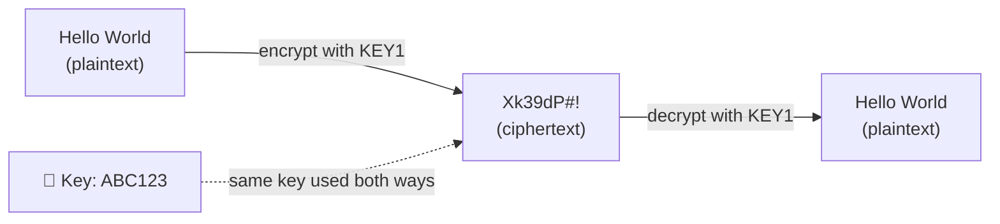

**Problem:** How do you share the key? If an attacker intercepts it, they can decrypt everything.

**Fast:** AES-256-GCM encrypts ~1 GB/s. Used for all bulk data.

### 2. Asymmetric Encryption — Public/Private Key Pair

Two mathematically linked keys. **Public key encrypts, private key decrypts.** The private key never leaves the server.

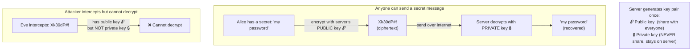

**Problem:** 100× slower than symmetric. Can't use for bulk data.

### 3. How HTTPS Combines Both (Hybrid Encryption)

HTTPS uses asymmetric only to **agree on a shared key**, then uses symmetric for all data:

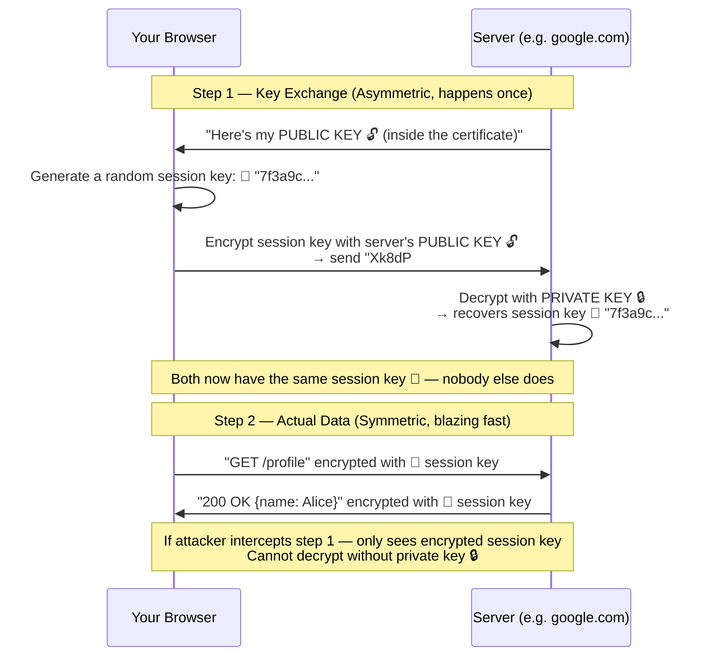

**Summary of what each does in HTTPS:**

| Crypto type | Used for | Why |
|-------------|---------|-----|
| Asymmetric (RSA/ECDH) | Key exchange only | Solves the key-sharing problem |
| Symmetric (AES-256-GCM) | All actual data | Fast enough for gigabytes |
| Hashing (SHA-256) | Certificate signatures, MAC | Verify nothing was tampered with |

---

## Symmetric vs Asymmetric — Side by Side

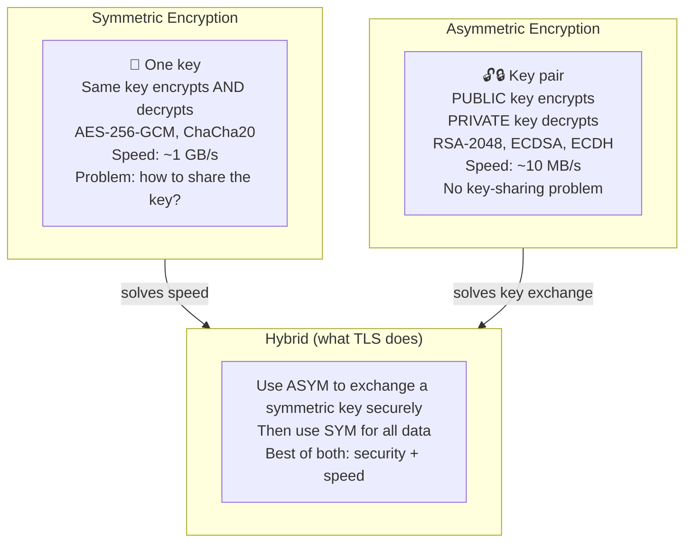

---


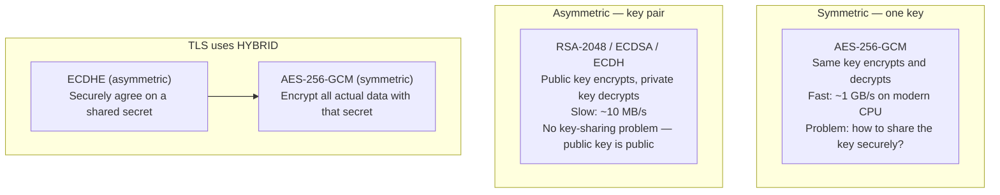

**Why hybrid?** Asymmetric crypto solves the key exchange problem but is 100× slower than AES. TLS uses asymmetric only to agree on a shared session key, then switches to AES for all data.

**Forward Secrecy (ECDHE):** Each session generates a new ephemeral key pair. The server's long-term private key is never used to encrypt data — only to authenticate. If the private key is stolen years later, past sessions cannot be decrypted.

---

## SSL vs TLS History

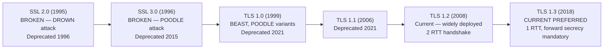

**Minimum acceptable today:** TLS 1.2. Prefer TLS 1.3.

---

## TLS 1.2 Handshake (2 RTT)

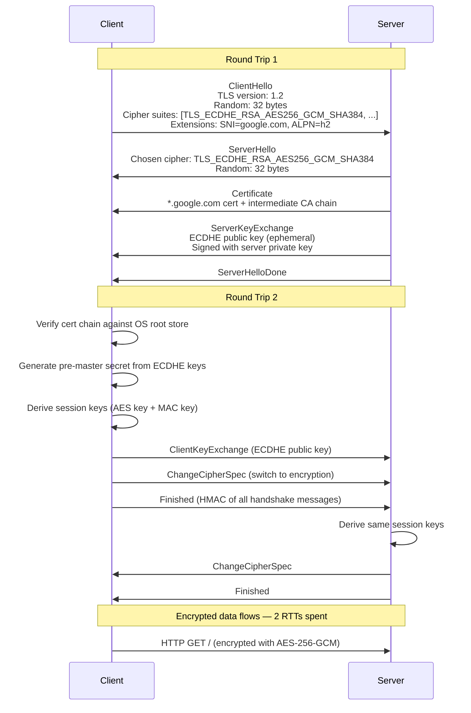

---

## TLS 1.3 Handshake (1 RTT)

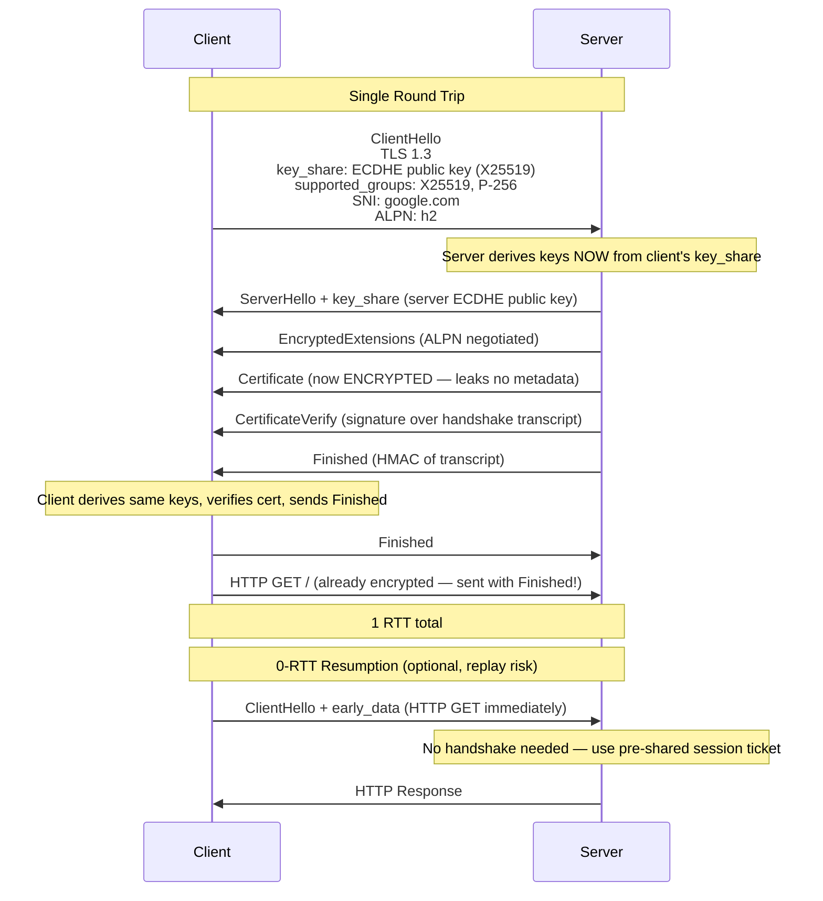

**TLS 1.3 vs TLS 1.2:**

| Feature | TLS 1.2 | TLS 1.3 |
|---------|---------|---------|
| Handshake RTTs | 2 | 1 (0 with resumption) |
| Forward secrecy | Optional (RSA key exchange exists) | Mandatory (ECDHE only) |
| Certificate visibility | Plaintext to network | Encrypted |
| Weak ciphers | RC4, 3DES, MD5 allowed | All removed |
| Session resumption | Session ID or ticket | PSK (pre-shared key) |
| Key exchange | RSA or ECDHE | ECDHE only (X25519, P-256) |

---

## TLS Certificate Chain

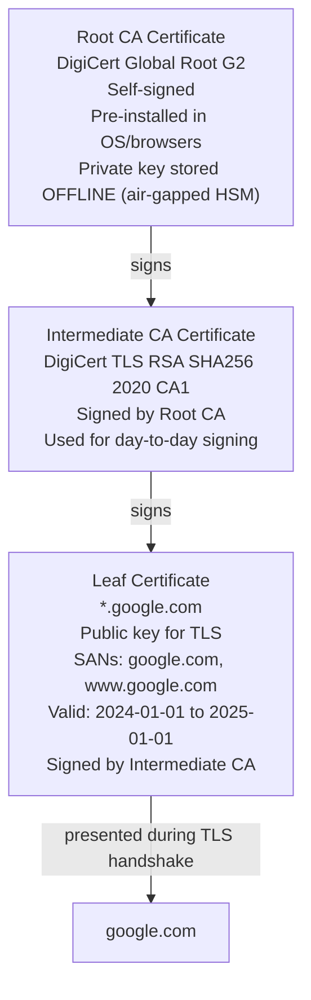

**Certificate fields:**
```
Subject:    CN=*.google.com
Issuer:     CN=DigiCert TLS RSA SHA256 2020 CA1
SANs:       DNS:*.google.com, DNS:google.com
Not Before: 2024-01-15 00:00:00 UTC
Not After:  2025-02-14 23:59:59 UTC
Public Key: EC 256-bit (P-256)
Signature:  SHA256WithRSA
```

**Why 3 levels?** Root CA private keys are air-gapped — never online. Intermediate CA does daily signing. If an intermediate is compromised, revoke it without touching the root. The root change would require every OS/browser to update their trust store.

### Certificate Validation Steps

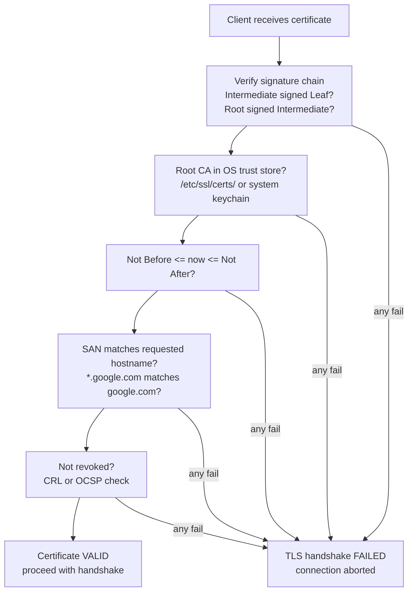

---

## Debugging TLS

```bash
# Full TLS handshake inspection
openssl s_client -connect google.com:443 -servername google.com
# Shows: cipher, cert chain, handshake details

# Check TLS version and cipher
openssl s_client -connect google.com:443 -tls1_3 2>/dev/null | grep "Protocol\|Cipher"

# Certificate expiry check
openssl s_client -connect google.com:443 2>/dev/null | openssl x509 -noout -dates

# Check all SANs on a certificate
openssl s_client -connect google.com:443 2>/dev/null | openssl x509 -noout -text | grep -A2 "Subject Alternative"

# Test specific TLS version (should fail for 1.0/1.1 on modern servers)
openssl s_client -connect google.com:443 -tls1   # TLS 1.0 — should fail
openssl s_client -connect google.com:443 -tls1_2 # TLS 1.2 — should work
openssl s_client -connect google.com:443 -tls1_3 # TLS 1.3 — should work

# curl with verbose TLS info
curl -v --tlsv1.3 https://google.com 2>&1 | grep -i "TLS\|SSL\|cert\|cipher"
```

---

## Diffie-Hellman Key Exchange — The Mathematics

Diffie-Hellman solves a fundamental problem: **two parties can agree on a shared secret over a public channel without ever transmitting the secret itself**. Anyone eavesdropping sees only public values and cannot derive the secret.

### Classic DH (Finite Field)

**Public parameters (known to everyone, including attackers):**
```
p = a large prime number (e.g., 2048-bit)
g = a generator (primitive root mod p, typically g=2 or g=5)
```

**The exchange:**

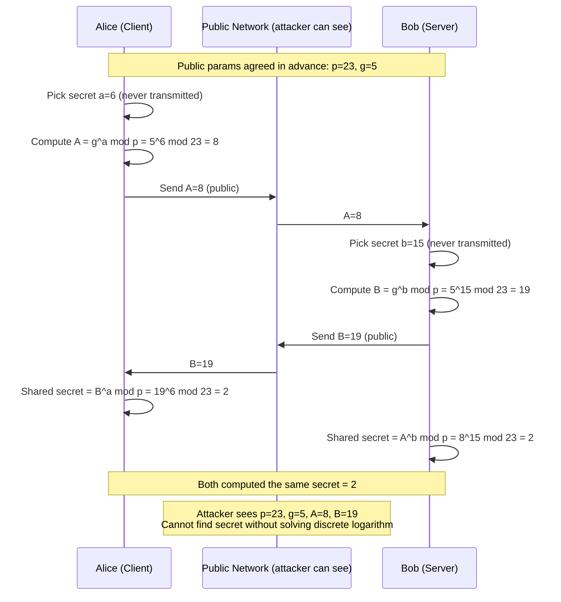

**Why it works — the math:**
```
Alice computes: s = B^a mod p = (g^b mod p)^a mod p = g^(ab) mod p
Bob computes:   s = A^b mod p = (g^a mod p)^b mod p = g^(ab) mod p

Both get g^(ab) mod p — the shared secret.
Attacker has A = g^a mod p and B = g^b mod p.
To find a from A = g^a mod p → Discrete Logarithm Problem.
No efficient algorithm known for large p (2048+ bits).
```

**The Discrete Logarithm Problem:** Given `g`, `p`, and `A = g^a mod p`, find `a`. Easy in one direction (exponentiation: fast), computationally infeasible in reverse for large primes.

---

### ECDH — Elliptic Curve Diffie-Hellman (Used in TLS 1.3)

Classic DH uses modular arithmetic. ECDH uses **points on an elliptic curve** — same mathematical structure, but achieves equivalent security with much smaller keys.

```
Elliptic curve equation: y² = x³ + ax + b  (over a finite field)
```

**Why elliptic curves?**

| Algorithm | Key size for ~128-bit security | Key size for ~256-bit security |
|-----------|-------------------------------|-------------------------------|
| Classic DH (finite field) | 3072 bits | 15360 bits |
| ECDH | 256 bits | 512 bits |
| RSA | 3072 bits | 15360 bits |

Smaller keys → faster computation, smaller TLS handshake messages, less CPU.

**Point multiplication on a curve:**

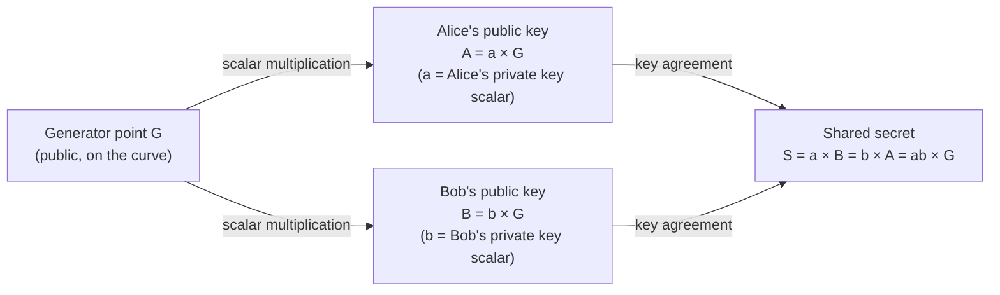

**The math:**
```
Public curve parameters: curve equation + generator point G + field order n

Alice: pick private key a (random integer)
       compute public key A = a × G  (point multiplication on curve)

Bob:   pick private key b (random integer)
       compute public key B = b × G

Alice: shared secret = a × B = a × (b × G) = ab × G
Bob:   shared secret = b × A = b × (a × G) = ab × G

Both get the same point ab × G.
Attacker sees G, A, B. Must find a from A = a × G → Elliptic Curve Discrete Log Problem (ECDLP).
No efficient algorithm known.
```

**Point multiplication** (`a × G`) means: add point G to itself `a` times using the curve's addition law. Repeated doubling makes this O(log a) — fast. Reversing it (finding `a` given `G` and `a × G`) has no known polynomial-time algorithm.

---

### ECDHE — Ephemeral ECDH (what TLS 1.3 actually uses)

ECDHE = ECDH + **Ephemeral**. A new key pair is generated for every TLS session.

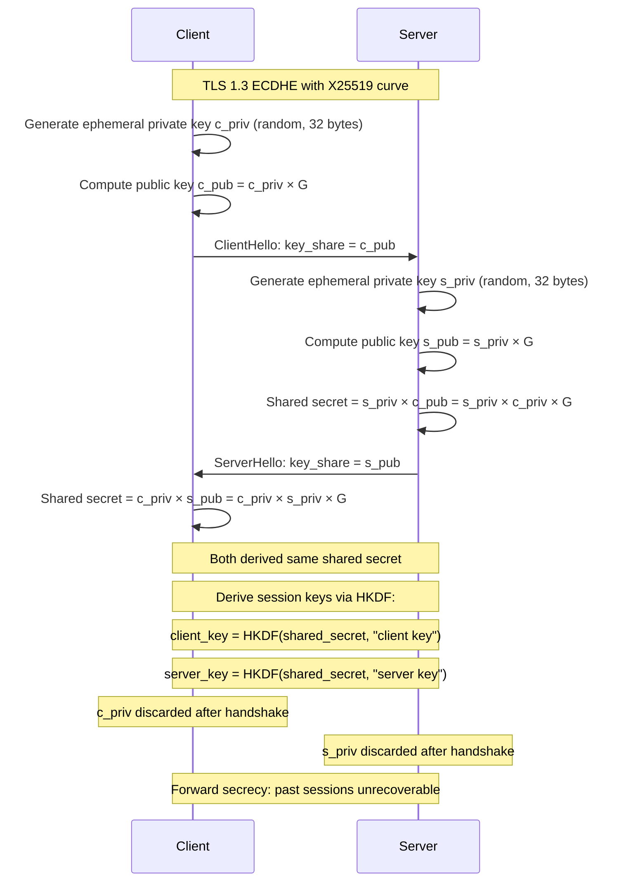

**Why "ephemeral" = forward secrecy:**
- Static DH: server uses the same private key for all sessions. Steal the private key → decrypt all past recorded traffic.
- Ephemeral DH: server generates a new private key per session and **discards it after the handshake**. Steal the long-term private key → can only impersonate future connections, cannot decrypt past traffic. Each session's key material is gone forever.

---

### X25519 — The Curve Used in TLS 1.3

TLS 1.3 mandates support for **X25519** (Curve25519). Designed by Daniel J. Bernstein.

```
Curve equation: y² = x³ + 486662x² + x  (over the field of integers mod 2^255 - 19)
Base point G: u = 9
Field size: 2^255 - 19 (a Mersenne-like prime, chosen for fast arithmetic)
Key size: 256 bits
Security level: ~128 bits
```

**Why X25519 over P-256 (NIST)?**

| | X25519 | P-256 (NIST) |
|--|--------|-------------|
| Speed | Faster (~2× on most CPUs) | Slower |
| Side-channel resistance | Designed to resist timing attacks | Vulnerable without careful implementation |
| Standardized by | IETF RFC 7748 | NIST |
| Trust | No NIST involvement (controversial) | NIST-approved |
| TLS 1.3 | Preferred | Supported |

---

### From Shared Secret to Session Keys (HKDF)

The raw ECDHE output (a point on the curve) is not directly used as an AES key. It goes through **HKDF (HMAC-based Key Derivation Function)**:

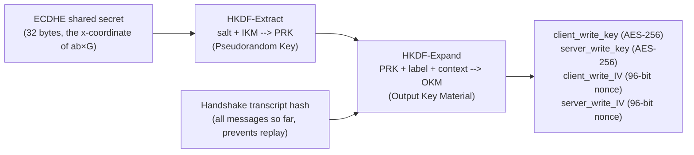

The **transcript hash** binds the keys to this specific handshake — prevents man-in-the-middle attacks where an attacker replays a valid key exchange from a different session.

**Summary of TLS 1.3 key derivation:**
```
ECDHE_secret = s_priv × c_pub  (x-coordinate of the curve point)
early_secret = HKDF-Extract(0, PSK or 0)
handshake_secret = HKDF-Extract(derived(early_secret), ECDHE_secret)
master_secret = HKDF-Extract(derived(handshake_secret), 0)

client_handshake_traffic_secret = HKDF-Expand-Label(handshake_secret, "c hs traffic", transcript_hash)
server_handshake_traffic_secret = HKDF-Expand-Label(handshake_secret, "s hs traffic", transcript_hash)
```
