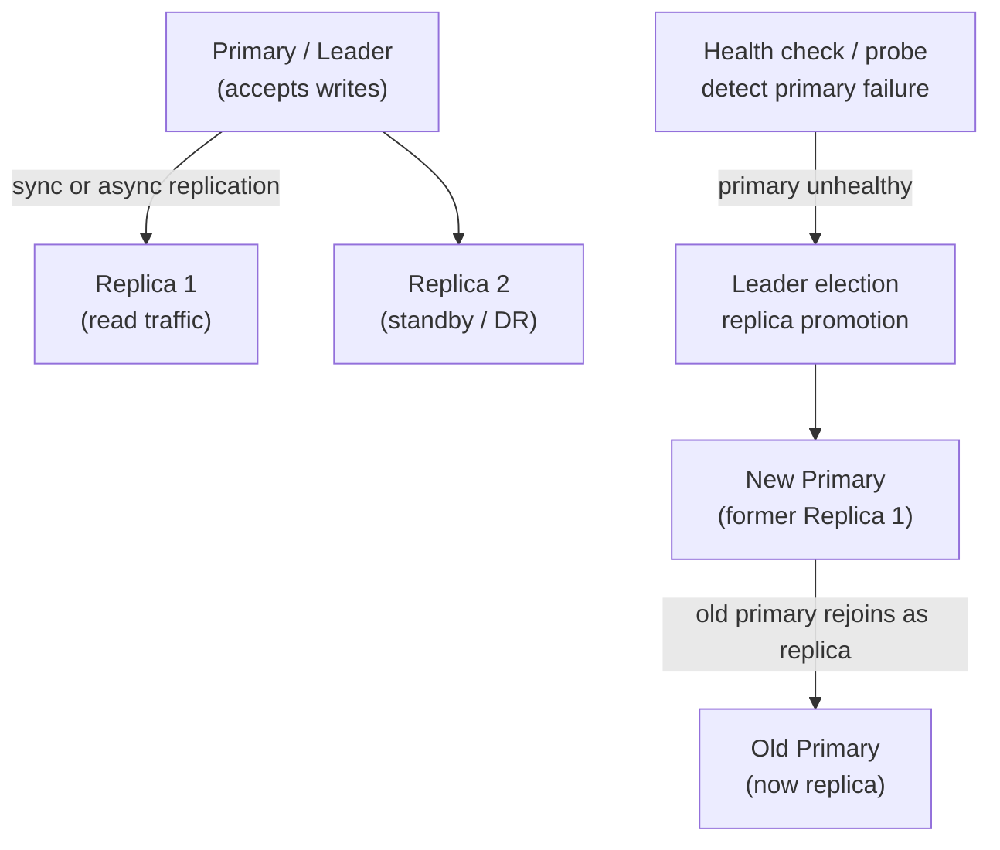
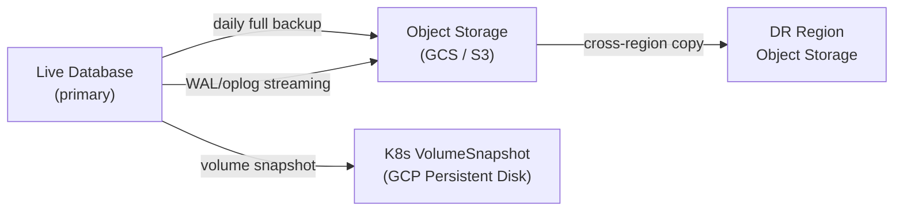

# Databases on Kubernetes (GKE / On-Prem)

Running stateful databases on Kubernetes — system design, replication, failover, snapshots, and operational patterns for each database.

## Why Run DBs on K8s?

Running databases on Kubernetes is operationally harder than managed services (Cloud SQL, RDS) but gives you:
- **Cost control** — no managed service markup (3-5× cheaper at scale)
- **Portability** — same setup on GKE, EKS, on-prem
- **Customization** — specific versions, plugins, tuning impossible in managed offerings
- **Data residency** — compliance requirements that forbid managed cloud DBs

**When NOT to run DBs on K8s:** Small teams, < 3 engineers who understand K8s storage, or when managed services fit your compliance requirements. Operational burden is real.

## Files

| File | Database | Topics |
|------|----------|--------|
| [postgres.md](./postgres.md) | PostgreSQL | StatefulSet, Patroni HA, sync/async replication, automatic failover, PITR, pgbackup |
| [mysql.md](./mysql.md) | MySQL | Operator, InnoDB Cluster, semi-sync replication, master promotion, XtraBackup |
| [mongodb.md](./mongodb.md) | MongoDB | Replica set on K8s, elections, oplog, readPreference, mongodump/mongorestore |
| [redis-cluster.md](./redis-cluster.md) | Redis Cluster | Sharding, slot distribution, sentinel vs cluster, persistence (RDB/AOF), failover |
| [kafka.md](./kafka.md) | Apache Kafka | Strimzi operator, partition replication, ISR, leader election, consumer groups |
| [clickhouse.md](./clickhouse.md) | ClickHouse | ClickHouse Operator, sharding, replication via ZooKeeper/ClickHouse Keeper, backups |

## Common Patterns Across All DBs

### Sync vs Async Replication

| | Synchronous | Asynchronous |
|--|-------------|--------------|
| Write completes when | Primary AND replica(s) confirm write | Primary confirms, replica catches up later |
| Data loss on failover | Zero (replica has all data) | Up to replication lag (seconds to minutes) |
| Write latency | Higher (waits for replica ACK) | Lower (just primary write) |
| Replica lag | Zero | Can fall behind under load |
| Use case | Financial data, critical records | Read replicas, analytics, DR |

### Snapshot Strategy (3-2-1 Rule)

- **Full snapshot:** daily, retained 7 days
- **WAL/incremental:** continuous, enables PITR (Point-In-Time Recovery)
- **Cross-region copy:** at least one copy in different region/zone
- **Test restores:** weekly automated restore test — an untested backup is not a backup
