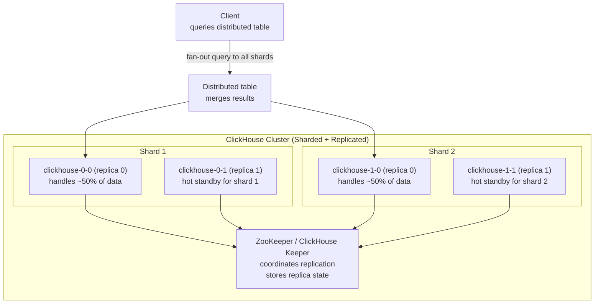
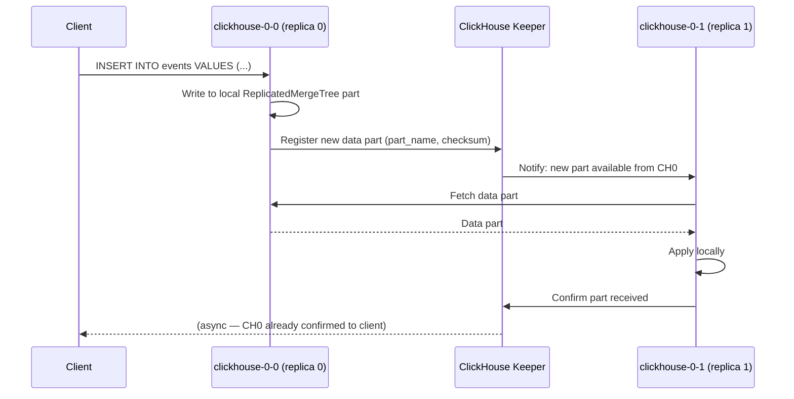

# ClickHouse on Kubernetes

## Architecture



**Distributed table** — a virtual table that fans queries out to all shards and merges results. Actual data lives in `MergeTree` tables on each shard.

---

## Replication with ClickHouse Keeper



**ClickHouse replication is asynchronous by default.** The INSERT returns when the local replica writes it. The keeper coordinates other replicas fetching it. This can lead to stale reads from a replica.

---

## ClickHouse Operator (Altinity)

```yaml
apiVersion: clickhouse.altinity.com/v1
kind: ClickHouseInstallation
metadata:
  name: clickhouse
spec:
  configuration:
    clusters:
    - name: main
      layout:
        shardsCount: 2
        replicasCount: 2
    zookeeper:
      nodes:
      - host: zookeeper-0.zookeeper-headless
      - host: zookeeper-1.zookeeper-headless
      - host: zookeeper-2.zookeeper-headless
    settings:
      max_connections: 200
      max_concurrent_queries: 100

  templates:
    volumeClaimTemplates:
    - name: data
      spec:
        accessModes: ["ReadWriteOnce"]
        storageClassName: premium-rwo
        resources:
          requests:
            storage: 500Gi
```

---

## Backups with clickhouse-backup

```bash
# Install clickhouse-backup
# Create full backup to GCS
clickhouse-backup create --tables "mydb.*" full_backup_$(date +%Y%m%d)
clickhouse-backup upload full_backup_$(date +%Y%m%d)

# Incremental backup (since last full)
clickhouse-backup create --diff-from full_backup_20240101 incr_$(date +%Y%m%d)
clickhouse-backup upload incr_$(date +%Y%m%d)

# Restore
clickhouse-backup download full_backup_20240101
clickhouse-backup restore full_backup_20240101

# Run as K8s CronJob
apiVersion: batch/v1
kind: CronJob
spec:
  schedule: "0 2 * * *"
  jobTemplate:
    spec:
      template:
        spec:
          containers:
          - name: backup
            image: altinity/clickhouse-backup:latest
            command: [clickhouse-backup, create-and-upload]
            env:
            - name: GCS_BUCKET
              value: my-clickhouse-backups
```

---

## Monitoring

```promql
# Queries per second
rate(ClickHouseMetrics_Query[5m])

# Memory usage
ClickHouseMetrics_MemoryTracking / ClickHouseAsyncMetrics_MemoryTotal > 0.8

# Replication queue lag (alert if > 100 parts behind)
ClickHouseMetrics_ReplicatedChecks > 100

# Merge queue (writes slow if too high)
ClickHouseMetrics_BackgroundPoolTask > 50
```
