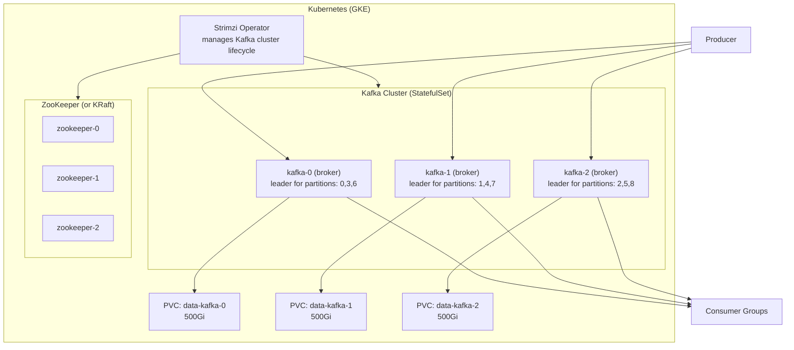
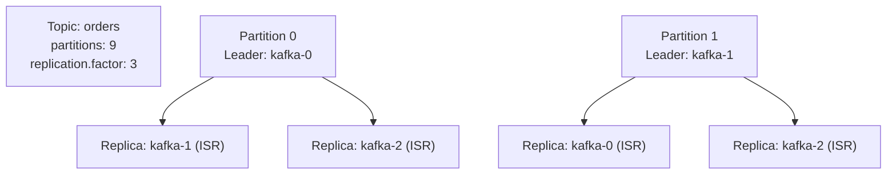
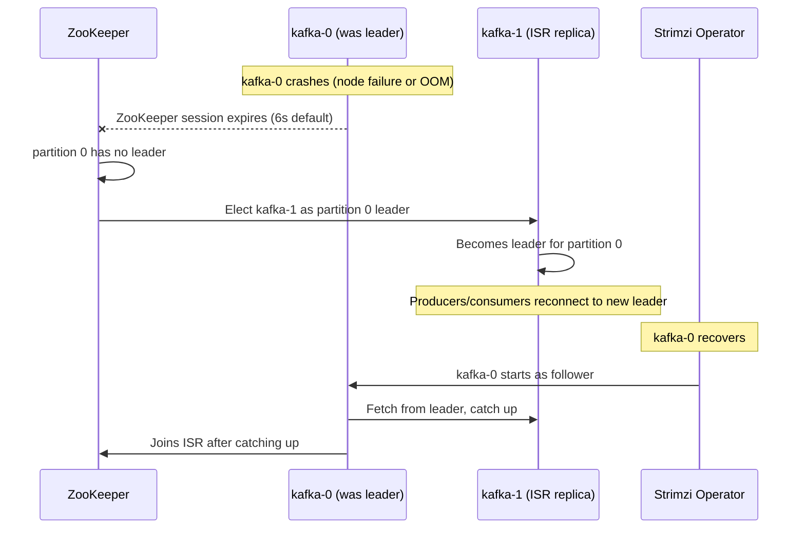
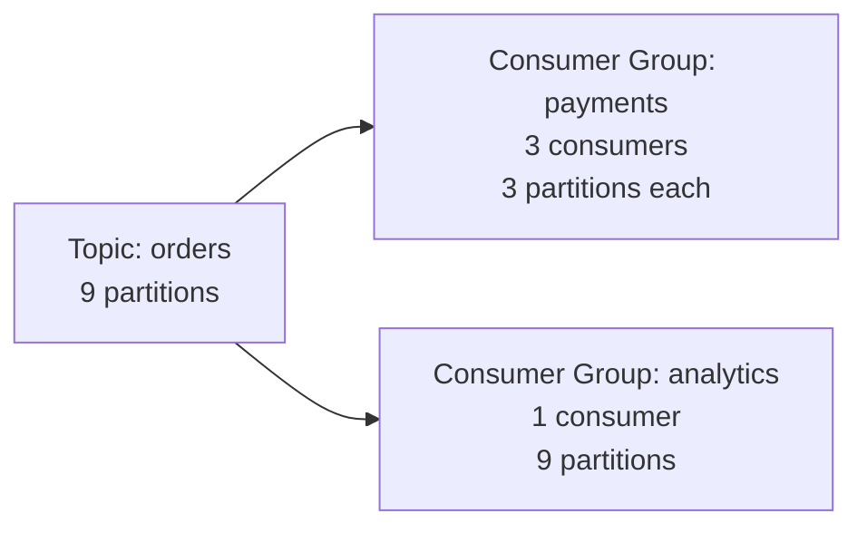

# Apache Kafka on Kubernetes (Strimzi Operator)

## Architecture



---

## Topic Replication and ISR



**ISR (In-Sync Replicas):** Replicas that are fully caught up with the leader (within `replica.lag.time.max.ms = 10000ms`). A replica falls out of ISR if it falls behind.

**`min.insync.replicas`:** Minimum ISR count required for a write to succeed. With `replication.factor=3` and `min.insync.replicas=2`: a write succeeds if at least 2 replicas (including leader) acknowledge it. One broker can fail with zero data loss.

```yaml
# Topic config
min.insync.replicas: 2
replication.factor: 3
```

```yaml
# Producer config for guaranteed delivery
acks: all             # wait for all ISR replicas to confirm
retries: 2147483647   # retry indefinitely
enable.idempotence: true  # exactly-once semantics
```

---

## Partition Leader Election (Failover)



**Unclean leader election:** If ALL ISR replicas are down, Kafka can optionally elect an out-of-sync replica (`unclean.leader.election.enable=true`). **Never enable in production** — guarantees data loss.

---

## Strimzi Kafka Cluster YAML

```yaml
apiVersion: kafka.strimzi.io/v1beta2
kind: Kafka
metadata:
  name: my-kafka
spec:
  kafka:
    version: 3.6.0
    replicas: 3
    listeners:
      - name: plain
        port: 9092
        type: internal
        tls: false
      - name: tls
        port: 9093
        type: internal
        tls: true
    config:
      offsets.topic.replication.factor: 3
      transaction.state.log.replication.factor: 3
      transaction.state.log.min.isr: 2
      default.replication.factor: 3
      min.insync.replicas: 2
      log.retention.hours: 168       # 7 days retention
      log.segment.bytes: 1073741824  # 1GB segments
    storage:
      type: persistent-claim
      size: 500Gi
      class: premium-rwo             # GKE SSD storage class
    resources:
      requests:
        memory: 8Gi
        cpu: 2
      limits:
        memory: 16Gi
        cpu: 4
    jvmOptions:
      -Xms: 4096m
      -Xmx: 4096m

  zookeeper:
    replicas: 3
    storage:
      type: persistent-claim
      size: 50Gi
      class: premium-rwo
```

---

## Consumer Groups and Lag



```bash
# Check consumer group lag
kubectl exec -it kafka-0 -- kafka-consumer-groups.sh \
  --bootstrap-server localhost:9092 \
  --describe --group payments

# TOPIC   PARTITION  CURRENT-OFFSET  LOG-END-OFFSET  LAG
# orders  0          1500            1500            0
# orders  1          1480            1520            40   <- lagging!
# orders  2          1600            1600            0

# Alert if lag > threshold
# Prometheus: kafka_consumer_group_lag > 1000
```

---

## Backups

Kafka doesn't have a built-in backup mechanism. Options:

1. **MirrorMaker 2** — replicate topics to another cluster (GKE → GCS via Kafka Connect)
2. **Kafka Connect S3 Sink** — stream all messages to GCS/S3
3. **Volume snapshots** — snapshot PVCs (consistent only if broker is stopped first)

```yaml
# Kafka Connect S3 Sink (backup all topics to GCS)
apiVersion: kafka.strimzi.io/v1beta2
kind: KafkaConnector
spec:
  class: io.confluent.connect.s3.S3SinkConnector
  config:
    topics: ".*"
    s3.bucket.name: my-kafka-backup
    s3.region: us-central1
    flush.size: 1000
    rotate.interval.ms: 3600000  # rotate files every hour
```
