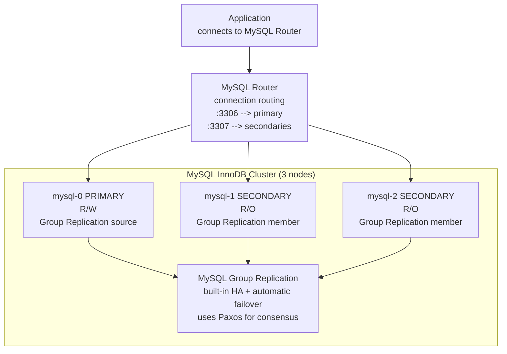
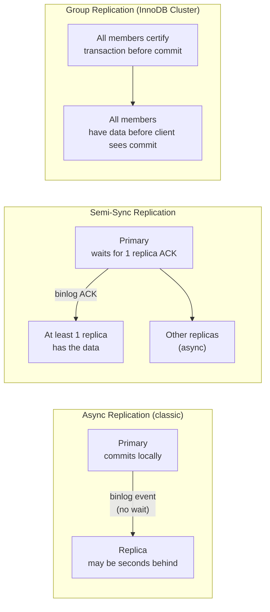
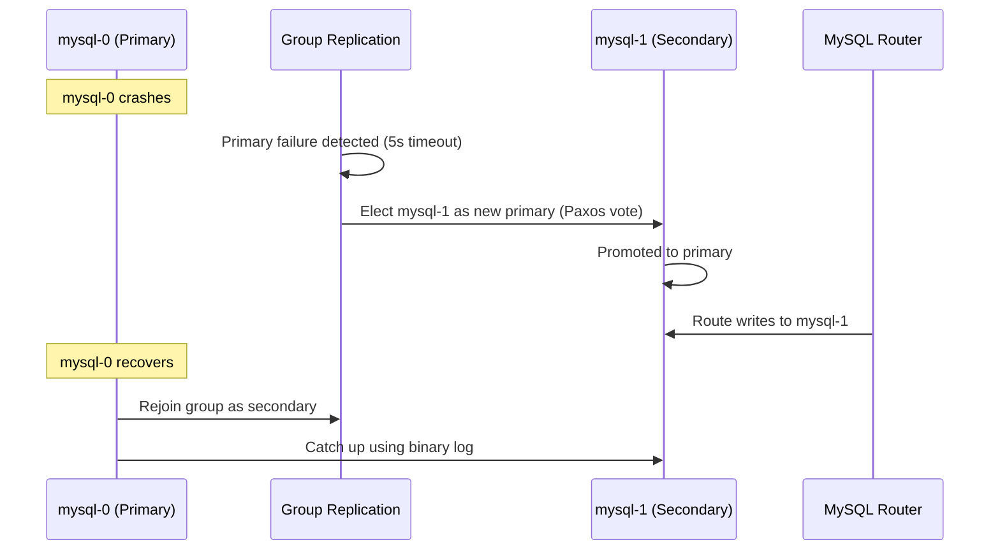

# MySQL on Kubernetes

## Architecture with MySQL Operator (Oracle)



MySQL Group Replication uses a Paxos-based consensus protocol — every transaction is certified by a majority of members before committing. This gives **virtually synchronous replication** — no data loss on failover.

---

## Replication Types



| Mode | Data loss on failover | Write latency | Use case |
|------|----------------------|---------------|---------|
| Async | Up to replication lag | Lowest | Read replicas, reporting |
| Semi-sync | Zero (for 1 replica) | +1 RTT to replica | Production HA |
| Group Replication | Zero | +1-2ms (consensus) | Production HA, automatic failover |

---

## MySQL Operator YAML

```yaml
apiVersion: mysql.oracle.com/v2
kind: InnoDBCluster
metadata:
  name: mysql
spec:
  secretName: mysql-secret   # root password
  tlsUseSelfSigned: true
  instances: 3
  router:
    instances: 2             # MySQL Router pods for HA routing
  datadirVolumeClaimTemplate:
    accessModes: [ReadWriteOnce]
    resources:
      requests:
        storage: 100Gi
    storageClassName: premium-rwo
  mycnf: |
    [mysqld]
    max_connections=500
    innodb_buffer_pool_size=4G
    binlog_expire_logs_seconds=604800  # 7 days binlog retention
    slow_query_log=ON
    long_query_time=1
```

---

## Failover



---

## Backups with XtraBackup

```bash
# Physical hot backup (no locks, consistent)
xtrabackup --backup \
  --user=backup_user \
  --password=$PASS \
  --target-dir=/backup/$(date +%Y%m%d)

# Upload to GCS
gsutil -m rsync -r /backup/$(date +%Y%m%d) gs://my-mysql-backups/$(date +%Y%m%d)/

# Prepare backup for restore
xtrabackup --prepare --target-dir=/backup/20240115

# Restore
xtrabackup --copy-back --target-dir=/backup/20240115
chown -R mysql:mysql /var/lib/mysql
```

---

## Monitoring

```promql
# Replication lag in seconds
mysql_slave_status_seconds_behind_master > 30

# Connection usage
mysql_global_status_threads_connected / mysql_global_variables_max_connections > 0.8

# InnoDB buffer pool hit rate (alert < 95%)
mysql_global_status_innodb_buffer_pool_read_requests /
(mysql_global_status_innodb_buffer_pool_read_requests +
 mysql_global_status_innodb_buffer_pool_reads) < 0.95

# Slow queries per second
rate(mysql_global_status_slow_queries[5m]) > 0
```

---

## MySQL on Kubernetes — Oracle MySQL Operator

```bash
# Install MySQL Operator
helm repo add mysql-operator https://mysql.github.io/mysql-operator/
helm install mysql-operator mysql-operator/mysql-operator \
  --namespace mysql-operator --create-namespace
```

```yaml
# Secret
apiVersion: v1
kind: Secret
metadata:
  name: mysql-secret
  namespace: mysql
type: Opaque
stringData:
  rootUser: root
  rootPassword: "changeme"
---
# 3-node InnoDB Cluster (1 primary + 2 secondary, Group Replication)
apiVersion: mysql.oracle.com/v2
kind: InnoDBCluster
metadata:
  name: mysql
  namespace: mysql
spec:
  secretName: mysql-secret
  tlsUseSelfSigned: true
  instances: 3
  router:
    instances: 2        # MySQL Router pods — route :6446 to primary, :6447 to replicas
  mycnf: |
    [mysqld]
    max_connections = 500
    innodb_buffer_pool_size = 4G
    slow_query_log = ON
    long_query_time = 1
  datadirVolumeClaimTemplate:
    accessModes: [ReadWriteOnce]
    storageClassName: gp3
    resources:
      requests:
        storage: 100Gi
  podSpec:
    containers:
    - name: mysql
      resources:
        requests:
          cpu: "2"
          memory: 8Gi
        limits:
          cpu: "4"
          memory: 16Gi
```

```bash
# Check cluster status
kubectl get innodbcluster mysql -n mysql
# NAME    STATUS   ONLINE   INSTANCES   ROUTERS
# mysql   ONLINE   3        3           2

# Connect via Router (auto-routes to primary)
kubectl port-forward svc/mysql-router 6446:6446 -n mysql
mysql -h 127.0.0.1 -P 6446 -u root -p

# Check Group Replication status
kubectl exec -it mysql-0 -n mysql -- \
  mysql -u root -p -e "SELECT * FROM performance_schema.replication_group_members;"
```

```yaml
# Headless service: direct pod DNS (mysql-0.mysql.mysql.svc.cluster.local)
apiVersion: v1
kind: Service
metadata:
  name: mysql
  namespace: mysql
spec:
  clusterIP: None
  selector:
    app: mysql
  ports:
  - port: 3306
```
