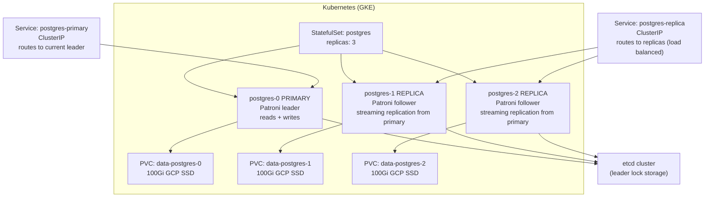
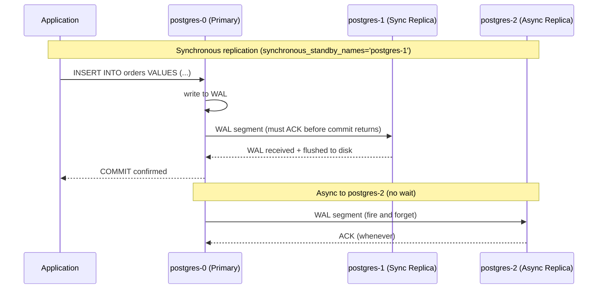
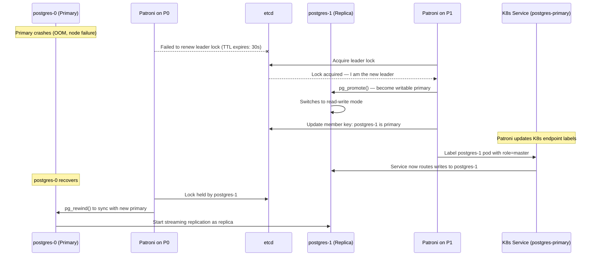
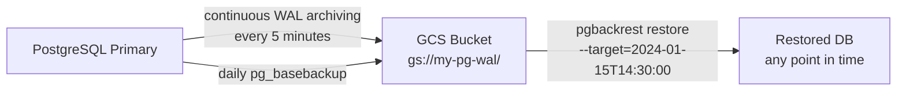
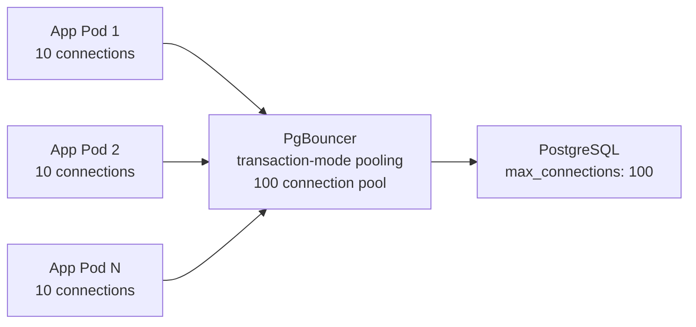

# PostgreSQL on Kubernetes (GKE)

## Architecture with Patroni (High Availability)

Patroni is the standard solution for PostgreSQL HA on K8s. It uses etcd/Consul/ZooKeeper as a distributed lock to manage leader election.



Patroni maintains the leader lock in etcd. If the primary fails to renew the lock within `ttl` seconds, a replica acquires the lock and promotes itself.

---

## Sync vs Async Replication



```sql
-- PostgreSQL synchronous replication config
-- postgresql.conf
synchronous_standby_names = 'FIRST 1 (postgres-1)'
-- FIRST 1: wait for at least 1 sync replica to confirm
-- This guarantees zero data loss on postgres-1

-- Check replication lag
SELECT
    client_addr,
    state,
    sent_lsn - write_lsn AS write_lag,
    sent_lsn - flush_lsn AS flush_lag,
    sent_lsn - replay_lsn AS replay_lag
FROM pg_stat_replication;
```

**Trade-off:** Synchronous replication adds latency equal to the round trip to the replica. If the sync replica is in a different zone (recommended), that's 1-5ms extra per write.

---

## Automatic Failover with Patroni



**Failover time:** ~30 seconds (default TTL). Tune with `ttl`, `loop_wait`, `retry_timeout` in Patroni config.

---

## Patroni Configuration (Helm)

```yaml
# values.yaml for Patroni
patroni:
  postgresql:
    parameters:
      max_connections: 200
      shared_buffers: "4GB"
      effective_cache_size: "12GB"
      wal_level: replica
      max_wal_senders: 10
      hot_standby: "on"
      synchronous_commit: "remote_write"  # sync to WAL on replica, not full flush

  bootstrap:
    dcs:
      ttl: 30               # seconds before leader lock expires
      loop_wait: 10         # check interval
      retry_timeout: 10     # operation timeout
      maximum_lag_on_failover: 1048576  # 1MB max lag — don't promote if replica is too far behind
      postgresql:
        use_pg_rewind: true  # allow old primary to rejoin as replica without full resync
        use_slots: true      # replication slots (prevent WAL deletion before replica catches up)
```

---

## Backups and PITR



```bash
# Install pgBackRest (production WAL backup tool)
# Daily full backup
pgbackrest --stanza=main backup --type=full

# WAL archiving (add to postgresql.conf)
archive_mode = on
archive_command = 'pgbackrest --stanza=main archive-push %p'
archive_timeout = 300   # force WAL switch every 5 min

# PITR restore to specific time
pgbackrest --stanza=main restore \
  --target="2024-01-15 14:30:00" \
  --target-action=promote \
  --recovery-option="recovery_target_timeline=latest"

# GKE VolumeSnapshot (consistent disk snapshot while DB is running)
kubectl apply -f - << 'EOF'
apiVersion: snapshot.storage.k8s.io/v1
kind: VolumeSnapshot
metadata:
  name: postgres-snapshot-$(date +%Y%m%d)
spec:
  source:
    persistentVolumeClaimName: data-postgres-0
  volumeSnapshotClassName: csi-gce-pd-vsc
EOF
```

---

## Master Promotion — Manual Steps

```bash
# Check current cluster state
patronictl -c /etc/patroni.yml list
# + Cluster: postgres --------+----+-----------+
# | Member     | Host         | Role   | State   |
# | postgres-0 | 10.0.1.5:5432 | Leader | running |
# | postgres-1 | 10.0.1.6:5432 | Replica| running |
# | postgres-2 | 10.0.1.7:5432 | Replica| running |

# Planned switchover (graceful — zero data loss)
patronictl -c /etc/patroni.yml switchover postgres \
  --master postgres-0 \
  --candidate postgres-1 \
  --force

# Emergency failover (if primary is dead)
patronictl -c /etc/patroni.yml failover postgres \
  --master postgres-0 \
  --candidate postgres-1 \
  --force

# After failover: old primary rejoins as replica automatically
# Verify new cluster state
patronictl -c /etc/patroni.yml list
```

---

## Connection Pooling with PgBouncer

Each PostgreSQL connection uses ~10MB RAM. 200 app pods × 10 connections = 2000 connections → 20GB RAM just for connections.



```yaml
# PgBouncer config
[pgbouncer]
pool_mode = transaction    # connection returned to pool after each transaction
max_client_conn = 10000   # clients can connect freely
default_pool_size = 100    # actual PostgreSQL connections
server_idle_timeout = 600  # close idle server connections
```

---

## Monitoring

```promql
# Replication lag (alert if > 10MB)
pg_replication_slots_lag_bytes > 10485760

# Connection usage (alert if > 80%)
pg_stat_activity_count / pg_settings_max_connections > 0.8

# Long-running transactions (alert if > 5 min)
pg_stat_activity_max_tx_duration > 300

# Dead tuples (needs VACUUM)
pg_stat_user_tables_n_dead_tup > 100000
```
