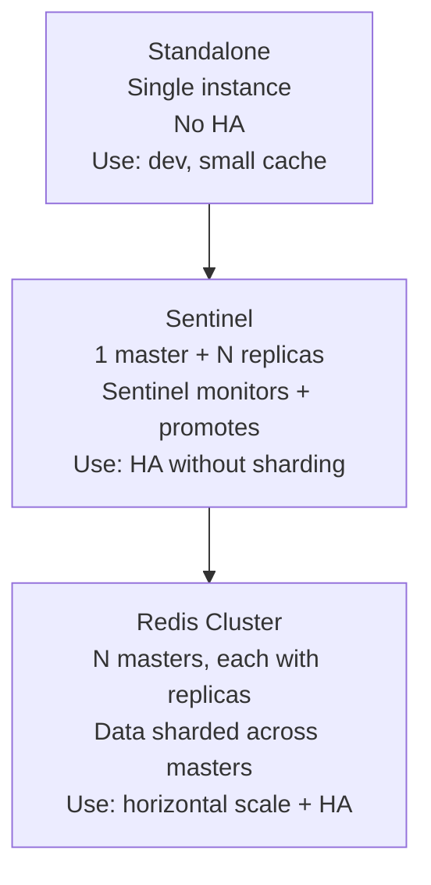
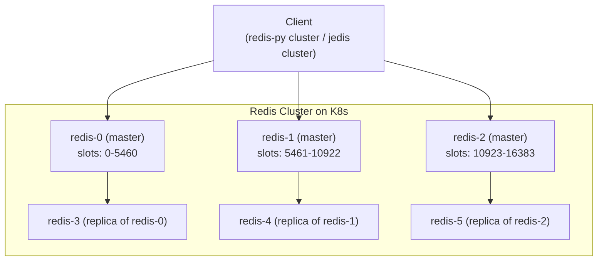
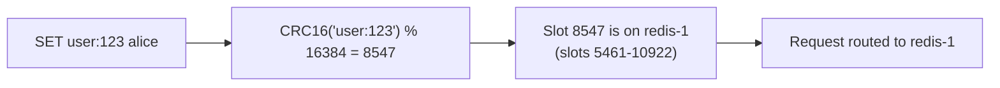
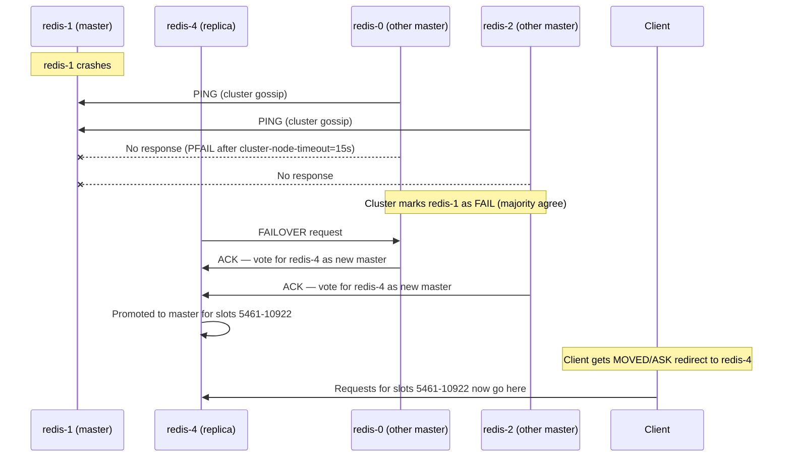
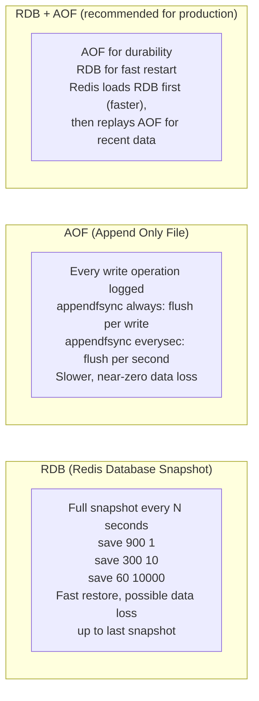

# Redis Cluster on Kubernetes

## Redis Modes



---

## Redis Cluster Architecture (6-node minimum)



**16384 hash slots** are distributed across masters. Every key is hashed (`CRC16(key) % 16384`) to find which slot (and thus which master) owns it.

---

## Key Distribution (Hash Slots)



**Hash tags** `{tag}key` force keys to the same slot (for multi-key operations):
```
SET {user:123}.name alice   -- slot = CRC16('user:123') % 16384
SET {user:123}.email a@b.c  -- same slot
MGET {user:123}.name {user:123}.email  -- works (same slot)
```

---

## Failover



**Failover time:** `cluster-node-timeout` (default 15s) + election + promotion ≈ 15-30s.

---

## Persistence: RDB vs AOF



```bash
# redis.conf
save 3600 1        # snapshot if 1 key changed in 1h
save 300 100       # snapshot if 100 keys changed in 5m
save 60 10000      # snapshot if 10000 keys changed in 1m
appendonly yes
appendfsync everysec  # fsync every second (good balance)
no-appendfsync-on-rewrite yes  # don't fsync during compaction
```

---

## Redis Cluster on K8s (StatefulSet)

```yaml
apiVersion: apps/v1
kind: StatefulSet
metadata:
  name: redis
spec:
  replicas: 6   # 3 masters + 3 replicas
  serviceName: redis-headless
  template:
    spec:
      containers:
      - name: redis
        image: redis:7.2-alpine
        command:
        - redis-server
        - /etc/redis/redis.conf
        - --cluster-enabled yes
        - --cluster-config-file /data/nodes.conf
        - --cluster-node-timeout 15000
        - --appendonly yes
        - --save 3600 1
        resources:
          limits:
            memory: 8Gi
          requests:
            memory: 4Gi
        volumeMounts:
        - name: data
          mountPath: /data
  volumeClaimTemplates:
  - metadata:
      name: data
    spec:
      accessModes: ["ReadWriteOnce"]
      storageClassName: premium-rwo
      resources:
        requests:
          storage: 50Gi
```

```bash
# Initialize the cluster (run once after pods start)
redis-cli --cluster create \
  redis-0.redis-headless:6379 \
  redis-1.redis-headless:6379 \
  redis-2.redis-headless:6379 \
  redis-3.redis-headless:6379 \
  redis-4.redis-headless:6379 \
  redis-5.redis-headless:6379 \
  --cluster-replicas 1   # 1 replica per master

# Check cluster state
redis-cli -c cluster info
redis-cli -c cluster nodes
```

---

## Backups

```bash
# Trigger RDB snapshot on primary
redis-cli BGSAVE
# Wait for completion
redis-cli LASTSAVE  # returns UNIX timestamp of last successful save

# Copy RDB to GCS
gsutil cp /data/dump.rdb gs://my-redis-backups/$(date +%Y%m%d)/dump.rdb

# Volume snapshot (quicker, consistent)
kubectl apply -f - << 'EOF'
apiVersion: snapshot.storage.k8s.io/v1
kind: VolumeSnapshot
metadata:
  name: redis-snapshot-$(date +%Y%m%d)
spec:
  source:
    persistentVolumeClaimName: data-redis-0
EOF
```

---

## Monitoring

```promql
# Memory usage (alert > 80% of maxmemory)
redis_memory_used_bytes / redis_memory_max_bytes > 0.8

# Cache hit rate (alert < 90%)
rate(redis_keyspace_hits_total[5m]) /
(rate(redis_keyspace_hits_total[5m]) + rate(redis_keyspace_misses_total[5m])) < 0.9

# Cluster state (1 = ok)
redis_cluster_state != 1

# Replication lag (bytes)
redis_connected_slaves < 1  # alert if no replicas
```
