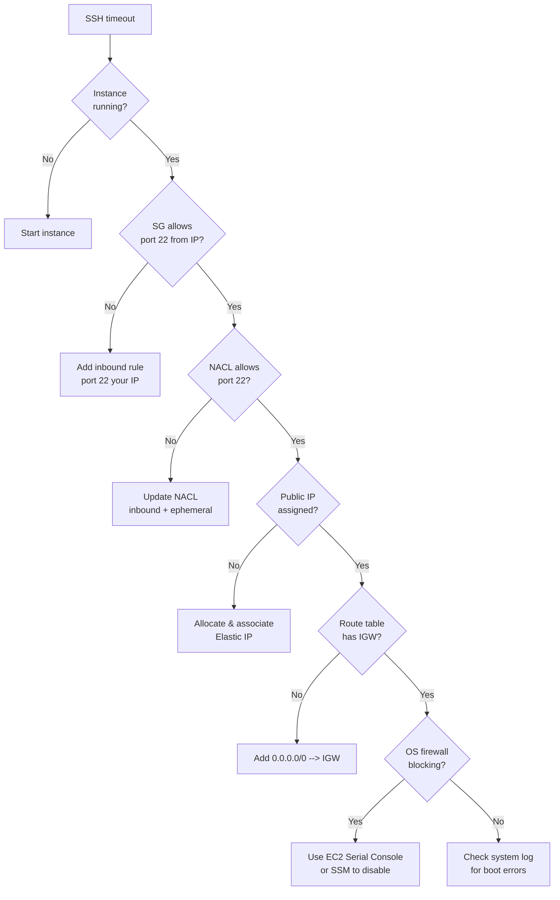
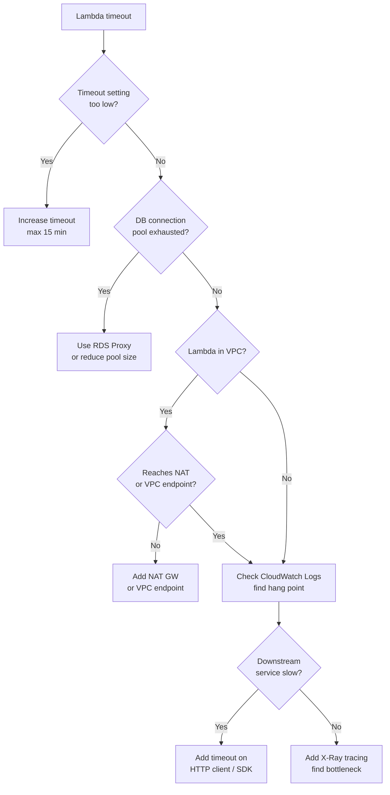
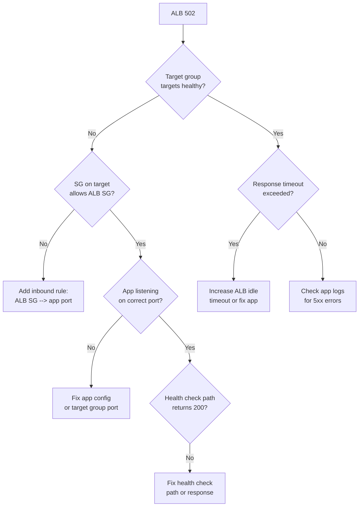
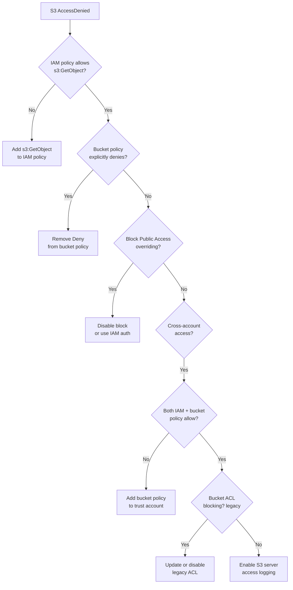
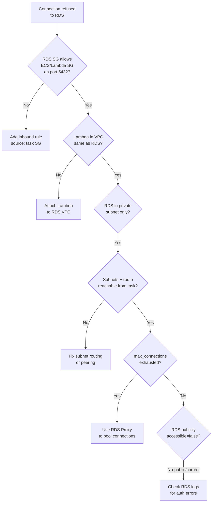
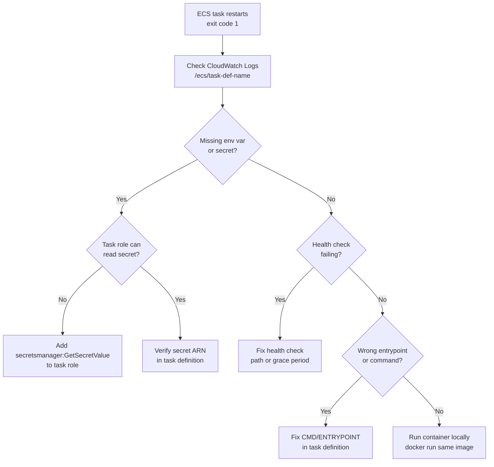
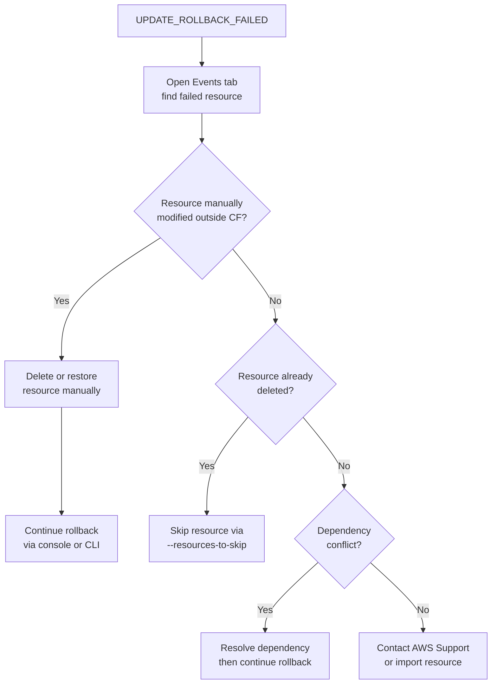
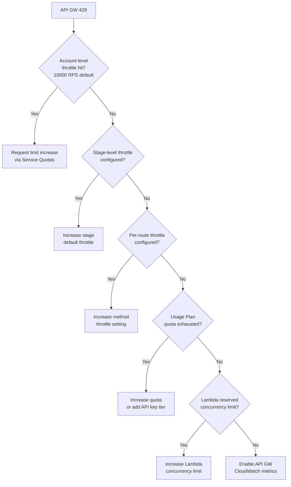
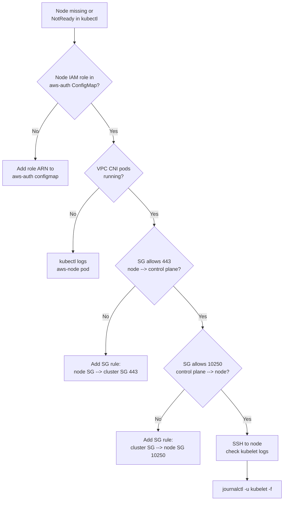
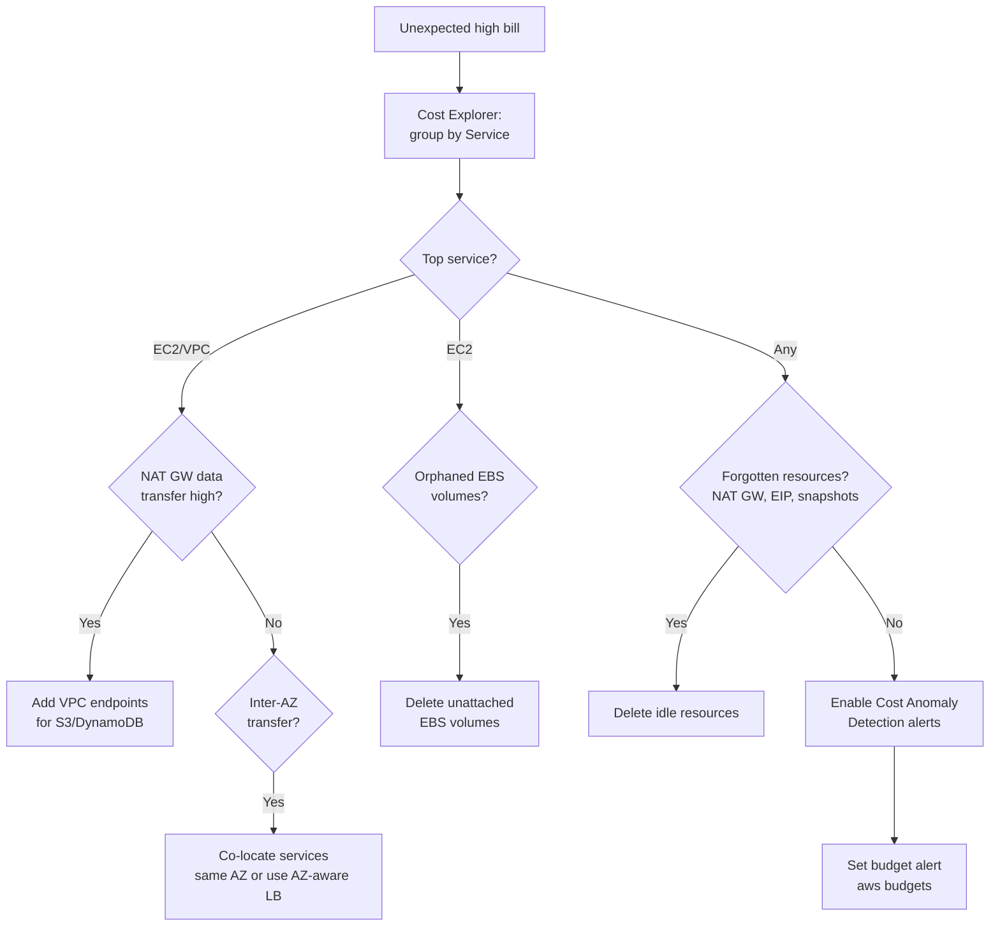

# AWS Debugging & Operational Scenarios

---

## 1. EC2 Instance Unreachable (SSH Timeout)



**Commands**

```bash
# Check instance state
aws ec2 describe-instances --instance-ids i-xxxx \
  --query 'Reservations[].Instances[].[InstanceId,State.Name,PublicIpAddress]'

# Check security group rules
aws ec2 describe-security-groups --group-ids sg-xxxx \
  --query 'SecurityGroups[].IpPermissions'

# Check NACLs for the subnet
SUBNET=$(aws ec2 describe-instances --instance-ids i-xxxx \
  --query 'Reservations[].Instances[].SubnetId' --output text)
aws ec2 describe-network-acls \
  --filters "Name=association.subnet-id,Values=$SUBNET"

# Check route table
aws ec2 describe-route-tables \
  --filters "Name=association.subnet-id,Values=$SUBNET"

# Get system log (boot errors)
aws ec2 get-console-output --instance-id i-xxxx --latest

# Connect via SSM (no SSH needed)
aws ssm start-session --target i-xxxx
```

**Prevention:** Never rely on SSH for production access — use SSM Session Manager instead (no port 22, no key management, full audit trail in CloudTrail). Enforce this with an SCP: `Deny ec2:AuthorizeSecurityGroupIngress where port=22 from 0.0.0.0/0`. Keep an EC2 Systems Manager baseline policy on every instance role.

---

## 2. Lambda Function Timing Out



**Commands**

```bash
# Check current timeout
aws lambda get-function-configuration --function-name my-fn \
  --query '[Timeout,MemorySize,VpcConfig]'

# Update timeout
aws lambda update-function-configuration \
  --function-name my-fn --timeout 30

# Tail live logs
aws logs tail /aws/lambda/my-fn --follow

# Last 20 min of logs
aws logs filter-log-events \
  --log-group-name /aws/lambda/my-fn \
  --start-time $(date -v-20M +%s000) \
  --filter-pattern "Task timed out"

# Check Lambda concurrency
aws lambda get-function-concurrency --function-name my-fn

# Enable X-Ray tracing
aws lambda update-function-configuration \
  --function-name my-fn \
  --tracing-config Mode=Active
```

**Prevention:** Set `timeout` to 2× your p99 execution time, never the max (15 min). Add a CloudWatch alarm on `Errors + Throttles` for every Lambda. Enable X-Ray tracing from day one — retrofitting tracing after a production timeout incident is painful. Use provisioned concurrency for latency-sensitive functions to eliminate cold start timeouts.

---

## 3. ALB Returns 502 Bad Gateway



**Commands**

```bash
# List target group health
aws elbv2 describe-target-health \
  --target-group-arn arn:aws:elasticloadbalancing:...

# Describe load balancer attributes (idle timeout)
aws elbv2 describe-load-balancer-attributes \
  --load-balancer-arn arn:aws:elasticloadbalancing:...

# Modify idle timeout
aws elbv2 modify-load-balancer-attributes \
  --load-balancer-arn arn:aws:elasticloadbalancing:... \
  --attributes Key=idle_timeout.timeout_seconds,Value=120

# Check ALB access logs (if enabled)
aws s3 cp s3://my-alb-logs/AWSLogs/... ./alb-logs/ --recursive

# Check security group of target
aws ec2 describe-security-groups --group-ids sg-target-xxxx \
  --query 'SecurityGroups[].IpPermissions'

# Describe target group health check settings
aws elbv2 describe-target-groups \
  --target-group-arns arn:aws:elasticloadbalancing:... \
  --query 'TargetGroups[].[HealthCheckPath,HealthCheckPort,Matcher]'
```

**Prevention:** Set `deregistration_delay` to 30s (down from 300s default) so deployments drain fast. Set `slow_start.duration_seconds` = 30 so new targets warm up before receiving full traffic. Alert on ALB `HTTPCode_Target_5XX_Count > 0` in CloudWatch. Test health check endpoint independently in staging with the exact ALB matcher config.

---

## 4. S3 Access Denied



**Commands**

```bash
# Simulate IAM policy evaluation
aws iam simulate-principal-policy \
  --policy-source-arn arn:aws:iam::123456789:role/my-role \
  --action-names s3:GetObject \
  --resource-arns arn:aws:s3:::my-bucket/my-key

# Get bucket policy
aws s3api get-bucket-policy --bucket my-bucket

# Check Block Public Access settings
aws s3api get-public-access-block --bucket my-bucket

# Check bucket ACL
aws s3api get-bucket-acl --bucket my-bucket

# Check object ACL
aws s3api get-object-acl --bucket my-bucket --key my-key

# List bucket ownership controls
aws s3api get-bucket-ownership-controls --bucket my-bucket
```

**Prevention:** Use IAM Access Analyzer to continuously audit S3 bucket policies and flag public or cross-account access. Enable S3 Block Public Access at the account level. Test IAM policies with `aws iam simulate-principal-policy` in CI before deploying policy changes.

---

## 5. RDS Connection Refused from ECS/Lambda



**Commands**

```bash
# Describe RDS instance network config
aws rds describe-db-instances --db-instance-identifier my-db \
  --query 'DBInstances[].[DBInstanceStatus,PubliclyAccessible,VpcSecurityGroups,Endpoint]'

# Check SG rules on RDS
aws ec2 describe-security-groups --group-ids sg-rds-xxxx

# Check RDS parameter max_connections
aws rds describe-db-parameters \
  --db-parameter-group-name my-pg \
  --query 'Parameters[?ParameterName==`max_connections`]'

# Check RDS enhanced monitoring / CloudWatch
aws cloudwatch get-metric-statistics \
  --namespace AWS/RDS \
  --metric-name DatabaseConnections \
  --dimensions Name=DBInstanceIdentifier,Value=my-db \
  --start-time $(date -u -v-1H +%Y-%m-%dT%H:%M:%SZ) \
  --end-time $(date -u +%Y-%m-%dT%H:%M:%SZ) \
  --period 60 --statistics Maximum

# Create RDS Proxy
aws rds create-db-proxy \
  --db-proxy-name my-proxy \
  --engine-family POSTGRESQL \
  --auth '[{"AuthScheme":"SECRETS","SecretArn":"arn:...","IAMAuth":"DISABLED"}]' \
  --role-arn arn:aws:iam::...role/rds-proxy-role \
  --vpc-subnet-ids subnet-a subnet-b \
  --vpc-security-group-ids sg-rds-xxxx
```

**Prevention:** Use RDS Proxy to pool connections — eliminates connection exhaustion as services scale. Set `max_connections` parameter group value explicitly. Alert on `DatabaseConnections` CloudWatch metric > 80% of `max_connections`. Use IAM auth for RDS so credentials never expire or get leaked.

---

## 6. ECS Task Keeps Restarting (Exit Code 1)



**Commands**

```bash
# List stopped tasks with reason
aws ecs list-tasks --cluster my-cluster --desired-status STOPPED
aws ecs describe-tasks --cluster my-cluster \
  --tasks task-id-xxxx \
  --query 'tasks[].[taskArn,stoppedReason,containers[].{name:name,exitCode:exitCode,reason:reason}]'

# Get CloudWatch log group for task
aws ecs describe-task-definition --task-definition my-task:5 \
  --query 'taskDefinition.containerDefinitions[].logConfiguration'

# Tail ECS logs
aws logs tail /ecs/my-task --follow

# Check task IAM role policies
aws iam list-role-policies --role-name ecsTaskRole
aws iam get-role-policy --role-name ecsTaskRole --policy-name MyPolicy

# Verify secret exists
aws secretsmanager describe-secret --secret-id my-secret

# Increase health check grace period
aws ecs update-service --cluster my-cluster --service my-svc \
  --health-check-grace-period-seconds 120
```

**Prevention:** Use ECS Exec (SSM-based) instead of SSH for debugging running containers. Set `healthCheckGracePeriodSeconds` equal to your app's p99 startup time. Alert on ECS `ServiceTaskCount < desired`. Use task role + Secrets Manager for credentials — never bake secrets into environment variables.

---

## 7. CloudFormation Stack Stuck in UPDATE_ROLLBACK_FAILED



**Commands**

```bash
# See stack events to find failed resource
aws cloudformation describe-stack-events \
  --stack-name my-stack \
  --query 'StackEvents[?ResourceStatus==`UPDATE_ROLLBACK_FAILED`]'

# Continue rollback (no skips)
aws cloudformation continue-update-rollback \
  --stack-name my-stack

# Continue rollback skipping a specific resource
aws cloudformation continue-update-rollback \
  --stack-name my-stack \
  --resources-to-skip MyBucketLogicalId

# Describe current stack status
aws cloudformation describe-stacks \
  --stack-name my-stack \
  --query 'Stacks[].[StackStatus,StackStatusReason]'

# Import existing resource into stack (alternative)
aws cloudformation create-change-set \
  --stack-name my-stack \
  --change-set-name import-fix \
  --change-set-type IMPORT \
  --resources-to-import '[{"ResourceType":"AWS::S3::Bucket","LogicalResourceId":"MyBucket","ResourceIdentifier":{"BucketName":"my-bucket"}}]' \
  --template-body file://template.yaml
```

**Prevention:** Always use Change Sets before any update to a production stack — never run `aws cloudformation update-stack` directly. Enable stack termination protection on all production stacks. Use `DeletionPolicy: Retain` on stateful resources (RDS, S3) so accidental stack deletion doesn't destroy data.

---

## 8. API Gateway Returns 429 Too Many Requests



**Commands**

```bash
# Get stage throttle settings
aws apigateway get-stage \
  --rest-api-id abc123 \
  --stage-name prod \
  --query '[defaultRouteSettings,throttlingBurstLimit,throttlingRateLimit]'

# Update stage-level throttle
aws apigateway update-stage \
  --rest-api-id abc123 \
  --stage-name prod \
  --patch-operations \
    op=replace,path=/defaultRouteSettings/throttlingRateLimit,value=5000 \
    op=replace,path=/defaultRouteSettings/throttlingBurstLimit,value=10000

# List usage plans
aws apigateway get-usage-plans

# Check current account throttle limits
aws service-quotas list-service-quotas \
  --service-code apigateway \
  --query 'Quotas[?contains(QuotaName,`throttle`)]'

# Request quota increase
aws service-quotas request-service-quota-increase \
  --service-code apigateway \
  --quota-code L-310E2D3C \
  --desired-value 20000

# Check Lambda concurrency
aws lambda get-function-concurrency --function-name my-fn

# CloudWatch 429 metric
aws cloudwatch get-metric-statistics \
  --namespace AWS/ApiGateway \
  --metric-name 4XXError \
  --dimensions Name=ApiName,Value=my-api Name=Stage,Value=prod \
  --start-time $(date -u -v-1H +%Y-%m-%dT%H:%M:%SZ) \
  --end-time $(date -u +%Y-%m-%dT%H:%M:%SZ) \
  --period 60 --statistics Sum
```

**Prevention:** Set Usage Plans and API Keys for all external-facing APIs. Use Lambda reserved concurrency to prevent a burst from one API consuming all account concurrency. Add a WAF rate-based rule as an additional layer. Alert on `4XXError rate > 5%` in CloudWatch — catches throttling before it becomes an outage.

---

## 9. EKS Nodes Not Joining the Cluster



**Commands**

```bash
# Check node status
kubectl get nodes -o wide

# View aws-auth ConfigMap
kubectl get configmap aws-auth -n kube-system -o yaml

# Add node IAM role to aws-auth (edit directly)
kubectl edit configmap aws-auth -n kube-system
# Add under mapRoles:
# - rolearn: arn:aws:iam::123456789:role/eks-node-role
#   username: system:node:{{EC2PrivateDNSName}}
#   groups: [system:bootstrappers, system:nodes]

# Check VPC CNI pods
kubectl get pods -n kube-system -l k8s-app=aws-node
kubectl logs -n kube-system daemonset/aws-node

# Check node SG rules (cluster SG)
CLUSTER_SG=$(aws eks describe-cluster --name my-cluster \
  --query 'cluster.resourcesVpcConfig.clusterSecurityGroupId' --output text)
aws ec2 describe-security-groups --group-ids $CLUSTER_SG

# Check kubelet logs on node (via SSM)
aws ssm start-session --target i-nodexxxx
# Then: journalctl -u kubelet -f

# Describe node for events
kubectl describe node ip-10-0-x-x.ec2.internal
```

**Prevention:** Use managed node groups — AWS handles the bootstrap script and AMI versioning. Pin AMI IDs in Terraform and test node-join in a staging cluster before rolling to prod. Use Launch Template user data validation: add a `curl` to the EKS cluster endpoint as the last line of bootstrap — it fails fast if networking is wrong. Alert on `cluster_failed_node_count > 0`.

---

## 10. High AWS Bill — Finding the Source



**Commands**

```bash
# Cost Explorer: top services last 30 days
aws ce get-cost-and-usage \
  --time-period Start=$(date -v-30d +%Y-%m-%d),End=$(date +%Y-%m-%d) \
  --granularity MONTHLY \
  --metrics BlendedCost \
  --group-by Type=DIMENSION,Key=SERVICE \
  --query 'ResultsByTime[].Groups[] | sort_by(@, &Metrics.BlendedCost.Amount) | reverse(@) | [:10]'

# Find unattached EBS volumes
aws ec2 describe-volumes \
  --filters Name=status,Values=available \
  --query 'Volumes[].[VolumeId,Size,CreateTime]'

# Find unassociated Elastic IPs
aws ec2 describe-addresses \
  --query 'Addresses[?AssociationId==null].[AllocationId,PublicIp]'

# Find NAT Gateways (cost ~$0.045/hr each)
aws ec2 describe-nat-gateways \
  --filter Name=state,Values=available \
  --query 'NatGateways[].[NatGatewayId,SubnetId,CreateTime]'

# Check data transfer via NAT GW (CloudWatch)
aws cloudwatch get-metric-statistics \
  --namespace AWS/NATGateway \
  --metric-name BytesOutToDestination \
  --dimensions Name=NatGatewayId,Value=nat-xxxx \
  --start-time $(date -u -v-1d +%Y-%m-%dT%H:%M:%SZ) \
  --end-time $(date -u +%Y-%m-%dT%H:%M:%SZ) \
  --period 3600 --statistics Sum

# Create Cost Anomaly Detection monitor
aws ce create-anomaly-monitor \
  --anomaly-monitor '{"MonitorName":"AllServices","MonitorType":"DIMENSIONAL","MonitorDimension":"SERVICE"}'

# Create budget alert at $200/month
aws budgets create-budget \
  --account-id 123456789012 \
  --budget '{"BudgetName":"monthly-limit","BudgetLimit":{"Amount":"200","Unit":"USD"},"TimeUnit":"MONTHLY","BudgetType":"COST"}' \
  --notifications-with-subscribers '[{"Notification":{"NotificationType":"ACTUAL","ComparisonOperator":"GREATER_THAN","Threshold":80},"Subscribers":[{"SubscriptionType":"EMAIL","Address":"you@example.com"}]}]'
```

**Prevention:** Set AWS Budgets alerts at 50%, 80%, and 100% of monthly forecast from day one. Enable Cost Anomaly Detection with a `$50 absolute threshold` — it alerts within hours of a runaway resource. Tag every resource with `team`, `env`, `service` tags enforced by an AWS Config rule. Review Cost Explorer weekly during growth phases.

---

*Last updated: 2026-06-16*
