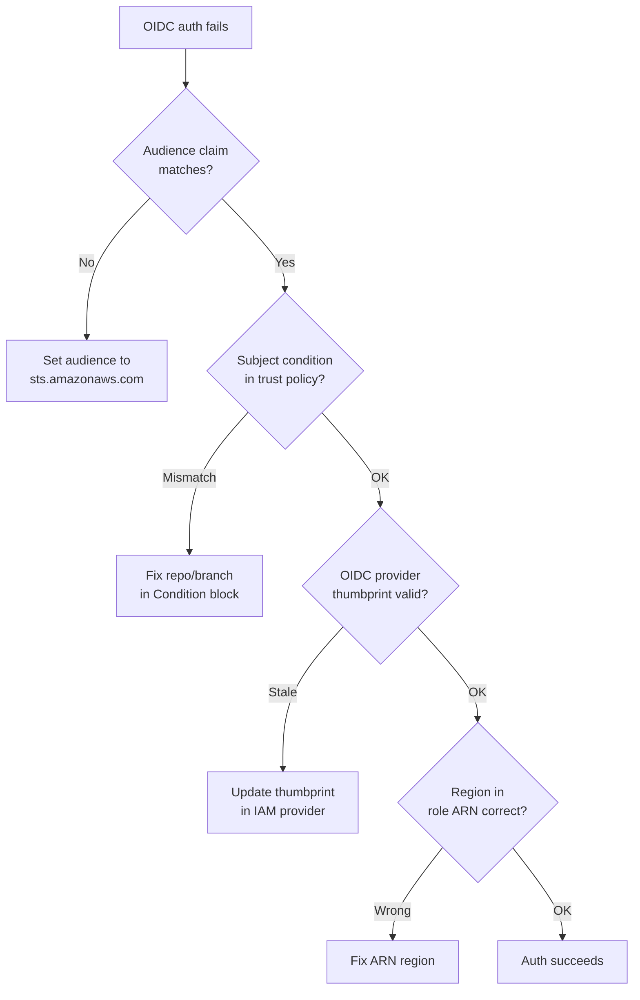
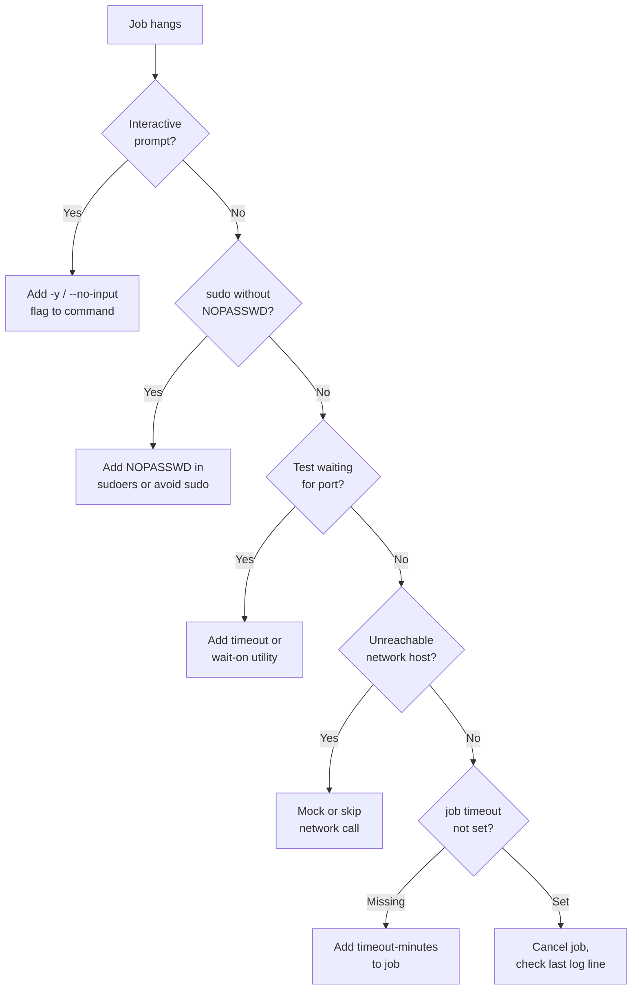
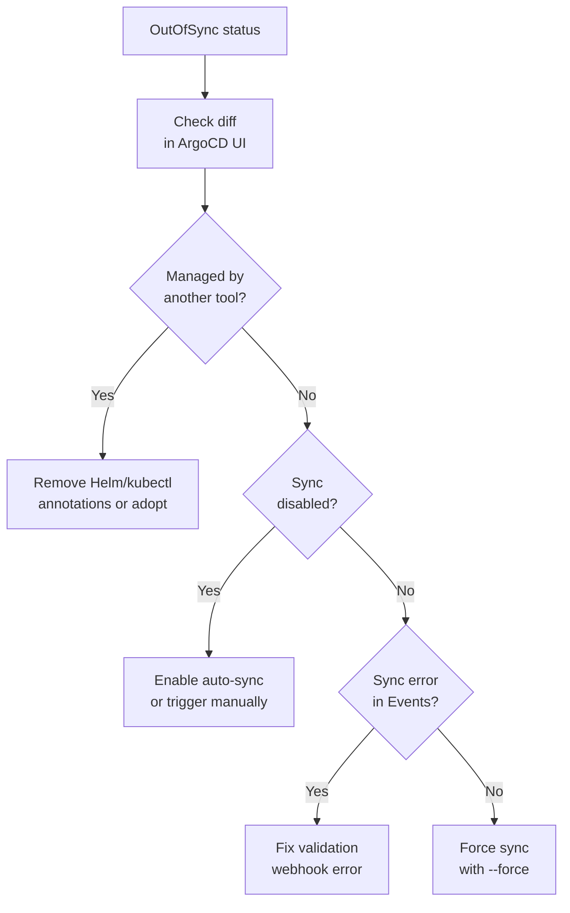
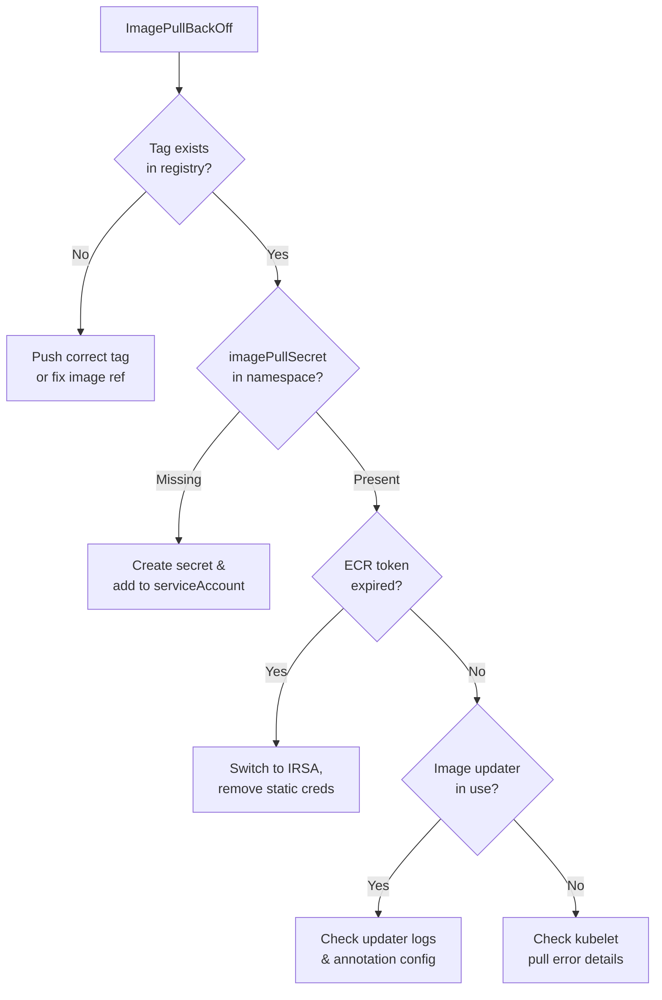
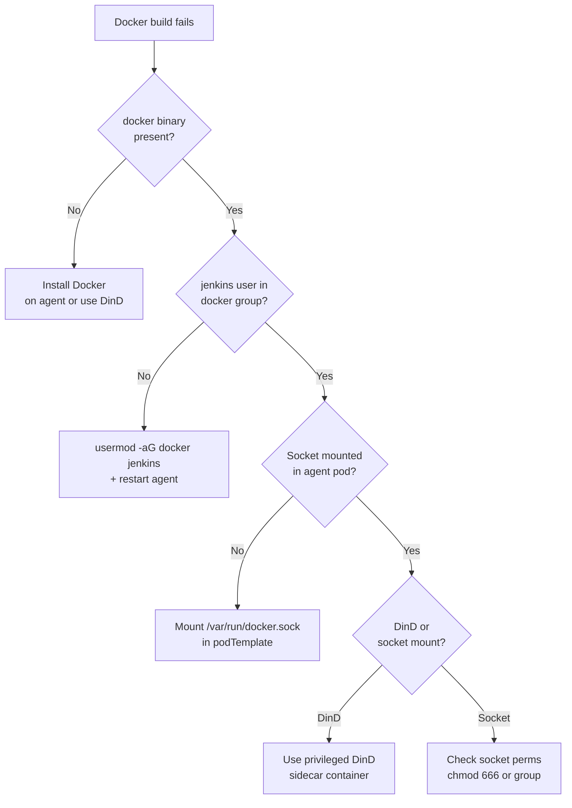
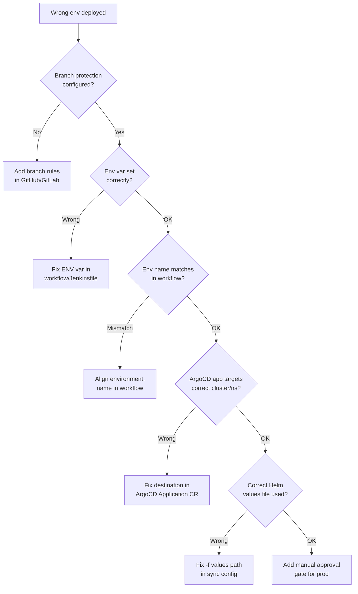
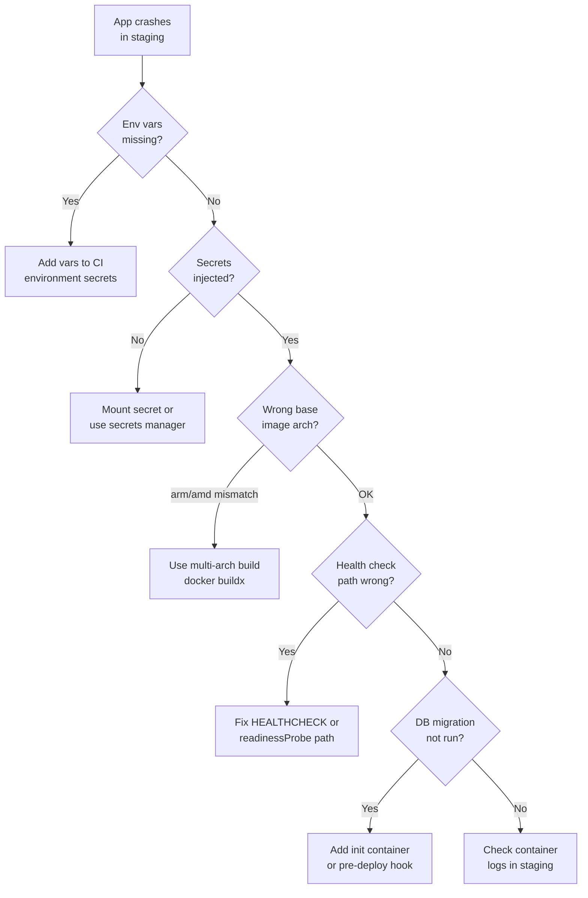
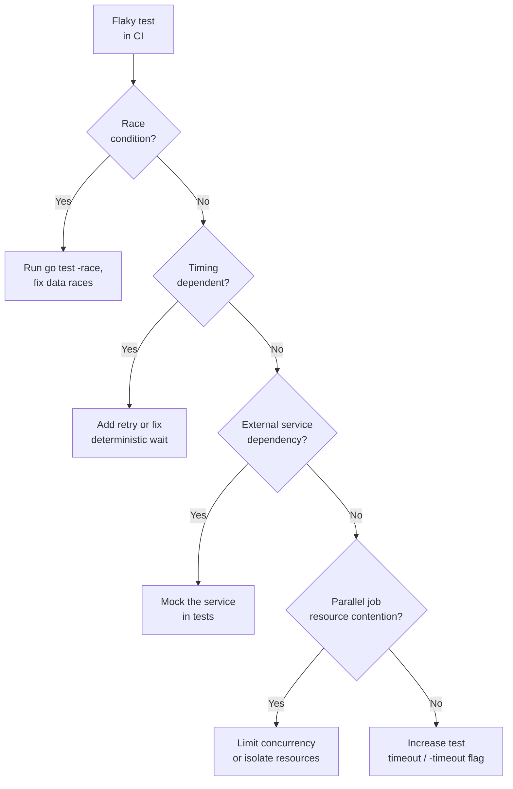

# CI/CD Debugging Scenarios

Practical debugging playbooks for GitHub Actions, ArgoCD, and Jenkins.

---

## 1. GitHub Actions: OIDC Auth to AWS Fails

**Symptom:** `Error assuming role` or `Token is not valid` when using `aws-actions/configure-aws-credentials`.



**Checklist & commands:**

```yaml
# workflow snippet — audience must match
- uses: aws-actions/configure-aws-credentials@v4
  with:
    role-to-assume: arn:aws:iam::123456789012:role/MyRole
    aws-region: us-east-1
    audience: sts.amazonaws.com   # must match trust policy
```

```json
// IAM trust policy — subject must match branch/repo
{
  "Condition": {
    "StringLike": {
      "token.actions.githubusercontent.com:sub": "repo:org/repo:ref:refs/heads/main",
      "token.actions.githubusercontent.com:aud": "sts.amazonaws.com"
    }
  }
}
```

```bash
# verify OIDC provider thumbprint
aws iam list-open-id-connect-providers
aws iam get-open-id-connect-provider \
  --open-id-connect-provider-arn arn:aws:iam::ACCOUNT:oidc-provider/token.actions.githubusercontent.com

# test assume-role manually with a debug token
aws sts get-caller-identity
```

---

## 2. GitHub Actions: Job Hangs Indefinitely

**Symptom:** A step runs forever with no output; job never completes.



**Commands:**

```yaml
jobs:
  build:
    timeout-minutes: 15      # always set a ceiling
    steps:
      - run: apt-get install -y curl   # -y prevents prompt
```

```bash
# cancel a stuck run via CLI
gh run list --limit 5
gh run cancel <run-id>

# stream logs to find the last line before hang
gh run view <run-id> --log | tail -40
```

---

## 3. ArgoCD: App Out of Sync But Won't Sync

**Symptom:** App shows `OutOfSync` in the UI but sync does nothing or errors immediately.



**Commands:**

```bash
# inspect what ArgoCD thinks is different
argocd app diff my-app

# check sync status and last error
argocd app get my-app

# enable sync if disabled
argocd app set my-app --sync-policy automated

# force sync (overwrites live state)
argocd app sync my-app --force

# check for webhook rejections in k8s events
kubectl get events -n my-namespace --sort-by='.lastTimestamp' | tail -20
```

---

## 4. ArgoCD: ImagePullBackOff After Deploy

**Symptom:** ArgoCD reports `Synced/Healthy` but pods stay in `ImagePullBackOff`.



**Commands:**

```bash
# check pod events for pull error details
kubectl describe pod <pod-name> -n <ns> | grep -A 10 Events

# verify image tag exists in ECR
aws ecr describe-images --repository-name my-repo \
  --image-ids imageTag=v1.2.3

# create ECR pull secret (short-term fix)
kubectl create secret docker-registry ecr-creds \
  --docker-server=<account>.dkr.ecr.<region>.amazonaws.com \
  --docker-username=AWS \
  --docker-password=$(aws ecr get-login-password)

# check argocd-image-updater logs
kubectl logs -n argocd deploy/argocd-image-updater | tail -50
```

---

## 5. Jenkins Pipeline: Docker Build Fails in Agent

**Symptom:** `docker: command not found` or `permission denied /var/run/docker.sock`.



**Pipeline snippet & commands:**

```groovy
// Jenkinsfile — socket mount approach
pipeline {
  agent {
    kubernetes {
      yaml """
apiVersion: v1
kind: Pod
spec:
  containers:
  - name: docker
    image: docker:24-cli
    command: [sleep, infinity]
    volumeMounts:
    - name: docker-sock
      mountPath: /var/run/docker.sock
  volumes:
  - name: docker-sock
    hostPath:
      path: /var/run/docker.sock
"""
    }
  }
  stages {
    stage('Build') {
      steps {
        container('docker') {
          sh 'docker build -t my-image .'
        }
      }
    }
  }
}
```

```bash
# on the agent node — add jenkins to docker group
sudo usermod -aG docker jenkins
sudo systemctl restart jenkins

# verify socket permissions
ls -la /var/run/docker.sock   # should be srw-rw---- docker group
```

---

## 6. Pipeline Deploys to Wrong Environment

**Symptom:** A staging branch push triggers a production deployment.



**Concrete fixes:**

```yaml
# GitHub Actions — gate production on branch + approval
jobs:
  deploy-prod:
    if: github.ref == 'refs/heads/main'
    environment: production          # requires manual approval in repo settings
    steps:
      - run: helm upgrade --install my-app ./chart -f values/prod.yaml
```

```bash
# verify ArgoCD app destination
argocd app get my-app -o json | jq '.spec.destination'

# check which values file ArgoCD is using
argocd app get my-app -o json | jq '.spec.source.helm'
```

---

## 7. Container Image Build Passes but App Crashes in Staging

**Symptom:** `docker build` succeeds in CI, but container exits immediately in staging.



**Commands:**

```bash
# pull and inspect the exact CI-built image locally
docker pull <registry>/my-app:<ci-tag>
docker run --rm -e ENV=staging <registry>/my-app:<ci-tag>

# check arch of built image
docker inspect <image> | jq '.[].Architecture'

# multi-arch build
docker buildx build --platform linux/amd64,linux/arm64 -t my-app:latest --push .

# check staging pod logs
kubectl logs -n staging deploy/my-app --previous
kubectl logs -n staging deploy/my-app -f

# describe pod for crash reason
kubectl describe pod -n staging -l app=my-app | grep -A 5 "Last State"
```

---

## 8. Flaky Tests Blocking Pipeline

**Symptom:** Tests pass locally and sometimes in CI, but fail intermittently and block merges.



**Commands:**

```bash
# detect races
go test -race ./...

# run with explicit timeout
go test -timeout 120s ./...

# re-run flaky test N times locally
for i in $(seq 1 10); do go test -run TestMyFlaky ./pkg/...; done

# run only failed tests from last run (requires gotestsum)
gotestsum --rerun-fails=3 --packages ./...
```

```yaml
# GitHub Actions — retry flaky step
- name: Test
  uses: nick-fields/retry@v3
  with:
    timeout_minutes: 10
    max_attempts: 3
    command: go test -race -timeout 90s ./...
```

---

## Quick Reference

| Symptom | First command |
|---------|--------------|
| OIDC auth fails | `aws sts get-caller-identity` |
| Job hangs | `gh run cancel <id>` + check last log |
| ArgoCD won't sync | `argocd app diff my-app` |
| ImagePullBackOff | `kubectl describe pod` → check Events |
| Docker not found in Jenkins | `ls -la /var/run/docker.sock` |
| Wrong env deployed | `argocd app get my-app -o json \| jq .spec.destination` |
| App crashes in staging | `kubectl logs deploy/my-app --previous` |
| Flaky tests | `go test -race ./...` |
