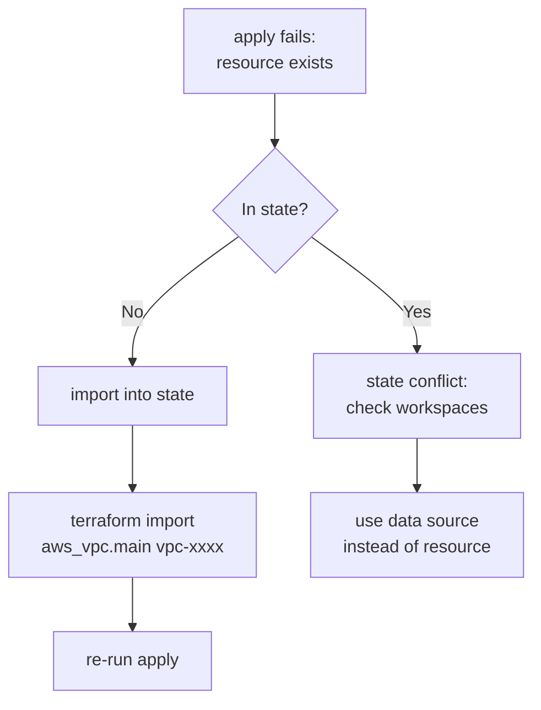
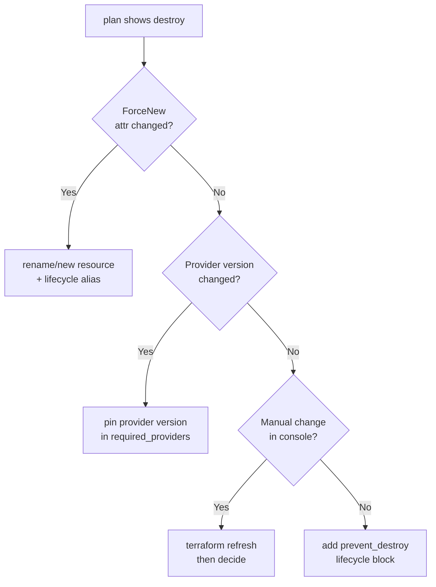
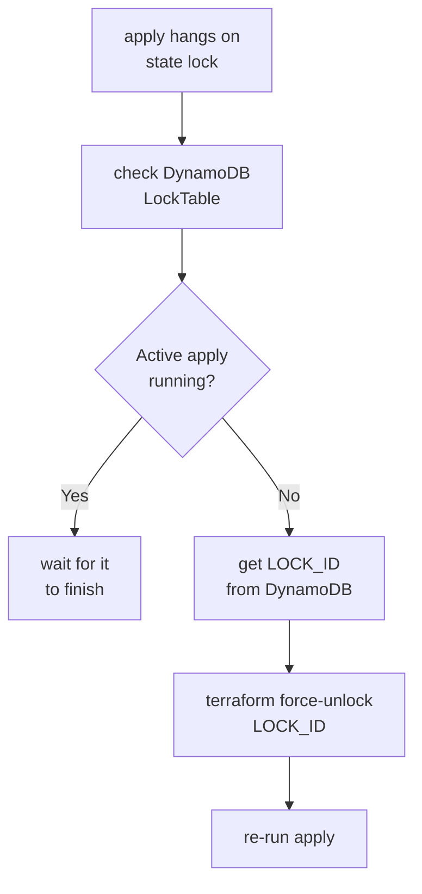
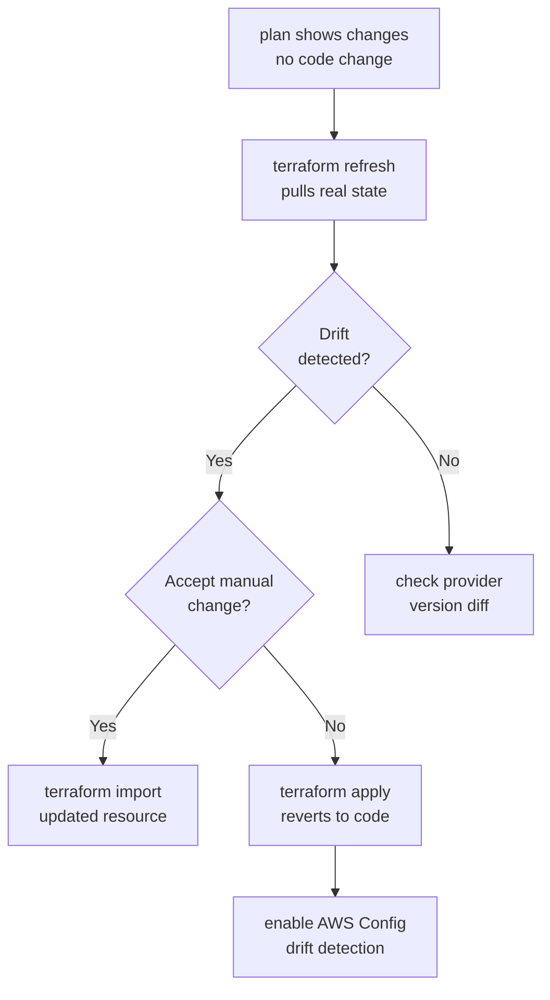
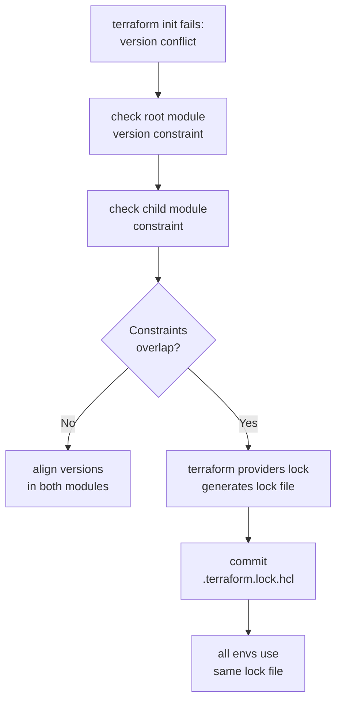
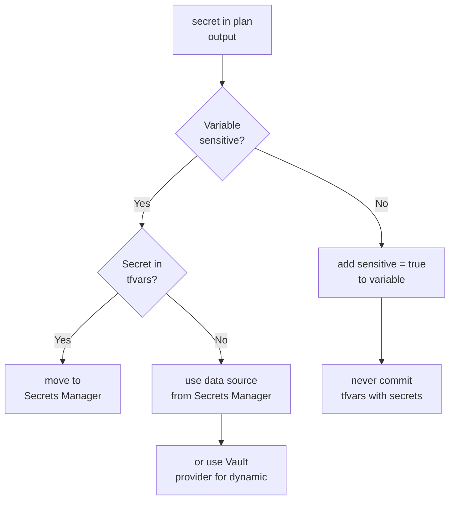
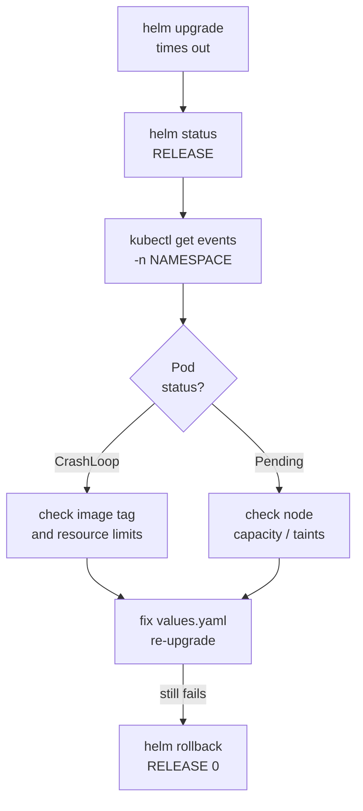
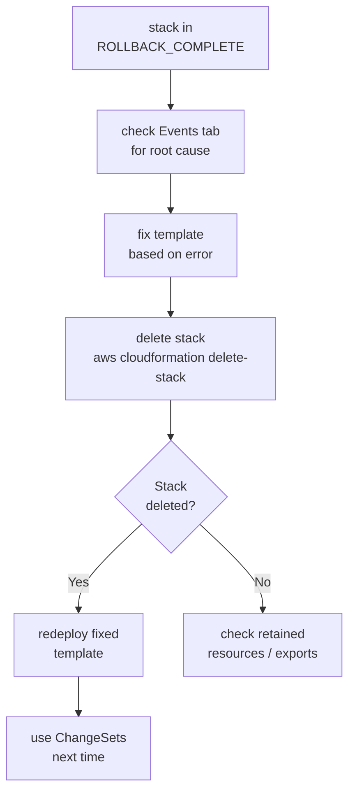

# IaC Debugging Scenarios

Terraform, Helm, and CloudFormation failure patterns with diagnosis flowcharts and concrete commands.

---

## 1. terraform apply Fails: Resource Already Exists

**Symptom:** `Error creating VPC: VpcLimitExceeded` or `already exists`



**Commands:**
```bash
# Import existing resource into state
terraform import aws_vpc.main vpc-0abc1234def56789

# Or reference without managing it
# In .tf:
data "aws_vpc" "main" {
  id = "vpc-0abc1234def56789"
}

# Check all workspaces
terraform workspace list
```

**Prevention:** Run `terraform plan` in CI on every PR and require approval before `apply`. Use `lifecycle { prevent_destroy = true }` on stateful resources. Add `terraform validate` and `tflint` as required CI checks to catch config errors before they reach `apply`.

---

## 2. terraform plan Shows Unexpected Destroy

**Symptom:** Plan shows `-/+` destroy and recreate for a resource you didn't change.



**Commands:**
```bash
# See what attribute is forcing replacement
terraform plan -out=plan.tfplan
terraform show -json plan.tfplan | jq '.resource_changes[] | select(.change.actions[] == "delete")'

# Protect critical resources
# In .tf:
lifecycle {
  prevent_destroy = true
}

# Pin provider version
terraform {
  required_providers {
    aws = { source = "hashicorp/aws", version = "= 5.31.0" }
  }
}
```

**Prevention:** Always run `terraform plan -out=tfplan` and pipe it through `terraform show -json tfplan | jq '[.resource_changes[] | select(.change.actions[] | contains("delete"))] | length'` in CI — fail the pipeline if this count exceeds an expected threshold. Use `lifecycle { prevent_destroy = true }` on databases, S3 buckets, and KMS keys.

---

## 3. State Lock: terraform apply Hangs

**Symptom:** `Acquiring state lock...` hangs indefinitely.



**Commands:**
```bash
# Find the stuck lock in DynamoDB
aws dynamodb scan \
  --table-name terraform-state-lock \
  --filter-expression "attribute_exists(LockID)"

# Force unlock (only if no apply is running!)
terraform force-unlock <LOCK_ID>

# Or delete the DynamoDB item directly
aws dynamodb delete-item \
  --table-name terraform-state-lock \
  --key '{"LockID": {"S": "my-bucket/path/to/terraform.tfstate"}}'
```

**Prevention:** Use Terraform Cloud or Atlantis for all `apply` runs — eliminates local lock issues entirely. Set S3 state backend with `encrypt = true` and DynamoDB locking. Add a CI check that detects stale locks older than 30 minutes and alerts the on-call.

---

## 4. Terraform State Drift

**Symptom:** `terraform plan` shows changes even though no code changed.



**Commands:**
```bash
# Refresh state from real infrastructure
terraform refresh

# See what drifted
terraform plan -detailed-exitcode
# exit 2 = changes present

# Import the manually-changed resource
terraform import aws_security_group.web sg-0abc1234

# Enable AWS Config rule for drift detection
aws configservice put-config-rule --config-rule '{
  "ConfigRuleName": "required-tags",
  "Source": {"Owner": "AWS", "SourceIdentifier": "REQUIRED_TAGS"}
}'
```

**Prevention:** Run `terraform plan` on a schedule (nightly) and alert if it shows non-empty diff — that's drift. Use AWS Config Rules to detect manual console changes and trigger notifications. Enable CloudTrail and set up EventBridge rules to alert when resources are modified outside Terraform.

---

## 5. Module Version Conflict

**Symptom:** `terraform init` fails with version constraint errors across environments.



**Commands:**
```bash
# See current provider constraints
terraform providers

# Generate/update lock file for all platforms
terraform providers lock \
  -platform=linux_amd64 \
  -platform=darwin_arm64

# Upgrade a specific provider within constraints
terraform init -upgrade

# Check what version is locked
cat .terraform.lock.hcl

# In modules, pin versions:
# module "vpc" {
#   source  = "terraform-aws-modules/vpc/aws"
#   version = "= 5.1.2"
# }
```

**Prevention:** Pin all module versions to exact versions (`= X.Y.Z`) in production, never use `~>` or `>=`. Use `terraform providers lock` to generate a `.terraform.lock.hcl` and commit it — enforces exact provider versions across all environments. Review module changelogs before bumping versions.

---

## 6. Sensitive Values in State / Plan Output

**Symptom:** Passwords or secrets visible in `terraform plan` or stored in state file.



**Commands:**
```hcl
# Mark variable as sensitive
variable "db_password" {
  type      = string
  sensitive = true
}

# Fetch from Secrets Manager instead
data "aws_secretsmanager_secret_version" "db" {
  secret_id = "prod/db/password"
}

resource "aws_db_instance" "main" {
  password = data.aws_secretsmanager_secret_version.db.secret_string
}

# Vault provider for dynamic secrets
data "vault_generic_secret" "db" {
  path = "secret/prod/db"
}
```

```bash
# Check if secrets are in state (never log this in CI)
terraform state show aws_db_instance.main

# Add to .gitignore
echo "*.tfvars" >> .gitignore
echo "terraform.tfstate*" >> .gitignore
```

**Prevention:** Never put passwords in Terraform — use `aws_secretsmanager_secret` data sources to reference secrets, never create them with the value in HCL. Mark sensitive outputs with `sensitive = true`. Restrict S3 state bucket access to CI role only with `Block Public Access` enabled and SSE-KMS encryption.

---

## 7. Helm Release Fails: Timeout Waiting for Resources

**Symptom:** `helm upgrade --wait` times out without completing.



**Commands:**
```bash
# Check release status
helm status my-release -n my-namespace

# Get pod events
kubectl get events -n my-namespace --sort-by='.lastTimestamp'

# Check pod logs
kubectl logs -n my-namespace -l app=my-app --previous

# Describe crashing pod
kubectl describe pod -n my-namespace <pod-name>

# Rollback to previous revision (0 = last good)
helm rollback my-release 0 -n my-namespace

# Upgrade with longer timeout
helm upgrade my-release ./chart \
  --wait \
  --timeout 10m \
  --atomic \
  -n my-namespace

# List revision history
helm history my-release -n my-namespace
```

**Prevention:** Always set `--atomic` on `helm upgrade` in CI — auto-rolls back if the release fails. Set `--timeout` equal to your app's p99 startup time + 60s buffer. Add readiness probes on all Deployments so Helm's `--wait` has something meaningful to check. Test chart changes in a throwaway namespace first: `helm upgrade --install --create-namespace -n test-$PR_NUMBER`.

---

## 8. CloudFormation: Stack in ROLLBACK_COMPLETE Can't Be Updated

**Symptom:** Stack stuck in `ROLLBACK_COMPLETE` state; updates are rejected.



**Commands:**
```bash
# Check why it rolled back
aws cloudformation describe-stack-events \
  --stack-name my-stack \
  --query 'StackEvents[?ResourceStatus==`CREATE_FAILED`].[LogicalResourceId,ResourceStatusReason]' \
  --output table

# Delete the stuck stack
aws cloudformation delete-stack --stack-name my-stack

# Wait for deletion
aws cloudformation wait stack-delete-complete --stack-name my-stack

# Redeploy
aws cloudformation deploy \
  --stack-name my-stack \
  --template-file template.yaml \
  --capabilities CAPABILITY_IAM

# Use ChangeSets to preview before next deploy
aws cloudformation create-change-set \
  --stack-name my-stack \
  --change-set-name preview-changes \
  --template-body file://template.yaml

aws cloudformation describe-change-set \
  --stack-name my-stack \
  --change-set-name preview-changes

aws cloudformation execute-change-set \
  --stack-name my-stack \
  --change-set-name preview-changes
```

**Prevention:** Always deploy via Change Sets, never direct update. Set `--on-failure DO_NOTHING` during development so stacks stay in `CREATE_FAILED` with resources intact for debugging (don't use in production). Enable CloudFormation stack notifications via SNS so failures are immediately visible. Use `aws cloudformation describe-stack-events` to see the exact resource that caused rollback.

---

## Quick Reference

| Scenario | Key Command |
|---|---|
| Resource exists, not in state | `terraform import <resource> <id>` |
| Unexpected destroy | `terraform show -json plan.tfplan \| jq` |
| State lock stuck | `terraform force-unlock <LOCK_ID>` |
| State drift | `terraform refresh` then decide |
| Module version conflict | `terraform providers lock` |
| Secrets in plan | `sensitive = true` + Secrets Manager |
| Helm timeout | `helm rollback <release> 0` |
| CFN ROLLBACK_COMPLETE | delete stack → fix → redeploy |
