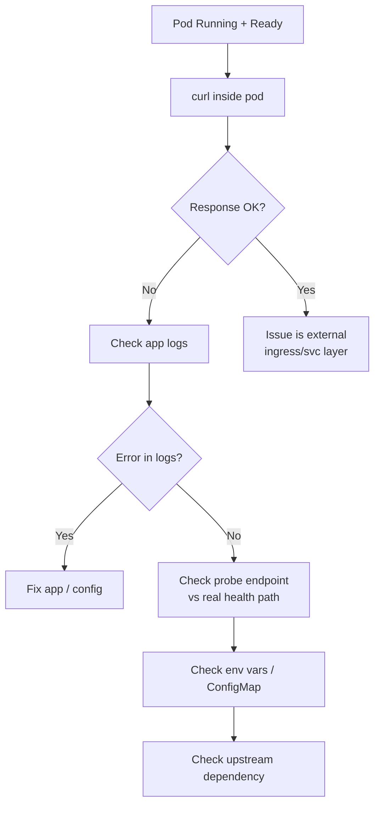
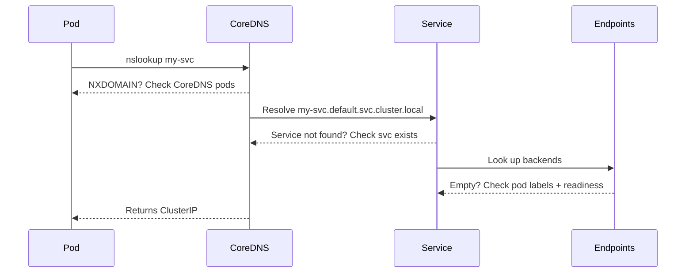
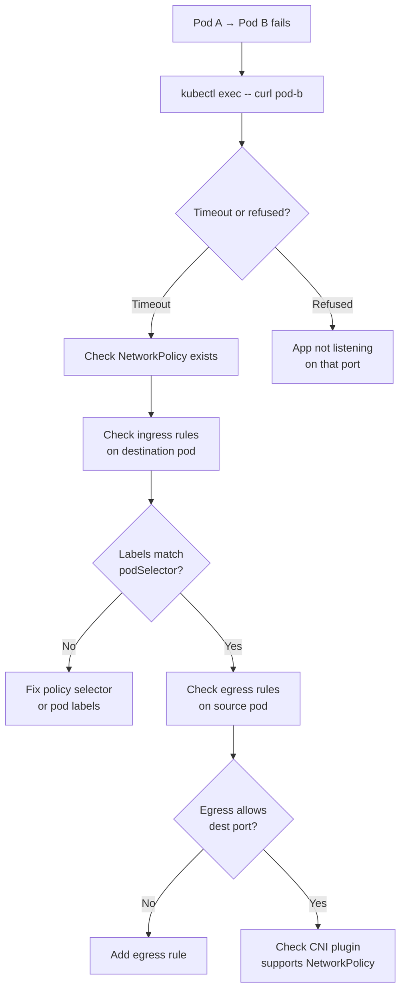
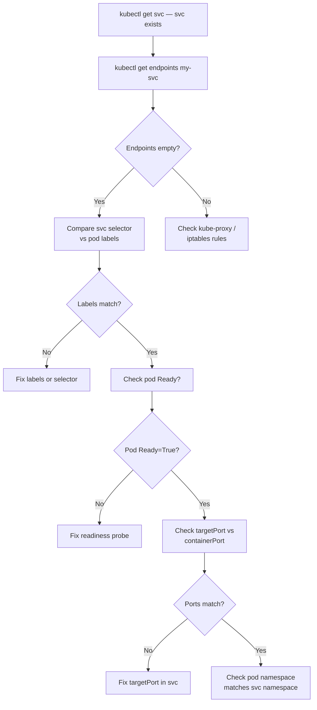
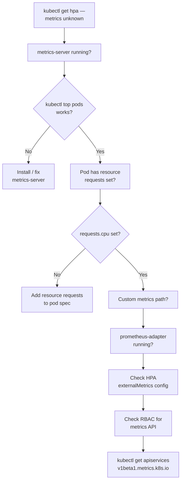
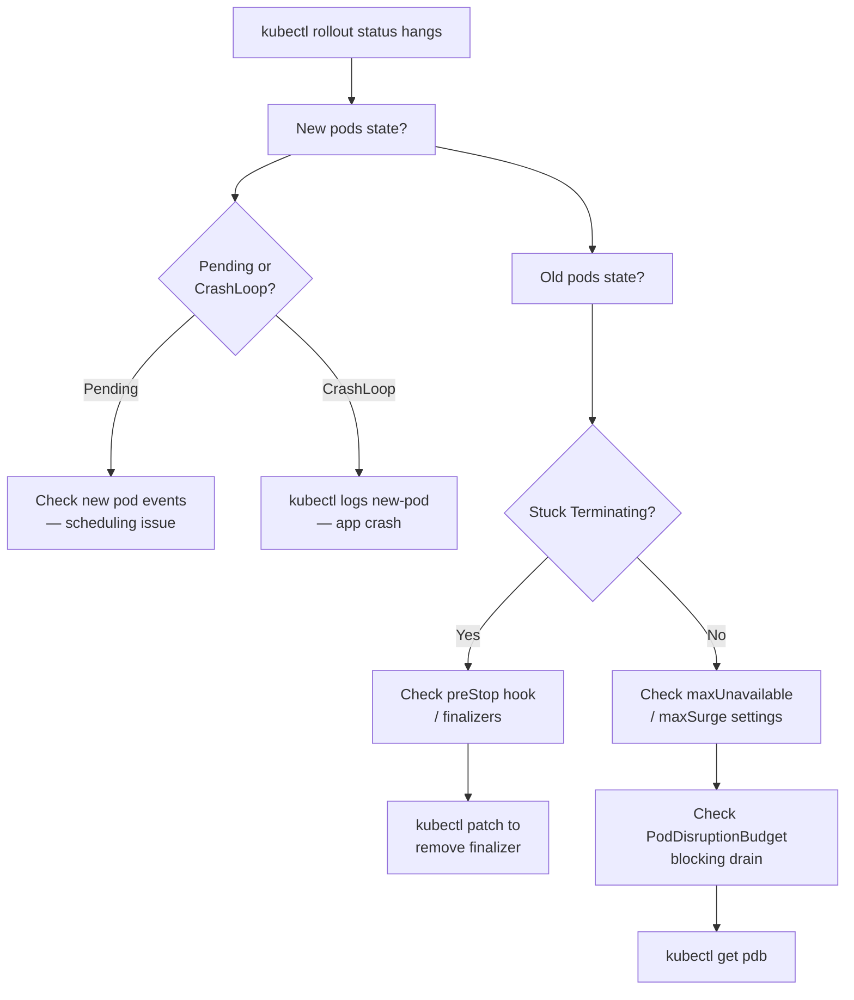
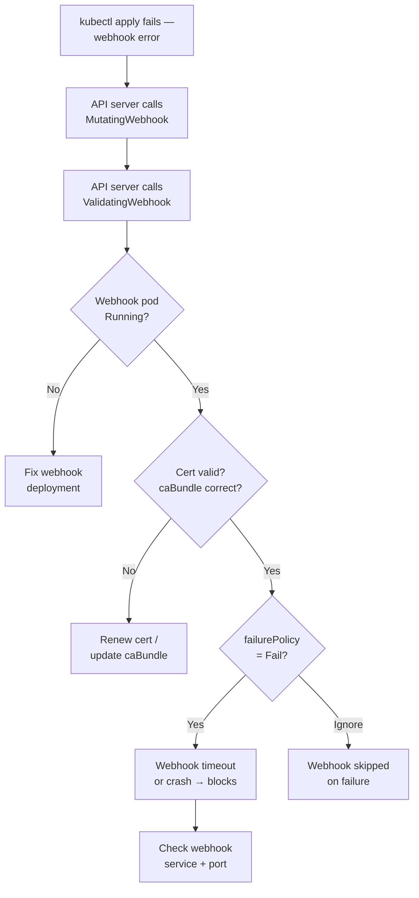
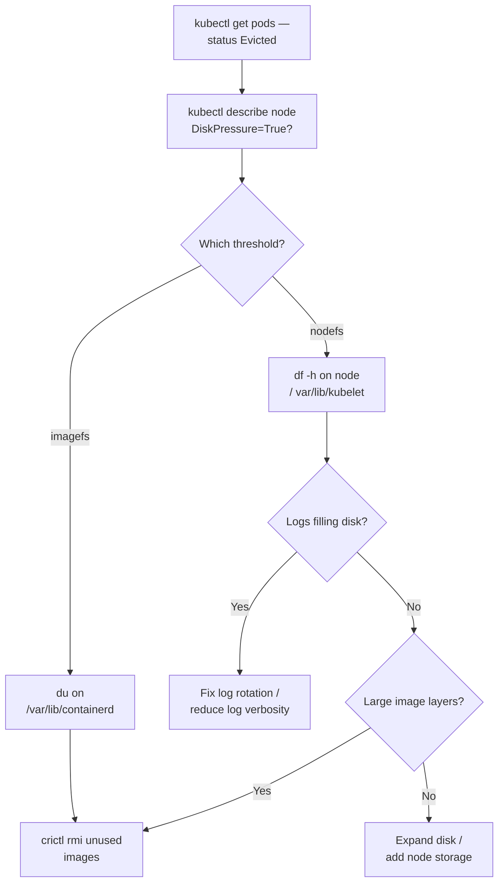
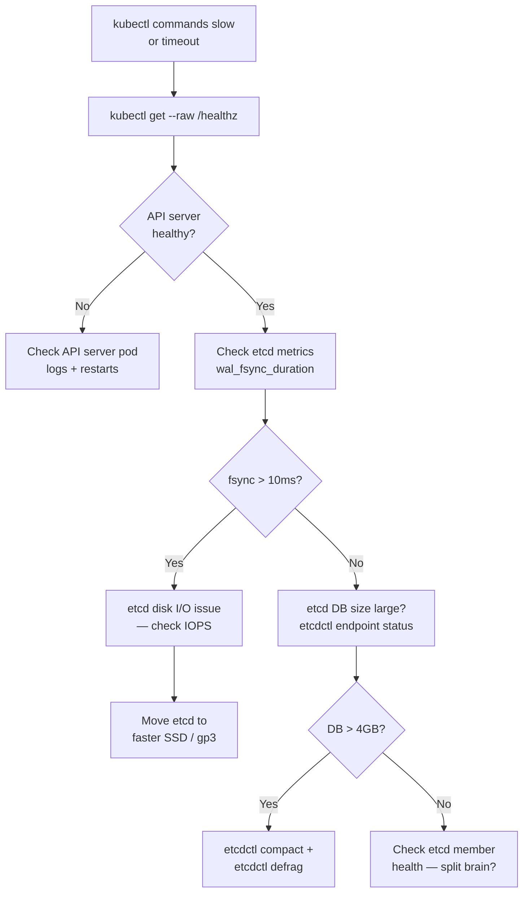
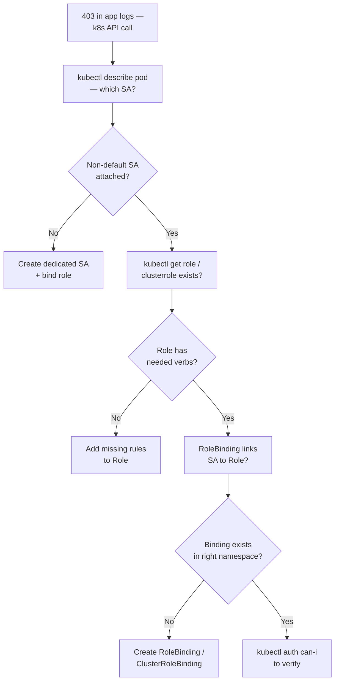

## CrashLoopBackOff: Debugging Runbook

`CrashLoopBackOff` means the container starts, crashes (exits non-zero), Kubernetes restarts it, it crashes again — and Kubernetes applies exponential backoff between restarts (10s → 20s → 40s → 80s → 160s → 5min cap). It will keep retrying indefinitely.

**It is not a single cause — it's a symptom.** The exit code tells you where to look first.

### Step 1: Get the exit code and last logs

```bash
# See restart count and status
kubectl get pod <pod> -n <ns>

# Last crash reason + exit code
kubectl describe pod <pod> -n <ns>
# Look for: Last State, Exit Code, Reason (OOMKilled / Error / Completed)

# Logs from the crashed container (not the current one)
kubectl logs <pod> -n <ns> --previous

# If multi-container pod
kubectl logs <pod> -n <ns> -c <container-name> --previous
```

### Step 2: Diagnose by exit code

| Exit Code | Meaning | Where to look |
|-----------|---------|---------------|
| `1` | App error / panic / unhandled exception | `--previous` logs — missing env var, failed DB connect, bad config |
| `2` | Misuse of shell / script error | Entrypoint/command misconfigured |
| `137` | `SIGKILL` — OOM killed by kernel | Memory limit too low, memory leak |
| `139` | Segfault | Corrupt binary, wrong arch (arm vs amd64) |
| `143` | `SIGTERM` not handled — graceful shutdown timeout | App ignores SIGTERM, preStop hook too short |
| `125` | Docker/container runtime error | Bad image, missing binary in container |
| `126` | Permission denied on entrypoint | File not executable, wrong user |
| `127` | Entrypoint binary not found | Typo in `command`, wrong base image |

### Step 3: Work through the cause tree

```
CrashLoopBackOff
├── Exit 137 (OOMKilled)
│   ├── memory.limit too low → increase resources.limits.memory
│   ├── memory leak → profile with pprof, check goroutine count
│   └── JVM heap not set → add -Xmx flag
│
├── Exit 1 (App panic/error)
│   ├── Missing env var → kubectl describe pod, check envFrom / env
│   ├── Can't connect to DB/Redis on startup → wrong SERVICE_NAME, wrong port
│   ├── Failed DB migration (runs in same container) → separate init container
│   ├── Config file not found → ConfigMap not mounted, wrong mountPath
│   └── Secret not found → Secret doesn't exist in namespace
│
├── Exit 127 (binary not found)
│   ├── Wrong command/args in Deployment spec
│   └── Multi-stage build forgot to copy the binary
│
├── Exit 1 but logs are empty
│   ├── App crashes before logger initializes → add stderr logging early
│   ├── Init container failing → kubectl logs <pod> -c <init-container>
│   └── readinessProbe killing pod before app fully starts
│
└── Liveness probe killing healthy pod
    ├── initialDelaySeconds too short → app not ready when probe fires
    ├── Probe endpoint wrong → 404 returns, pod killed
    └── timeoutSeconds too low → slow startup looks like failure
```

### Common contributors and fixes

#### 1. Missing / wrong environment variable

```bash
kubectl describe pod <pod> -n <ns> | grep -A5 "Environment"
# Or check what the app is actually seeing:
kubectl exec <pod> -n <ns> -- env | grep DB_

# Fix: check ConfigMap and Secret refs in Deployment
```

```yaml
# Common mistake: referencing a Secret that doesn't exist in this namespace
env:
- name: DB_PASSWORD
  valueFrom:
    secretKeyRef:
      name: db-secret      # does this Secret exist in the same namespace?
      key: password
```

```bash
kubectl get secret db-secret -n <ns>   # 404 here = pod will CrashLoop
```

#### 2. Can't connect to dependency on startup

App tries to connect to DB/Redis/external API during `init()` or startup, fails, panics.

```bash
# Test connectivity from inside a debug pod in same namespace
kubectl run debug --rm -it --image=busybox -n <ns> -- sh
wget -qO- http://my-service:5432   # or nc -zv my-service 5432
```

**Fix:** Add startup retry logic — don't fail fast on first connection attempt. Or use an init container to wait for the dependency:

```yaml
initContainers:
- name: wait-for-db
  image: busybox
  command: ['sh', '-c', 'until nc -z postgres-svc 5432; do echo waiting; sleep 2; done']
```

#### 3. OOMKilled — memory limit too low

```bash
kubectl describe pod <pod> | grep -A3 "Last State"
# Last State: Terminated  Reason: OOMKilled

# Check current memory usage before the crash
kubectl top pod <pod> -n <ns>

# Check limits
kubectl get pod <pod> -o jsonpath='{.spec.containers[0].resources}'
```

**Fix:**
```yaml
resources:
  requests:
    memory: "256Mi"
  limits:
    memory: "512Mi"   # increase this, or remove limit to use node memory
```

For Go apps: `GOGC` env var controls GC aggressiveness. `GOMEMLIMIT` (Go 1.19+) sets a soft memory ceiling before GC kicks in aggressively:

```yaml
env:
- name: GOMEMLIMIT
  value: "450MiB"   # slightly below the k8s limit
```

#### 4. Liveness probe killing the pod

Pod shows `CrashLoopBackOff` but logs look fine — the liveness probe is the killer.

```bash
kubectl describe pod <pod> | grep -A10 "Liveness"
# Events: Liveness probe failed: ... Killing container with id...
```

```yaml
# Fix: give app time to start before first probe
livenessProbe:
  httpGet:
    path: /healthz
    port: 8080
  initialDelaySeconds: 30    # wait 30s before first check
  periodSeconds: 10
  failureThreshold: 3        # need 3 consecutive failures before kill
  timeoutSeconds: 5          # give it 5s to respond
```

#### 5. Init container failing silently

```bash
# Init containers show separately
kubectl get pod <pod> -n <ns>
# Init:0/1 means init container hasn't completed

kubectl logs <pod> -n <ns> -c <init-container-name>
kubectl logs <pod> -n <ns> -c <init-container-name> --previous
```

#### 6. Wrong image / wrong arch

```bash
kubectl describe pod <pod> | grep -A5 "Events"
# exec format error → image built for wrong arch (amd64 image on arm node or vice versa)

# Fix: build multi-arch image
docker buildx build --platform linux/amd64,linux/arm64 -t my-org/app:v1 --push .
```

### Quick checklist

```
□ kubectl logs <pod> --previous          → read the actual crash message
□ kubectl describe pod <pod>             → exit code, events, probe config
□ kubectl get events -n <ns> --sort-by=.lastTimestamp  → cluster-level events
□ exit code 137?                         → OOMKilled, check memory limits
□ exit code 1, empty logs?               → init container? probe killing it?
□ env vars correct?                      → describe pod, check secret/configmap exists
□ can pod reach its dependencies?        → debug pod with nc/wget
□ liveness probe initialDelaySeconds?    → might be firing too early
□ init containers healthy?               → kubectl logs -c <init-container>
□ image right arch?                      → exec format error in events
```

**Prevention:** Set `resources.limits.memory` on all containers — OOMKills become predictable, not random. Use `GOMEMLIMIT` for Go apps. Add startup probes with `failureThreshold: 30` so slow-starting apps don't get killed by liveness. In CI: run `kubectl apply --dry-run=server` to catch missing secrets/configmaps before deploy. Use `init containers` for dependency checks instead of fast-failing in the main container.

---

## Pod Stuck in `Pending`

Pod is created but never scheduled — it's sitting in the scheduler queue with no node assigned.

```bash
kubectl describe pod <pod> -n <ns>
# Look at Events section at the bottom — FailedScheduling with reason
```

### Cause tree

| Event message | Root cause | Fix |
|--------------|-----------|-----|
| `0/3 nodes are available: 3 Insufficient cpu` | No node has enough CPU | Scale up node group, lower requests, or check if requests are over-specified |
| `0/3 nodes are available: 3 Insufficient memory` | No node has enough memory | Same as above |
| `0/3 nodes are available: 3 node(s) had taint... that the pod didn't tolerate` | Missing toleration | Add toleration for the taint |
| `0/3 nodes are available: 3 node(s) didn't match Pod's node affinity/selector` | nodeAffinity/nodeSelector mismatch | Check labels on nodes vs pod spec |
| `0/3 nodes are available: 3 node(s) had untolerated taint + 0 didn't match affinity` | Both issues at once | Fix both |
| `unbound immediate PersistentVolumeClaims` | PVC not bound to a PV | See PVC stuck section below |
| `didn't match pod anti-affinity rules` | Hard anti-affinity unsatisfiable | Not enough nodes, or switch to soft |

```bash
# Check actual node capacity vs allocatable
kubectl describe nodes | grep -A5 "Allocated resources"

# Check what's consuming resources
kubectl top nodes
kubectl top pods -A --sort-by=memory

# Check if cluster autoscaler is blocked
kubectl logs -n kube-system -l app=cluster-autoscaler | tail -50
```

**Prevention:** Set accurate `resources.requests` — oversized requests cause artificial pending. Use Cluster Autoscaler with proper `minSize`/`maxSize` and ensure node groups cover all required taints/labels. Add `podAntiAffinity` with `preferredDuringScheduling` (not `required`) to avoid unsatisfiable constraints. Test scheduling with `kubectl apply --dry-run=server`.

---

## `ImagePullBackOff` / `ErrImagePull`

Container image can't be pulled. `ErrImagePull` is the first attempt; `ImagePullBackOff` is repeated failure with backoff.

```bash
kubectl describe pod <pod> -n <ns>
# Events: Failed to pull image "...", reason in the message
```

### Cause tree

| Error message | Cause | Fix |
|--------------|-------|-----|
| `unauthorized: authentication required` | No pull secret / wrong creds | Add `imagePullSecrets` to pod spec |
| `not found` / `manifest unknown` | Tag doesn't exist | `docker pull <image>` locally to verify |
| `no basic auth credentials` | ECR token expired (12hr TTL) | Refresh ECR token, or use IRSA + ECR pull-through |
| `exec format error` | Wrong arch (arm image on amd64 node) | Build multi-arch image |
| `connection refused` / timeout | Node can't reach registry | Check node's internet access / NAT GW / VPC endpoint for ECR |
| `ImagePullBackOff` on private registry | `imagePullSecrets` missing or wrong namespace | Secret must be in same namespace as pod |

```bash
# Test pulling manually on the node
kubectl debug node/<node-name> -it --image=busybox
# inside: docker pull <image> or crictl pull <image>

# Check if imagePullSecret exists in the right namespace
kubectl get secret regcred -n <ns>

# For ECR: check node IAM role has ecr:GetAuthorizationToken
aws iam simulate-principal-policy \
  --policy-source-arn <node-role-arn> \
  --action-names ecr:GetAuthorizationToken
```

**Prevention:** Use image digest pinning (`image: my-app@sha256:abc123`) instead of mutable tags in production — guarantees the same image always. Set up ECR pull-through cache or mirror to avoid rate limits. For ECR: use IRSA on the node role with `ecr:GetAuthorizationToken` + `ecr:BatchGetImage`. Test image pulls in CI before deploying.

---

## Pod Stuck in `Terminating`

`kubectl delete pod` was run but pod stays in Terminating state indefinitely.

```bash
kubectl describe pod <pod> -n <ns>
# Look for: finalizers, volumes not unmounting, preStop hook hanging
```

### Causes

**1. Finalizer not being removed**
```bash
kubectl get pod <pod> -n <ns> -o json | jq '.metadata.finalizers'
# If a controller crashed and never removed the finalizer, pod hangs

# Force remove finalizer (only if you're sure the controller is gone)
kubectl patch pod <pod> -n <ns> -p '{"metadata":{"finalizers":[]}}' --type=merge
```

**2. preStop hook hanging**
```yaml
# preStop has a hard deadline of terminationGracePeriodSeconds (default 30s)
# If hook runs longer, pod is force killed after the grace period
lifecycle:
  preStop:
    exec:
      command: ["/bin/sh", "-c", "sleep 5"]  # must complete within grace period
```

**3. Volume not unmounting (PVC)**
```bash
kubectl describe pod <pod> | grep -A5 "Volumes"
# "Unable to unmount volumes" in events = storage driver issue

# Force delete as last resort (may leave volume in bad state)
kubectl delete pod <pod> -n <ns> --grace-period=0 --force
```

**4. Node is NotReady / unreachable**
```bash
# If node went offline, pods on it stay Terminating until node comes back or is deleted
kubectl get node <node>
kubectl delete node <node>   # removes the node object, pods get rescheduled
```

**Prevention:** Avoid finalizers unless necessary — they're the #1 cause of stuck Terminating pods. Set `terminationGracePeriodSeconds` to a realistic value (preStop duration + drain time + buffer). For node failures: enable `NonGracefulNodeShutdown` feature gate (GA in 1.28) so stuck Terminating pods are auto-cleaned up.

---

## Node `NotReady`

```bash
kubectl get nodes
# NAME        STATUS      ROLES    AGE
# node-1      NotReady    <none>   2d

kubectl describe node <node-name>
# Look at: Conditions, Events, kubelet logs
```

### Cause tree

```
Node NotReady
├── kubelet stopped
│   └── ssh to node: systemctl status kubelet
│       journalctl -u kubelet -n 100
│
├── Disk pressure (DiskPressure=True)
│   ├── Node full of logs/images → kubelet evicts pods
│   └── Fix: kubectl drain + increase disk, or add imagePrunner CronJob
│       docker system prune / crictl rmi --prune
│
├── Memory pressure (MemoryPressure=True)
│   ├── System processes consuming memory
│   └── Fix: kubectl drain + investigate, check for memory leak in DaemonSets
│
├── PID pressure (PIDPressure=True)
│   ├── Too many processes (fork bomb, runaway threads)
│   └── Fix: find the pod: kubectl top pods --sort-by=cpu
│
├── Network unreachable
│   ├── CNI plugin crashed → pods can't get IPs
│   └── kubectl logs -n kube-system -l k8s-app=aws-node (VPC CNI)
│       kubectl logs -n kube-system -l app=calico-node
│
└── Cloud provider issue (EKS)
    └── EC2 instance health check failing → terminate + replace node
        aws ec2 describe-instance-status --instance-id <id>
```

```bash
# Cordon + drain to safely remove workloads before investigating
kubectl cordon <node>
kubectl drain <node> --ignore-daemonsets --delete-emptydir-data

# Check node events
kubectl get events -n default --field-selector involvedObject.name=<node>
```

**Prevention:** Monitor node conditions with `kube_node_status_condition` Prometheus metric. Alert on `DiskPressure=True` before pods are evicted. Add image GC thresholds in kubelet config (`imageGCHighThresholdPercent: 80`). Use node health checks with AWS Auto Scaling Group health check integration so unhealthy nodes are automatically replaced.

---

## High Latency / Slow Requests

Pod is Running, no crashes, but requests are slow.

### Step 1 — isolate the layer

```bash
# Is it all pods or specific ones?
kubectl top pods -n <ns>    # CPU throttled? Memory pressure?

# Check if requests hit a specific pod (check per-pod metrics in Grafana/Datadog)
# Is load balancer distributing unevenly?
```

### Step 2 — CPU throttling (most common invisible cause)

```bash
# Check throttling metrics
kubectl top pod <pod> -n <ns>
# If CPU is at limit constantly → throttled

# In Prometheus:
# container_cpu_cfs_throttled_seconds_total — cumulative throttle time
# rate(container_cpu_cfs_throttled_periods_total[5m]) / rate(container_cpu_cfs_periods_total[5m])
# > 0.25 means 25%+ of scheduling periods throttled → very bad for latency
```

**Fix:** Either raise the CPU limit, or remove it entirely (keep only `requests`). CPU limits cause p99 latency spikes even when average CPU is low.

```yaml
resources:
  requests:
    cpu: "500m"
  limits:
    cpu: "2000m"   # raise this, or remove limits entirely for latency-sensitive services
```

### Step 3 — GC pauses (Go / JVM)

```bash
# Go: check GC stats via pprof
kubectl port-forward pod/<pod> 6060:6060
curl http://localhost:6060/debug/pprof/heap > heap.prof
go tool pprof heap.prof

# Check GC frequency
curl http://localhost:6060/debug/vars | jq '.memstats'
# NumGC high + PauseTotalNs high → GC pressure
```

**Fix for Go:** Set `GOMEMLIMIT` to give GC headroom before hitting k8s limit.

### Step 4 — connection pool exhaustion

```bash
# Symptoms: latency spikes at high concurrency, logs show "connection wait timeout"
# App is waiting for a DB connection from the pool

# Check pool metrics if exposed, or:
kubectl exec <pod> -- cat /proc/<pid>/net/tcp | wc -l   # open TCP connections
```

**Fix:** increase pool size, or add read replicas / RDS Proxy.

### Step 5 — DNS resolution slow

```bash
# DNS latency inside cluster
kubectl run dnstest --rm -it --image=busybox -- sh
time nslookup my-service.my-namespace.svc.cluster.local

# CoreDNS performance
kubectl top pods -n kube-system -l k8s-app=kube-dns
kubectl logs -n kube-system -l k8s-app=kube-dns | grep -i error
```

**Fix:** use fully qualified domain names (FQDN) to avoid search domain iteration, or tune CoreDNS replicas.

**Prevention:** Never set CPU limits on latency-sensitive services — use requests only. Alert on `container_cpu_cfs_throttled_periods_total / container_cpu_cfs_periods_total > 0.25`. Set `dnsConfig.options: [{name: ndots, value: "2"}]` on all pods. Use `GOMEMLIMIT` for Go services. Deploy NodeLocal DNSCache to eliminate DNS as a latency source.

---

## PVC Stuck in `Pending`

```bash
kubectl get pvc -n <ns>
# NAME    STATUS    VOLUME   CAPACITY   STORAGECLASS
# data    Pending                       gp3

kubectl describe pvc data -n <ns>
# Events tell you why
```

| Event | Cause | Fix |
|-------|-------|-----|
| `no persistent volumes available` | No PV matches (static provisioning) | Create a PV or switch to dynamic |
| `storageclass not found` | Wrong `storageClassName` | `kubectl get storageclass` — check name |
| `waiting for first consumer` | StorageClass has `volumeBindingMode: WaitForFirstConsumer` | Normal — PVC binds when pod is scheduled |
| `failed to provision volume` | CSI driver error / IAM permissions | Check CSI driver pod logs |
| `exceeded quota` | ResourceQuota on namespace | `kubectl describe quota -n <ns>` |

```bash
# Check CSI driver (EBS on EKS)
kubectl logs -n kube-system -l app=ebs-csi-controller -c ebs-plugin | tail -50

# Check storage classes
kubectl get storageclass

# Check if IAM role for CSI has ebs:CreateVolume permission
```

**Prevention:** Use `WaitForFirstConsumer` volumeBindingMode on StorageClasses — prevents PVCs binding to the wrong AZ before the pod is scheduled. Set ResourceQuota for storage to prevent runaway PVC creation. Test CSI driver RBAC with `kubectl auth can-i` in staging before deploying new clusters.

---

## Resource Quota / LimitRange Blocking Pods

```bash
# Pod fails to create with "exceeded quota" or "must specify limits"
kubectl describe quota -n <ns>
kubectl describe limitrange -n <ns>

# Example output:
# Resource         Used    Hard
# requests.cpu     1800m   2000m    ← close to limit
# limits.memory    3Gi     4Gi
```

**LimitRange** sets defaults and min/max for containers in a namespace. If a pod has no `resources` set and LimitRange requires it, the pod is rejected.

```bash
# See what defaults are being injected
kubectl get limitrange -n <ns> -o yaml
```

**Prevention:** Set LimitRange defaults in every namespace so pods without resource specs still get sane defaults. Alert on `kube_resourcequota{type="used"} / kube_resourcequota{type="hard"} > 0.80` to catch quota exhaustion before it blocks deployments. Document quota allocations per team in runbooks.

---

## Quick Reference: All Pod States

| Status | Meaning | First command |
|--------|---------|--------------|
| `Pending` | Not scheduled yet | `kubectl describe pod` → Events: FailedScheduling |
| `Init:0/1` | Init container running/failed | `kubectl logs <pod> -c <init-container>` |
| `PodInitializing` | Init done, main container starting | Normal, wait |
| `Running` but not Ready | Readiness probe failing | `kubectl describe pod` → probe config + app logs |
| `CrashLoopBackOff` | Container crashing repeatedly | `kubectl logs --previous`, check exit code |
| `OOMKilled` | Memory limit exceeded | Increase `limits.memory`, check for leak |
| `Error` | Container exited non-zero once | `kubectl logs <pod>` |
| `Completed` | Container exited 0 (Job/init) | Normal for Jobs |
| `Terminating` | Delete issued, waiting grace period | Check finalizers, preStop hook |
| `ImagePullBackOff` | Can't pull image | `kubectl describe pod` → registry/auth/tag |
| `ErrImageNeverPull` | `imagePullPolicy: Never` + image missing | Push image to node or change policy |
| `NodeLost` / `Unknown` | Node unreachable | `kubectl get node`, check cloud console |

---

## Pod Running But Requests Failing Silently

**Symptom:** Pod is `Running` and `Ready`, but requests return errors or wrong data. Readiness probe passes but the app is broken inside.



**Commands:**

```bash
# exec into pod and curl the app directly
kubectl exec -it <pod> -- curl -v http://localhost:<port>/healthz

# check app logs
kubectl logs <pod> --tail=100

# check readiness probe config
kubectl describe pod <pod> | grep -A 10 "Readiness"

# check env vars
kubectl exec -it <pod> -- env | grep -i db
kubectl exec -it <pod> -- env | grep -i api
```

**Expected output snippet:**
```
Readiness:  http-get http://:8080/ready delay=5s timeout=1s period=10s
# If /ready returns 200 but app is broken, the probe path is wrong
```

**Root Cause Table:**

| Root Cause | Fix |
|---|---|
| Readiness probe checks wrong path | Update probe to check real health endpoint |
| Missing/wrong env var or ConfigMap | Verify `envFrom` / `env` in pod spec |
| Upstream DB/service unavailable | Check upstream pod/service connectivity |
| App bug returns 200 on errors | Fix application logic |

**Prevention:** Separate liveness from readiness probes — readiness should check actual app health (e.g. DB ping), liveness should only check if the process is hung. Use `/readyz` for readiness (checks dependencies) and `/livez` for liveness (just checks process). Add integration tests in CI that deploy to staging and verify the probe endpoints return correct status codes.

---

## DNS Resolution Failures Inside Pods

**Symptom:** Pod gets `NXDOMAIN` or connection timeout when resolving service names. `nslookup my-svc` fails inside the pod.



**Commands:**

```bash
# test DNS from inside pod
kubectl exec -it <pod> -- nslookup my-svc
kubectl exec -it <pod> -- nslookup my-svc.default.svc.cluster.local

# check resolv.conf
kubectl exec -it <pod> -- cat /etc/resolv.conf
# expect: search default.svc.cluster.local svc.cluster.local cluster.local

# is CoreDNS running?
kubectl get pods -n kube-system -l k8s-app=kube-dns

# CoreDNS logs
kubectl logs -n kube-system -l k8s-app=kube-dns --tail=50
```

**Root Cause Table:**

| Root Cause | Fix |
|---|---|
| CoreDNS pod down/crashlooping | Restart CoreDNS pods; check its ConfigMap |
| Service doesn't exist in namespace | `kubectl get svc` — create if missing |
| Wrong search domain in resolv.conf | Check `dnsConfig` in pod spec |
| NetworkPolicy blocks pod→CoreDNS (port 53) | Allow egress to kube-dns on UDP/TCP 53 |

**Prevention:** Deploy NodeLocal DNSCache DaemonSet — each node caches DNS locally, eliminating CoreDNS as a SPOF. Set `ndots: 2` in pod dnsConfig to reduce DNS round trips. Alert on `coredns_dns_responses_total{rcode="SERVFAIL"}` and CoreDNS `OOMKilled`. Scale CoreDNS replicas proportional to cluster size (1 replica per 16 nodes minimum).

---

## NetworkPolicy Blocking Traffic

**Symptom:** Pod A can't reach Pod B or a Service, but both are `Running`. No obvious error — just connection refused or timeout.



**Commands:**

```bash
# list all network policies in namespace
kubectl get networkpolicy -n <ns>

# inspect a policy
kubectl describe networkpolicy <policy-name> -n <ns>

# test connectivity from pod A
kubectl exec -it <pod-a> -- curl -v http://<pod-b-ip>:<port>

# use ephemeral debug container (k8s 1.23+)
kubectl debug -it <pod-a> --image=nicolaka/netshoot --target=<container>
# then: curl, nslookup, tcpdump
```

**Root Cause Table:**

| Root Cause | Fix |
|---|---|
| Ingress policy missing `from` rule | Add `podSelector` matching source pod labels |
| Egress policy missing `to` rule | Add egress rule for destination port |
| Pod labels don't match policy selector | Align pod labels with `podSelector` |
| CNI doesn't enforce NetworkPolicy | Switch to Calico/Cilium/Weave |

**Prevention:** Adopt a default-deny-all NetworkPolicy per namespace and explicitly allowlist required traffic. Test policies with `kubectl exec -- curl` in staging before prod. Use Cilium's `hubble observe --verdict DROPPED` to see what's being blocked in real time. Include NetworkPolicy in service deployment manifests so policies travel with the service.

---

## Service Not Routing to Pods (Empty Endpoints)

**Symptom:** Service exists and has a ClusterIP, but requests get `connection refused` or no backends respond.



**Commands:**

```bash
# check endpoints
kubectl get endpoints my-svc
# ENDPOINTS column should not be "<none>"

# describe the service to see selector
kubectl describe svc my-svc

# check pod labels
kubectl get pods --show-labels

# verify targetPort
kubectl get svc my-svc -o jsonpath='{.spec.ports[*].targetPort}'
```

**Expected output snippet:**
```
NAME      ENDPOINTS         AGE
my-svc    <none>            5m   ← problem: no backends
```

**Root Cause Table:**

| Root Cause | Fix |
|---|---|
| Service selector doesn't match pod labels | Align `spec.selector` with pod labels |
| Pod not Ready (failing readiness probe) | Fix readiness probe or app startup |
| targetPort ≠ containerPort | Match `targetPort` to the port the app listens on |
| Pod in different namespace | Service and pods must be in same namespace |

**Prevention:** Use label conventions enforced by LimitRange/OPA — all pods must have `app` label. Write CI checks (`conftest`, `kyverno`) that validate Service selectors match Deployment labels before merge. Add a Prometheus alert on `kube_endpoint_address_not_ready > 0` sustained for > 2 minutes.

---

## HPA Not Scaling

**Symptom:** Load is high but HPA stays at `minReplicas`. `kubectl get hpa` shows `<unknown>` for current metrics.



**Commands:**

```bash
# check HPA status
kubectl get hpa
kubectl describe hpa <hpa-name>

# verify metrics-server is reachable
kubectl top pods -n <ns>
kubectl top nodes

# check metrics API registration
kubectl get apiservices | grep metrics

# check if resource requests are set on pods
kubectl get pod <pod> -o jsonpath='{.spec.containers[*].resources}'
```

**Expected output snippet:**
```
NAME   REFERENCE         TARGETS         MINPODS  MAXPODS  REPLICAS
web    Deployment/web    <unknown>/50%   2        10       2
# <unknown> means metrics pipeline is broken
```

**Root Cause Table:**

| Root Cause | Fix |
|---|---|
| metrics-server not installed | Install via `kubectl apply -f metrics-server.yaml` |
| No `resources.requests.cpu` on pod | Add CPU request to pod/deployment spec |
| `v1beta1.metrics.k8s.io` not registered | Fix metrics-server or prometheus-adapter install |
| RBAC missing for metrics API | Add ClusterRole for HPA to read metrics |

**Prevention:** Always set `resources.requests.cpu` — HPA silently shows `<unknown>` without it. Install metrics-server as part of cluster bootstrap (not optional). For production: use KEDA with external metrics (queue depth, RPS) instead of CPU-only HPA — CPU is a lagging indicator of load.

---

## Deployment Stuck in Rollout

**Symptom:** `kubectl rollout status` hangs. New pods won't start (CrashLoop/Pending) or old pods won't terminate.



**Commands:**

```bash
# check rollout status
kubectl rollout status deployment/<name>

# rollout history
kubectl rollout history deployment/<name>

# inspect new and old pods
kubectl get pods -l app=<name> --sort-by=.metadata.creationTimestamp

# describe a stuck pod
kubectl describe pod <new-pod>

# check PodDisruptionBudget
kubectl get pdb -n <ns>
kubectl describe pdb <pdb-name>

# rollback if needed
kubectl rollout undo deployment/<name>
```

**Root Cause Table:**

| Root Cause | Fix |
|---|---|
| New image crash / bad config | Check logs; rollback with `kubectl rollout undo` |
| PDB blocks pod termination | Temporarily scale PDB `minAvailable` or fix pod health |
| preStop hook hangs | Fix hook or reduce `terminationGracePeriodSeconds` |
| maxUnavailable=0 + unschedulable nodes | Fix node capacity or adjust rollout strategy |

**Prevention:** Set a `progressDeadlineSeconds` (default 600s) — rollout auto-fails if new pods don't become Ready within that window, making CI pipelines fail fast. Always set a PDB with `minAvailable: 1` so rollouts can't kill all replicas. Add a readiness probe that fails until the app is truly ready (not just started).

---

## Webhook Admission Failures

**Symptom:** `kubectl apply` returns an admission webhook error. Resource can't be created or updated.



**Commands:**

```bash
# list webhook configs
kubectl get validatingwebhookconfigurations
kubectl get mutatingwebhookconfigurations

# inspect a webhook
kubectl describe validatingwebhookconfiguration <name>

# check webhook pod and service
kubectl get pods -n <webhook-ns>
kubectl get svc -n <webhook-ns>

# test webhook service reachability
kubectl exec -it <debug-pod> -- curl -k https://<webhook-svc>.<ns>.svc/validate
```

**Root Cause Table:**

| Root Cause | Fix |
|---|---|
| Webhook pod down | Restart webhook deployment |
| TLS cert expired / wrong caBundle | Rotate cert; update `caBundle` in webhook config |
| `failurePolicy: Fail` + unreachable webhook | Set `failurePolicy: Ignore` temporarily or fix pod |
| Webhook rejects valid resource (logic bug) | Fix webhook validation logic |

**Prevention:** Set `failurePolicy: Ignore` on all non-critical webhooks (security webhooks can be `Fail`). Add `namespaceSelector` to exclude `kube-system` from webhook scope — prevents the webhook from blocking its own recovery. Use cert-manager to auto-rotate webhook TLS certs. Run webhook pods with PDB and 2+ replicas.

---

## Node Disk Pressure Evicting Pods

**Symptom:** Pods suddenly evicted with `reason: Evicted`. Node shows `DiskPressure=True` condition.



**Commands:**

```bash
# find evicted pods
kubectl get pods --field-selector=status.phase=Failed -A | grep Evicted

# describe node for disk pressure
kubectl describe node <node-name> | grep -A 5 "Conditions"

# debug node filesystem (k8s 1.23+)
kubectl debug node/<node-name> -it --image=ubuntu
# inside: df -h, du -sh /var/log/containers/*

# clean up evicted pods
kubectl delete pods --field-selector=status.phase=Failed -A
```

**Expected output snippet:**
```
Conditions:
  Type            Status  ...
  DiskPressure    True    kubelet has disk pressure
```

**Root Cause Table:**

| Root Cause | Fix |
|---|---|
| Container logs unbounded | Configure `logrotate` or set `--container-log-max-size` |
| Unused container images | Run `crictl rmi --prune` or configure image GC |
| emptyDir volumes growing large | Add `sizeLimit` to emptyDir volume spec |
| Node disk too small | Expand EBS volume or add larger node group |

**Prevention:** Set kubelet `--container-log-max-size=50Mi --container-log-max-files=3`. Configure image GC thresholds (`imageGCHighThresholdPercent: 80`). Alert on `node_filesystem_avail_bytes / node_filesystem_size_bytes < 0.15`. Add `sizeLimit` to all emptyDir volumes. Use instance types with ≥ 100Gi root volumes for nodes.

---

## etcd Slow / API Server Timeout

**Symptom:** `kubectl` commands hang or return timeout. All operations are slow. Cluster feels frozen.



**Commands:**

```bash
# check API server health
kubectl get --raw /healthz
kubectl get --raw /readyz

# etcd health (run on etcd node or via pod)
etcdctl --endpoints=https://127.0.0.1:2379 \
  --cacert=/etc/kubernetes/pki/etcd/ca.crt \
  --cert=/etc/kubernetes/pki/etcd/healthcheck-client.crt \
  --key=/etc/kubernetes/pki/etcd/healthcheck-client.key \
  endpoint health

# etcd status (shows DB size)
etcdctl endpoint status --write-out=table

# defrag etcd (do during low-traffic window)
etcdctl defrag --endpoints=https://127.0.0.1:2379
```

**Root Cause Table:**

| Root Cause | Fix |
|---|---|
| Slow disk (high WAL fsync latency) | Move etcd to SSD; use gp3 with provisioned IOPS |
| etcd DB size > quota (default 2GB) | Compact revisions + defrag; increase `--quota-backend-bytes` |
| etcd member unhealthy / quorum lost | Recover failed member; restore from snapshot |
| Too many objects (large secrets/CMs) | Audit and prune large resources |

**Prevention:** Provision etcd on dedicated fast SSDs (io2 or local NVMe). Alert on `etcd_disk_wal_fsync_duration_seconds_bucket{quantile="0.99"} > 0.01` (10ms p99). Set up automated daily compaction and defrag as a CronJob. Monitor `etcd_mvcc_db_total_size_in_bytes` — alert at 1.5GB (before hitting 2GB default quota). Run etcd on at least 3 nodes for quorum.

---

## RBAC 403 — Pod Can't Call Kubernetes API

**Symptom:** App inside a pod gets `403 Forbidden` when calling the Kubernetes API. ServiceAccount token is present but denied.



**Commands:**

```bash
# test permissions as the service account
kubectl auth can-i get pods \
  --as=system:serviceaccount:default:my-sa -n default

kubectl auth can-i list secrets \
  --as=system:serviceaccount:default:my-sa -n default

# check what SA the pod uses
kubectl get pod <pod> -o jsonpath='{.spec.serviceAccountName}'

# list role bindings in namespace
kubectl get rolebinding -n <ns>
kubectl get clusterrolebinding | grep my-sa

# describe the binding
kubectl describe rolebinding <name> -n <ns>
kubectl describe clusterrolebinding <name>
```

**Expected output snippet:**
```
no  ← kubectl auth can-i returns "no" → RBAC is the blocker
```

**Root Cause Table:**

| Root Cause | Fix |
|---|---|
| Default SA has no permissions | Create Role + RoleBinding for a dedicated SA |
| RoleBinding in wrong namespace | Re-create binding in the pod's namespace |
| Role missing required verb/resource | Add `verbs` and `resources` to Role rules |
| ClusterRole needed but only Role created | Use ClusterRole + ClusterRoleBinding for cluster-wide access |

**Prevention:** Use least-privilege by default — never use `cluster-admin` for application service accounts. Audit existing bindings regularly: `kubectl get clusterrolebinding -o json | jq '[.items[] | select(.subjects[]?.kind=="ServiceAccount")]'`. Use Kyverno or OPA Gatekeeper policies to prevent broad RBAC grants in CI. Test RBAC with `kubectl auth can-i --as=system:serviceaccount:ns:sa` in staging.
