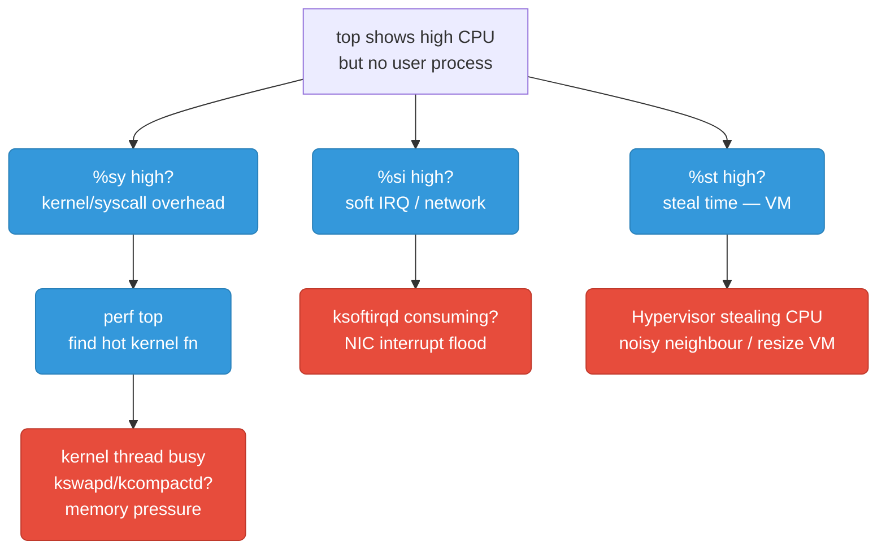
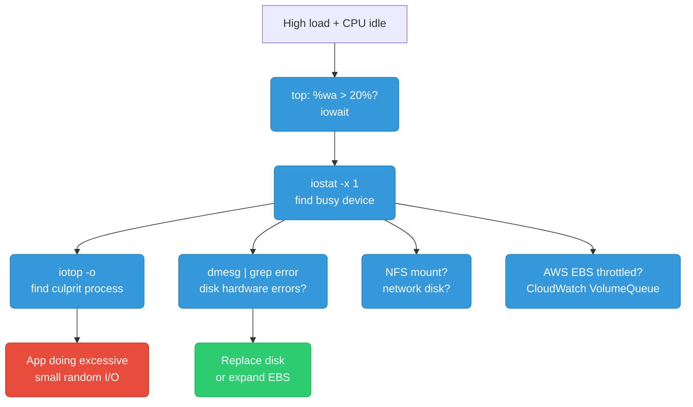
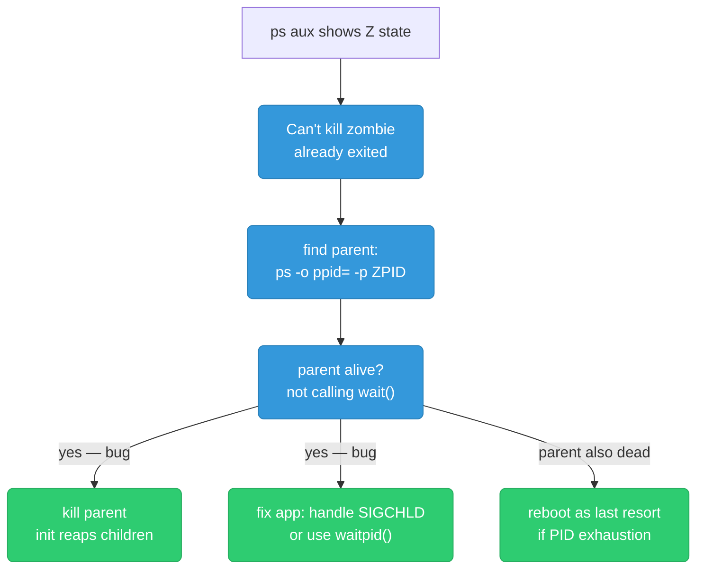
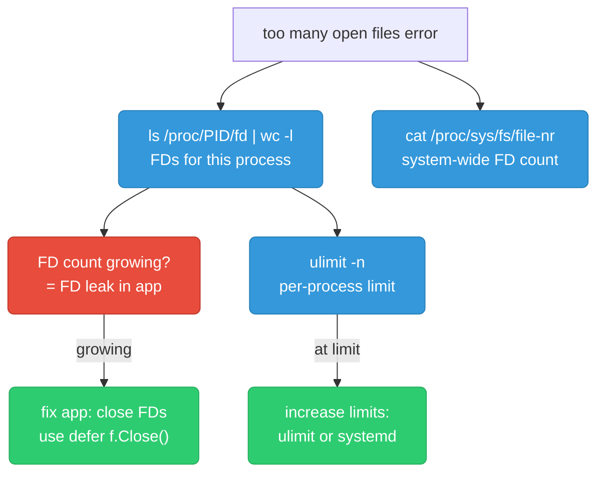
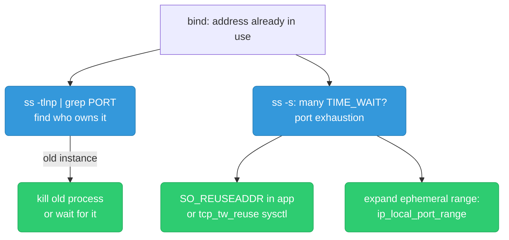
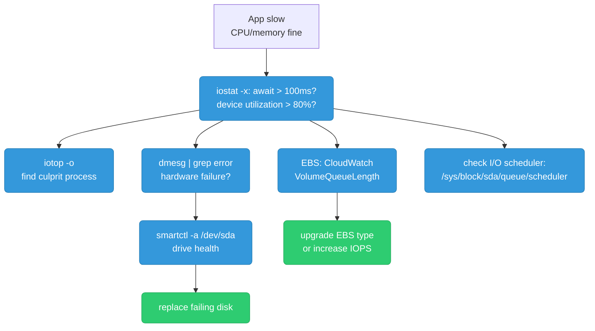
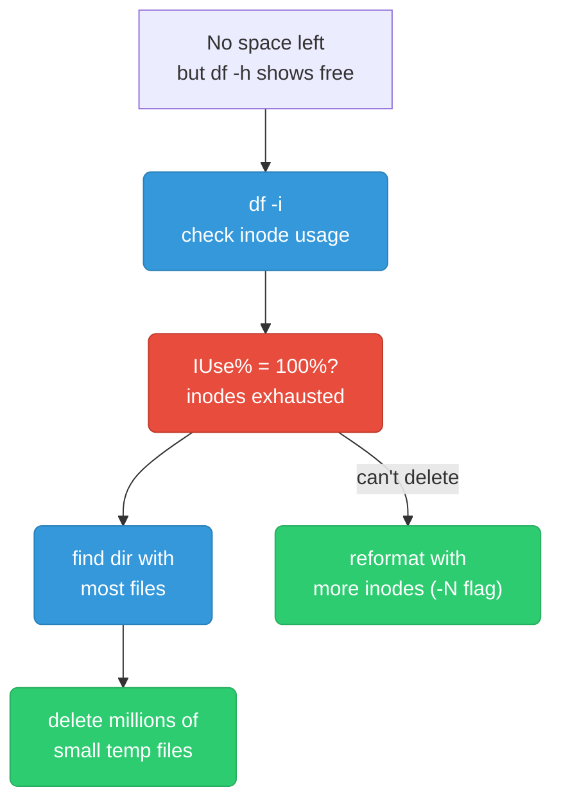
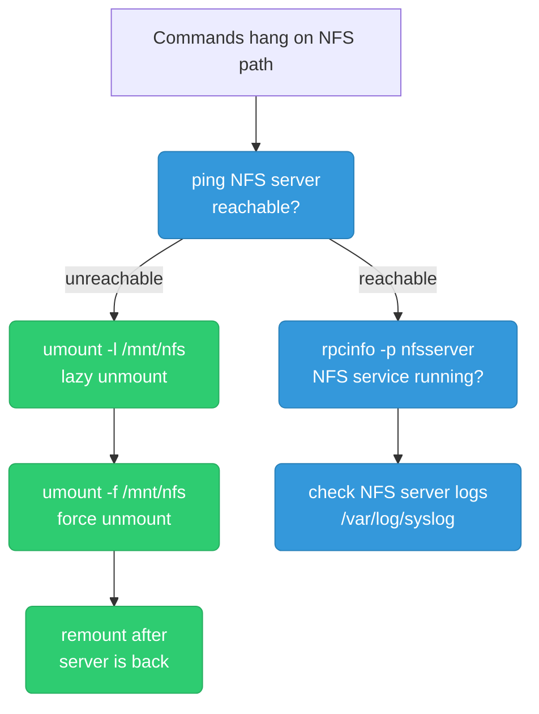
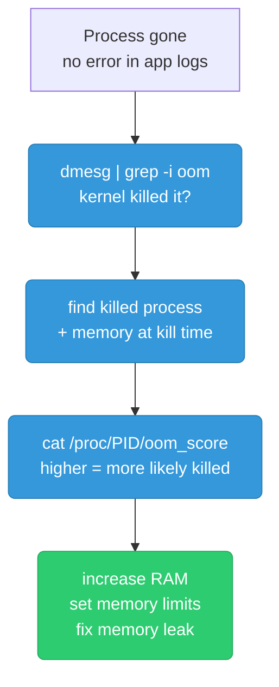
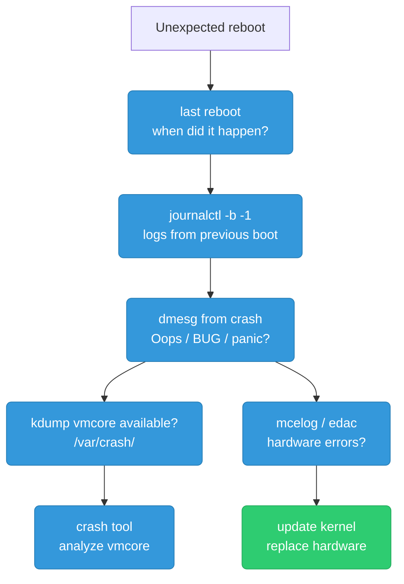

# Linux Debugging Scenarios

---

## High CPU But `top` Shows Nothing Obvious

**Symptom:** System feels slow, load high, but no single user process shows high CPU in `top`. `%us` is low but `%sy` or `%si` is high.



```bash
top              # press 1 for per-CPU breakdown
                 # columns: %us %sy %ni %id %wa %hi %si %st

# %sy high — syscall/kernel overhead
perf top         # see hot kernel functions in real time
perf stat -a sleep 5   # aggregate counters

# %si high — soft IRQ (network packet processing)
cat /proc/softirqs        # see NET_RX/NET_TX counts per CPU
cat /proc/interrupts      # hardware interrupts per CPU
ethtool -l eth0           # check NIC queue count
# Fix: spread NIC queues across CPUs with irqbalance

# %st high — steal time (VM only)
# CPU cycles taken by hypervisor for other VMs
# Fix: move to dedicated instance, resize, or complain to cloud provider

# kswapd busy — memory pressure causing kernel to swap
vmstat 1         # si/so columns: swap in/out
free -h          # available memory
```

**Prevention:** Alert on `node_cpu_seconds_total{mode="softirq"} > 15%` and `node_cpu_seconds_total{mode="steal"} > 10%` in Prometheus. For NIC floods, enable RSS and set `irqbalance` in systemd. Profile with `perf record -ag` on canary instances before problems reach prod.

---

## Load Average High But CPU Idle

**Symptom:** `load average` is 20+ but `top` shows `%id` at 95%. System sluggish. Classic I/O wait.



```bash
# Load average counts all RUNNABLE + UNINTERRUPTIBLE processes
# Uninterruptible = waiting for I/O — shows in load but not CPU %

top              # check %wa (iowait)

# Find the busy device
iostat -x 1 5
# Key columns:
# await   = avg I/O wait time (ms) — >100ms is bad
# %util   = device utilization — >80% is saturated
# r/s w/s = reads/writes per second

# Find the process doing the I/O
iotop -o         # -o = only show processes doing I/O
iotop -o -b -n 3 # batch mode, 3 iterations

# Check for disk errors
dmesg | grep -iE "error|failure|ata|scsi|i/o" | tail -20

# Check if EBS is throttled (AWS)
# CloudWatch: VolumeQueueLength > 1 sustained = throttled
# Fix: upgrade to io2 or increase IOPS provisioning
```

**Load average formula:** counts processes in `R` (running) + `D` (uninterruptible sleep, waiting for I/O). High I/O wait → many `D` state processes → high load, low CPU.

**Prevention:** Alert on `node_pressure_io_stalled_seconds_total` (PSI) before load spikes. Use `iostat` in node exporters; page at `await > 50ms` sustained. For EBS: provision io2 with explicit IOPS, set CloudWatch alarm on `VolumeQueueLength > 1`.

---

## Zombie Process Accumulation

**Symptom:** `ps aux` shows many `Z` (zombie) processes. System may eventually run out of PIDs.



```bash
# Find zombies
ps aux | grep Z
# or
ps -eo pid,ppid,stat,comm | awk '$3 ~ /^Z/'

# Find the parent of a zombie
ps -o ppid= -p <zombie_pid>

# You CANNOT kill a zombie with kill -9 — it's already dead
# The zombie entry persists because the parent hasn't called wait()
# to collect the exit status

# Kill the parent — init (PID 1) will then reap all orphaned zombies
kill -9 <parent_pid>

# Check PID exhaustion
cat /proc/sys/kernel/pid_max   # default 32768
ps aux | wc -l                 # current process count

# Root cause: parent process creates children but doesn't handle SIGCHLD
# or never calls waitpid(). Fix in application code.
```

**Prevention:** Alert on `process_open_fds` (node exporter) or custom metric counting zombie processes (`ps -eo stat | grep -c Z`). Fix root cause in code: in Go `os/exec.Cmd.Wait()` always. Never fire-and-forget child processes.

---

## File Descriptor Exhaustion

**Symptom:** App logs `too many open files`. New connections refused. Existing connections may drop.



```bash
# Check per-process FD count
PID=$(pgrep myapp)
ls /proc/$PID/fd | wc -l
lsof -p $PID | wc -l         # more detailed

# Check current limit vs max
cat /proc/$PID/limits | grep "open files"

# System-wide FD usage: used | free | max
cat /proc/sys/fs/file-nr
# e.g.: 8192  0  1048576  → 8192 open, max 1M

# Increase per-process limit (persistent)
# /etc/security/limits.conf
echo "* soft nofile 65536" >> /etc/security/limits.conf
echo "* hard nofile 65536" >> /etc/security/limits.conf

# For systemd services:
# [Service]
# LimitNOFILE=65536

# Increase system-wide limit
sysctl -w fs.file-max=2097152
echo "fs.file-max = 2097152" >> /etc/sysctl.conf

# Detect FD leak: watch count over time
watch -n 1 "ls /proc/$PID/fd | wc -l"
```

**Prevention:** Export `process_open_fds / process_max_fds` via Prometheus process collector. Alert at 80% of limit. In Go: always `defer f.Close()` and `defer resp.Body.Close()`. Use `golangci-lint` with `bodyclose` linter to catch unclosed HTTP response bodies at CI time.

---

## Port Already in Use / TIME_WAIT Accumulation

**Symptom:** Service fails to start: `bind: address already in use`. Or `ss` shows thousands of `TIME_WAIT` sockets causing port exhaustion.



```bash
# Find what's using the port
ss -tlnp | grep :8080
# or
lsof -i :8080

# Count TIME_WAIT sockets
ss -tan | grep TIME_WAIT | wc -l
ss -s   # summary: number of each socket state

# TIME_WAIT is normal — lasts 2×MSL (60s default)
# Problem: high-frequency connections exhaust ephemeral ports

# Enable TIME_WAIT socket reuse (safe for most cases)
sysctl -w net.ipv4.tcp_tw_reuse=1

# Expand ephemeral port range (default 32768-60999)
sysctl -w net.ipv4.ip_local_port_range="1024 65535"

# In application: set SO_REUSEADDR before bind()
# Go HTTP server does this automatically
# Immediate restart fix:
sysctl -w net.ipv4.tcp_fin_timeout=15  # reduce TIME_WAIT duration
```

**Prevention:** Use connection pooling (keep-alive) so connections are reused instead of torn down per-request. In Go `http.Client`: set `MaxIdleConnsPerHost` to expected concurrency. Alert on `node_sockstat_TCP_tw > 10000`. Persist sysctl settings in `/etc/sysctl.d/` and apply via Ansible/Terraform.

---

## Disk I/O Latency Spike

**Symptom:** App is slow, no CPU/memory issue. Writes or reads taking seconds.



```bash
# Real-time I/O stats per device
iostat -x 1 5
# Key columns:
# Device  r/s   w/s   rMB/s  wMB/s  await  %util
# nvme0n1 10.0  50.0  0.5    2.0    250.0  95.0  ← await 250ms = bad

# Find which process is doing the I/O
iotop -o            # only show active processes
iotop -o -b -n 5    # non-interactive, 5 samples

# Check for disk errors
dmesg | grep -iE "error|ata|scsi|nvme|i/o err" | tail -20

# Check drive health (SMART)
smartctl -a /dev/sda
# Look for: Reallocated_Sector_Ct > 0 = bad sectors

# Check I/O scheduler
cat /sys/block/sda/queue/scheduler
# [mq-deadline] kyber none
# For SSD/NVMe: 'none' or 'mq-deadline' is best

# Simulate I/O to confirm
dd if=/dev/zero of=/tmp/test bs=1M count=1000 oflag=direct
# Check MB/s — compare with expected for disk type
```

**Prevention:** Alert on `node_disk_io_time_weighted_seconds_total` (saturation proxy) and `node_disk_read_time_seconds_total / node_disk_reads_completed_total` (latency per op). On AWS: use io2 Block Express for critical workloads, enable EBS burst balance alarm. Run `fio` benchmarks at instance provisioning time to establish baseline.

---

## Out of Inodes

**Symptom:** `No space left on device` but `df -h` shows free space. Writes fail.



```bash
# Check inode usage per filesystem
df -i
# Filesystem      Inodes  IUsed   IFree IUse%
# /dev/xvda1     6553600 6553600     0  100%  ← exhausted!

# Compare with block usage
df -h   # might show 40% used — space is fine, inodes are the issue

# Find directory with the most files (the culprit)
find / -xdev -printf '%h<br>' 2>/dev/null | sort | uniq -c | sort -rn | head -10
# Output: 2847291 /var/spool/postfix/maildrop  ← likely culprit

# Count files in suspected directory
ls /var/spool/postfix/maildrop | wc -l

# Clean up (example: old temp files, mail queue, cache)
find /tmp -type f -mtime +7 -delete     # files older than 7 days
find /var/spool/postfix/maildrop -type f -delete

# Why it happens:
# - Mail queue buildup (postfix misconfigured)
# - App creating millions of tiny lock/temp files
# - Log rotation creating too many files
# - Each file consumes 1 inode regardless of size
```

**Prevention:** Alert on `node_filesystem_files_free / node_filesystem_files < 0.10` (under 10% inodes free). For apps that generate many small files: use a subdirectory-per-bucket scheme (e.g. `tmp/ab/cd/abcdef...`). Configure log rotation with `maxfiles` limits.

---

## NFS Mount Hanging

**Symptom:** Commands hang when accessing NFS mount. `ls` on mount point freezes. `df -h` hangs. Can't unmount normally.



```bash
# WARNING: don't run df -h or ls on the mount — they'll hang too

# Check if NFS server is reachable
ping nfs-server
telnet nfs-server 2049

# Check NFS mounts without hanging
cat /proc/mounts | grep nfs

# Lazy unmount (detaches mount point, cleans up when processes release)
umount -l /mnt/nfs

# Force unmount (may corrupt in-flight writes)
umount -f /mnt/nfs

# If processes are stuck in D state waiting for NFS
lsof | grep /mnt/nfs      # find processes
# D-state processes can only be killed by fixing the NFS server or rebooting

# Check NFS server RPC services
rpcinfo -p nfs-server
showmount -e nfs-server

# Mount options to prevent hanging (use in /etc/fstab):
# nfs-server:/export /mnt/nfs nfs soft,timeo=30,retrans=3,_netdev 0 0
# soft: return error instead of hanging forever
# timeo=30: timeout after 30 deciseconds
# _netdev: wait for network before mounting at boot
```

**Prevention:** Always mount NFS with `soft,timeo=30,retrans=3` — never use hard mounts in production. Monitor NFS server availability with a synthetic probe. For K8s: prefer CSI drivers over direct NFS mounts; use PVCs with `ReadWriteMany` via EFS CSI driver which handles reconnect automatically.

---

## OOM Killer — Reading `dmesg`

**Symptom:** Process disappears without any error logs. Container/pod restarts unexpectedly.



```bash
# Check if OOM killer fired
dmesg | grep -iE "oom|killed process|out of memory"
journalctl -k | grep -i "oom\|killed process"

# Sample OOM kill log — what to look for:
# [1234567.890] Out of memory: Kill process 12345 (java) score 892 or sacrifice child
# [1234567.891] Killed process 12345 (java) total-vm:8192000kB, anon-rss:7890432kB
#
# Fields:
# score 892     → oom_score at time of kill (0-1000, higher = chosen first)
# total-vm      → virtual memory size
# anon-rss      → actual physical RAM used (this is what matters)

# Check oom_score of running processes (higher = killed first)
cat /proc/$(pgrep java)/oom_score

# Protect a process from OOM killer
echo -17 > /proc/$(pgrep critical-process)/oom_adj   # -17 = never kill

# Check memory at time of kill (the dmesg output shows a memory map)
# Look for: MemFree, Active, Inactive, Slab lines before the kill message

# For containers/K8s: exit code 137 = SIGKILL from OOM
# kubectl describe pod → Last State: OOMKilled
```

**Prevention:** Set memory `requests` = `limits` for Guaranteed QoS class in K8s (prevents OOM at pod level). Enable VPA to auto-tune limits. Alert on `container_memory_working_set_bytes / container_spec_memory_limit_bytes > 0.85`. Disable THP (`/sys/kernel/mm/transparent_hugepage/enabled = never`) for Redis/JVM workloads.

---

## Kernel Panic / System Freeze — Reading Crash Dumps

**Symptom:** System rebooted unexpectedly. Need to find why — hardware error, kernel bug, or driver crash.



```bash
# When did the system reboot?
last reboot
uptime

# Read logs from the previous boot (before crash)
journalctl -b -1           # previous boot
journalctl -b -1 | tail -100  # last 100 lines before crash
journalctl -b -1 -p err    # only errors

# Look for kernel oops/panic in dmesg
dmesg | grep -iE "panic|oops|bug:|call trace|segfault|general protection"

# Sample kernel oops output:
# BUG: unable to handle kernel NULL pointer dereference at 0000000000000010
# IP: [<ffffffff8123abcd>] some_kernel_function+0x1a/0x80
# Call Trace:
#   [<ffffffff8123def0>] another_function+0x40/0x100
# This is a stack trace — look up the function names for the kernel version

# Check if kdump captured a crash dump
ls -lh /var/crash/
# vmcore file = full kernel memory dump at crash time

# Analyze with crash tool
crash /usr/lib/debug/lib/modules/$(uname -r)/vmlinux /var/crash/$(date +%Y-%m-%d)/vmcore
# Inside crash: bt (backtrace), log (dmesg), ps (processes at crash)

# Check for hardware memory errors (ECC errors, MCE)
mcelog --client                    # machine check exceptions
cat /sys/devices/system/edac/mc/mc0/ce_count   # correctable errors

# Common causes:
# Kernel panic: driver bug, null pointer deref, stack overflow
# Soft lockup: "BUG: soft lockup - CPU#0 stuck" = CPU in kernel > 20s
# Hard lockup: NMI watchdog fires = CPU completely frozen
```

**Prevention:** Enable `kdump`/`kexec` on all nodes so crashes leave a vmcore for postmortem. Use AWS SSM Parameter Store or CloudWatch to capture last-boot logs. Keep kernels patched and pin driver versions in AMI builds. Alert on `node_boot_time_seconds` changing unexpectedly (unexpected reboot detector).

---

## Quick Reference: Linux Debugging Commands

| Symptom | First command | What to look for |
|---------|--------------|-----------------|
| High CPU, nothing in top | `perf top` | Kernel function consuming cycles |
| High load, CPU idle | `iostat -x 1` | `await > 100ms`, `%util > 80%` |
| Zombies | `ps -eo pid,ppid,stat,comm \| awk '$3~/Z/'` | PPID of zombie |
| FD exhaustion | `lsof -p PID \| wc -l` | Count growing over time = leak |
| Port in use | `ss -tlnp \| grep :PORT` | PID holding the port |
| Slow I/O | `iotop -o` | Process with highest I/O |
| No space (but df is fine) | `df -i` | IUse% = 100% |
| NFS hang | `umount -l /mnt/nfs` | Then check server reachability |
| Process disappeared | `dmesg \| grep -i oom` | `Killed process` entry |
| Unexpected reboot | `journalctl -b -1 \| tail -50` | Last log lines before crash |
