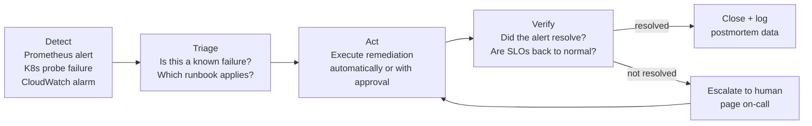
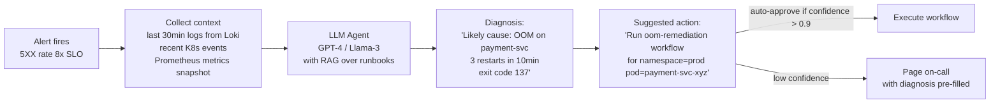

# Self-Healing Infrastructure & AIOps

Two converging ideas: automated remediation (SRE runbooks that run themselves) and AIOps (AI agents that diagnose and act on incidents). Both follow the same loop.

---

## The Self-Healing Loop



The difference from a standard alert: **Act** is automated, not a human. The human only gets involved if automation fails.

---

## Argo Events + Argo Workflows — Event-Driven Remediation

Argo Events watches for triggers (webhook, Prometheus alert, K8s event). Argo Workflows executes the remediation DAG.

### Install

```bash
kubectl create namespace argo-events
kubectl apply -n argo-events -f https://raw.githubusercontent.com/argoproj/argo-events/stable/manifests/install.yaml

kubectl create namespace argo
kubectl apply -n argo -f https://github.com/argoproj/argo-workflows/releases/download/v3.5.0/install.yaml
```

### Pattern: Prometheus alert → remediation workflow

```yaml
# EventSource: receives Prometheus Alertmanager webhooks
apiVersion: argoproj.io/v1alpha1
kind: EventSource
metadata:
  name: prometheus-alerts
  namespace: argo-events
spec:
  webhook:
    prometheus:
      port: "12000"
      endpoint: /alerts
      method: POST
---
# Sensor: maps alert name → workflow template to trigger
apiVersion: argoproj.io/v1alpha1
kind: Sensor
metadata:
  name: alert-remediator
  namespace: argo-events
spec:
  dependencies:
  - name: alert-dep
    eventSourceName: prometheus-alerts
    eventName: prometheus

  triggers:
  # OOMKilled → scale up memory
  - template:
      name: oom-remediation
      conditions: "alert-dep"
      argoWorkflow:
        operation: submit
        source:
          resource:
            apiVersion: argoproj.io/v1alpha1
            kind: Workflow
            metadata:
              generateName: oom-fix-
            spec:
              workflowTemplateRef:
                name: oom-remediation-template
        parameters:
        - src:
            dependencyName: alert-dep
            dataKey: body.alerts.0.labels.namespace
          dest: spec.arguments.parameters.0.value
        - src:
            dependencyName: alert-dep
            dataKey: body.alerts.0.labels.pod
          dest: spec.arguments.parameters.1.value
    retryStrategy:
      steps: 3
```

### Remediation workflow templates

```yaml
# Template 1: OOMKilled — patch memory limit up 50%
apiVersion: argoproj.io/v1alpha1
kind: WorkflowTemplate
metadata:
  name: oom-remediation
  namespace: argo
spec:
  arguments:
    parameters:
    - name: namespace
    - name: pod

  entrypoint: remediate
  templates:
  - name: remediate
    steps:
    - - name: get-current-limit
        template: kubectl-get-limit

    - - name: patch-limit
        template: kubectl-patch-limit
        arguments:
          parameters:
          - name: new_limit
            value: "{{steps.get-current-limit.outputs.result}}"

    - - name: verify
        template: verify-pod-running

    - - name: notify
        template: slack-notify

  - name: kubectl-get-limit
    script:
      image: bitnami/kubectl:latest
      command: [bash]
      source: |
        # Get current memory limit and increase by 50%
        current=$(kubectl get pod {{workflow.parameters.pod}} \
          -n {{workflow.parameters.namespace}} \
          -o jsonpath='{.spec.containers[0].resources.limits.memory}')
        # Convert Mi to number, multiply by 1.5
        echo "$current"

  - name: kubectl-patch-limit
    inputs:
      parameters:
      - name: new_limit
    script:
      image: bitnami/kubectl:latest
      command: [bash]
      source: |
        kubectl patch deployment \
          -n {{workflow.parameters.namespace}} \
          -l app={{workflow.parameters.pod}} \
          --type=json \
          -p='[{"op":"replace","path":"/spec/template/spec/containers/0/resources/limits/memory","value":"{{inputs.parameters.new_limit}}"}]'

  - name: verify-pod-running
    script:
      image: bitnami/kubectl:latest
      command: [bash]
      source: |
        kubectl rollout status deployment \
          -n {{workflow.parameters.namespace}} \
          --timeout=120s

  - name: slack-notify
    script:
      image: curlimages/curl:latest
      command: [sh]
      source: |
        curl -X POST $SLACK_WEBHOOK \
          -H "Content-Type: application/json" \
          -d '{"text":"Auto-remediated OOMKilled pod {{workflow.parameters.pod}} in {{workflow.parameters.namespace}}: memory limit increased"}'
      env:
      - name: SLACK_WEBHOOK
        valueFrom:
          secretKeyRef:
            name: slack-secret
            key: webhook-url
```

---

## Top 5 Auto-Remediation Scenarios

### 1. Pod OOMKilled repeatedly

**Trigger:** `kube_pod_container_status_restarts_total > 3` AND `kube_pod_container_status_last_terminated_reason == "OOMKilled"`

**Automated action:**
```bash
# Patch deployment memory limit up 25%
kubectl patch deployment $DEPLOY -n $NS --type=json \
  -p='[{"op":"replace","path":"/spec/template/spec/containers/0/resources/limits/memory","value":"'"$NEW_LIMIT"'"}]'
```

**Verify:** `kubectl rollout status deployment/$DEPLOY --timeout=120s`

**Escalate if:** pod still OOMKills after 2 automated increases → likely memory leak, needs code fix.

---

### 2. Node Disk Pressure → auto-prune

**Trigger:** `node_filesystem_avail_bytes / node_filesystem_size_bytes < 0.15`

**Automated action:**
```bash
# Run on the affected node via SSH or kubectl debug
crictl rmi --prune                           # remove unused container images
find /var/log/containers -mtime +7 -delete   # remove old log files
```

**K8s approach — DaemonSet job triggered by node condition:**
```yaml
# Argo Workflow triggered by NodeCondition DiskPressure=True
- name: prune-node
  script:
    image: bitnami/kubectl:latest
    command: [bash]
    source: |
      kubectl debug node/{{workflow.parameters.node}} \
        -it --image=ubuntu -- \
        bash -c "crictl rmi --prune && journalctl --vacuum-size=500M"
```

---

### 3. Deployment stuck in rollout → auto-rollback

**Trigger:** `kube_deployment_status_condition{condition="Progressing",status="False"}` for > 5 min

**Automated action:**
```bash
kubectl rollout undo deployment/$DEPLOY -n $NS
kubectl rollout status deployment/$DEPLOY -n $NS --timeout=60s
```

**Escalate if:** rollback also fails → previous version is also broken.

---

### 4. K8s Node NotReady → cordon + drain + replace

**Trigger:** `kube_node_status_condition{condition="Ready",status="false"} > 0` for > 5 min

**Automated action:**
```bash
# Step 1: cordon (no new pods)
kubectl cordon $NODE

# Step 2: drain (move existing pods)
kubectl drain $NODE --ignore-daemonsets --delete-emptydir-data --timeout=5m

# Step 3: if on AWS, terminate instance (ASG will replace it)
INSTANCE_ID=$(kubectl get node $NODE -o jsonpath='{.spec.providerID}' | cut -d/ -f5)
aws ec2 terminate-instances --instance-ids $INSTANCE_ID
```

**Verify:** new node joins, all pods Running.

---

### 5. RDS/Redis connection exhaustion

**Trigger:** `pg_stat_activity_count / pg_settings_max_connections > 0.9`

**Automated action:**
```bash
# Restart PgBouncer (connection pooler) to reclaim stale connections
kubectl rollout restart deployment/pgbouncer -n $NS

# If no pooler: kill idle connections > 10 min
psql -c "SELECT pg_terminate_backend(pid) FROM pg_stat_activity
         WHERE state = 'idle' AND query_start < NOW() - INTERVAL '10 min';"
```

---

## AIOps — AI-Assisted Incident Response

AIOps uses LLMs to automate the **Triage** step: given an alert and recent logs, determine which runbook to run and what the likely root cause is.



### Implementation with LangChain + Loki + Runbook RAG

```python
from langchain.agents import AgentExecutor, create_openai_tools_agent
from langchain_openai import ChatOpenAI
from langchain.tools import tool
import httpx, json

@tool
def query_loki(namespace: str, pod: str, minutes: int = 30) -> str:
    """Query recent logs from Loki for a specific pod"""
    query = f'{{namespace="{namespace}", pod=~"{pod}.*"}}'
    resp = httpx.get(
        "http://loki:3100/loki/api/v1/query_range",
        params={
            "query": query,
            "start": f"{minutes}m",
            "limit": 200,
        }
    )
    logs = [v[1] for result in resp.json()["data"]["result"]
            for v in result["values"]]
    return "\n".join(logs[-50:])  # last 50 log lines

@tool
def query_prometheus(promql: str) -> str:
    """Query current metric value from Prometheus"""
    resp = httpx.get(
        "http://prometheus:9090/api/v1/query",
        params={"query": promql}
    )
    return json.dumps(resp.json()["data"]["result"])

@tool
def get_k8s_events(namespace: str) -> str:
    """Get recent K8s warning events for a namespace"""
    import subprocess
    result = subprocess.run(
        ["kubectl", "get", "events", "-n", namespace,
         "--field-selector=type=Warning", "--sort-by=.lastTimestamp"],
        capture_output=True, text=True
    )
    return result.stdout[-3000:]  # last 3000 chars

@tool
def trigger_remediation_workflow(workflow_template: str, namespace: str, pod: str) -> str:
    """Trigger an Argo Workflow remediation template"""
    # Submit workflow via Argo API
    resp = httpx.post(
        "http://argo-server:2746/api/v1/workflows/argo",
        json={
            "workflow": {
                "spec": {
                    "workflowTemplateRef": {"name": workflow_template},
                    "arguments": {
                        "parameters": [
                            {"name": "namespace", "value": namespace},
                            {"name": "pod", "value": pod},
                        ]
                    }
                }
            }
        }
    )
    return f"Workflow submitted: {resp.json().get('metadata', {}).get('name')}"

# System prompt includes your runbook library (RAG-retrieved)
SYSTEM_PROMPT = """You are an SRE incident response agent.
When given an alert, you:
1. Collect logs and metrics to understand what's happening
2. Identify the root cause using the available tools
3. If confidence > 90% and it matches a known remediation pattern, trigger it
4. Otherwise, summarize findings for the on-call engineer

Known remediation workflows: oom-remediation, disk-prune, rollback-deployment, node-replace
"""

llm = ChatOpenAI(model="gpt-4", temperature=0)
tools = [query_loki, query_prometheus, get_k8s_events, trigger_remediation_workflow]
agent = create_openai_tools_agent(llm, tools, SYSTEM_PROMPT)
executor = AgentExecutor(agent=agent, tools=tools, verbose=True)

# Called by Alertmanager webhook
def handle_alert(alert: dict) -> str:
    namespace = alert["labels"]["namespace"]
    pod = alert["labels"].get("pod", "")
    alert_name = alert["labels"]["alertname"]

    result = executor.invoke({
        "input": f"Alert: {alert_name} fired for pod={pod} in namespace={namespace}. "
                 f"Diagnose and remediate if appropriate."
    })
    return result["output"]
```

### AlertManager webhook to AIOps agent

```yaml
# alertmanager.yml — route critical alerts to AIOps agent
route:
  routes:
  - match:
      severity: critical
    receiver: aiops-agent
    continue: true   # also page on-call

receivers:
- name: aiops-agent
  webhook_configs:
  - url: http://aiops-agent:8080/webhook/alert
    send_resolved: true
```

---

## Human Approval Gate

Not all remediations should be fully automatic. Use a confidence threshold:

```python
CONFIDENCE_THRESHOLD = 0.85

def handle_diagnosis(diagnosis: dict):
    if diagnosis["confidence"] >= CONFIDENCE_THRESHOLD:
        # Auto-execute
        trigger_remediation(diagnosis["workflow"], diagnosis["params"])
        notify_slack(f"Auto-remediated: {diagnosis['summary']}")
    else:
        # Send to on-call with pre-filled context
        page_oncall(
            title=diagnosis["alert_name"],
            diagnosis=diagnosis["summary"],
            suggested_action=diagnosis["suggested_workflow"],
            runbook_link=diagnosis["runbook_url"],
        )
```

---

## Observability for Self-Healing

Track remediation effectiveness as a metric:

```python
from prometheus_client import Counter, Histogram

remediations_total = Counter(
    "self_healing_remediations_total",
    "Auto-remediations attempted",
    labelnames=["alert_name", "outcome"]  # outcome: success, escalated, failed
)

remediation_duration = Histogram(
    "self_healing_remediation_duration_seconds",
    "Time from alert to resolution",
    labelnames=["alert_name"]
)
```

```promql
# Success rate of auto-remediation
rate(self_healing_remediations_total{outcome="success"}[1h])
/
rate(self_healing_remediations_total[1h])

# Average time to auto-resolve (MTTR for automated incidents)
histogram_quantile(0.50, rate(self_healing_remediation_duration_seconds_bucket[24h]))
```
