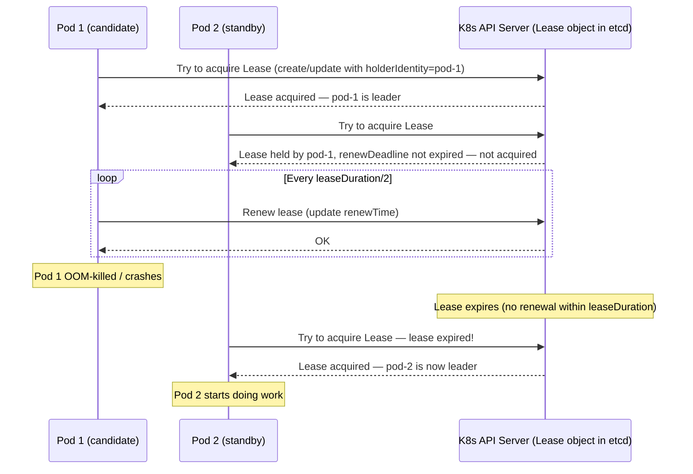
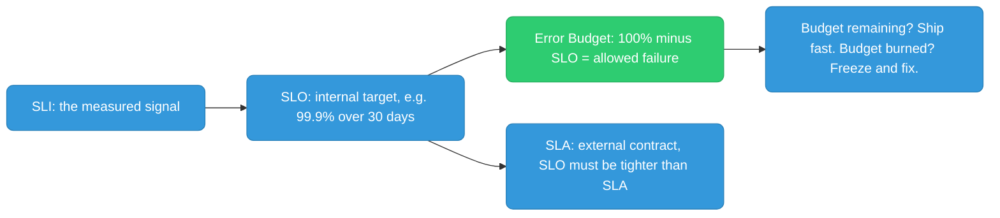
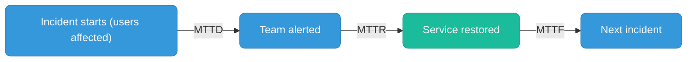
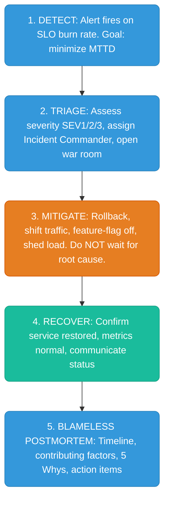

## Leader Election for Singleton Workloads

If you need exactly one active instance (not zero, not two), use Kubernetes **Lease-based leader election**. The Lease API is a lightweight lock stored in etcd.

**Use cases:** distributed job scheduler, CDC consumer, singleton reconciler, any process that must not run concurrently.

### How It Works



### Go Implementation with `client-go`

```go
package main

import (
	"context"
	"fmt"
	"os"
	"time"

	metav1 "k8s.io/apimachinery/pkg/apis/meta/v1"
	"k8s.io/client-go/kubernetes"
	"k8s.io/client-go/rest"
	"k8s.io/client-go/tools/leaderelection"
	"k8s.io/client-go/tools/leaderelection/resourcelock"
)

func main() {
	// Identity: use pod name so we can see who is leader
	id := os.Getenv("POD_NAME")
	if id == "" {
		id, _ = os.Hostname()
	}

	// In-cluster config (works when running inside a K8s pod)
	cfg, err := rest.InClusterConfig()
	if err != nil {
		panic(err)
	}
	client := kubernetes.NewForConfigOrDie(cfg)

	// Lease lock — stored as a Lease object in the given namespace
	lock := &resourcelock.LeaseLock{
		LeaseMeta: metav1.ObjectMeta{
			Name:      "my-app-leader",    // Lease object name
			Namespace: "default",
		},
		Client: client.CoordinationV1(),
		LockConfig: resourcelock.ResourceLockConfig{
			Identity: id, // pod name — identifies who holds the lease
		},
	}

	ctx, cancel := context.WithCancel(context.Background())
	defer cancel()

	leaderelection.RunOrDie(ctx, leaderelection.LeaderElectionConfig{
		Lock: lock,

		// How long a lease is valid without renewal
		// If the leader crashes, a new leader can only be elected after this duration
		LeaseDuration: 15 * time.Second,

		// How long the leader has to renew before losing leadership
		// Must be < LeaseDuration
		RenewDeadline: 10 * time.Second,

		// How often the leader tries to renew
		// Must be < RenewDeadline
		RetryPeriod: 2 * time.Second,

		// ReleaseOnCancel: release the lease gracefully when context is cancelled
		// (e.g., on SIGTERM). Without this, the lease holds for LeaseDuration
		// after crash, delaying failover.
		ReleaseOnCancel: true,

		Callbacks: leaderelection.LeaderCallbacks{
			// Called when this pod becomes the leader — start your work here
			OnStartedLeading: func(ctx context.Context) {
				fmt.Printf("[%s] became leader — starting work\n", id)
				runWork(ctx)
			},

			// Called when this pod loses leadership (lease expired, context cancelled)
			// Stop your work here — MUST return quickly
			OnStoppedLeading: func() {
				fmt.Printf("[%s] lost leadership — stopping work\n", id)
				// If work goroutine is running, the ctx passed to OnStartedLeading
				// is cancelled automatically by the leader election library
				os.Exit(0) // let kubelet restart the pod to re-compete
			},

			// Called when any pod acquires the lease (informational)
			OnNewLeader: func(identity string) {
				if identity == id {
					return // we already know we're leader from OnStartedLeading
				}
				fmt.Printf("[%s] new leader elected: %s\n", id, identity)
			},
		},
	})
}

// runWork is the actual singleton work. ctx is cancelled when leadership is lost.
func runWork(ctx context.Context) {
	ticker := time.NewTicker(5 * time.Second)
	defer ticker.Stop()

	for {
		select {
		case <-ctx.Done():
			fmt.Println("work stopped — leadership lost or context cancelled")
			return
		case t := <-ticker.C:
			fmt.Printf("doing singleton work at %s\n", t.Format(time.RFC3339))
			// e.g., process a job queue, run a reconciliation loop, etc.
		}
	}
}
```

### Required RBAC

The pod needs permission to create/get/update the `Lease` object:

```yaml
apiVersion: v1
kind: ServiceAccount
metadata:
  name: my-app
  namespace: default
---
apiVersion: rbac.authorization.k8s.io/v1
kind: Role
metadata:
  name: leader-election
  namespace: default
rules:
  - apiGroups: ["coordination.k8s.io"]
    resources: ["leases"]
    verbs: ["get", "create", "update"]
---
apiVersion: rbac.authorization.k8s.io/v1
kind: RoleBinding
metadata:
  name: my-app-leader-election
  namespace: default
subjects:
  - kind: ServiceAccount
    name: my-app
roleRef:
  kind: Role
  name: leader-election
  apiGroup: rbac.authorization.k8s.io
---
apiVersion: apps/v1
kind: Deployment
metadata:
  name: my-app
spec:
  replicas: 2   # both pods run, only one is leader at a time
  template:
    spec:
      serviceAccountName: my-app  # bind the SA with lease permissions
      containers:
        - name: app
          image: my-org/my-app:v1
          env:
            - name: POD_NAME
              valueFrom:
                fieldRef:
                  fieldPath: metadata.name  # inject pod name as identity
```

### Key Tuning Parameters

| Parameter | Default | Effect of too low | Effect of too high |
|-----------|---------|------------------|--------------------|
| `LeaseDuration` | 15s | Frequent leader churn under network blips | Slow failover after leader crash |
| `RenewDeadline` | 10s | Leader gives up leadership under transient API slowness | Leader holds on too long during real failures |
| `RetryPeriod` | 2s | High API Server load (many renewals) | Slow to detect that renewal is needed |
| `replicas` | 2+ | Single point of failure if leader pod is OOM-killed | Wasted resources |

**`ReleaseOnCancel: true`** is critical for fast failover on graceful shutdown. When the pod receives SIGTERM (rolling update, scale-down), it cancels the context, the leader election library releases the Lease immediately, and a new leader is elected within `RetryPeriod` — not `LeaseDuration`. Without this, failover waits the full 15 seconds.


---

## SRE Core Concepts

### SLI, SLO, Error Budget, SLA



**SLI (Service Level Indicator):**
The actual measured signal. What you observe.
- % of requests served successfully (status != 5xx)
- % of requests under 300ms latency
- Uptime percentage
- Error rate

**SLO (Service Level Objective):**
The internal target for the SLI. What you commit to internally.
- 99.9% of requests successful over a 30-day rolling window
- p99 latency under 500ms, measured over 1-hour windows
- 99.95% availability per quarter

**Error Budget:**
`100% - SLO = allowed failure`

| SLO | Budget | Monthly downtime allowed |
|-----|--------|--------------------------|
| 99% | 1% | ~7.2 hours |
| 99.9% | 0.1% | ~43 minutes |
| 99.95% | 0.05% | ~21.6 minutes |
| 99.99% | 0.01% | ~4.3 minutes |

The budget is a **resource**: burn it fast (bad incident) -> freeze risky changes, focus on reliability. Budget remaining -> ship features aggressively. This depersonalizes the argument: the budget decides, not opinion.

**How error budget changes behavior:** The team checks error budget weekly. If a bad incident burns 50% of the month's budget in one day, the next sprint freezes new features and focuses entirely on reliability.

**SLA (Service Level Agreement):**
External contract with customers. Breaching it means fines/credits. SLOs should always be tighter than SLAs (buffer for detecting breaches before customers do).

---

### MTTD, MTTR, MTTF



**MTTD (Mean Time To Detect):**
Time from incident START to team KNOWS about it.

Improve by: SLO-based burn rate alerts, synthetic monitoring, anomaly detection, on-call coverage gaps analysis.

**MTTR (Mean Time To Recover):**
Time from detection to SERVICE RESTORED.

Improve by: runbooks (documented and tested), automated rollback, feature flags (instant kill switches), on-call drills, pre-approved playbooks for common failure modes.

**MTTF (Mean Time To Failure):**
Average time between incidents. Higher = more reliable.

Improve by: reducing toil, better testing, chaos engineering, capacity planning.

**Key insight:** MTTD and MTTR are separate problems.
- Fast detection + slow recovery = still bad (you know it's broken but can't fix it)
- Fast recovery + slow detection = users hurt for a long time before you knew

---

### Toil

**Toil** = manual, repetitive, automatable, reactive operational work that scales linearly with service growth and produces no enduring improvement.

**All traits must be true:**

| Trait | Question |
|-------|----------|
| Manual | No automation runs it |
| Repetitive | Done again and again |
| Automatable | Could be automated |
| Scales with growth | More users = more toil instances |
| No durable value | Does it again next time, leaves nothing behind |

**Examples:**
- Manually restarting a stuck service
- Hand-running database migrations
- Rotating certs by SSH-ing to 30 servers
- A daily release call with the same manual steps

**Why cap at ~50%:** If toil isn't capped, the team drowns in ops as the service grows and never builds anything permanent. SRE dedicates the freed time to automating the toil away.

---

### Incident Response Flow



**Key principle of step 3:** Do NOT wait for root cause analysis. Mitigate first, investigate after. Rollback the deploy, shed load, feature-flag off — worry about why later.

**Blameless postmortem questions:**
- What happened? (timeline)
- What allowed it to happen? (not who caused it — what system gap)
- How did we detect it? Could we have detected it faster?
- How did we mitigate? Could we have mitigated faster?
- What prevents this class of failure from recurring? (action items)

---

### Monitoring: RED Method and Alerting

**RED method for request-based services:**

| Signal | What it measures | Alert when |
|--------|-----------------|------------|
| **R**ate | Requests per second | Sudden drop (service down?) or spike (DDoS?) |
| **E**rrors | Error rate (5xx / total) | Exceeds error budget burn rate |
| **D**uration | Latency distribution (p50, p95, p99) | p99 exceeds SLO threshold |

**Rules for good alerts:**
1. Alert on **symptoms** (user impact), not causes (CPU high, memory high)
2. Every page must be **actionable** — if no human action needed, it is not a page
3. Use **SLO burn rate** alerts — page when consuming error budget faster than sustainable
4. Group and deduplicate — one incident = one page, not 30
5. Audit alerts quarterly — delete any that fire but nobody acts on

**SLO burn rate alert example (Prometheus):**

```promql
# Fires when error budget burns 2x faster than sustainable over 1h window
sum(rate(http_requests_total{status=~"5.."}[1h])) /
sum(rate(http_requests_total[1h]))
> (1 - 0.999) * 2     # 2x the error budget rate for 99.9% SLO
```

---

### Scaling: Horizontal vs Vertical

| | Horizontal (scale out) | Vertical (scale up) |
|--|----------------------|-------------------|
| How | Add more instances | Bigger instance (more CPU/RAM) |
| Works for | Stateless services, microservices | Any app, no code changes |
| Fails when | App has shared state hard to distribute | Hit the largest instance size |
| Downtime | Zero (add instances behind LB) | Possible for traditional infra (not K8s) |
| Tools | K8s HPA, ECS Autoscaling, ASG | Change instance type |

**Best practice:** Design stateless services (session in Redis, not in-process memory) so horizontal scaling works cleanly. Vertical scale is the emergency lever when you can't distribute state.

---

