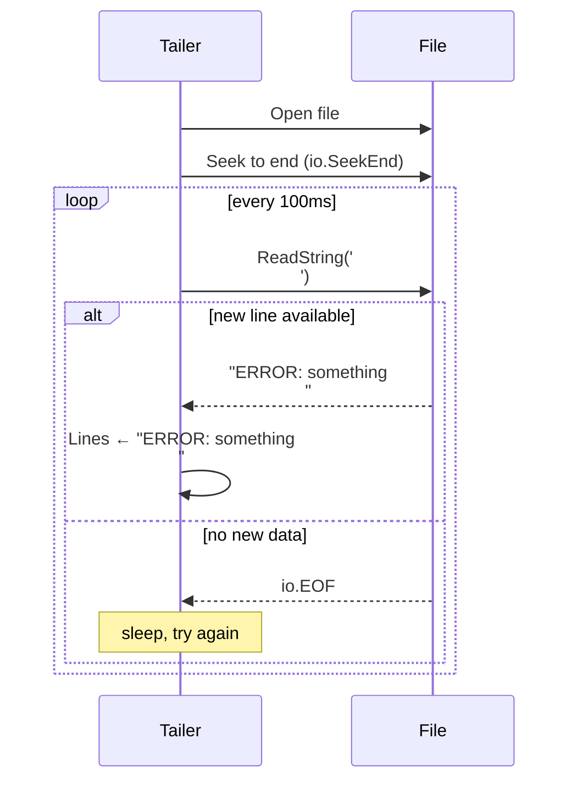
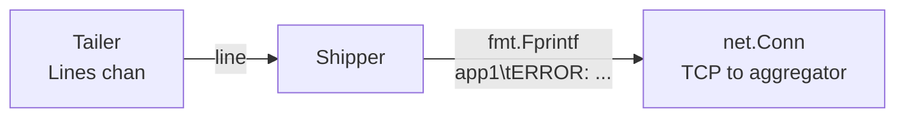
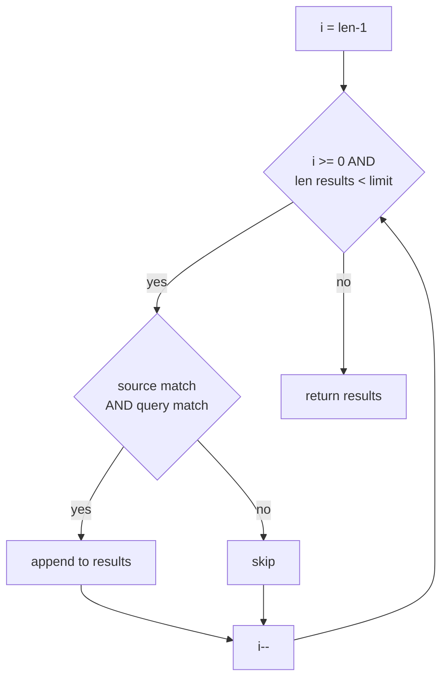

# 08-log-aggregator: Deep Dive

## System Overview

```mermaid
graph LR
    APP[Application<br>writes to file] -->|append| FILE[/tmp/app.log]
    FILE -->|poll 100ms| TAILER[Tailer<br>seek to end on start]
    TAILER -->|new lines| SHIPPER[Shipper<br>TCP client]
    SHIPPER -->|SOURCE\tLINE<br>| AGG[Aggregator<br>TCP :9002]
    AGG --> STORE[In-memory store<br>[]LogEntry]
    STORE -->|search| HTTP[HTTP API<br>:8085 /logs]
    HTTP -->|JSON| QUERY[curl / browser]
```

## Tailer: Poll-Based File Watching

The tailer seeks to the end of the file on startup (so it only tails new lines), then polls every 100ms:



## Shipper Protocol

Simple tab-separated format: `SOURCE\tLOG_LINE<br>`



## Aggregator: Ingest + Search

```mermaid
graph TD
    TCP[TCP :9002] -->|accept| CONN[net.Conn per shipper]
    CONN -->|scan lines| PARSE[split SOURCE\tLINE]
    PARSE --> INGEST[Ingest<br>append LogEntry]
    INGEST --> STORE[sync.RWMutex<br>[]LogEntry]

    HTTP[GET /logs?q=error&source=app1] --> SEARCH[Search<br>reverse scan]
    STORE --> SEARCH
    SEARCH -->|filter by query + source| RESULTS[[]LogEntry]
    RESULTS --> JSON[JSON response]
```

## Search Algorithm

Search scans from newest to oldest (reverse slice iteration) and stops at `limit`:



Reverse scan means the most recent logs appear first in results — the natural expectation for log queries.
