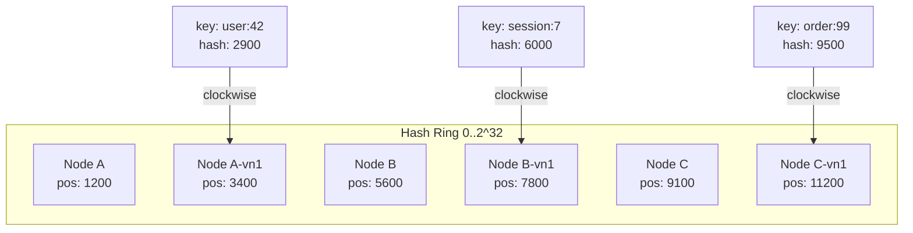
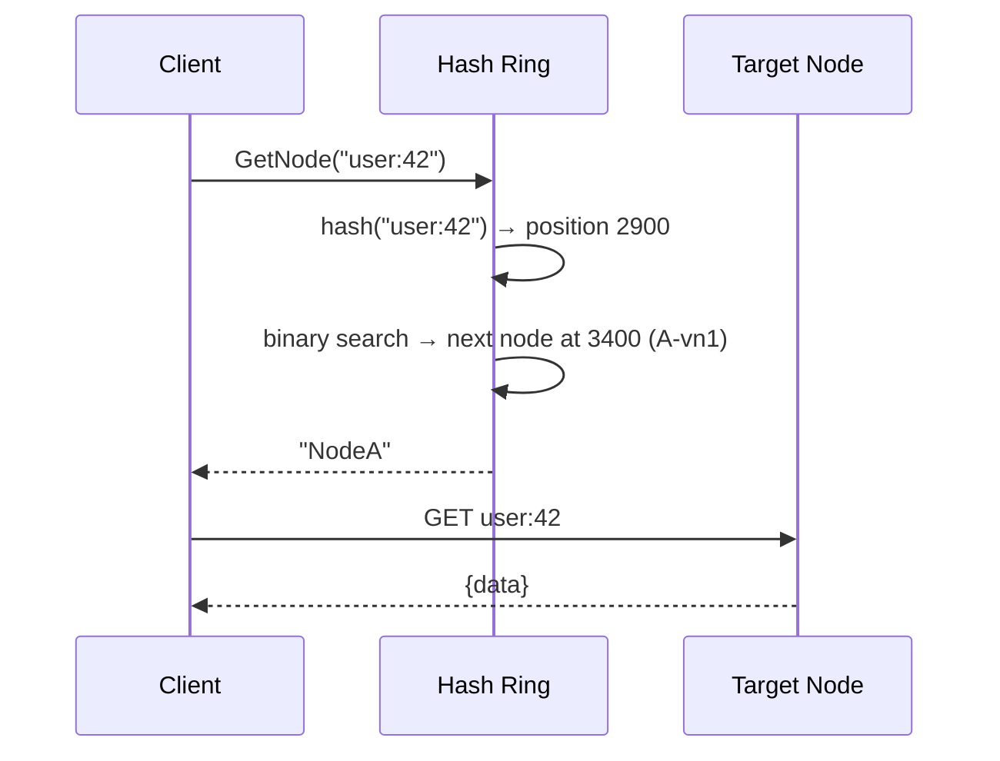

# 12 — Consistent Hashing

Build a consistent hashing ring from scratch — the algorithm behind distributed caches (Memcached), databases (DynamoDB, Cassandra), and load balancers.

---

## Why Not Modulo?

```
// Naive: node = hash(key) % N
// Problem: when N changes (node dies), almost ALL keys remap
// With 4 nodes → 3 nodes: ~75% of keys move
```

Consistent hashing ensures only `K/N` keys move when a node is added/removed (K = total keys, N = total nodes).

---

## Architecture





---

## Key Concepts

| Concept | Description |
|---------|-------------|
| Hash Ring | Circular space [0, 2^32) where nodes and keys are mapped |
| Virtual Nodes | Each physical node gets N positions on the ring for better distribution |
| Clockwise Lookup | A key maps to the first node found clockwise from its hash position |
| Minimal Disruption | Adding/removing a node only affects adjacent keys |

---

## Implementation

```go
type HashRing struct {
    nodes       map[uint32]string // hash position → node name
    sorted      []uint32          // sorted positions for binary search
    replicas    int               // virtual nodes per physical node
    mu          sync.RWMutex
}

func (r *HashRing) GetNode(key string) string {
    hash := crc32.ChecksumIEEE([]byte(key))
    idx := sort.Search(len(r.sorted), func(i int) bool {
        return r.sorted[i] >= hash
    })
    if idx >= len(r.sorted) {
        idx = 0 // wrap around
    }
    return r.nodes[r.sorted[idx]]
}
```

---

## Running

```bash
make build
make run
make test
```

---

## What You Learn

- Why distributed systems use consistent hashing over modulo
- Virtual nodes for load balancing
- Binary search on sorted ring
- Measuring key redistribution on topology changes
