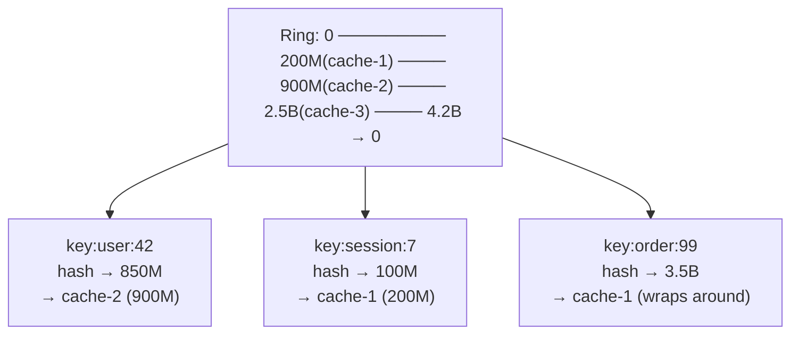
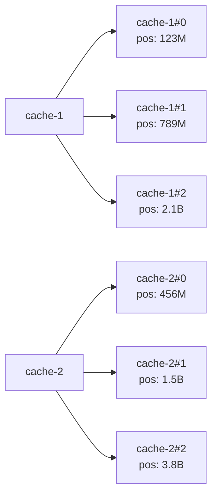
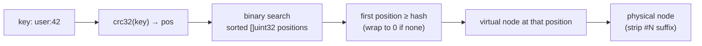
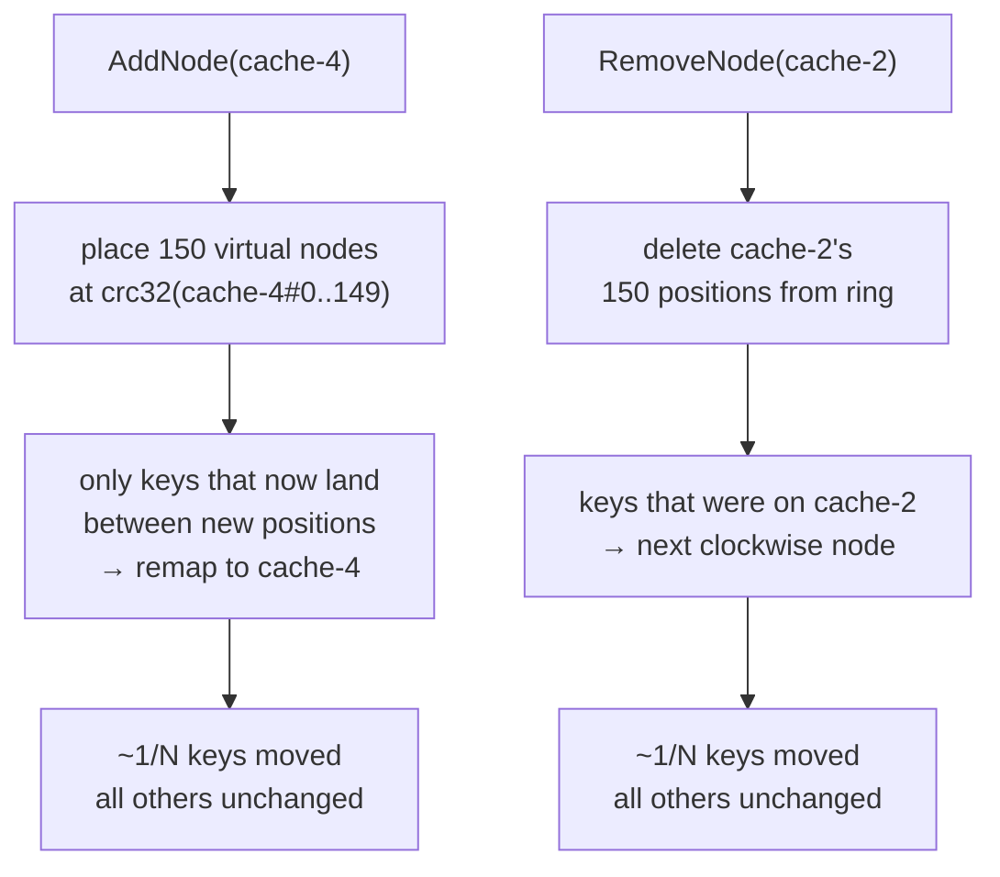

# 12-consistent-hash: Deep Dive

## Why Consistent Hashing?

With naive modulo hashing (`hash(key) % N`), adding or removing one node remaps nearly all keys. This kills any caching layer — every cache miss on a fleet restart.

Consistent hashing remaps only `~1/N` of keys when a node joins or leaves.

## The Ring

All possible hash values form a ring (0 → 2³²-1 for crc32). Nodes are placed at positions on the ring. A key maps to the **first node clockwise from its hash position**.



## Virtual Nodes

One physical node → 150 virtual nodes, each at a different ring position. Prevents hot spots when physical nodes are unevenly distributed.



Without virtual nodes: uneven ring gaps → one node gets 60% of keys, another gets 5%.
With 150 virtual nodes: each physical node handles `~1/N` of keyspace regardless of position.

## Lookup: Binary Search



```go
func (r *Ring) Get(key string) string {
    h := r.hash(key)
    idx := sort.Search(len(r.positions), func(i int) bool {
        return r.positions[i] >= h
    })
    if idx == len(r.positions) {
        idx = 0 // wrap around
    }
    return r.nodeOf[r.positions[idx]] // strip virtual node suffix → physical
}
```

`sort.Search` is O(log N) where N = total virtual nodes. For 10 physical nodes × 150 vnodes = 1500 entries, that's ~11 comparisons.

## Node Join and Leave



**Why 1/N?** Each virtual node covers 1/(total vnodes) of the ring. Removing N physical nodes × 150 vnodes means those ring segments now point to the next clockwise node — only the keys in those segments move.

## Real-World Uses

| System | What it hashes | Why consistent hash |
|--------|---------------|-------------------|
| Memcached clients | cache key → node | Minimize cache misses on scale |
| Cassandra | partition key → replica | Even data distribution |
| Chord DHT | file content hash → peer | Decentralized lookup |
| Nginx upstream | URL → backend | Sticky sessions without state |

## Comparison: Modulo vs Consistent

```
Cluster: 3 nodes → add 1 node (now 4)

Modulo hash(key) % N:
  key "abc" → hash 1000 → 1000%3=1 → node-1
  after:       hash 1000 → 1000%4=0 → node-0  ← moved!
  ~75% of all keys move on a single node addition

Consistent hash:
  only keys in the ring segments now owned by the new node move
  ~25% of keys move (1/4)
```
