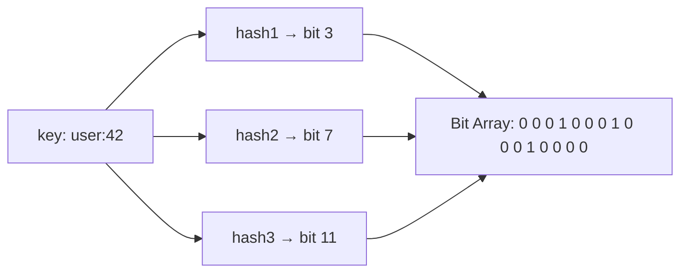
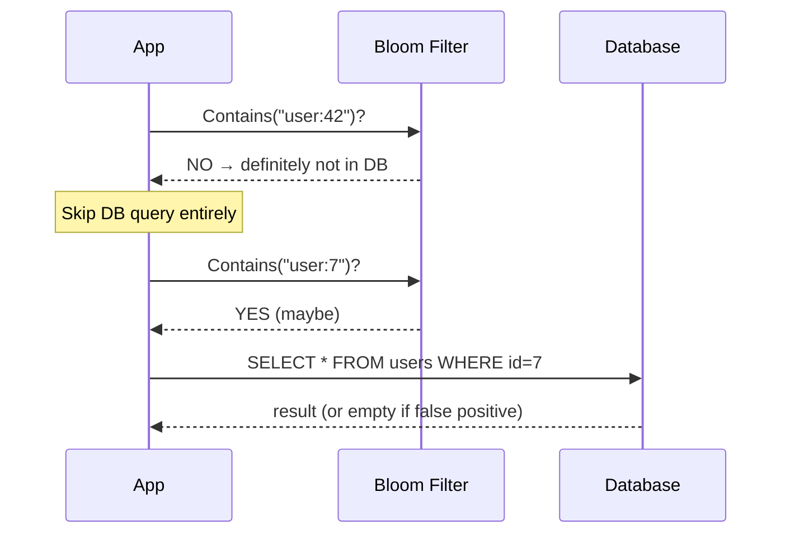
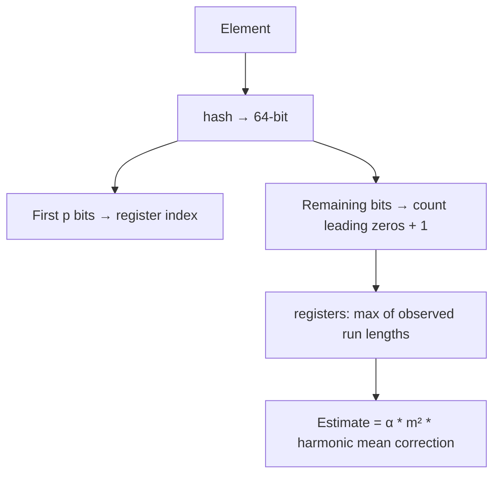

# 13 — Bloom Filter & HyperLogLog

Probabilistic data structures used everywhere in distributed systems: cache miss prevention, deduplication at scale, and cardinality estimation.

---

## Bloom Filter

A space-efficient probabilistic set that answers "is X in the set?" with:
- **Definitely NOT in set** (100% accurate)
- **Probably in set** (false positive possible)





### Use Cases
- **Cache miss prevention**: Check bloom filter before hitting DB
- **Distributed dedup**: Has this event been processed?
- **Spell checkers**: Is this word in the dictionary?
- **Network routers**: Is this IP in the blocklist?

### False Positive Rate

```
FPR ≈ (1 - e^(-kn/m))^k

m = bit array size
n = number of elements inserted
k = number of hash functions
Optimal k = (m/n) * ln(2)
```

| Elements | Bits | Hash funcs | FPR |
|----------|------|-----------|-----|
| 1,000 | 9,585 | 7 | 1% |
| 1,000,000 | 9,585,058 | 7 | 1% |
| 1,000,000 | 4,792,529 | 3 | 10% |

---

## HyperLogLog

Estimates the **cardinality** (count of distinct elements) of a set using only ~12KB of memory — even for billions of elements.



**Accuracy**: ±1.04/√m standard error (m = number of registers)
- 1024 registers (1KB) → ~3.25% error
- 16384 registers (12KB) → ~0.81% error

### Use Cases
- Count unique visitors (without storing all IPs)
- Count distinct queries per day
- Redis `PFADD` / `PFCOUNT` uses HyperLogLog

---

## Running

```bash
make run    # demos both structures
make test   # verify false positive rates
```
