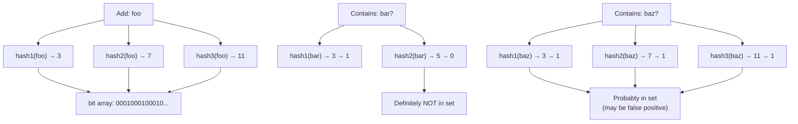
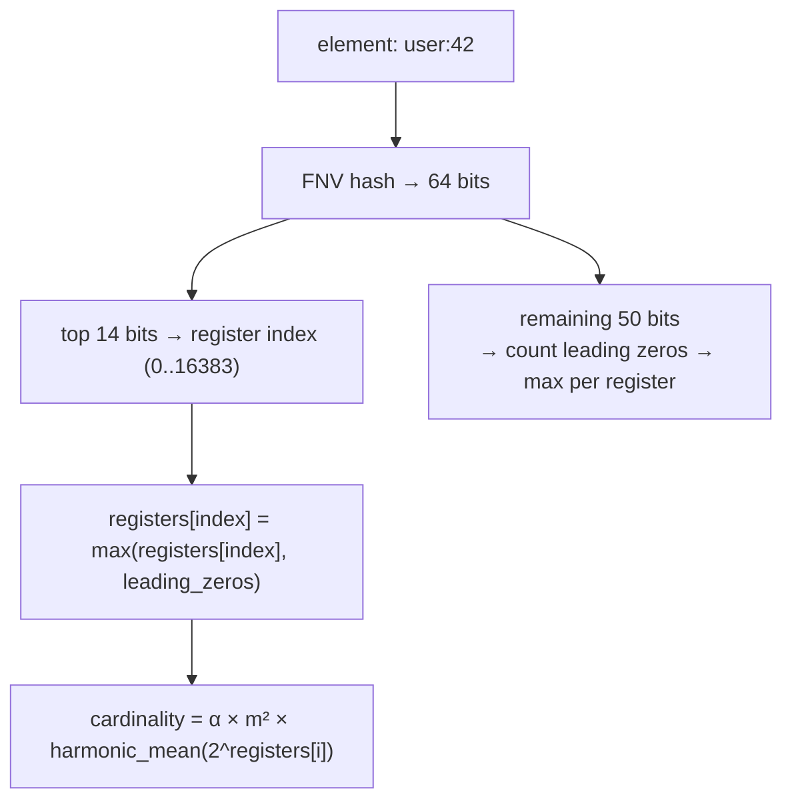

# 13-bloom-filter: Deep Dive

## Why Probabilistic Data Structures?

Exact membership (a hash set) costs O(n) memory — one pointer per element. For billions of URLs, IPs, or usernames that's gigabytes. A Bloom filter answers "probably in set" or "definitely not in set" using a fixed-size bit array — 1 billion URLs in ~1.2 GB with 1% false positive rate, vs ~8 GB for a hash set.

## How a Bloom Filter Works

A bit array of `m` bits, initially all 0. `k` independent hash functions.

**Add element:**
```
hash1("foo") % m → set bit 3
hash2("foo") % m → set bit 7
hash3("foo") % m → set bit 11
```

**Check element:**
```
hash1("bar") % m → bit 3 → 1
hash2("bar") % m → bit 5 → 0  ← at least one 0 → DEFINITELY NOT in set
```

```
hash1("baz") % m → bit 3 → 1
hash2("baz") % m → bit 7 → 1
hash3("baz") % m → bit 11 → 1  ← all 1s → PROBABLY in set (may be false positive)
```



**Key property:** False negatives are impossible. If all bits are set, the element was either added OR it's a false positive.

## False Positive Rate Math

```
p = (1 - e^(-kn/m))^k

k = number of hash functions
n = number of elements inserted
m = number of bits

For 1M elements, 10MB (80M bits), k=7:
p = (1 - e^(-7×1M/80M))^7 ≈ 0.8% false positive rate
```

**Optimal k** (minimises false positive rate for given m/n):
```
k_opt = (m/n) × ln(2) ≈ 0.693 × (m/n)
```

**Sizing formula** (bits needed for target false positive rate p):
```
m = -n × ln(p) / (ln2)²
```

## Implementation: k Hash Functions from 2

Rather than k independent hash functions (expensive), use **double hashing**: derive k functions from just 2 hash functions (fnv1a + fnv1a with different seed):

```go
func (b *BloomFilter) positions(data []byte) []uint {
    h1 := fnv32a(data)
    h2 := fnv32aWithSeed(data, 0x9747b28c)
    positions := make([]uint, b.k)
    for i := uint(0); i < b.k; i++ {
        positions[i] = (h1 + i*h2) % b.m
    }
    return positions
}
```

This is the Kirsch-Mitzenmacher optimization — provably achieves the same asymptotic false positive rate as k independent functions.

## HyperLogLog: Cardinality Estimation

Bloom filter answers "is X in the set?" HyperLogLog answers "how many distinct elements have I seen?" using only ~12 KB regardless of input size.

**Core insight:** The maximum number of leading zeros in any hash value is related to the cardinality:

```
If hash("foo") = 00001...  (4 leading zeros) → estimate ~2^4 = 16 distinct elements seen
If hash("bar") = 000001... (5 leading zeros) → estimate ~2^5 = 32 distinct elements seen
```

One register tracks the max leading zeros seen. This would be noisy, so HyperLogLog uses 16,384 registers (one per hash prefix) and harmonic mean:



**Result:** Estimates cardinality up to ~10^18 with ±6% error using 12 KB. Redis HyperLogLog uses exactly this approach (`PFADD`, `PFCOUNT`).

## Comparison

| Structure | Space | Membership | Cardinality | False positives |
|-----------|-------|-----------|-------------|----------------|
| Hash set | O(n) | Exact | Exact | None |
| Bloom filter | O(m) fixed | Probabilistic | No | Yes (tunable) |
| HyperLogLog | O(m) ~12KB | No | ±6% estimate | N/A |

## Real-World Uses

| System | What for |
|--------|---------|
| Cassandra | Check if SSTable contains a key before disk I/O |
| Chrome | Malicious URL check (local Bloom, no server round-trip) |
| Akamai CDN | "Don't cache one-hit wonders" — only cache on second request |
| Redis | `PFADD`/`PFCOUNT` — HyperLogLog built-in |
| BigTable | Reduce disk lookups for non-existent rows |
