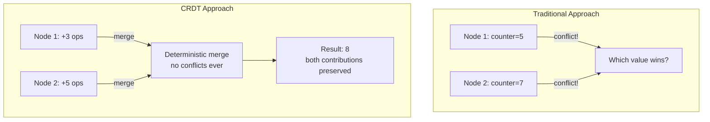
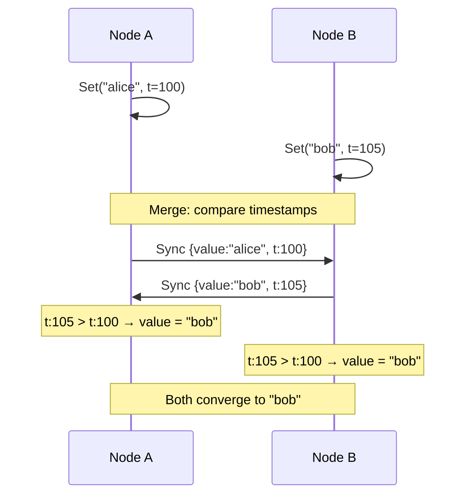

# 14 — CRDTs (Conflict-Free Replicated Data Types)

Data structures that can be replicated across nodes and merged without coordination — enabling eventual consistency without conflicts.

---

## Why CRDTs?

In distributed systems, you often face the CAP theorem trade-off. CRDTs let you choose **AP** (Available + Partition-tolerant) while guaranteeing eventual consistency — no coordination, no conflicts, no data loss.



---

## G-Counter (Grow-Only Counter)

Each node maintains its own counter. The global value is the sum of all nodes.

```mermaid
graph LR
    subgraph Node A
        A[A: {A:3, B:0, C:0}\nlocal value = 3]
    end
    subgraph Node B
        B[B: {A:0, B:5, C:0}\nlocal value = 5]
    end
    subgraph Node C
        C[C: {A:0, B:0, C:2}\nlocal value = 2]
    end
    
    A -->|merge| M[Merged: {A:3, B:5, C:2}\nglobal value = 10]
    B -->|merge| M
    C -->|merge| M
```

**Merge rule**: For each node ID, take the **max** of both values.

### Use Cases
- Like counters (Facebook likes)
- View counters
- Any monotonically increasing metric

---

## PN-Counter (Positive-Negative Counter)

Two G-Counters: one for increments, one for decrements. Value = P - N.

```mermaid
graph TD
    INC[Increment G-Counter\n{A:5, B:3}] --> VAL[Value = sum P - sum N\n= 8 - 2 = 6]
    DEC[Decrement G-Counter\n{A:1, B:1}] --> VAL
```

---

## LWW-Register (Last-Writer-Wins Register)

Each write carries a timestamp. On merge, the highest timestamp wins.



**Trade-off**: Concurrent writes → one is silently dropped (the older one).

---

## Running

```bash
make run    # demos G-Counter, PN-Counter, LWW-Register
make test
```
