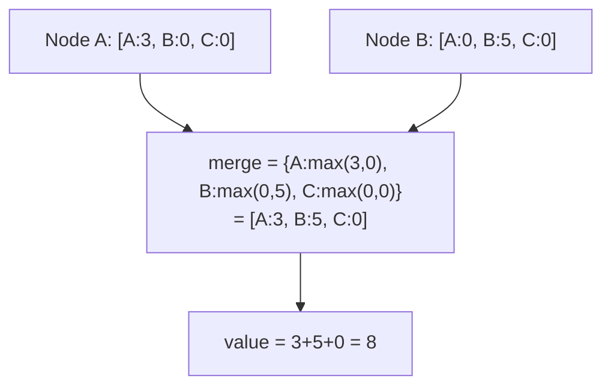
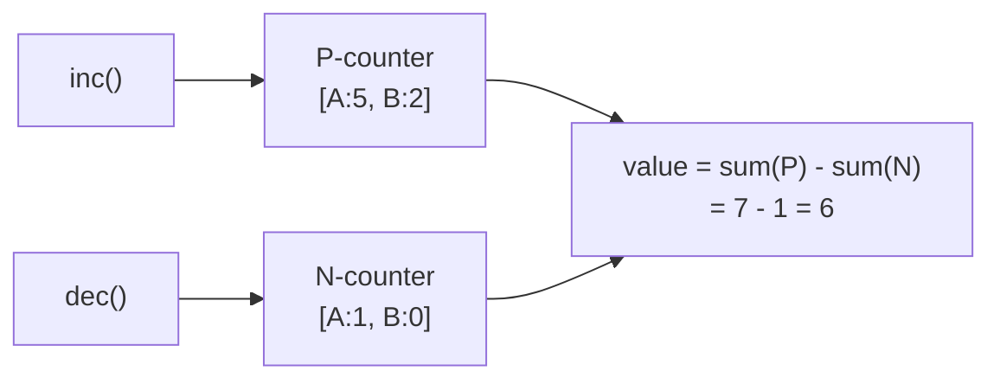
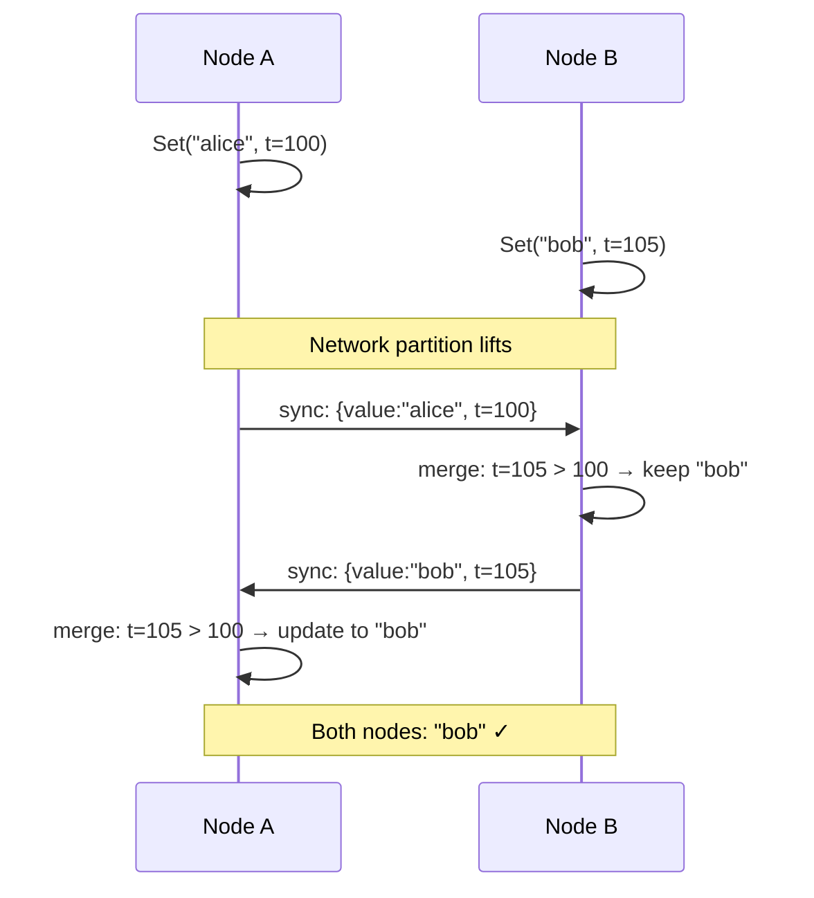

# 14-crdt: Deep Dive

## Why CRDTs?

Distributed systems face a fundamental tension: coordination (consensus, locking) ensures correctness but adds latency and availability risk. CRDTs (Conflict-Free Replicated Data Types) allow nodes to accept writes independently and always converge to the same state when they communicate — no coordinator, no lock, no consensus.

**Tradeoff:** CRDTs only work for data types with a mathematically defined merge operation. Not everything can be a CRDT.

## The Convergence Guarantee

A CRDT must satisfy one of two conditions:

**Operation-based (CmRDT):** All operations are commutative — order doesn't matter.
```
inc(3) + inc(5) = inc(5) + inc(3)  ✓
```

**State-based (CvRDT):** The merge function is commutative, associative, and idempotent.
```
merge(A, B) = merge(B, A)       commutative
merge(merge(A,B),C) = merge(A,merge(B,C))  associative
merge(A, A) = A                 idempotent
```

This project implements **state-based CRDTs** — nodes exchange full state, merge function handles everything.

## G-Counter (Grow-Only Counter)

Each node tracks its own count. Merge = max per node. Value = sum of all.



```go
type GCounter struct {
    counts map[string]uint64 // nodeID → count
    nodeID string
}

func (g *GCounter) Increment() {
    g.counts[g.nodeID]++
}

func (g *GCounter) Merge(other *GCounter) {
    for nodeID, count := range other.counts {
        if count > g.counts[nodeID] {
            g.counts[nodeID] = count // max per node
        }
    }
}

func (g *GCounter) Value() uint64 {
    var total uint64
    for _, c := range g.counts {
        total += c
    }
    return total
}
```

**Why max?** A node can only increment its own slot. If node A reports [A:3], it means node A has done 3 increments. Taking the max handles the case where you receive the same state twice (idempotent).

## PN-Counter (Increment + Decrement)

Two G-Counters: one for increments (P), one for decrements (N). Value = P - N.



Merge = merge both G-Counters independently.

## LWW-Register (Last-Writer-Wins)

A single value with a timestamp. Merge = keep the higher timestamp.



**Risk:** Clock skew. If Node A's clock is ahead by 200ms, it wins every conflict regardless of causal order. Fix: use **Hybrid Logical Clocks (HLC)** which combine wall time + logical counter.

## OR-Set (Observed-Remove Set)

Add/remove is hard. Naive approach: if you add X then remove X, does X exist?
Race condition: concurrent add on Node A + remove on Node B — who wins?

OR-Set: every add gets a unique tag. Remove only removes specific tagged entries.

```
Node A: Add("apple", tag=uuid1) → {(apple,uuid1)}
Node B: Remove("apple") → removes ALL tags seen so far
Node A: Add("apple", tag=uuid2) [concurrent with remove] → {(apple,uuid2)} still present
```

Merge: union of all adds, minus all removes. The concurrent add survives because it has a new tag not in the remove set.

## Why CRDTs Break for Some Problems

| Problem | Why CRDT can't solve it |
|---------|------------------------|
| Bank transfer "atomically debit A, credit B" | Requires coordination — partial failure must roll back |
| Unique username registration | Need consensus on "first writer wins" across all nodes |
| Ordered queue with guaranteed FIFO | Order requires agreement on sequence |
| Strong consistency reads | "Read your writes" requires coordinator |

## Real-World Uses

| System | CRDT type | Use |
|--------|-----------|-----|
| Riak | OR-Set, LWW-Register | Distributed KV store |
| Redis (CRDT edition) | PN-Counter, LWW-Register | Geo-replicated Redis |
| Figma | Custom CRDT | Collaborative design canvas |
| Apple Notes | Custom sequence CRDT | Concurrent text editing |
| CockroachDB | HLC timestamps | Causal consistency |

## CAP Theorem Connection

CRDTs choose **AP** (Available + Partition-tolerant) from the CAP theorem:
- Each node accepts writes even when partitioned (A)
- Nodes converge when connected (eventual C, not strong C)
- They give up: linearizability, read-your-writes across nodes (C in CAP)
