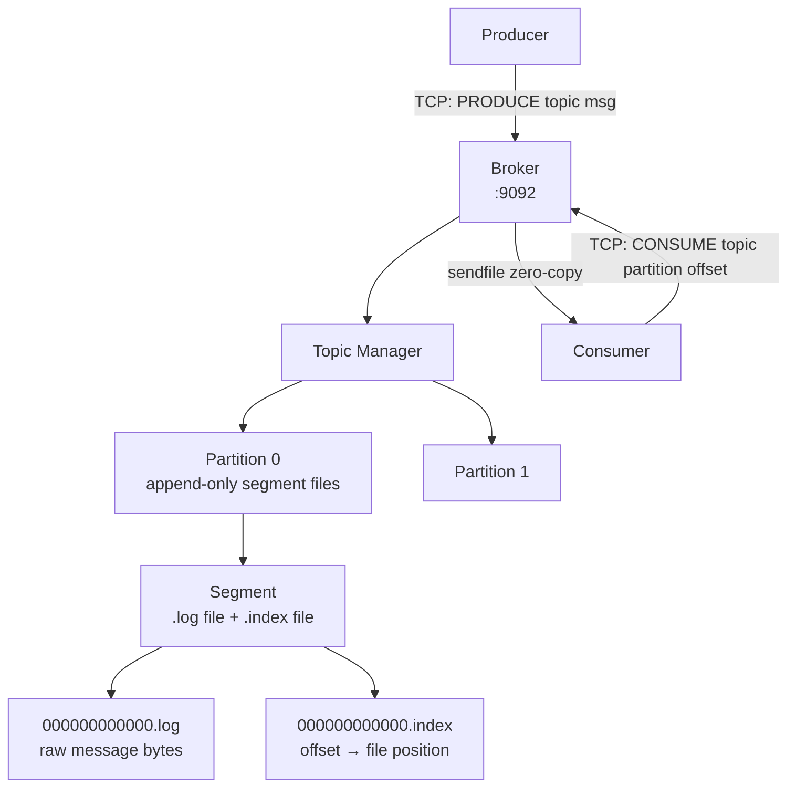
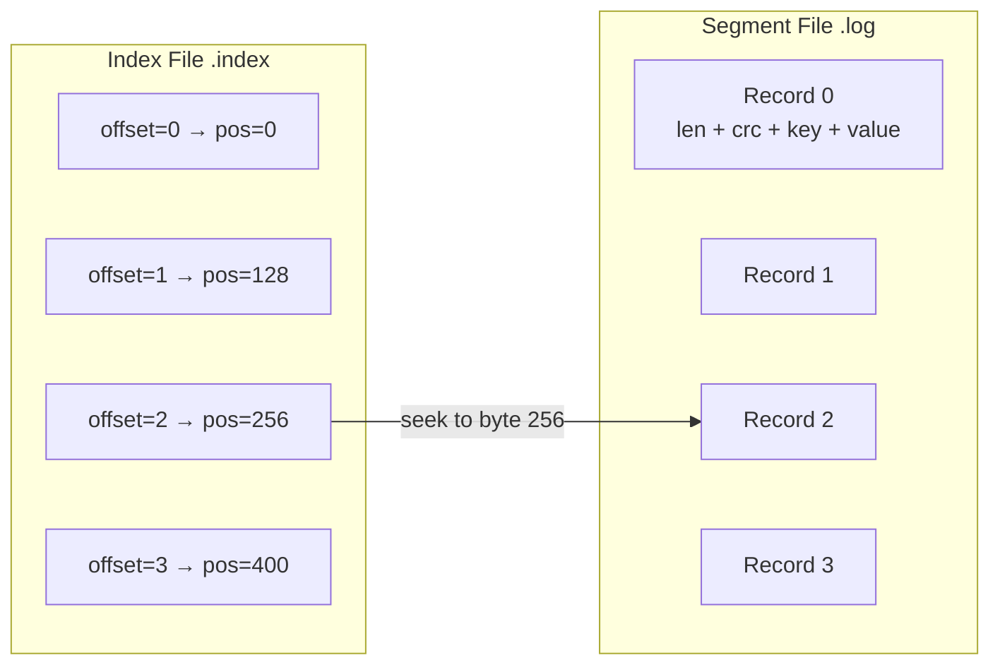
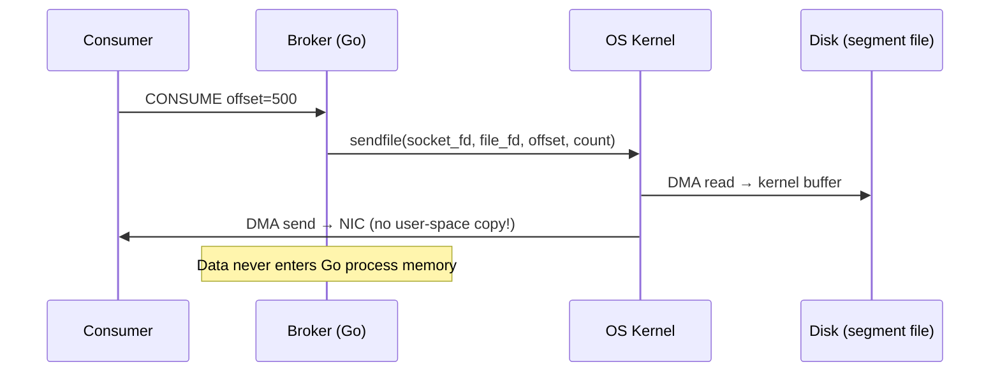

# 15 — Log-Structured Message Broker (Mini-Kafka)

A persistent, append-only distributed commit log built from scratch — teaching disk I/O, memory-mapped files (`mmap`), zero-copy transfer (`sendfile`), and consumer offset management.

---

## Why Build This?

This bridges the gap between your from-scratch networking projects and high-throughput storage:
- **From-scratch 06 (Message Queue)**: In-memory, messages lost on restart
- **This project**: Persistent to disk, survives restarts, supports replay from any offset
- **Kafka's core insight**: A log is just an append-only file with an index

---

## Architecture



---

## Segment File Layout



```
data/
└── topics/
    └── orders/
        ├── partition-0/
        │   ├── 00000000000000000000.log    # messages (append-only)
        │   ├── 00000000000000000000.index  # offset → byte position (mmap'd)
        │   ├── 00000000000000001000.log    # new segment after 1000 records
        │   └── 00000000000000001000.index
        └── partition-1/
            └── ...
```

---

## Key Concepts

### 1. Append-Only Log (Sequential I/O)

```go
// Writing is always sequential — O(1) append, no random seeks
func (s *Segment) Append(record []byte) (offset uint64, err error) {
    pos, _ := s.logFile.Seek(0, io.SeekEnd)
    
    // Write: [length:4][crc32:4][data:N]
    binary.Write(s.logFile, binary.BigEndian, uint32(len(record)))
    binary.Write(s.logFile, binary.BigEndian, crc32.ChecksumIEEE(record))
    s.logFile.Write(record)
    
    // Update index: offset → file position
    s.index.WriteEntry(s.nextOffset, uint64(pos))
    s.nextOffset++
    return s.nextOffset - 1, nil
}
```

**Why sequential I/O matters**: HDD does ~100 random IOPS but 100MB/s sequential. SSD does 10K random IOPS but 500MB/s sequential. Kafka's design exploits this.

### 2. Memory-Mapped Index (mmap)

```go
// mmap the index file — OS manages page cache, no explicit read() calls
func (idx *Index) Open(path string) error {
    f, _ := os.OpenFile(path, os.O_RDWR|os.O_CREATE, 0644)
    f.Truncate(indexMaxBytes)
    
    idx.mmap, _ = syscall.Mmap(
        int(f.Fd()), 0, indexMaxBytes,
        syscall.PROT_READ|syscall.PROT_WRITE,
        syscall.MAP_SHARED,
    )
    return nil
}

// Lookup: O(1) — direct memory access, no syscall
func (idx *Index) Lookup(offset uint32) (position uint64) {
    entry := offset * entrySize // 12 bytes per entry
    return binary.BigEndian.Uint64(idx.mmap[entry+4 : entry+12])
}
```

### 3. Zero-Copy Transfer (sendfile)



```go
// Zero-copy: kernel transfers directly from page cache to socket
func (s *Segment) SendTo(conn net.Conn, offset, maxBytes uint64) error {
    pos := s.index.Lookup(uint32(offset))
    tcpConn := conn.(*net.TCPConn)
    rawConn, _ := tcpConn.SyscallConn()
    var sendErr error
    rawConn.Control(func(fd uintptr) {
        _, sendErr = syscall.Sendfile(int(fd), int(s.logFile.Fd()), (*int64)(&pos), int(maxBytes))
    })
    return sendErr
}
```

### 4. Consumer Offset Management

```go
type ConsumerGroup struct {
    groupID  string
    offsets  map[string]map[int]uint64 // topic → partition → offset
    mu       sync.Mutex
}

func (cg *ConsumerGroup) Commit(topic string, partition int, offset uint64) {
    cg.mu.Lock()
    defer cg.mu.Unlock()
    cg.offsets[topic][partition] = offset
}
```

---

## Wire Protocol

```
PRODUCE <topic> <partition>\r\n
<4-byte length><message bytes>\r\n

CONSUME <topic> <partition> <offset> <max_bytes>\r\n

RESPONSE:
OK <offset>\r\n
DATA <count>\r\n<messages...>
```

---

## Performance Characteristics

| Operation | Complexity | Why |
|-----------|-----------|-----|
| Produce | O(1) append | Sequential write to end of file |
| Consume by offset | O(1) seek | mmap index → direct file position |
| Consume range | O(N) sequential | sendfile from contiguous bytes |
| Segment rotation | O(1) | Close old, open new file |

---

## Comparison: This vs From-Scratch 06

| Aspect | 06-message-queue | 15-commit-log |
|--------|-----------------|---------------|
| Storage | In-memory | Disk (persistent) |
| Restart | Messages lost | Messages survive |
| Replay | No | Yes (seek to any offset) |
| Consumer model | Push (fan-out) | Pull (consumer controls pace) |
| Ordering | Per-topic | Per-partition |

---

## Running

```bash
make build
make run          # starts broker on :9092
make produce      # send test messages
make consume      # consume from offset 0
```

---

## What You Learn

- Why append-only logs are the foundation of Kafka, Pulsar, and Redpanda
- How `mmap` eliminates read syscalls for index lookups
- How `sendfile` achieves zero-copy network transfer
- Segment rotation and retention policies
- Why sequential I/O beats random I/O by 100x
