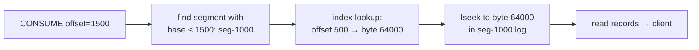
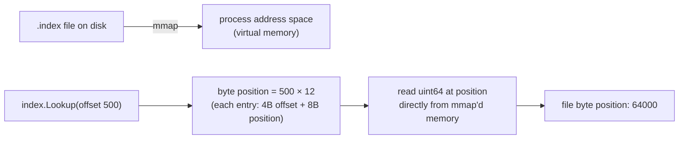
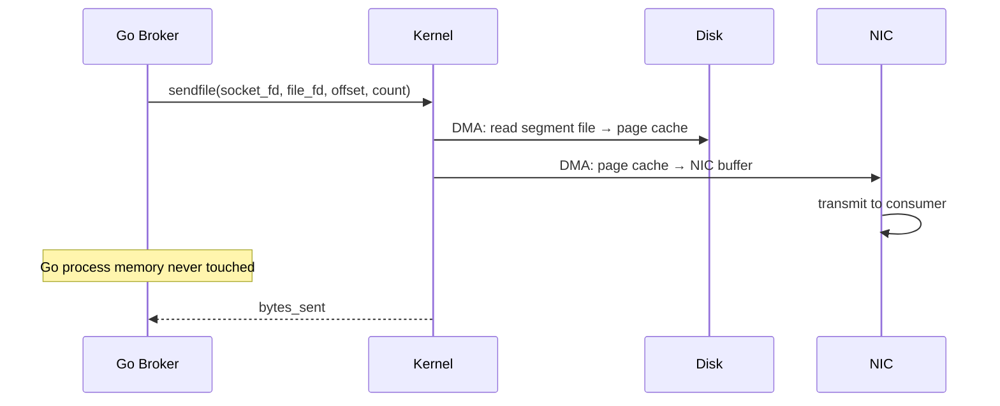
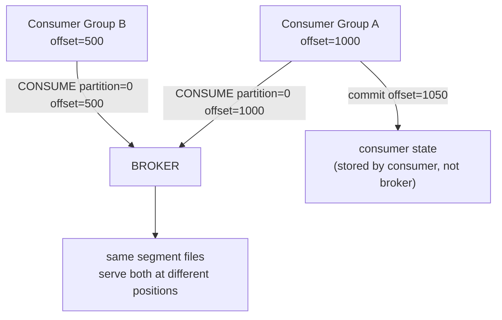
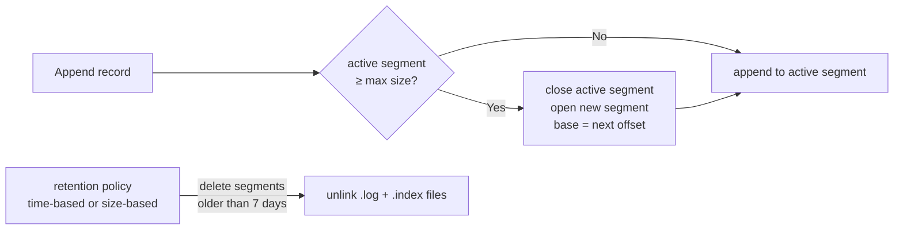

# 15-commit-log: Deep Dive

## Why a Commit Log?

A commit log is an append-only, ordered sequence of records. It is the foundation of Kafka, Pulsar, Redpanda, CockroachDB, and etcd. Every write goes to the end — no random seeks, no overwrites. This gives sequential I/O throughput (disk or SSD) which is 10–100× faster than random I/O.

**Two key insights:**
1. Sequential writes are fast. Append-only = always sequential.
2. Consumers pull at their own pace from any offset. The broker does not track consumer state.

## Segment Files

A single log file would grow forever. The log is split into **segments**:

```
data/topics/orders/partition-0/
├── 00000000000000000000.log    # records 0–999
├── 00000000000000000000.index  # offset → byte position for records 0–999
├── 00000000000000001000.log    # records 1000–1999
└── 00000000000000001000.index
```

The filename is the **base offset** of that segment. Finding offset 1500:
1. Scan segment filenames descending: 1000 ≤ 1500 → open segment 1000
2. Look up (1500 - 1000 = 500) in the index → byte position
3. Seek to that byte position in the .log file



## Record Format

```
┌────────────┬──────────┬──────────────────────────────────────┐
│ length: 4B │ crc32: 4B│ payload: N bytes                     │
└────────────┴──────────┴──────────────────────────────────────┘
```

- **length**: byte length of payload (not including header)
- **crc32**: checksum of payload — detect corruption on disk or network
- **payload**: raw message bytes (opaque to the broker)

## Memory-Mapped Index

The index is loaded into memory via `mmap`. The OS manages page cache — no explicit `read()` syscalls for index lookups.



```go
// Lookup is a direct memory read — O(1), no syscall
func (idx *Index) Lookup(relativeOffset uint32) uint64 {
    pos := relativeOffset * entrySize         // 12 bytes per entry
    return binary.BigEndian.Uint64(idx.mmap[pos+4 : pos+12])
}
```

The OS brings index pages into RAM on first access (page fault). Subsequent lookups are pure memory reads.

## Zero-Copy Transfer with sendfile

Normal send path: 4 copies
```
disk → kernel buffer → user space (read) → kernel socket buffer (write) → NIC
          2 DMA copies      +      2 CPU copies = 4 copies total
```

`sendfile` path: 2 copies, user space never touched
```
disk → kernel page cache → NIC
          2 DMA copies    (kernel handles entirely)
```



At 1 GB/s consumer throughput, eliminating user-space copies saves ~2 ns/byte = 2 seconds per gigabyte of CPU time.

## Consumer Offsets

The broker does NOT track where each consumer is. Consumers store their own offset and send it with each CONSUME request. This is exactly how Kafka works.



**Why?** Decouples consumer progress from broker state. Adding a new consumer group doesn't require broker changes. Replay = reset offset to 0.

## Segment Rotation and Retention



## Performance Characteristics

| Operation | Complexity | Why |
|-----------|-----------|-----|
| Produce | O(1) | Sequential append to end of active segment |
| Consume by offset | O(log S + 1) | Binary search over segments + O(1) index lookup |
| Consume range N | O(N) | Sequential sendfile — near-disk-bandwidth |
| Segment rotation | O(1) | fdatasync + open new file |
| Consumer position | O(0) on broker | Broker is stateless about consumer position |

## How This Compares to Kafka

| Aspect | This project | Apache Kafka |
|--------|-------------|-------------|
| Segment format | length+crc+payload | length+attributes+timestamp+key+value |
| Index | flat array (mmap) | sparse index (every N bytes) |
| Zero-copy | sendfile | sendfile (same syscall) |
| Consumer offset | client-managed | stored in `__consumer_offsets` topic |
| Replication | not implemented | ISR (in-sync replicas) + leader election |
| Compaction | not implemented | log compaction (keep latest per key) |
