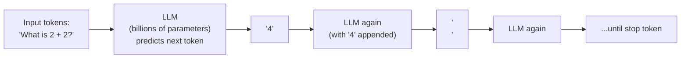
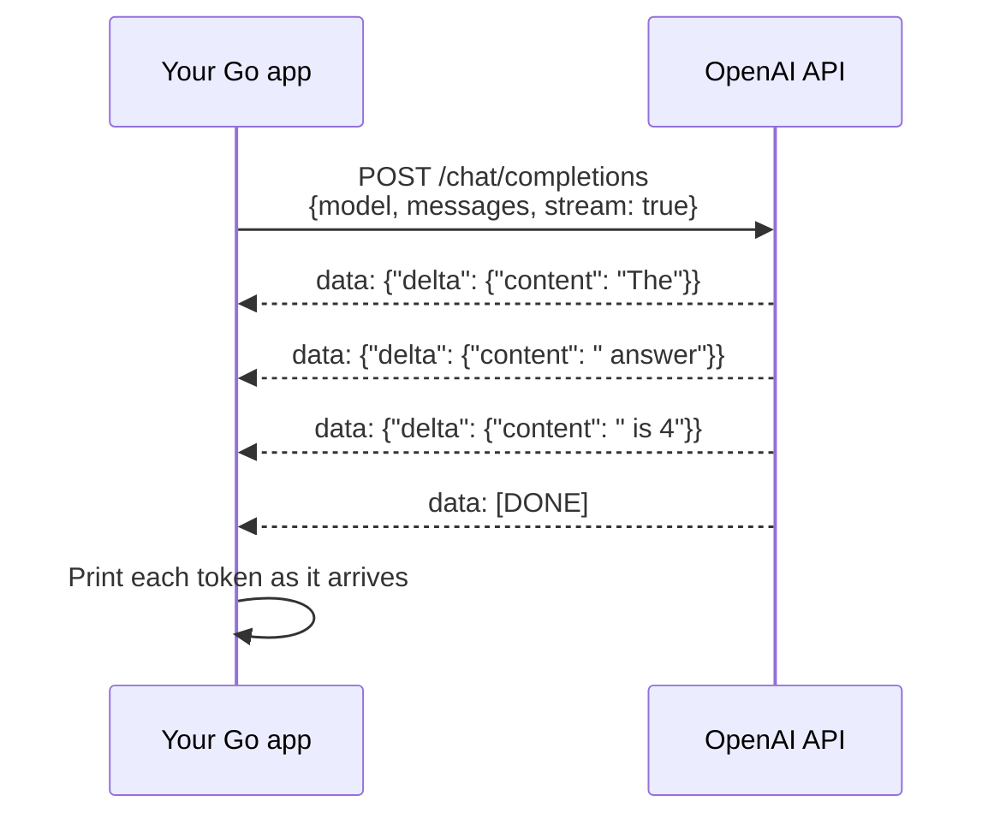

# 16 — Your First LLM Call

The absolute starting point for AI. Build a Go program that talks to an LLM — understand what a prompt is, what a token is, how streaming works, and why context matters.

**Prerequisites:** Go basics (goroutines, HTTP). No AI knowledge required.

---

## What is an LLM?

A Large Language Model is a program that predicts the next token given all previous tokens. That's it. Everything else — chat, code generation, reasoning — emerges from this one mechanism.



**Token ≠ word.** A token is roughly 3-4 characters. "kubernetes" = 2 tokens. "k8s" = 2 tokens. "Hello world" = 2 tokens.

```
"Hello, how are you today?" = 7 tokens
Pricing: GPT-4o = $2.50 per 1M input tokens = $0.0000025 per token
1000 queries × 500 tokens each = 500K tokens = $1.25
```

---

## What You Build

A Go CLI and HTTP server that:
1. Sends a prompt to the OpenAI API
2. Receives a streaming response (tokens arrive as they're generated)
3. Prints tokens in real-time as they arrive (like ChatGPT typing effect)
4. Shows token usage and cost estimate after each call



---

## Key Concepts You Learn Here

| Concept | What it is | Why it matters |
|---------|-----------|---------------|
| **Prompt** | The text you send to the LLM | Quality in = quality out |
| **Completion** | The LLM's response | |
| **Token** | ~4 chars, the unit LLMs think in | Affects cost + context limit |
| **Context window** | Max tokens input+output (e.g. 128K) | Can't send infinite text |
| **Temperature** | 0=deterministic, 1=creative | Controls randomness |
| **System prompt** | Instructions that always apply | Shapes model behavior |
| **Streaming** | Tokens arrive one at a time | Better UX, same cost |

## Quick Start

```bash
export OPENAI_API_KEY=sk-...
make run
# Interactive CLI — type a question, see streaming response
# Or:
curl -X POST http://localhost:8080/ask \
  -d '{"prompt": "Explain Kubernetes in 2 sentences"}'
```

## Docs
- [`docs/deep-dive.md`](./docs/deep-dive.md) — how LLMs actually work, tokenization, temperature math, context windows explained
