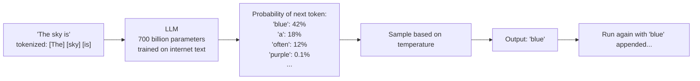
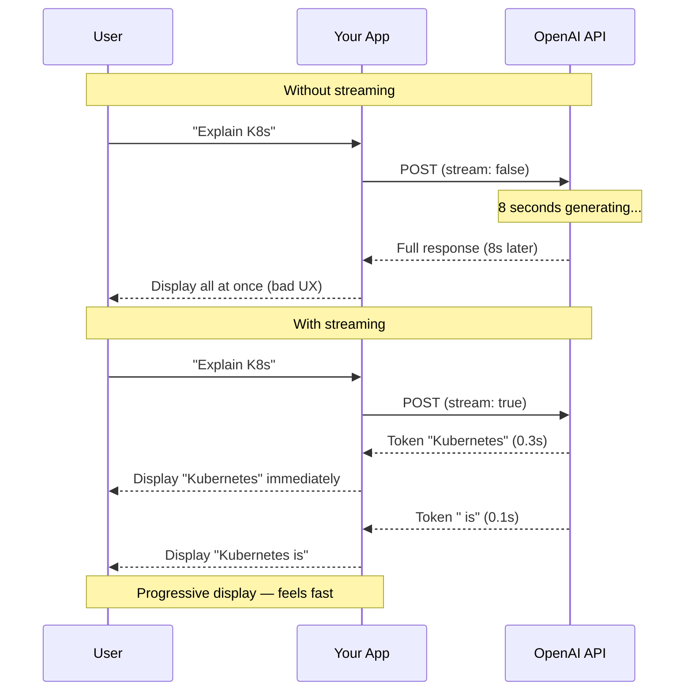

# 16-llm-first-call: Deep Dive

## How LLMs Actually Work (The Simple Version)

An LLM is trained to answer one question, over and over: **"Given everything before this, what token comes next?"**

That's the entire model. Billions of parameters learned to answer this one question. When you give it "The sky is", it predicts "blue" has high probability, "a" has some probability, "purple" has low probability.



**Temperature controls sampling:**
- `temperature=0`: always pick the highest probability token (deterministic, predictable)
- `temperature=1`: sample proportionally (creative, varied)
- `temperature=2`: amplify low-probability tokens (weird, often broken)

For factual answers: use `temperature=0`. For creative writing: use `0.7-1.0`.

---

## What is a Token?

Tokens are not words. They're sub-word pieces learned from training data.

```
"Hello" → [Hello]                  1 token
"kubernetes" → [k] [ubern] [etes]   3 tokens (uncommon word, broken up)
"API" → [API]                      1 token (common abbreviation)
"don't" → [don] ['] [t]            3 tokens
" hello" → [ hello]                1 token (leading space is part of the token)
```

**Why does this matter?**
1. **Cost:** You pay per token. 1000 words ≈ 1333 tokens.
2. **Context limit:** GPT-4o has a 128,000 token context window. That's ~96,000 words — about the length of a novel.
3. **Speed:** Tokens per second is the throughput metric for LLM inference.

---

## The API Request Structure

```json
POST https://api.openai.com/v1/chat/completions
Authorization: Bearer sk-...
Content-Type: application/json

{
  "model": "gpt-4o-mini",
  "messages": [
    {"role": "system", "content": "You are a helpful assistant."},
    {"role": "user",   "content": "What is a Kubernetes pod?"}
  ],
  "temperature": 0,
  "stream": true,
  "max_tokens": 500
}
```

**Response (streaming, one chunk at a time):**
```
data: {"choices":[{"delta":{"content":"A"}}]}
data: {"choices":[{"delta":{"content":" Kubernetes"}}]}
data: {"choices":[{"delta":{"content":" pod"}}]}
data: {"choices":[{"delta":{"content":" is"}}]}
...
data: [DONE]
```

**Non-streaming response (entire answer at once):**
```json
{
  "choices": [{"message": {"role": "assistant", "content": "A Kubernetes pod is..."}}],
  "usage": {"prompt_tokens": 25, "completion_tokens": 48, "total_tokens": 73}
}
```

---

## Why Streaming Matters

Without streaming: user stares at a blank screen for 5-10 seconds, then sees the full answer appear instantly.

With streaming: user sees tokens appearing word by word — feels responsive even if total time is the same.



---

## Cost Calculation

```
GPT-4o-mini pricing (as of 2024):
  Input:  $0.150 per 1M tokens
  Output: $0.600 per 1M tokens

Example: Ask 1000 questions per day
  Average input:  500 tokens per question  → 500K tokens/day
  Average output: 200 tokens per answer    → 200K tokens/day

Daily cost:
  Input:  500K × $0.000000150 = $0.075
  Output: 200K × $0.000000600 = $0.120
  Total:  $0.195/day = ~$6/month

GPT-4o (full):
  Input:  $2.50 per 1M tokens
  Output: $10.00 per 1M tokens
  Same usage = ~$100/month
```

**Rule of thumb:** Use `gpt-4o-mini` for development and most production use. Only upgrade to `gpt-4o` when quality is measurably insufficient.

---

## Comparing Models

| Model | Context | Quality | Speed | Cost (input) |
|-------|---------|---------|-------|-------------|
| `gpt-4o-mini` | 128K | Good | Fast | $0.15/1M |
| `gpt-4o` | 128K | Best | Medium | $2.50/1M |
| `gpt-4-turbo` | 128K | Great | Medium | $10/1M |
| `gpt-3.5-turbo` | 16K | Okay | Fast | $0.50/1M |
| `claude-3-haiku` | 200K | Good | Fastest | $0.25/1M |
| `claude-3.5-sonnet` | 200K | Best | Medium | $3/1M |

---

## What You Learned Here

After FS-16 you understand:
- LLM = next-token predictor, nothing more magical
- Tokens = sub-word pieces (~4 chars), used for cost + limits
- Temperature = how random the output is
- Streaming = progressive token delivery for better UX
- API structure: messages array with roles

**What's next (FS-17):** You notice the LLM forgets everything between calls. Fix that with conversation history.
