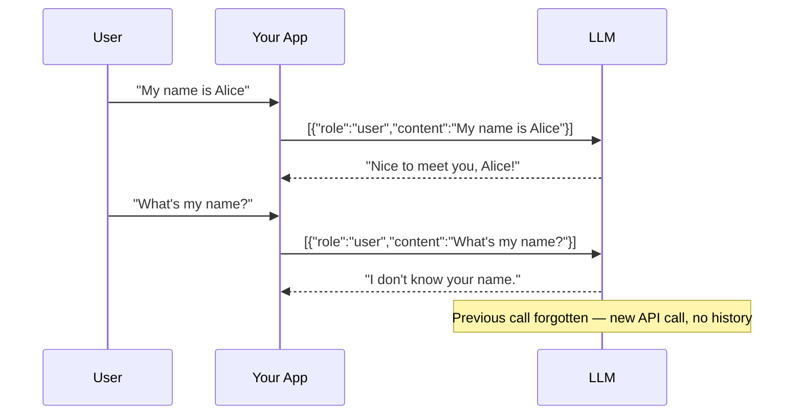
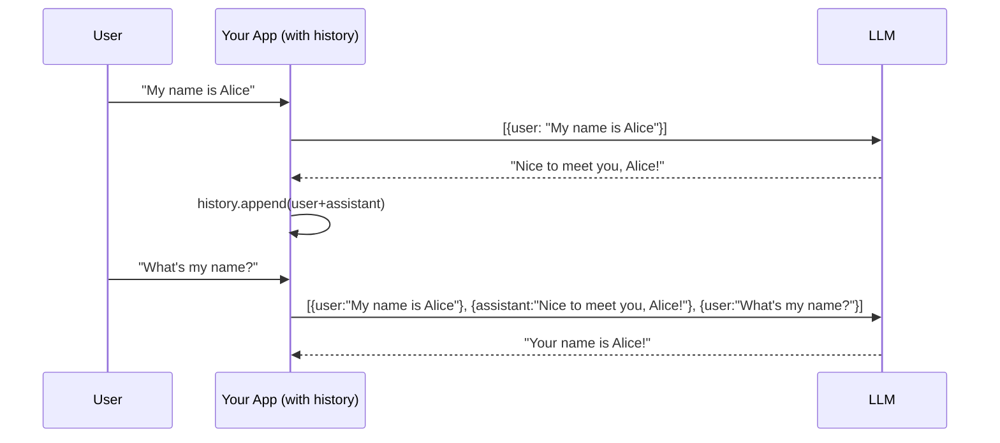
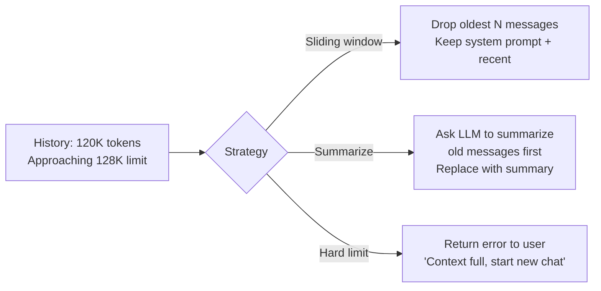

# 17 — Chat with Memory

Build a multi-turn chatbot. Understand why LLMs don't remember you by default, how conversation history works, and what happens when you hit the context limit.

**Prerequisites:** FS-16 (First LLM Call).

---

## The Problem: LLMs Are Stateless

Every API call is independent. The LLM has no memory of previous calls.



**The fix: send the whole conversation every time.**



---

## What You Build

A terminal chat application with:
- Persistent conversation history (in memory)
- System prompt (personality/role)
- Token counter — shows how much context is used
- Context window management — auto-truncate oldest messages when nearing the limit

```
You: My name is Alice and I'm a DevOps engineer
Assistant: Nice to meet you, Alice! How can I help with DevOps today?
[tokens: 45/128000]

You: What's my name and what do I do?
Assistant: You're Alice, a DevOps engineer.
[tokens: 98/128000]

You: /clear    ← reset history
You: /system "You are a snarky assistant"  ← change personality
You: /tokens   ← show current usage
```

---

## Context Window Management



## Key Concepts

| Concept | What it is |
|---------|-----------|
| **Message roles** | `system` (instructions), `user` (human), `assistant` (LLM response) |
| **Context window** | Total tokens (input + output) the model sees at once |
| **Sliding window** | Drop old messages to stay within limit |
| **System prompt** | First message that shapes all behavior, never dropped |

## Quick Start

```bash
export OPENAI_API_KEY=sk-...
make run
# Interactive terminal chat
```
