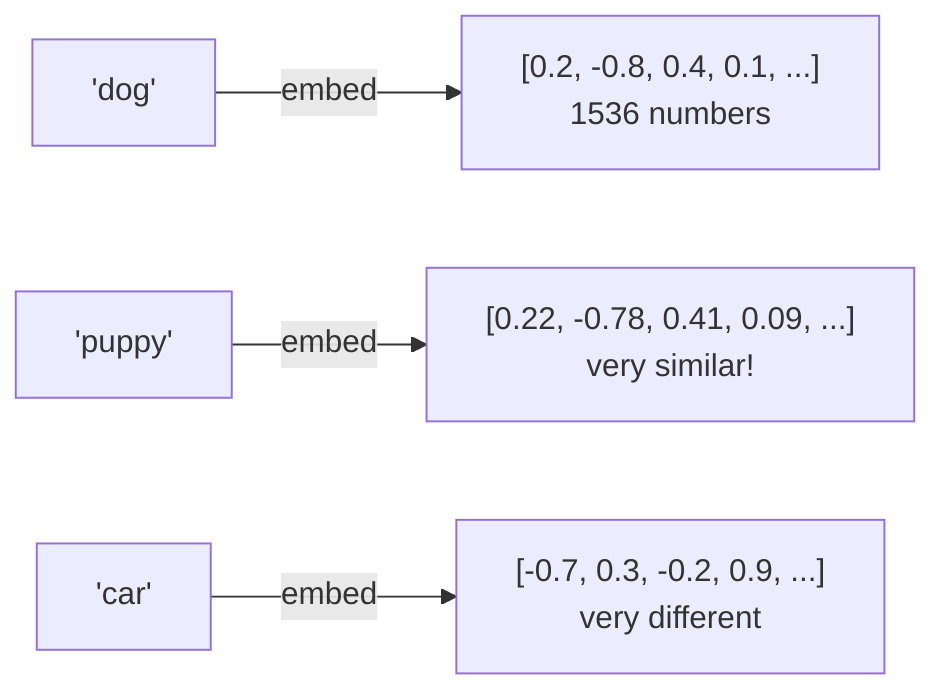

# 18 — Embeddings from Scratch

Understand what an embedding is, implement cosine similarity yourself, and build semantic search without any vector database.

**Prerequisites:** FS-17 (Chat with Memory) — you've used the LLM API. Now learn its embedding API.

---

## What is an Embedding?

An embedding is a list of numbers (a vector) that captures the *meaning* of text. The key property: **similar meaning = similar vectors**.



The embedding model is trained so that semantic relationships become geometric distances.

---

## Cosine Similarity — The Math

```
Two vectors A and B:
A = [1, 0, 1]  (represents "fast dog")
B = [1, 0, 0.9] (represents "quick puppy")
C = [-1, 1, 0]  (represents "slow traffic")

cos(A, B) = (A·B) / (|A| × |B|)
          = (1×1 + 0×0 + 1×0.9) / (√2 × √1.81)
          = 1.9 / 2.69 = 0.71  ← similar!

cos(A, C) = (1×-1 + 0×1 + 1×0) / (√2 × √2)
          = -1 / 2 = -0.5  ← different!
```

You implement this yourself in Go — just a dot product and magnitude.

---

## What You Build

A semantic search engine over a small corpus:

```bash
# Index 100 sentences from Go documentation
make index

# Search semantically
make run
Query: "how to handle errors"
Results:
  0.91: "Error handling in Go uses multiple return values"
  0.87: "The error interface has a single Error() string method"
  0.82: "Use errors.Is and errors.As for wrapped errors"
  0.31: "Goroutines are lightweight threads" (not relevant — filtered out)
```

**No external vector DB.** All embeddings stored in memory as `[][]float32`. Brute-force cosine similarity search (correct for small datasets, O(n) per query).

---

## Key Concepts

| Concept | What it is |
|---------|-----------|
| **Embedding** | Vector of floats representing text meaning |
| **Cosine similarity** | Angle between vectors (1=identical, 0=unrelated) |
| **Semantic search** | Find similar meaning, not just matching keywords |
| **Embedding model** | Separate from chat model — `text-embedding-3-small` |
| **Brute-force search** | Compare query to every stored vector — works for <100K |

## Quick Start

```bash
export OPENAI_API_KEY=sk-...
make run
```
