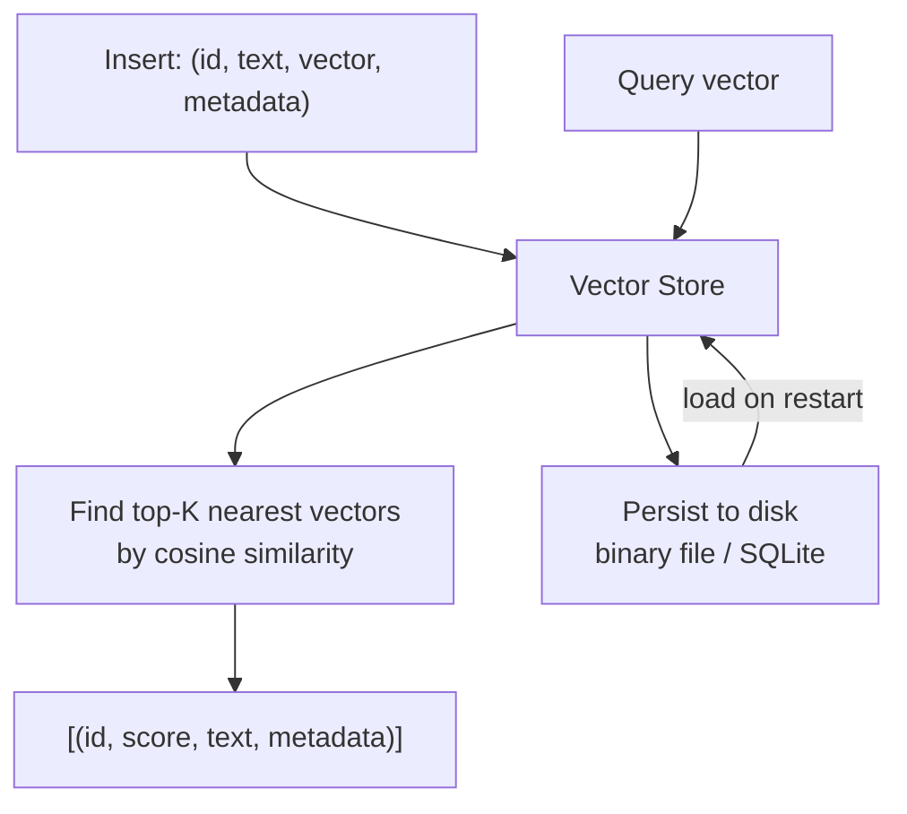
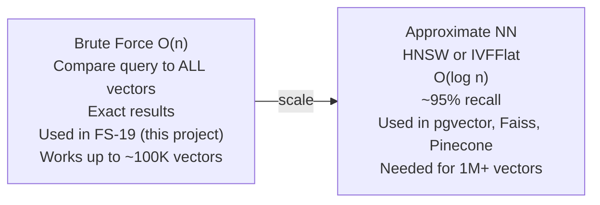

# 19 — Vector Store from Scratch

Build your own in-memory vector store with persistence. Understand what pgvector/Pinecone/Weaviate do under the hood before you use them.

**Prerequisites:** FS-18 (Embeddings from Scratch) — you understand vectors and cosine similarity.

---

## What is a Vector Store?

A vector store is a database optimized for one operation: **given a query vector, find the K most similar stored vectors**. This is the engine inside every RAG system, semantic search product, and recommendation system.



---

## What You Build

A complete vector store in Go with:

1. **In-memory index** — all vectors in a flat `[]Record` slice
2. **Brute-force search** — exact cosine similarity, correct for <100K vectors
3. **Persistence** — save/load from disk (binary encoding of float32 slices)
4. **Metadata filtering** — `WHERE source = 'k8s-docs'` before similarity search
5. **HTTP API** — insert, search, delete, list endpoints

```bash
# Start the vector store server
make run  # :8082

# Insert a document
curl -X POST http://localhost:8082/insert \
  -d '{"id":"doc1","text":"Kubernetes pods are the smallest unit","metadata":{"source":"k8s"}}'

# Search
curl "http://localhost:8082/search?q=container+orchestration&k=3"
# Returns: top 3 most similar records with scores

# Persist to disk
curl -X POST http://localhost:8082/save?path=./store.bin

# Load on restart
STORE_PATH=./store.bin make run
```

---

## Brute Force vs Approximate (HNSW / IVFFlat)



You build brute force here. Once you understand it, using pgvector's IVFFlat (FS-20) is just "brute force with an index to skip most vectors".

---

## Key Concepts

| Concept | What it is |
|---------|-----------|
| **Flat index** | All vectors in a list, scan all for search |
| **Metadata filter** | Pre-filter by category/source before similarity search |
| **Persistence** | Binary encoding: `encoding/binary` + `[]float32` |
| **Record** | `{id, vector, text, metadata}` — the unit of storage |
| **Recall** | % of true nearest neighbours found (brute force = 100%) |

## Quick Start

```bash
export OPENAI_API_KEY=sk-...
make run
```

## What's Next

FS-20 (RAG Pipeline) uses this vector store (or upgrades to pgvector for scale) to build the full retrieval-augmented generation system.
