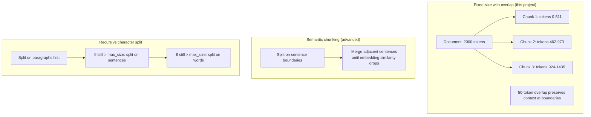
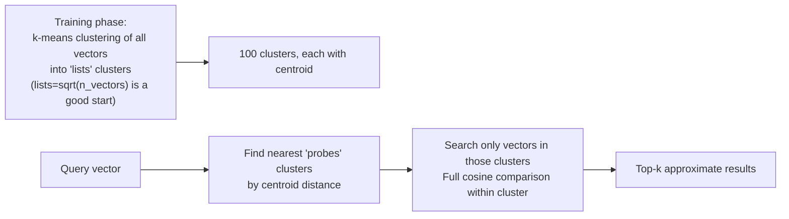

# 16-rag-pipeline: Deep Dive

## What is RAG?

Standard LLMs have a knowledge cutoff and cannot access your private data. RAG (Retrieval-Augmented Generation) fixes this by:
1. **Indexing** your documents as vectors in a database
2. **Retrieving** the most relevant chunks at query time
3. **Augmenting** the LLM prompt with those chunks

The LLM doesn't need to know everything — it reasons over retrieved facts.

---

## Embedding Math — Vectors and Cosine Similarity

An embedding model converts text to a vector of floats. Semantically similar text produces similar vectors.

```
"How does Raft elect a leader?" --> [0.12, -0.34, 0.89, ..., 0.02]  (1536 dims)
"Raft leader election process"  --> [0.11, -0.33, 0.91, ..., 0.03]  (similar!)
"Recipe for chocolate cake"     --> [-0.77, 0.45, -0.12, ..., 0.61] (different)
```

**Cosine similarity** measures the angle between two vectors:

```
cos(θ) = (A · B) / (|A| × |B|)

Where:
  A · B = sum(A[i] × B[i])  (dot product)
  |A|   = sqrt(sum(A[i]²))  (magnitude)

Range: -1 (opposite) to 1 (identical)
Practical range for text: 0.0 to 1.0

Example:
  query    = [0.6, 0.8]
  chunk_1  = [0.7, 0.7]  → cos = (0.42 + 0.56) / (1.0 × 0.99) = 0.98 (very similar)
  chunk_2  = [-0.9, 0.1] → cos = (-0.54 + 0.08) / (1.0 × 0.91) = -0.51 (unrelated)
```

pgvector's `<=>` operator computes **cosine distance** = `1 - cosine_similarity`. Lower = more similar.

```sql
SELECT content, 1 - (embedding <=> '[0.12,-0.34,...]'::vector) AS similarity
FROM chunks
ORDER BY embedding <=> '[0.12,-0.34,...]'::vector
LIMIT 5;
```

---

## Chunking Strategies



**Why 512 tokens with 50 overlap?**
- 512 tokens ≈ ~350 words — enough context for a complete thought
- Overlap prevents splitting a sentence that spans a boundary
- text-embedding-3-small max input: 8191 tokens (but smaller = better focus)

---

## IVFFlat Index — How It Works

Exact nearest neighbour (compare query to every row) is O(n). For 1M vectors: 1M cosine computations per query → slow.

**IVFFlat (Inverted File with Flat compression):**



```sql
-- Create IVFFlat index (run after inserting data)
CREATE INDEX ON chunks USING ivfflat (embedding vector_cosine_ops)
  WITH (lists = 100);
-- lists ≈ sqrt(row_count)

-- At query time, search more clusters for better recall
SET ivfflat.probes = 10;  -- default 1, higher = more accurate but slower
```

**Recall vs speed tradeoff:** `lists=100, probes=10` searches 10% of the index per query — much faster than full scan, with ~95% recall for typical data.

---

## Retrieval Quality Metrics

**Retrieval precision@k:** Of the k chunks retrieved, what fraction are actually relevant?
```
precision@5 = relevant_chunks_retrieved / 5
Target: > 0.6 (at least 3/5 chunks relevant)
```

**Cosine similarity threshold:** Only pass chunks with similarity > 0.7 to the LLM. Below this threshold, chunks are likely noise.

**LLM-as-judge evaluation:**
```python
# Automatic evaluation: ask GPT-4 if the answer is grounded in the context
judge_prompt = f"""
Given this context:
{retrieved_chunks}

And this question: {question}

And this answer: {llm_answer}

Is the answer grounded in the context? Reply YES or NO with a brief reason.
"""
```

---

## The Prompt Template

```
You are a helpful assistant. Answer the question based ONLY on the provided context.
If the context doesn't contain enough information, say "I don't have enough information."
Do not make up facts.

Context:
---
{chunk_1_content}
[Source: {chunk_1_metadata}]

{chunk_2_content}
[Source: {chunk_2_metadata}]

{chunk_3_content}
[Source: {chunk_3_metadata}]
---

Question: {user_query}

Answer:
```

**Why "ONLY on the provided context"?** Prevents the LLM from using its parametric knowledge (training data) which may be outdated or wrong for your domain.

---

## pgvector Schema

```sql
CREATE EXTENSION IF NOT EXISTS vector;

CREATE TABLE documents (
    id          SERIAL PRIMARY KEY,
    source_path TEXT NOT NULL,
    chunk_index INTEGER NOT NULL,
    content     TEXT NOT NULL,
    tokens      INTEGER,
    embedding   vector(1536),  -- text-embedding-3-small dimension
    created_at  TIMESTAMPTZ DEFAULT now()
);

CREATE INDEX ON documents USING ivfflat (embedding vector_cosine_ops)
  WITH (lists = 100);

-- Full-text search as fallback when vector search scores are low
CREATE INDEX ON documents USING gin(to_tsvector('english', content));
```

---

## Connection to devops/ai-infra/llmops.md

This project is the hands-on implementation of the RAG concepts documented in `devops/ai-infra/llmops.md`. Key concepts from that file implemented here:

| Concept | Where in this project |
|---------|----------------------|
| pgvector cosine search | `internal/store/vector.go` |
| Chunking with overlap | `internal/indexer/chunker.go` |
| Embedding via OpenAI API | `internal/embedder/openai.go` |
| Streaming LLM response | `internal/llm/stream.go` + SSE handler |
| Retrieval similarity threshold | `internal/retriever/retrieve.go` |
