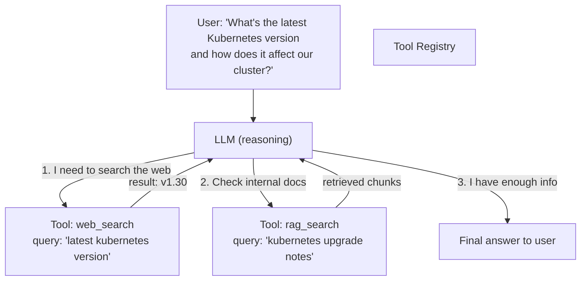
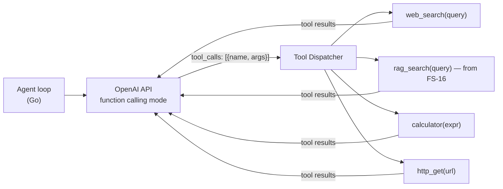

# 17 — LLM Agent with Tool Use

Build an LLM agent from scratch — the engine behind ChatGPT plugins, Claude tools, and AI assistants. No LangChain. Pure Go + OpenAI function calling API.

**Prerequisites:** FS-16 (RAG Pipeline) — the agent uses RAG as one of its tools.

---

## What is an Agent?

A single LLM call produces one answer. An **agent** loops: it can call tools, observe results, and decide what to do next — until it has enough information to answer.



**ReAct loop (Reason + Act):**
```
Thought: I need to find the latest K8s version
Action: web_search("latest kubernetes version")
Observation: v1.30 released March 2024
Thought: Now I need to check our upgrade docs
Action: rag_search("kubernetes 1.30 upgrade breaking changes")
Observation: [relevant chunks]
Thought: I have enough information to answer
Answer: Kubernetes 1.30 is the latest...
```

---

## Architecture



---

## Key Concepts

- **Function calling** — OpenAI API feature: pass tool schemas as JSON Schema, model returns structured `tool_calls` instead of text when it needs a tool
- **Tool registry** — map of `name --> handler func(args) string`
- **Max iterations** — prevent infinite loops; stop after N tool calls
- **Observation injection** — tool results injected back into message history as `role: tool` messages

## Quick Start

```bash
# Requires FS-16 running for RAG tool
export OPENAI_API_KEY=sk-...
make run
curl -X POST http://localhost:8081/agent \
  -d '{"query": "Summarize the latest changes in our k8s docs and find the current date"}'
```

## Docs
- [`docs/deep-dive.md`](./docs/deep-dive.md) — ReAct pattern, function calling JSON schema, tool design principles, token budget management
