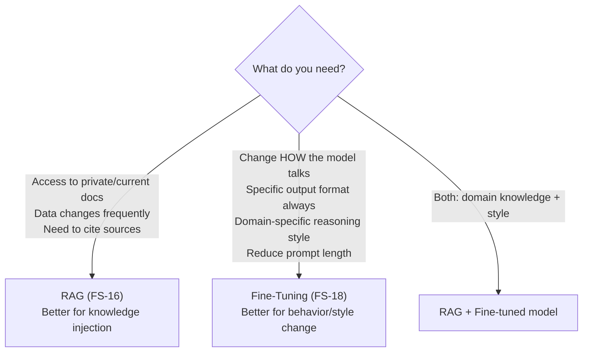
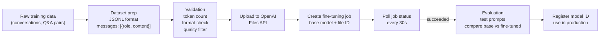

# 18 — Fine-Tuning Pipeline

Orchestrate the full fine-tuning workflow in Go — dataset preparation, job submission, monitoring, and model evaluation. Understand when RAG is not enough.

**Prerequisites:** FS-16 (RAG Pipeline) — fine-tuning and RAG are complementary.

---

## RAG vs Fine-Tuning — When to Use Which



**Fine-tune when RAG isn't enough:**
- You want the model to always respond in a specific JSON schema without a long system prompt
- You're training on customer support transcripts to match your company's tone
- Domain vocabulary (medical, legal, code) that the base model doesn't understand well
- Reduce inference cost: smaller fine-tuned model replaces larger base model

---

## Architecture



---

## JSONL Training Format

```jsonl
{"messages": [{"role": "system", "content": "You are a K8s expert."}, {"role": "user", "content": "What is a Pod?"}, {"role": "assistant", "content": "A Pod is the smallest deployable unit in Kubernetes..."}]}
{"messages": [{"role": "user", "content": "How does HPA work?"}, {"role": "assistant", "content": "HPA scales replicas based on metrics..."}]}
```

## Quick Start

```bash
export OPENAI_API_KEY=sk-...
# Prepare your JSONL dataset in ./data/train.jsonl
make prepare   # validate + count tokens + estimate cost
make upload    # upload to OpenAI Files API
make train     # create fine-tuning job
make monitor   # poll until complete
make eval      # run test prompts against base + fine-tuned
```

## Key Concepts

- **LoRA (Low-Rank Adaptation)** — fine-tune only a small adapter matrix on top of frozen base weights. 100-1000x fewer trainable parameters than full fine-tune. Used internally by OpenAI for their fine-tuning API.
- **Token cost estimation** — fine-tuning costs per token. Count tokens before submitting.
- **Train/validation split** — hold out 10-20% for validation loss monitoring.
- **Overfitting** — if val loss rises while train loss drops, reduce epochs or data quality issues.
