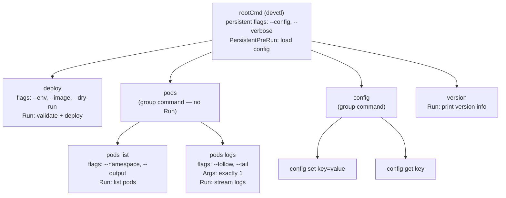

# 23 — Building a Modern CLI with Cobra

Build a production-quality CLI tool in Go — the same patterns used by `kubectl`, `helm`, `gh`, and `docker`. Cobra is the standard library for Go CLIs.

**Prerequisites:** Go basics. No prior CLI experience needed.

---

## What You Build

A `devctl` CLI — a mock platform engineering tool that demonstrates every modern CLI pattern:

```bash
devctl --help
devctl deploy --env prod --image myapp:v1.2 --dry-run
devctl pods list --namespace production --output json
devctl pods logs my-pod-abc --follow --tail 100
devctl config set cluster=prod-us-east
devctl config get cluster
devctl version
```

---

## Cobra Architecture



---

## Key Cobra Patterns

| Pattern | How | Used in |
|---------|-----|---------|
| Subcommands | `rootCmd.AddCommand(deployCmd)` | All commands |
| Persistent flags | `rootCmd.PersistentFlags()` — inherited by all children | `--verbose`, `--config` |
| Local flags | `deployCmd.Flags()` — only on this command | `--dry-run` |
| Required flags | `.MarkFlagRequired("env")` | `deploy --env` |
| Args validation | `cobra.ExactArgs(1)`, `cobra.MinimumNArgs(1)` | `pods logs <pod>` |
| Flag completion | `RegisterFlagCompletionFunc` | `--env` tab completion |
| Config file | `viper.SetConfigFile()` | `~/.devctl/config.yaml` |
| Shell completion | `devctl completion bash` | Built-in to Cobra |

## Quick Start

```bash
make build
./devctl --help
./devctl deploy --env staging --image myapp:v1.0 --dry-run
./devctl pods list --output json
./devctl completion bash >> ~/.bashrc  # tab completion
```

## Docs

- [`docs/deep-dive.md`](./docs/deep-dive.md) — Cobra internals, flag types, Viper config, shell completion, testing CLIs, distribution with GoReleaser
