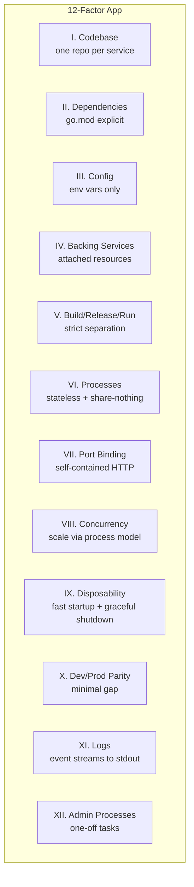
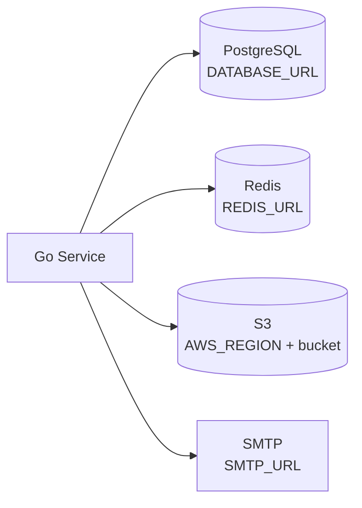
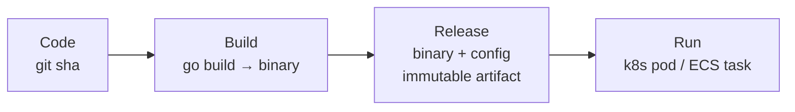
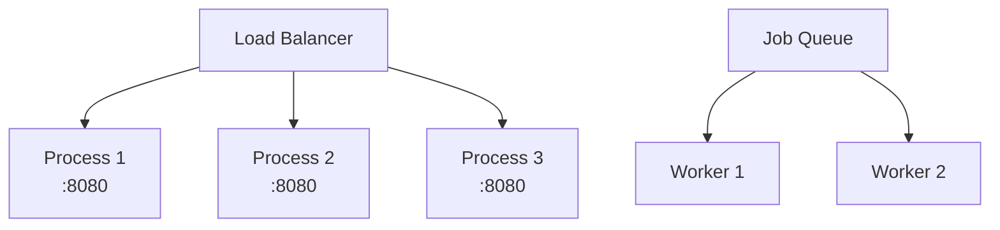

# The Twelve-Factor App in Go

How to apply the [12-factor methodology](https://12factor.net) to Go microservices for cloud-native deployment.

---

## Overview



---

## Factor-by-Factor in Go

### I. Codebase — One Repo, Many Deploys

```
my-service/
├── cmd/server/main.go    # production entry point
├── cmd/migrate/main.go   # admin process (Factor XII)
├── internal/             # private packages
├── go.mod
└── Dockerfile
```

### II. Dependencies — Explicitly Declared

```go
// go.mod — pinned, reproducible, vendorable
module github.com/org/my-service

go 1.23

require (
    github.com/jackc/pgx/v5 v5.7.2
    github.com/redis/go-redis/v9 v9.7.0
)
```

```bash
go mod tidy      # sync deps
go mod vendor    # vendor for hermetic builds
go mod verify    # checksum verification
```

### III. Config — Environment Variables

```go
type Config struct {
    Port        string `env:"PORT" envDefault:"8080"`
    DatabaseURL string `env:"DATABASE_URL,required"`
    RedisURL    string `env:"REDIS_URL" envDefault:"localhost:6379"`
    LogLevel    string `env:"LOG_LEVEL" envDefault:"info"`
}

func LoadConfig() (*Config, error) {
    cfg := &Config{
        Port:     getEnv("PORT", "8080"),
        DatabaseURL: os.Getenv("DATABASE_URL"),
        RedisURL: getEnv("REDIS_URL", "localhost:6379"),
        LogLevel: getEnv("LOG_LEVEL", "info"),
    }
    if cfg.DatabaseURL == "" {
        return nil, errors.New("DATABASE_URL is required")
    }
    return cfg, nil
}

func getEnv(key, fallback string) string {
    if v := os.Getenv(key); v != "" {
        return v
    }
    return fallback
}
```

**Never**: hardcode URLs, credentials, or feature flags in code.

### IV. Backing Services — Attached Resources



Swap from local Postgres to RDS by changing one env var — zero code changes.

### V. Build, Release, Run



```dockerfile
# Build stage produces immutable artifact
FROM golang:1.23-alpine AS builder
RUN CGO_ENABLED=0 go build -o /server ./cmd/server

# Release = binary + runtime config (env vars injected at deploy)
FROM gcr.io/distroless/static
COPY --from=builder /server /server
ENTRYPOINT ["/server"]
```

### VI. Processes — Stateless

```go
// BAD: in-memory session state
var sessions = map[string]*Session{} // lost on restart/scale

// GOOD: external state store
func GetSession(ctx context.Context, id string) (*Session, error) {
    return redis.Get(ctx, "session:"+id).Result()
}
```

### VII. Port Binding — Self-Contained

```go
// The app IS the web server — no external container needed
func main() {
    port := os.Getenv("PORT")
    if port == "" {
        port = "8080"
    }
    http.ListenAndServe(":"+port, handler)
}
```

### VIII. Concurrency — Scale Out via Processes



Scale web processes horizontally. Scale workers independently. Each process is stateless (Factor VI).

### IX. Disposability — Fast Start, Graceful Stop

```go
func main() {
    ctx, stop := signal.NotifyContext(context.Background(), syscall.SIGTERM)
    defer stop()

    srv := &http.Server{Addr: ":8080", Handler: mux}

    go func() {
        <-ctx.Done()
        shutdownCtx, cancel := context.WithTimeout(context.Background(), 30*time.Second)
        defer cancel()
        srv.Shutdown(shutdownCtx) // drain in-flight requests
    }()

    srv.ListenAndServe()
}
```

### X. Dev/Prod Parity

```yaml
# docker-compose.yml — same backing services as production
services:
  postgres:
    image: postgres:16
  redis:
    image: redis:7-alpine
  app:
    build: .
    env_file: .env.development
```

### XI. Logs — Event Streams

```go
// Logs go to stdout — the platform routes them
slog.SetDefault(slog.New(slog.NewJSONHandler(os.Stdout, nil)))

// Never: log to files, manage log rotation in-app
// The platform (K8s, ECS, systemd) handles collection
```

### XII. Admin Processes — One-Off Tasks

```go
// cmd/migrate/main.go — same codebase, separate entry point
func main() {
    db := connectDB(os.Getenv("DATABASE_URL"))
    if err := migrate.Up(db); err != nil {
        log.Fatal(err)
    }
}
```

```bash
# Run as one-off in same environment
kubectl exec deploy/my-service -- /migrate
# or
docker run --env-file .env myapp /migrate
```

---

## Anti-Patterns

| Anti-Pattern | 12-Factor Fix |
|-------------|---------------|
| Config in YAML files baked into image | Env vars injected at runtime |
| Sticky sessions | External session store (Redis) |
| Local file uploads | Object storage (S3) |
| Cron jobs in the app process | Separate worker process + job queue |
| Log files with rotation | stdout → platform collector |
