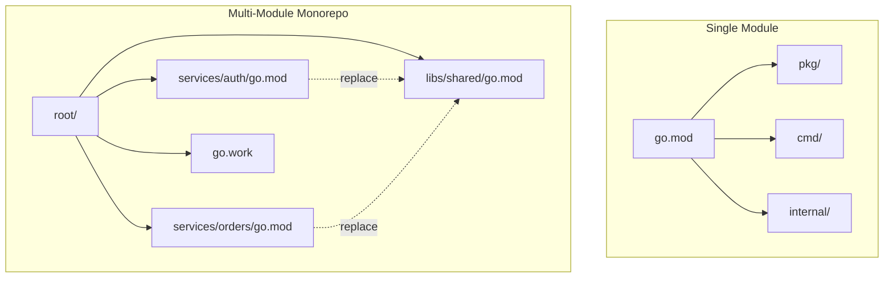
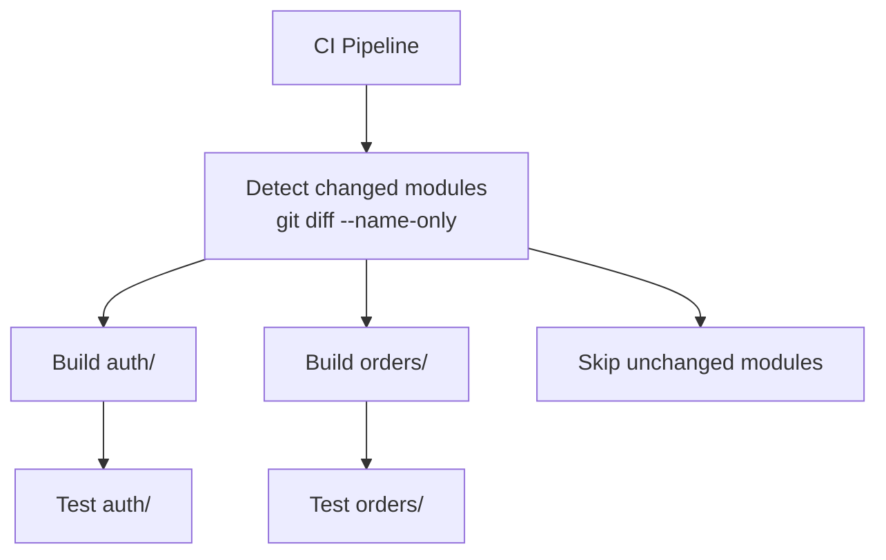

# Go Module Patterns

`go.work` workspaces, internal packages, replace directives, and monorepo strategies.

---

## Module Layout



---

## `internal/` Package Restriction

The `internal` directory is enforced by the Go compiler — code inside can only be imported by packages rooted at the parent of `internal`.

```
myservice/
├── cmd/server/main.go          ✅ can import internal/
├── internal/
│   ├── domain/user.go          # business logic
│   ├── handler/http.go         # HTTP handlers
│   ├── repository/postgres.go  # data access
│   └── config/config.go        # app config
├── pkg/                        # public API (importable by others)
│   └── client/client.go
└── go.mod
```

```go
// cmd/server/main.go
import "myservice/internal/handler"  // ✅ works

// some-other-module/main.go
import "myservice/internal/handler"  // ❌ compile error
import "myservice/pkg/client"        // ✅ works
```

**When to use `internal/`:**
- Domain logic that shouldn't be a public API
- Handlers, repositories, config — implementation details
- Anything you want to refactor freely without breaking consumers

---

## `go.work` Workspaces (Go 1.18+)

For developing multiple modules locally without publishing.

```
monorepo/
├── go.work
├── services/
│   ├── auth/
│   │   ├── go.mod    (module github.com/org/monorepo/services/auth)
│   │   └── main.go
│   └── orders/
│       ├── go.mod    (module github.com/org/monorepo/services/orders)
│       └── main.go
└── libs/
    └── shared/
        ├── go.mod    (module github.com/org/monorepo/libs/shared)
        └── types.go
```

```go
// go.work
go 1.23

use (
    ./services/auth
    ./services/orders
    ./libs/shared
)
```

```bash
go work init ./services/auth ./services/orders ./libs/shared
go work sync  # sync all modules
```

**Key rules:**
- `go.work` is for **local development only** — never commit to CI
- Add `go.work` and `go.work.sum` to `.gitignore`
- CI uses `replace` directives or published modules

---

## `replace` Directives

### Local Development (without go.work)

```go
// services/auth/go.mod
module github.com/org/monorepo/services/auth

go 1.23

require github.com/org/monorepo/libs/shared v0.0.0

replace github.com/org/monorepo/libs/shared => ../../libs/shared
```

### Forked Dependencies

```go
// Use your fork until upstream merges your PR
replace github.com/original/pkg => github.com/yourfork/pkg v1.2.3-fix
```

### Pinning Vulnerable Versions

```go
// Force upgrade of transitive dependency
replace golang.org/x/crypto v0.0.0-old => golang.org/x/crypto v0.17.0
```

---

## Monorepo Strategies

| Strategy | Pros | Cons |
|----------|------|------|
| Single `go.mod` | Simple, one build | All deps shared, slow CI |
| Multi-module + `go.work` | Independent deps, fast CI per service | More complex, version coordination |
| Multi-repo | Full isolation | Cross-repo changes are painful |

### Recommended: Multi-Module Monorepo



```makefile
# Makefile at root
MODULES := $(shell find . -name 'go.mod' -exec dirname {} \;)

.PHONY: test-all
test-all:
	@for mod in $(MODULES); do \
		echo "Testing $$mod..."; \
		(cd $$mod && go test -race ./...) || exit 1; \
	done

.PHONY: tidy-all
tidy-all:
	@for mod in $(MODULES); do \
		(cd $$mod && go mod tidy); \
	done
```

---

## Versioning Multi-Module

```bash
# Tag format for multi-module repos:
git tag services/auth/v1.2.3
git tag libs/shared/v0.5.0

# Go resolves: github.com/org/repo/services/auth v1.2.3
```

**Rule**: Each module's tag must be prefixed with its path relative to the repo root.

---

## Build Tags & Conditional Compilation

Build tags (also called build constraints) let you include or exclude files from a build based on OS, architecture, Go version, or custom flags. They are the Go equivalent of `#ifdef` in C.

---

### Syntax (Go 1.17+)

```go
//go:build constraint
```

The old `// +build` syntax still works but is deprecated. Both can coexist in the same file for backward compatibility — `gofmt` adds the old form automatically when it sees the new one.

```go
// New syntax (Go 1.17+) — required first
//go:build linux && amd64

// Old syntax — kept for tools that don't understand Go 1.17+
// +build linux,amd64

package mypackage
```

**Rule**: The `//go:build` line must appear before the `package` declaration, with a blank line between the build constraint and the package clause.

---

### Boolean Operators

| New syntax | Old syntax | Meaning |
|-----------|-----------|---------|
| `A && B`  | `A,B`     | A **and** B must be satisfied |
| `A \|\| B`| `A B`     | A **or** B must be satisfied |
| `!A`      | `!A`      | A must **not** be satisfied |
| `(A \|\| B) && C` | `(A B),C` | Grouped expression |

```go
//go:build (linux || darwin) && !cgo

//go:build !windows

//go:build amd64 || arm64
```

---

### File-Level Build Constraints

```go
// Only compile on Linux
//go:build linux

// Compile on everything except Windows
//go:build !windows

// Only compile on 64-bit architectures
//go:build amd64 || arm64

// Require a specific Go version
//go:build go1.21
```

---

### Common GOOS and GOARCH Values

| GOOS      | Platform               | GOARCH   | Architecture          |
|-----------|------------------------|----------|-----------------------|
| `linux`   | Linux                  | `amd64`  | x86-64 (Intel/AMD)    |
| `darwin`  | macOS                  | `arm64`  | ARM 64-bit (Apple M1+)|
| `windows` | Windows                | `386`    | x86 32-bit            |
| `freebsd` | FreeBSD                | `arm`    | ARM 32-bit            |
| `android` | Android                | `mips`   | MIPS                  |
| `ios`     | iOS                    | `wasm`   | WebAssembly           |
| `js`      | JavaScript/WASM target | `riscv64`| RISC-V 64-bit         |

Full list: `go tool dist list`

---

### Automatic Platform-Specific Files

The Go toolchain automatically applies build constraints based on file naming conventions — no `//go:build` line needed:

```
mypackage/
├── fs.go              # compiled on all platforms
├── fs_linux.go        # compiled only on Linux
├── fs_windows.go      # compiled only on Windows
├── fs_darwin.go       # compiled only on macOS
├── fs_linux_amd64.go  # compiled only on Linux/amd64
└── fs_test.go         # compiled only during tests
```

Naming pattern: `*_GOOS.go`, `*_GOARCH.go`, or `*_GOOS_GOARCH.go`.

---

### Integration vs Unit Test Separation

Keep slow integration tests (DB, network) out of the default `go test` run:

```go
//go:build integration

package db_test

import (
    "testing"
    "database/sql"
)

func TestRealDatabase(t *testing.T) {
    // Connects to a real DB — only run in CI or explicitly
    db, err := sql.Open("postgres", "postgres://localhost/testdb")
    // ...
}
```

Running tests:

```bash
# Run only unit tests (default — integration tag not set)
go test ./...

# Run unit + integration tests
go test -tags integration ./...

# Run ONLY integration tests (exclude untagged tests via build constraint trick)
go test -tags integration -run Integration ./...
```

---

### Cross-Compilation Examples

Go's cross-compilation is first-class — no toolchain changes needed:

```bash
# Linux AMD64 binary (e.g. deploy to EC2)
GOOS=linux GOARCH=amd64 go build -o app-linux .

# macOS Apple Silicon (M1/M2/M3)
GOOS=darwin GOARCH=arm64 go build -o app-macos-arm .

# macOS Intel
GOOS=darwin GOARCH=amd64 go build -o app-macos-intel .

# Windows x64
GOOS=windows GOARCH=amd64 go build -o app.exe .

# WebAssembly (runs in browser or Node)
GOOS=js GOARCH=wasm go build -o app.wasm .

# Fully static binary (no libc dependency) — ideal for scratch Docker images
CGO_ENABLED=0 GOOS=linux GOARCH=amd64 go build -o app-static .
```

**CGO_ENABLED=0** disables cgo and produces a pure Go binary. This is required for:
- `FROM scratch` Docker images
- Alpine Linux (musl libc)
- Lambda / AWS Fargate / Cloud Run (minimal runtime)

```dockerfile
# Multi-stage Dockerfile with static binary
FROM golang:1.23-alpine AS builder
WORKDIR /app
COPY go.mod go.sum ./
RUN go mod download
COPY . .
RUN CGO_ENABLED=0 GOOS=linux go build -ldflags="-s -w" -o /app/server .

FROM scratch
COPY --from=builder /app/server /server
ENTRYPOINT ["/server"]
```

---

### `go:generate` for Code Generation

`//go:generate` embeds a shell command in source that runs when you call `go generate`:

```go
// In types.go:
//go:generate stringer -type=Direction
//go:generate mockgen -source=service.go -destination=mock_service.go
//go:generate protoc --go_out=. proto/api.proto

type Direction int
const (
    North Direction = iota
    South
    East
    West
)
```

```bash
# Run all go:generate directives in the package
go generate ./...

# Run only in specific package
go generate ./internal/domain/...
```

Common `go:generate` tools:

| Tool | Use case |
|------|----------|
| `stringer` | `String()` methods for `iota` enums |
| `mockgen` | Interface mocks (gomock) |
| `protoc` | Protobuf / gRPC code generation |
| `sqlc` | Type-safe SQL → Go |
| `oapi-codegen` | OpenAPI → Go server/client |

---

### Multi-Architecture Makefile

```makefile
APP     := myapp
VERSION := $(shell git describe --tags --always --dirty)
LDFLAGS := -ldflags="-s -w -X main.version=$(VERSION)"

.PHONY: build-all build-linux build-darwin build-windows build-wasm test-unit test-integration

# Build for all common platforms
build-all: build-linux build-darwin build-windows

build-linux:
	CGO_ENABLED=0 GOOS=linux   GOARCH=amd64  go build $(LDFLAGS) -o dist/$(APP)-linux-amd64   .
	CGO_ENABLED=0 GOOS=linux   GOARCH=arm64  go build $(LDFLAGS) -o dist/$(APP)-linux-arm64   .

build-darwin:
	CGO_ENABLED=0 GOOS=darwin  GOARCH=amd64  go build $(LDFLAGS) -o dist/$(APP)-darwin-amd64  .
	CGO_ENABLED=0 GOOS=darwin  GOARCH=arm64  go build $(LDFLAGS) -o dist/$(APP)-darwin-arm64  .

build-windows:
	CGO_ENABLED=0 GOOS=windows GOARCH=amd64  go build $(LDFLAGS) -o dist/$(APP)-windows-amd64.exe .

build-wasm:
	GOOS=js GOARCH=wasm go build -o dist/$(APP).wasm .

# Unit tests (fast, no external deps)
test-unit:
	go test -race -count=1 ./...

# Integration tests (require running DB/infra)
test-integration:
	go test -race -count=1 -tags integration ./...

# Tidy all modules
tidy:
	go mod tidy

# Run go generate everywhere
generate:
	go generate ./...

clean:
	rm -rf dist/
```
