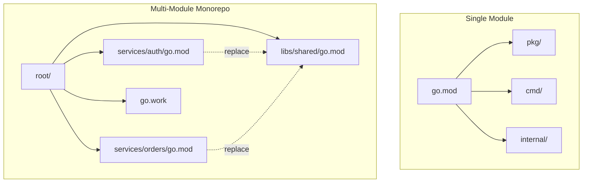
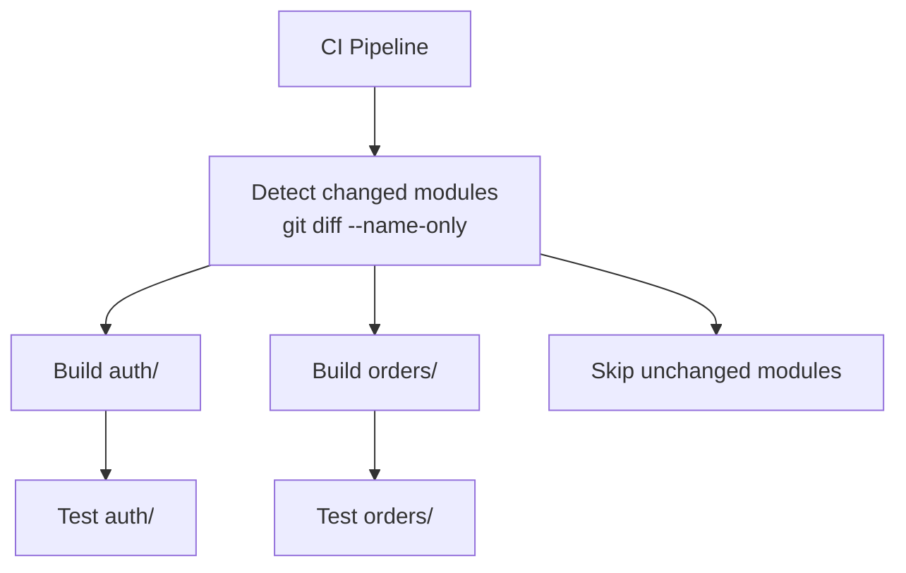

# Go Module Patterns

`go.work` workspaces, internal packages, replace directives, and monorepo strategies.

---

## Module Layout



---

## `internal/` Package Restriction

The `internal` directory is enforced by the Go compiler — code inside can only be imported by packages rooted at the parent of `internal`.

```
myservice/
├── cmd/server/main.go          ✅ can import internal/
├── internal/
│   ├── domain/user.go          # business logic
│   ├── handler/http.go         # HTTP handlers
│   ├── repository/postgres.go  # data access
│   └── config/config.go        # app config
├── pkg/                        # public API (importable by others)
│   └── client/client.go
└── go.mod
```

```go
// cmd/server/main.go
import "myservice/internal/handler"  // ✅ works

// some-other-module/main.go
import "myservice/internal/handler"  // ❌ compile error
import "myservice/pkg/client"        // ✅ works
```

**When to use `internal/`:**
- Domain logic that shouldn't be a public API
- Handlers, repositories, config — implementation details
- Anything you want to refactor freely without breaking consumers

---

## `go.work` Workspaces (Go 1.18+)

For developing multiple modules locally without publishing.

```
monorepo/
├── go.work
├── services/
│   ├── auth/
│   │   ├── go.mod    (module github.com/org/monorepo/services/auth)
│   │   └── main.go
│   └── orders/
│       ├── go.mod    (module github.com/org/monorepo/services/orders)
│       └── main.go
└── libs/
    └── shared/
        ├── go.mod    (module github.com/org/monorepo/libs/shared)
        └── types.go
```

```go
// go.work
go 1.23

use (
    ./services/auth
    ./services/orders
    ./libs/shared
)
```

```bash
go work init ./services/auth ./services/orders ./libs/shared
go work sync  # sync all modules
```

**Key rules:**
- `go.work` is for **local development only** — never commit to CI
- Add `go.work` and `go.work.sum` to `.gitignore`
- CI uses `replace` directives or published modules

---

## `replace` Directives

### Local Development (without go.work)

```go
// services/auth/go.mod
module github.com/org/monorepo/services/auth

go 1.23

require github.com/org/monorepo/libs/shared v0.0.0

replace github.com/org/monorepo/libs/shared => ../../libs/shared
```

### Forked Dependencies

```go
// Use your fork until upstream merges your PR
replace github.com/original/pkg => github.com/yourfork/pkg v1.2.3-fix
```

### Pinning Vulnerable Versions

```go
// Force upgrade of transitive dependency
replace golang.org/x/crypto v0.0.0-old => golang.org/x/crypto v0.17.0
```

---

## Monorepo Strategies

| Strategy | Pros | Cons |
|----------|------|------|
| Single `go.mod` | Simple, one build | All deps shared, slow CI |
| Multi-module + `go.work` | Independent deps, fast CI per service | More complex, version coordination |
| Multi-repo | Full isolation | Cross-repo changes are painful |

### Recommended: Multi-Module Monorepo



```makefile
# Makefile at root
MODULES := $(shell find . -name 'go.mod' -exec dirname {} \;)

.PHONY: test-all
test-all:
	@for mod in $(MODULES); do \
		echo "Testing $$mod..."; \
		(cd $$mod && go test -race ./...) || exit 1; \
	done

.PHONY: tidy-all
tidy-all:
	@for mod in $(MODULES); do \
		(cd $$mod && go mod tidy); \
	done
```

---

## Versioning Multi-Module

```bash
# Tag format for multi-module repos:
git tag services/auth/v1.2.3
git tag libs/shared/v0.5.0

# Go resolves: github.com/org/repo/services/auth v1.2.3
```

**Rule**: Each module's tag must be prefixed with its path relative to the repo root.
