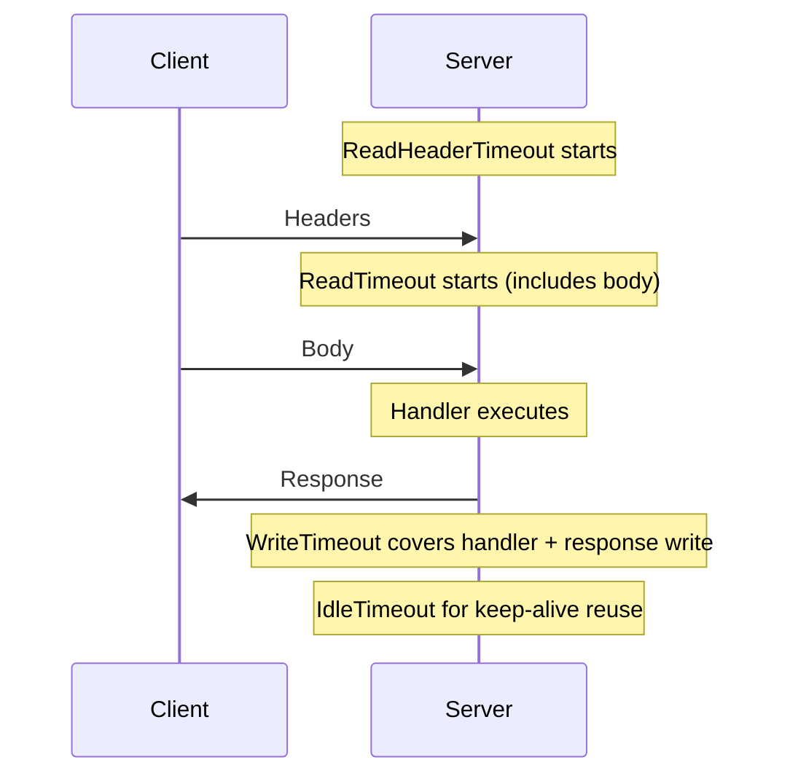
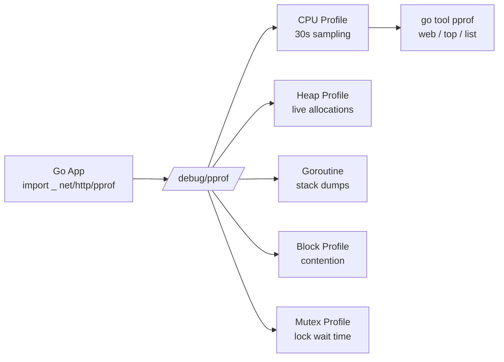
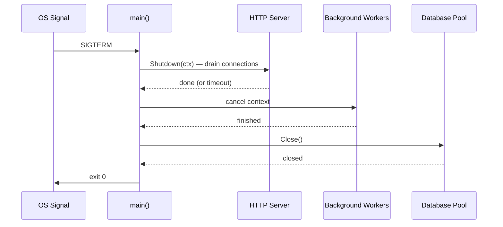

# Production Go

Go-specific techniques for building production-grade distributed systems: timeout tuning, profiling, escape analysis, atomic operations, and lock-free patterns.

---

## HTTP Timeout Architecture

Every production Go HTTP server needs **all four timeouts** configured. Missing any one creates a resource leak vector.



```go
srv := &http.Server{
    Addr:              ":8080",
    ReadHeaderTimeout: 5 * time.Second,  // slow loris protection
    ReadTimeout:       10 * time.Second, // max time to read entire request
    WriteTimeout:      30 * time.Second, // max time for handler + response
    IdleTimeout:       120 * time.Second, // keep-alive connection reuse
    MaxHeaderBytes:    1 << 20,          // 1MB header limit
}
```

### http.Client Timeouts

```go
client := &http.Client{
    Timeout: 30 * time.Second, // end-to-end timeout
    Transport: &http.Transport{
        MaxIdleConns:        100,
        MaxIdleConnsPerHost: 10,
        IdleConnTimeout:     90 * time.Second,
        TLSHandshakeTimeout: 10 * time.Second,
        DialContext: (&net.Dialer{
            Timeout:   5 * time.Second,  // TCP connect timeout
            KeepAlive: 30 * time.Second,
        }).DialContext,
    },
}
```

---

## Profiling with pprof



```go
import _ "net/http/pprof" // register /debug/pprof/ handlers

// In production, gate behind auth:
// mux.Handle("/debug/pprof/", authMiddleware(http.DefaultServeMux))
```

**Common commands:**
```bash
# CPU profile (30 seconds)
go tool pprof http://localhost:6060/debug/pprof/profile?seconds=30

# Heap allocations
go tool pprof http://localhost:6060/debug/pprof/heap

# Goroutine dump
curl http://localhost:6060/debug/pprof/goroutine?debug=2
```

---

## Escape Analysis

```mermaid
graph TD
    FUNC[Function Call] --> ALLOC{Does value escape?}
    ALLOC -->|No: stays in function| STACK[Stack Allocation<br>O(1) free, no GC pressure]
    ALLOC -->|Yes: returned/shared| HEAP[Heap Allocation<br>GC must track and collect]
    
    HEAP --> PRESSURE[GC Pressure<br>STW pauses]
    STACK --> FAST[Fast<br>zero GC cost]
```

```bash
# Check what escapes to heap
go build -gcflags='-m -m' ./...

# Common escapes:
# - Returning pointer to local variable
# - Interface conversion (value → interface)
# - Closure capturing local variable
# - Slice/map growing beyond initial capacity
```

```go
// ESCAPES: pointer returned
func newUser() *User { return &User{} }

// STAYS ON STACK: value returned
func newUserValue() User { return User{} }

// ESCAPES: interface conversion
func log(v any) { fmt.Println(v) }

// Tip: pre-allocate slices to avoid escape
data := make([]byte, 0, 4096) // known capacity → stack-friendly
```

---

## sync/atomic & Lock-Free Patterns

```go
// Atomic counter — no mutex needed for simple increments
var requestCount atomic.Int64

func handler(w http.ResponseWriter, r *http.Request) {
    requestCount.Add(1)
    // ...
}

// Atomic pointer swap — lock-free config reload
var config atomic.Pointer[Config]

func reloadConfig() {
    newCfg := loadFromFile()
    config.Store(newCfg) // atomic swap, readers never block
}

func getConfig() *Config {
    return config.Load() // lock-free read
}
```

### Compare-And-Swap (CAS) Pattern

```go
// Lock-free max tracker
var maxLatency atomic.Int64

func recordLatency(ms int64) {
    for {
        old := maxLatency.Load()
        if ms <= old {
            return
        }
        if maxLatency.CompareAndSwap(old, ms) {
            return
        }
        // CAS failed — another goroutine updated, retry
    }
}
```

---

## Graceful Shutdown Orchestration



```go
func main() {
    ctx, stop := signal.NotifyContext(context.Background(), syscall.SIGTERM, syscall.SIGINT)
    defer stop()

    g, gCtx := errgroup.WithContext(ctx)

    // HTTP server
    g.Go(func() error {
        <-gCtx.Done()
        shutCtx, cancel := context.WithTimeout(context.Background(), 10*time.Second)
        defer cancel()
        return srv.Shutdown(shutCtx)
    })

    // Background worker
    g.Go(func() error {
        return worker.Run(gCtx) // respects context cancellation
    })

    g.Go(func() error {
        return srv.ListenAndServe()
    })

    if err := g.Wait(); err != nil && !errors.Is(err, http.ErrServerClosed) {
        log.Fatal(err)
    }
}
```

---

## Running

```bash
go run .
```
