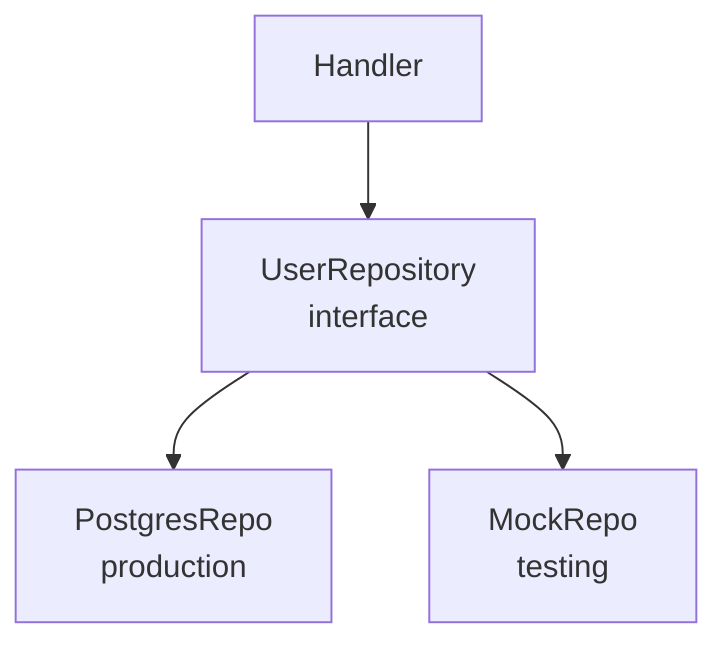
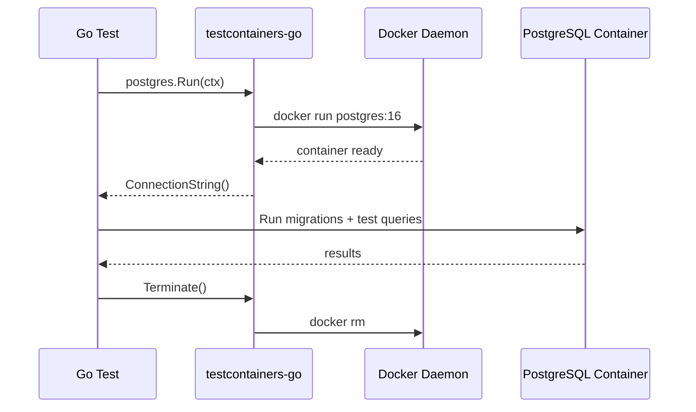

# Testing Patterns in Go

Table-driven tests, mocks, integration tests with testcontainers, benchmarks, and fuzz testing.

---

## Table-Driven Tests

The idiomatic Go testing pattern — every test case is a struct in a slice.

```go
func TestAdd(t *testing.T) {
    tests := []struct {
        name     string
        a, b     int
        expected int
    }{
        {"positive", 2, 3, 5},
        {"negative", -1, -2, -3},
        {"zero", 0, 0, 0},
        {"mixed", -1, 5, 4},
    }

    for _, tt := range tests {
        t.Run(tt.name, func(t *testing.T) {
            got := Add(tt.a, tt.b)
            if got != tt.expected {
                t.Errorf("Add(%d, %d) = %d, want %d", tt.a, tt.b, got, tt.expected)
            }
        })
    }
}
```

**Why table-driven?**
- Easy to add new cases (one line per case)
- `t.Run` gives subtests → parallel execution, selective running
- Failures show which case failed by name

---

## Mocking with Interfaces



```go
// Port (interface)
type UserRepository interface {
    GetByID(ctx context.Context, id string) (*User, error)
    Save(ctx context.Context, u *User) error
}

// Mock implementation for tests
type MockUserRepo struct {
    users map[string]*User
    err   error // inject errors
}

func (m *MockUserRepo) GetByID(_ context.Context, id string) (*User, error) {
    if m.err != nil {
        return nil, m.err
    }
    u, ok := m.users[id]
    if !ok {
        return nil, ErrNotFound
    }
    return u, nil
}

// Test using mock
func TestGetUser_NotFound(t *testing.T) {
    repo := &MockUserRepo{users: map[string]*User{}}
    svc := NewUserService(repo)

    _, err := svc.GetUser(context.Background(), "nonexistent")
    if !errors.Is(err, ErrNotFound) {
        t.Errorf("expected ErrNotFound, got %v", err)
    }
}
```

### testify/mock (for complex mocks)

```go
import "github.com/stretchr/testify/mock"

type MockRepo struct { mock.Mock }

func (m *MockRepo) GetByID(ctx context.Context, id string) (*User, error) {
    args := m.Called(ctx, id)
    return args.Get(0).(*User), args.Error(1)
}

func TestService(t *testing.T) {
    repo := new(MockRepo)
    repo.On("GetByID", mock.Anything, "user-1").Return(&User{Name: "Alice"}, nil)

    svc := NewUserService(repo)
    user, err := svc.GetUser(context.Background(), "user-1")

    assert.NoError(t, err)
    assert.Equal(t, "Alice", user.Name)
    repo.AssertExpectations(t)
}
```

---

## Integration Tests with testcontainers-go



```go
import "github.com/testcontainers/testcontainers-go/modules/postgres"

func TestUserRepo_Integration(t *testing.T) {
    if testing.Short() {
        t.Skip("skipping integration test")
    }

    ctx := context.Background()
    pg, err := postgres.Run(ctx, "postgres:16",
        postgres.WithDatabase("testdb"),
        postgres.WithUsername("test"),
        postgres.WithPassword("test"),
        testcontainers.WithWaitStrategy(
            wait.ForLog("database system is ready").WithStartupTimeout(30*time.Second),
        ),
    )
    require.NoError(t, err)
    defer pg.Terminate(ctx)

    connStr, _ := pg.ConnectionString(ctx, "sslmode=disable")
    db, _ := sql.Open("pgx", connStr)

    // Run migrations
    runMigrations(db)

    // Test actual repository
    repo := NewPostgresUserRepo(db)
    err = repo.Save(ctx, &User{ID: "u1", Name: "Alice"})
    require.NoError(t, err)

    user, err := repo.GetByID(ctx, "u1")
    require.NoError(t, err)
    assert.Equal(t, "Alice", user.Name)
}
```

```bash
go test -v -run Integration ./...       # run only integration tests
go test -short ./...                     # skip integration tests
```

---

## Benchmarks

```go
func BenchmarkHashRing_GetNode(b *testing.B) {
    ring := NewHashRing(150)
    ring.AddNode("A")
    ring.AddNode("B")
    ring.AddNode("C")

    b.ResetTimer()
    for i := 0; i < b.N; i++ {
        ring.GetNode("key:" + strconv.Itoa(i))
    }
}

// Sub-benchmarks for different sizes
func BenchmarkBloomFilter(b *testing.B) {
    sizes := []int{1000, 10000, 100000}
    for _, size := range sizes {
        b.Run(fmt.Sprintf("size=%d", size), func(b *testing.B) {
            bf := NewBloomFilter(uint(size), 0.01)
            for i := 0; i < size; i++ {
                bf.Add(fmt.Sprintf("item:%d", i))
            }
            b.ResetTimer()
            for i := 0; i < b.N; i++ {
                bf.Contains(fmt.Sprintf("lookup:%d", i))
            }
        })
    }
}
```

```bash
go test -bench=. -benchmem ./...
# BenchmarkHashRing_GetNode-8    5000000    234 ns/op    48 B/op    2 allocs/op
```

**Key flags:**
- `-benchmem` — show allocations
- `-benchtime=5s` — longer runs for stability
- `-count=5` — multiple runs for statistical significance
- `benchstat old.txt new.txt` — compare before/after

---

## Fuzz Testing (Go 1.18+)

Fuzz testing generates random inputs to find edge cases you'd never think of.

```go
func FuzzParseURL(f *testing.F) {
    // Seed corpus — known good inputs
    f.Add("https://example.com/path?q=1")
    f.Add("http://localhost:8080")
    f.Add("")

    f.Fuzz(func(t *testing.T, input string) {
        result, err := ParseURL(input)
        if err != nil {
            return // invalid input is fine
        }
        // Property: if parsing succeeds, String() should round-trip
        if result.String() != input {
            // Only check for well-formed URLs
        }
        // Property: scheme must be http or https
        if result.Scheme != "http" && result.Scheme != "https" {
            t.Errorf("unexpected scheme: %s", result.Scheme)
        }
    })
}
```

```bash
go test -fuzz=FuzzParseURL -fuzztime=30s ./...
# Crashes saved to testdata/fuzz/FuzzParseURL/
```

---

## Test Organization

```
myservice/
├── internal/
│   ├── user/
│   │   ├── service.go
│   │   ├── service_test.go        # unit tests (mocks)
│   │   └── service_integ_test.go  # integration tests (testcontainers)
│   └── ...
├── testdata/                       # fixtures, golden files
│   └── fuzz/                       # fuzz corpus
└── Makefile
```

```makefile
test:
	go test -race -short ./...

test-integration:
	go test -race -v -run Integration ./...

bench:
	go test -bench=. -benchmem ./...

fuzz:
	go test -fuzz=. -fuzztime=60s ./...

coverage:
	go test -coverprofile=coverage.out ./...
	go tool cover -html=coverage.out -o coverage.html
```
