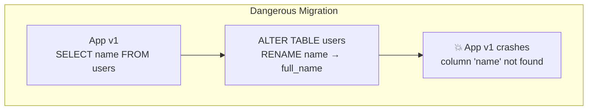
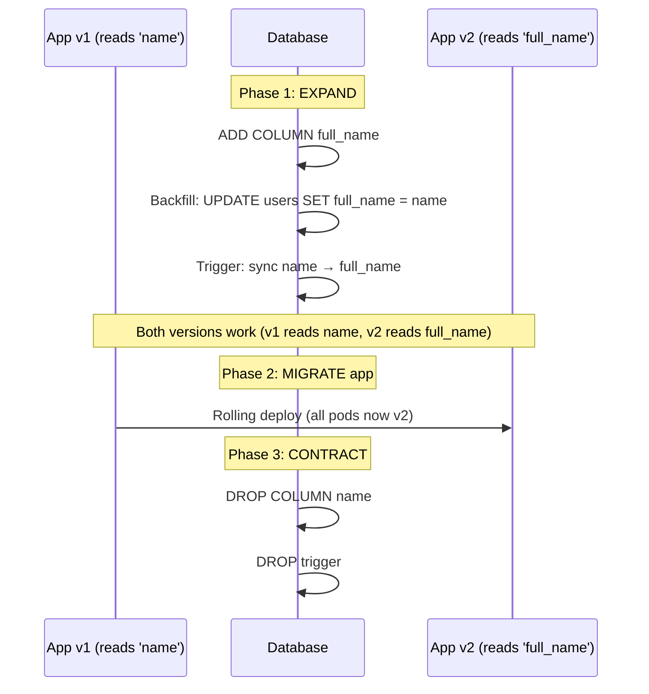
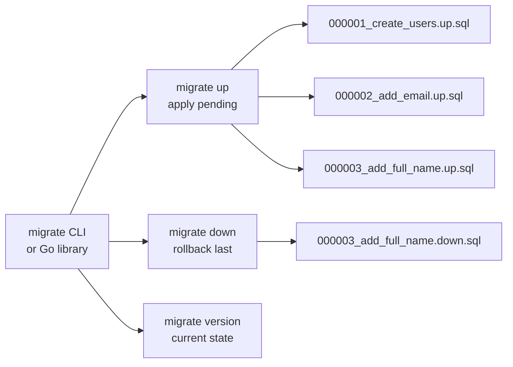
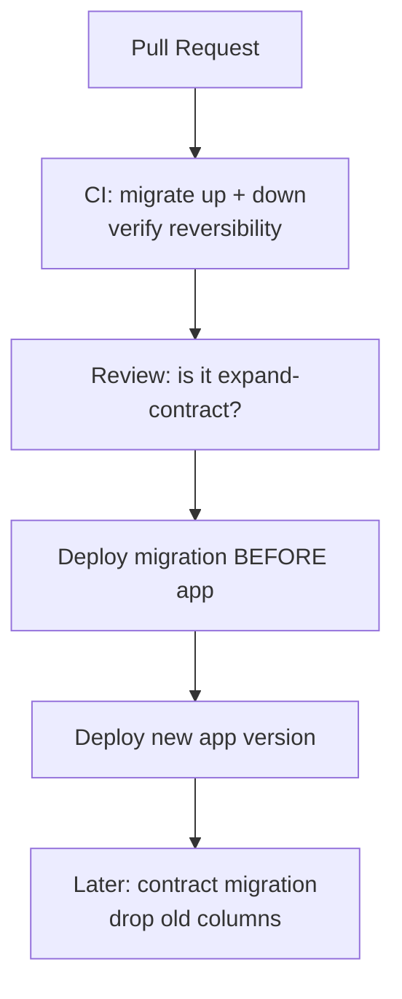

# Zero-Downtime Database Migrations

How to change database schemas without taking your service offline — expand-contract pattern, golang-migrate, and safe migration practices.

---

## The Problem



During a rolling deployment, **both old and new app versions run simultaneously**. The schema must be compatible with both.

---

## Expand-Contract Pattern



### Safe Migration Steps

| Step | Migration | App Change | Risk |
|------|-----------|-----------|------|
| 1. Expand | `ADD COLUMN full_name` | None | Zero (additive) |
| 2. Backfill | `UPDATE SET full_name = name WHERE full_name IS NULL` | None | Lock risk on large tables |
| 3. Dual-write | None | Write to both columns | None |
| 4. Deploy | None | Read from `full_name` | None |
| 5. Contract | `DROP COLUMN name` | None | Irreversible |

---

## golang-migrate



### File Structure

```
migrations/
├── 000001_create_users.up.sql
├── 000001_create_users.down.sql
├── 000002_add_email.up.sql
├── 000002_add_email.down.sql
├── 000003_expand_full_name.up.sql
└── 000003_expand_full_name.down.sql
```

### Example Migrations

```sql
-- 000001_create_users.up.sql
CREATE TABLE users (
    id UUID PRIMARY KEY DEFAULT gen_random_uuid(),
    name TEXT NOT NULL,
    created_at TIMESTAMPTZ DEFAULT now()
);
CREATE INDEX idx_users_name ON users(name);

-- 000001_create_users.down.sql
DROP TABLE users;
```

```sql
-- 000003_expand_full_name.up.sql (EXPAND phase)
ALTER TABLE users ADD COLUMN full_name TEXT;
-- Backfill in batches to avoid long locks
UPDATE users SET full_name = name WHERE full_name IS NULL;

-- 000003_expand_full_name.down.sql
ALTER TABLE users DROP COLUMN full_name;
```

### Go Integration

```go
import (
    "github.com/golang-migrate/migrate/v4"
    _ "github.com/golang-migrate/migrate/v4/database/postgres"
    _ "github.com/golang-migrate/migrate/v4/source/file"
)

func RunMigrations(dbURL string) error {
    m, err := migrate.New("file://migrations", dbURL)
    if err != nil {
        return err
    }
    if err := m.Up(); err != nil && err != migrate.ErrNoChange {
        return err
    }
    return nil
}
```

---

## Dangerous Operations & Safe Alternatives

| Dangerous | Safe Alternative |
|-----------|-----------------|
| `ALTER TABLE ... RENAME COLUMN` | Add new column → backfill → drop old |
| `ALTER TABLE ... ALTER TYPE` | Add new column with new type → migrate data |
| `DROP COLUMN` (while old app runs) | Only after all app instances use new column |
| `CREATE INDEX` (locks table) | `CREATE INDEX CONCURRENTLY` (Postgres) |
| `NOT NULL` on existing column | Add with DEFAULT, backfill NULLs, then add constraint |

### Large Table Backfill Pattern

```go
// Batch backfill to avoid locking entire table
func backfillFullName(ctx context.Context, db *sql.DB) error {
    for {
        result, err := db.ExecContext(ctx, `
            UPDATE users SET full_name = name
            WHERE full_name IS NULL
            LIMIT 1000
        `)
        if err != nil {
            return err
        }
        rows, _ := result.RowsAffected()
        if rows == 0 {
            return nil // done
        }
        time.Sleep(100 * time.Millisecond) // throttle
    }
}
```

---

## Migration in CI/CD



**Rule**: Migrations deploy **before** the app. The new schema must be backward-compatible with the currently running app version.
