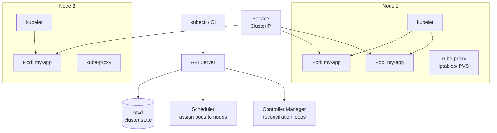
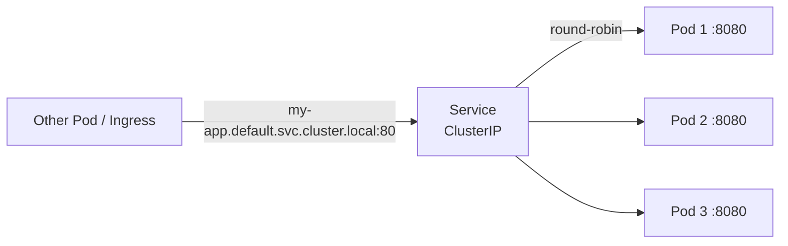
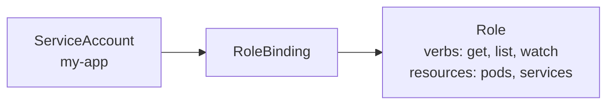

# Kubernetes Core Concepts

Pods, Services, Deployments, ConfigMaps, Secrets, RBAC, NetworkPolicies — the essentials for deploying Go services.

---

## Architecture



---

## Core Resources

### Pod (smallest deployable unit)

```yaml
apiVersion: v1
kind: Pod
metadata:
  name: my-app
  labels:
    app: my-app
spec:
  containers:
    - name: app
      image: ghcr.io/org/my-app:v1.0.0
      ports:
        - containerPort: 8080
      resources:
        requests: { cpu: "100m", memory: "64Mi" }
        limits:   { cpu: "500m", memory: "128Mi" }
      livenessProbe:
        httpGet: { path: /healthz, port: 8080 }
        initialDelaySeconds: 10
      readinessProbe:
        httpGet: { path: /readyz, port: 8080 }
        initialDelaySeconds: 5
```

### Deployment (manages ReplicaSets)

```yaml
apiVersion: apps/v1
kind: Deployment
metadata:
  name: my-app
spec:
  replicas: 3
  strategy:
    type: RollingUpdate
    rollingUpdate:
      maxSurge: 1
      maxUnavailable: 0
  selector:
    matchLabels: { app: my-app }
  template:
    metadata:
      labels: { app: my-app }
    spec:
      containers:
        - name: app
          image: ghcr.io/org/my-app:v1.0.0
          envFrom:
            - configMapRef: { name: my-app-config }
            - secretRef: { name: my-app-secrets }
```

### Service (stable network endpoint)



```yaml
apiVersion: v1
kind: Service
metadata:
  name: my-app
spec:
  selector: { app: my-app }
  ports:
    - port: 80
      targetPort: 8080
  type: ClusterIP  # internal only (use Ingress for external)
```

| Service Type | Access | Use Case |
|-------------|--------|----------|
| ClusterIP | Internal only | Service-to-service |
| NodePort | Node IP:port | Dev/testing |
| LoadBalancer | Cloud LB → pods | External traffic |

### ConfigMap & Secret

```yaml
apiVersion: v1
kind: ConfigMap
metadata:
  name: my-app-config
data:
  LOG_LEVEL: "info"
  PORT: "8080"
---
apiVersion: v1
kind: Secret
metadata:
  name: my-app-secrets
type: Opaque
stringData:
  DATABASE_URL: "postgres://user:pass@db:5432/mydb"
```

---

## RBAC (Role-Based Access Control)



```yaml
apiVersion: v1
kind: ServiceAccount
metadata:
  name: my-app
---
apiVersion: rbac.authorization.k8s.io/v1
kind: Role
metadata:
  name: pod-reader
rules:
  - apiGroups: [""]
    resources: ["pods"]
    verbs: ["get", "list", "watch"]
---
apiVersion: rbac.authorization.k8s.io/v1
kind: RoleBinding
metadata:
  name: my-app-pod-reader
subjects:
  - kind: ServiceAccount
    name: my-app
roleRef:
  kind: Role
  name: pod-reader
  apiGroup: rbac.authorization.k8s.io
```

---

## NetworkPolicy (Pod Firewall)

```yaml
# Only allow traffic from pods with label app=frontend
apiVersion: networking.k8s.io/v1
kind: NetworkPolicy
metadata:
  name: allow-frontend-only
spec:
  podSelector:
    matchLabels: { app: my-app }
  ingress:
    - from:
        - podSelector:
            matchLabels: { app: frontend }
      ports:
        - port: 8080
```

---

## HPA (Horizontal Pod Autoscaler)

```yaml
apiVersion: autoscaling/v2
kind: HorizontalPodAutoscaler
metadata:
  name: my-app
spec:
  scaleTargetRef:
    apiVersion: apps/v1
    kind: Deployment
    name: my-app
  minReplicas: 2
  maxReplicas: 20
  metrics:
    - type: Resource
      resource:
        name: cpu
        target:
          type: Utilization
          averageUtilization: 70
```

---

## Essential kubectl Commands

```bash
kubectl get pods -l app=my-app          # list pods
kubectl describe pod <name>             # detailed status
kubectl logs <pod> -f --tail=100        # stream logs
kubectl exec -it <pod> -- sh            # shell into pod
kubectl rollout status deploy/my-app    # watch rollout
kubectl rollout undo deploy/my-app      # rollback
kubectl top pods                        # resource usage
kubectl port-forward svc/my-app 8080:80 # local access
```
