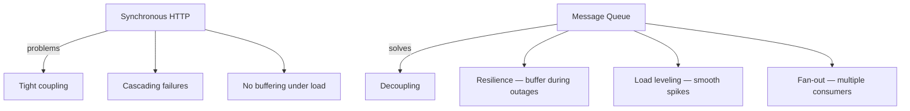
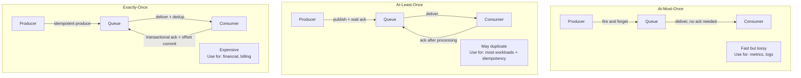
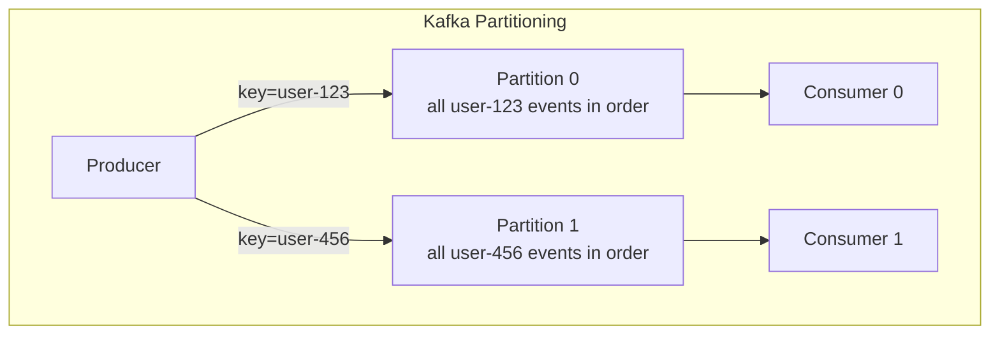
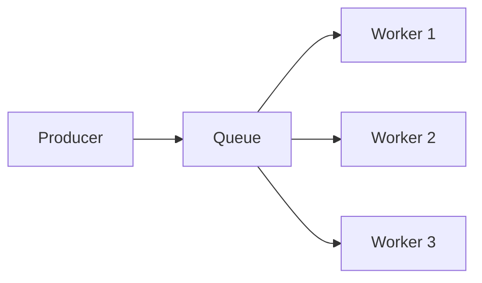
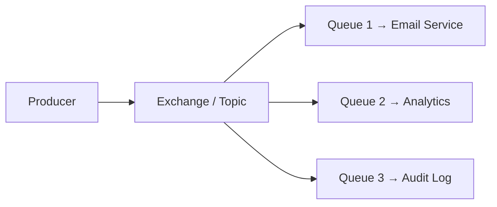
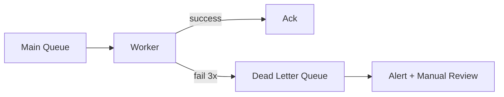

# Message Queue Patterns

Comparing Kafka, NATS, SQS, and RabbitMQ — ordering guarantees, delivery semantics, and when to use each.

---

## When to Use a Message Queue



---

## Comparison Matrix

| Feature | Kafka | RabbitMQ | NATS JetStream | AWS SQS |
|---------|-------|----------|----------------|---------|
| Model | Log (append-only) | Queue (AMQP) | Stream (subjects) | Queue (managed) |
| Ordering | Per-partition | Per-queue | Per-stream | Best-effort (FIFO available) |
| Delivery | At-least-once | At-least-once | At-least-once / exactly-once | At-least-once |
| Retention | Time/size-based | Until consumed | Time/size-based | 4 days (configurable) |
| Throughput | Millions/sec | 10K-100K/sec | 100K-1M/sec | ~3000/sec (batched) |
| Replay | Yes (offset seek) | No | Yes (consumer start position) | No |
| Ops complexity | High (ZooKeeper/KRaft) | Medium | Low (embedded) | Zero (managed) |
| Best for | Event streaming, logs | Task queues, RPC | Microservice messaging | Serverless, AWS-native |

---

## Delivery Semantics



### Achieving Exactly-Once in Practice

True exactly-once is expensive. The practical approach:

```
At-least-once delivery + Idempotent consumer = Effectively exactly-once
```

```go
func processMessage(ctx context.Context, msg Message) error {
    // Idempotency check
    processed, _ := redis.SetNX(ctx, "processed:"+msg.ID, "1", 24*time.Hour).Result()
    if !processed {
        return nil // already handled — skip
    }

    // Process
    if err := handleEvent(ctx, msg); err != nil {
        redis.Del(ctx, "processed:"+msg.ID) // allow retry
        return err
    }
    return nil
}
```

---

## Ordering Guarantees



| System | Ordering guarantee |
|--------|-------------------|
| Kafka | Per-partition (use partition key) |
| RabbitMQ | Per-queue (single consumer) |
| NATS JetStream | Per-stream/subject |
| SQS Standard | No ordering |
| SQS FIFO | Per-message-group-id |

**Rule**: If you need ordering, route related messages to the same partition/queue using a consistent key.

---

## Patterns

### Competing Consumers (Work Queue)



Each message processed by exactly one worker. Scale workers independently.

### Fan-Out (Pub/Sub)



Each message delivered to ALL subscribers.

### Dead Letter Queue (DLQ)



```go
func consume(msg amqp.Delivery) {
    retries := getRetryCount(msg)
    if retries >= 3 {
        msg.Nack(false, false) // send to DLQ (no requeue)
        return
    }
    if err := process(msg); err != nil {
        msg.Nack(false, true) // requeue for retry
        return
    }
    msg.Ack(false)
}
```

### Poison Pill Handling

A message that always fails (malformed, triggers bug) will block the queue forever without DLQ.

```go
// Always set max retries + DLQ
// Never: infinite requeue without a limit
```

---

## Backpressure in Queues

```go
// RabbitMQ: prefetch limits in-flight messages
channel.Qos(
    10,    // prefetch count — max unacked messages per consumer
    0,     // prefetch size (0 = no limit)
    false, // per-consumer (not per-channel)
)

// Kafka: consumer.Poll() with max.poll.records
// NATS: MaxAckPending in consumer config
// SQS: MaxNumberOfMessages (1-10) + VisibilityTimeout
```

---

## When to Use What

| Scenario | Recommendation |
|----------|---------------|
| Event streaming / replay needed | Kafka or NATS JetStream |
| Simple task queue | RabbitMQ or SQS |
| Microservice request/reply | NATS (core) |
| AWS-native, zero ops | SQS + SNS |
| High throughput + low latency | Kafka or NATS |
| Complex routing (headers, topics) | RabbitMQ |
| Exactly-once financial events | Kafka transactions + idempotent consumer |
