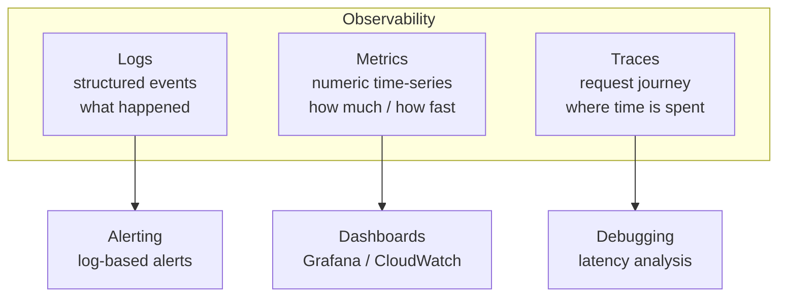
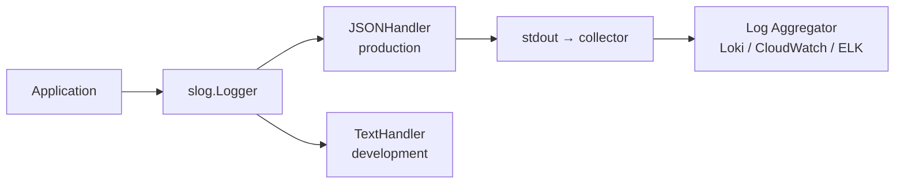
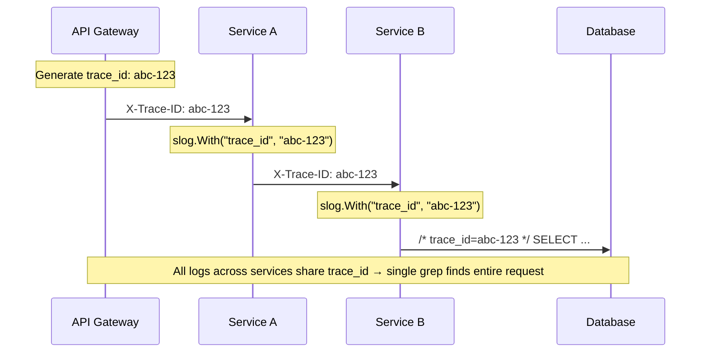

# Observability Guide

Structured logging with `log/slog`, trace ID propagation, and the three pillars of observability in Go services.

---

## Three Pillars



---

## Structured Logging with slog (Go 1.21+)



### Why Structured Logging?

```go
// BAD: unstructured — impossible to query at scale
log.Printf("user %s failed login from %s", userID, ip)

// GOOD: structured — every field is queryable
slog.Warn("login failed",
    "user_id", userID,
    "ip", ip,
    "attempt", attempt,
    "trace_id", traceID,
)
// Output: {"time":"...","level":"WARN","msg":"login failed","user_id":"u123","ip":"1.2.3.4","attempt":3,"trace_id":"abc-def"}
```

### Production Logger Setup

```go
func NewLogger(env string) *slog.Logger {
    var handler slog.Handler
    opts := &slog.HandlerOptions{
        Level: slog.LevelInfo,
        AddSource: true, // file:line in logs
    }
    
    switch env {
    case "production":
        handler = slog.NewJSONHandler(os.Stdout, opts)
    default:
        handler = slog.NewTextHandler(os.Stdout, opts)
    }
    
    return slog.New(handler)
}
```

---

## Trace ID Propagation



### Middleware Pattern

```go
func TraceMiddleware(next http.Handler) http.Handler {
    return http.HandlerFunc(func(w http.ResponseWriter, r *http.Request) {
        traceID := r.Header.Get("X-Trace-ID")
        if traceID == "" {
            traceID = uuid.NewString()
        }
        
        // Inject into context
        ctx := context.WithValue(r.Context(), traceIDKey, traceID)
        
        // Add to response header for client correlation
        w.Header().Set("X-Trace-ID", traceID)
        
        next.ServeHTTP(w, r.WithContext(ctx))
    })
}

// Extract in any handler/service
func TraceIDFrom(ctx context.Context) string {
    if id, ok := ctx.Value(traceIDKey).(string); ok {
        return id
    }
    return "unknown"
}
```

### Context-Aware Logger

```go
// Logger that automatically includes trace_id from context
func LoggerFrom(ctx context.Context) *slog.Logger {
    return slog.Default().With("trace_id", TraceIDFrom(ctx))
}

// Usage in any handler:
func handleOrder(ctx context.Context, orderID string) {
    log := LoggerFrom(ctx)
    log.Info("processing order", "order_id", orderID)
    // {"level":"INFO","msg":"processing order","trace_id":"abc-123","order_id":"ORD-42"}
}
```

---

## Metrics with Prometheus

```go
var (
    httpRequestsTotal = prometheus.NewCounterVec(
        prometheus.CounterOpts{
            Name: "http_requests_total",
            Help: "Total HTTP requests",
        },
        []string{"method", "path", "status"},
    )
    
    httpRequestDuration = prometheus.NewHistogramVec(
        prometheus.HistogramOpts{
            Name:    "http_request_duration_seconds",
            Help:    "HTTP request latency",
            Buckets: prometheus.DefBuckets,
        },
        []string{"method", "path"},
    )
)

func MetricsMiddleware(next http.Handler) http.Handler {
    return http.HandlerFunc(func(w http.ResponseWriter, r *http.Request) {
        start := time.Now()
        rw := &responseWriter{ResponseWriter: w, status: 200}
        
        next.ServeHTTP(rw, r)
        
        duration := time.Since(start).Seconds()
        httpRequestsTotal.WithLabelValues(r.Method, r.URL.Path, strconv.Itoa(rw.status)).Inc()
        httpRequestDuration.WithLabelValues(r.Method, r.URL.Path).Observe(duration)
    })
}
```

---

## Log Levels Strategy

| Level | When to use | Example |
|-------|-------------|---------|
| `DEBUG` | Development only, verbose | SQL queries, cache hits |
| `INFO` | Normal operations | Request started, job completed |
| `WARN` | Degraded but functional | Retry succeeded, cache miss |
| `ERROR` | Failure requiring attention | DB connection lost, payment failed |

**Rule**: If you'd wake someone up for it → ERROR. If it self-heals → WARN.

---

## Running

```bash
go run .
# Starts HTTP server with trace middleware + structured logging
# curl http://localhost:8080/orders/123
# Check logs for trace_id propagation
```
