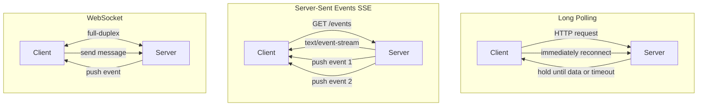
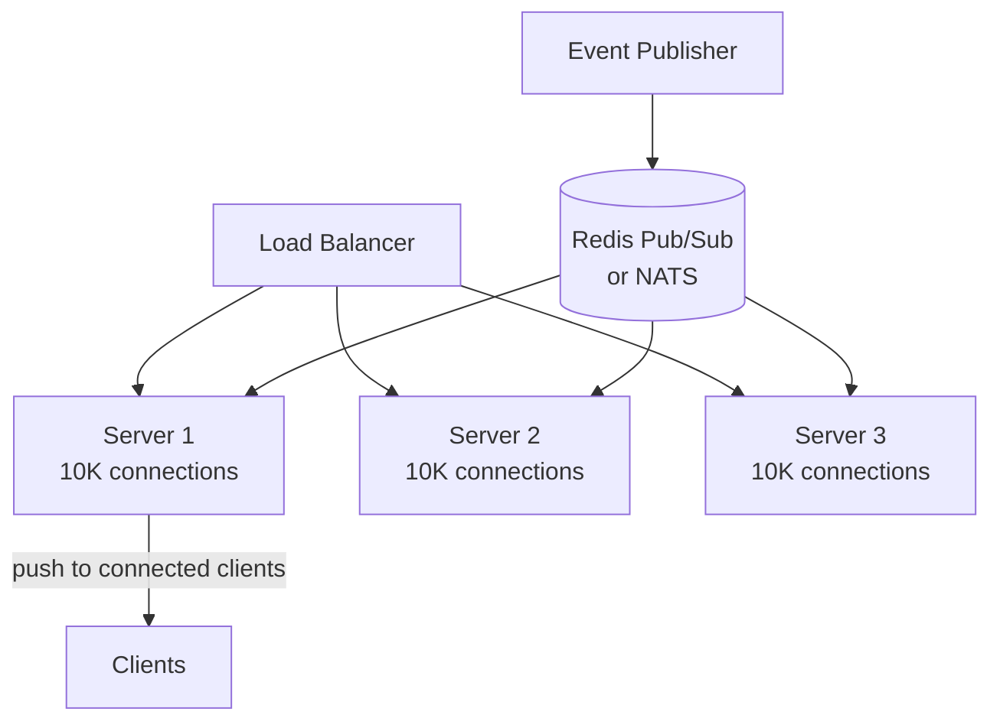
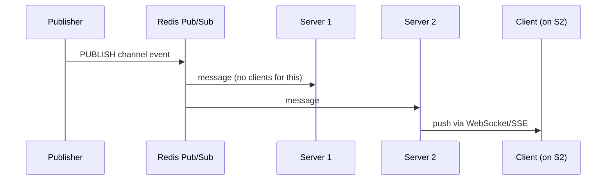

# Real-Time Communication: WebSocket vs SSE vs Long Polling

Choosing the right protocol for server-to-client push in Go services.

---

## Comparison



---

## Decision Matrix

| Feature | Long Polling | SSE | WebSocket |
|---------|-------------|-----|-----------|
| Direction | Server → Client | Server → Client | Bidirectional |
| Protocol | HTTP/1.1 | HTTP/1.1 or HTTP/2 | WS (upgrade from HTTP) |
| Connection | New per response | Persistent | Persistent |
| Browser support | Universal | All modern (no IE) | All modern |
| Auto-reconnect | Manual | Built-in (`EventSource`) | Manual |
| Binary data | No | No (text only) | Yes |
| Through proxies/LBs | Easy | Easy | Can be tricky |
| Scalability | Poor (connection churn) | Good | Good |
| Complexity | Low | Low | Medium |

---

## When to Use What

| Use Case | Best Choice | Why |
|----------|-------------|-----|
| Live notifications | SSE | Server push only, auto-reconnect |
| Chat / multiplayer | WebSocket | Bidirectional, low latency |
| Live dashboard | SSE | One-way data stream |
| File upload progress | WebSocket | Client sends data + server pushes progress |
| Stock ticker | SSE or WebSocket | Depends on whether client sends orders |
| Legacy browser support | Long Polling | Works everywhere |
| Simple event feed | SSE | Simplest to implement |

---

## Go Implementations

### SSE (Server-Sent Events)

```go
func sseHandler(w http.ResponseWriter, r *http.Request) {
    w.Header().Set("Content-Type", "text/event-stream")
    w.Header().Set("Cache-Control", "no-cache")
    w.Header().Set("Connection", "keep-alive")

    flusher, ok := w.(http.Flusher)
    if !ok {
        http.Error(w, "streaming not supported", 500)
        return
    }

    ticker := time.NewTicker(2 * time.Second)
    defer ticker.Stop()

    for {
        select {
        case <-r.Context().Done():
            return
        case t := <-ticker.C:
            fmt.Fprintf(w, "event: tick\ndata: %s\n\n", t.Format(time.RFC3339))
            flusher.Flush()
        }
    }
}
```

**Client (JavaScript):**
```javascript
const es = new EventSource("/events");
es.addEventListener("tick", (e) => console.log(e.data));
// Auto-reconnects on disconnect!
```

### WebSocket

```go
func wsHandler(w http.ResponseWriter, r *http.Request) {
    conn, _ := upgrader.Upgrade(w, r, nil)
    defer conn.Close()

    for {
        msgType, msg, err := conn.ReadMessage()
        if err != nil {
            return
        }
        // Echo back (bidirectional)
        conn.WriteMessage(msgType, msg)
    }
}
```

### Long Polling

```go
func longPollHandler(w http.ResponseWriter, r *http.Request) {
    ctx, cancel := context.WithTimeout(r.Context(), 30*time.Second)
    defer cancel()

    select {
    case event := <-eventChannel:
        json.NewEncoder(w).Encode(event)
    case <-ctx.Done():
        w.WriteHeader(http.StatusNoContent) // timeout, client should retry
    }
}
```

---

## Scaling Considerations





**Problem**: Client connects to Server 1, but event is published on Server 2.
**Solution**: Use Redis Pub/Sub or NATS to fan-out events to all servers.

| Concern | Solution |
|---------|----------|
| Sticky sessions | Not needed with pub/sub fan-out |
| Connection limits | ~50K per Go process (tune `ulimit`) |
| Load balancer timeout | Set idle timeout > heartbeat interval |
| Reconnection storms | Jittered exponential backoff |
