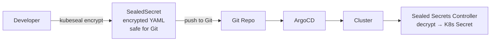
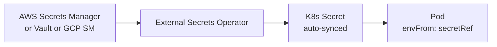
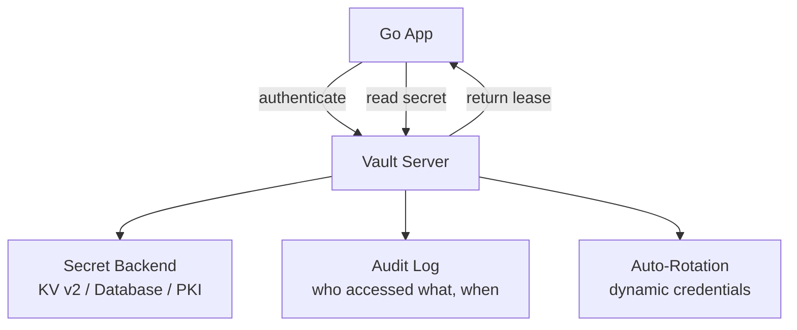

# Secrets Management

HashiCorp Vault, AWS Secrets Manager, sealed-secrets, and External Secrets Operator for Go services.

---

## The Problem

```mermaid
graph TD
    subgraph Bad Practices ❌
        ENV[.env file in Git]
        HARD[Hardcoded in code]
        CM[Plain ConfigMap in K8s]
    end
    
    subgraph Good Practices ✅
        VAULT[HashiCorp Vault]
        ASM[AWS Secrets Manager]
        SS[Sealed Secrets]
        ESO[External Secrets Operator]
    end
    
    BAD[Secrets exposed\nin logs, Git history, backups] --> ENV
    GOOD[Encrypted at rest\naudited access\nrotatable] --> VAULT
```

---

## Solutions Comparison

| Solution | Where secrets live | K8s native? | Rotation | Complexity |
|----------|-------------------|-------------|----------|-----------|
| K8s Secrets (base64) | etcd (not encrypted by default) | Yes | Manual | Low |
| Sealed Secrets | Git (encrypted) | Yes | Manual | Low |
| External Secrets Operator | External store → K8s Secret | Yes | Automatic | Medium |
| HashiCorp Vault | Vault server | Via sidecar/CSI | Automatic | High |
| AWS Secrets Manager | AWS | Via ESO or SDK | Automatic | Medium |

---

## Sealed Secrets (Bitnami)



```bash
# Encrypt a secret (only the cluster can decrypt)
echo -n "my-db-password" | kubeseal --raw --scope strict \
    --name my-app-secrets --namespace production

# Create sealed secret YAML
kubeseal --format yaml < secret.yaml > sealed-secret.yaml
# sealed-secret.yaml is safe to commit to Git
```

---

## External Secrets Operator (ESO)



```yaml
apiVersion: external-secrets.io/v1beta1
kind: ExternalSecret
metadata:
  name: my-app-secrets
spec:
  refreshInterval: 1h  # auto-rotation
  secretStoreRef:
    name: aws-secrets-manager
    kind: ClusterSecretStore
  target:
    name: my-app-secrets  # K8s Secret name
  data:
    - secretKey: DATABASE_URL
      remoteRef:
        key: production/my-app/database-url
    - secretKey: API_KEY
      remoteRef:
        key: production/my-app/api-key
```

---

## HashiCorp Vault



### Go Integration

```go
import vault "github.com/hashicorp/vault/api"

func getSecret(path string) (string, error) {
    client, _ := vault.NewClient(vault.DefaultConfig())
    // Authenticate (K8s service account, AppRole, etc.)
    
    secret, err := client.Logical().Read("secret/data/" + path)
    if err != nil {
        return "", err
    }
    data := secret.Data["data"].(map[string]interface{})
    return data["value"].(string), nil
}
```

### Dynamic Database Credentials

```go
// Vault generates short-lived DB credentials on demand
secret, _ := client.Logical().Read("database/creds/my-app-role")
username := secret.Data["username"].(string)
password := secret.Data["password"].(string)
// Credentials auto-expire after lease TTL
// No long-lived passwords!
```

---

## Best Practices

| Practice | Why |
|----------|-----|
| Never commit secrets to Git | Even after deletion, they're in history |
| Encrypt K8s Secrets at rest | Enable `EncryptionConfiguration` in API server |
| Use short-lived credentials | Vault dynamic secrets, AWS STS |
| Audit all access | Vault audit log, CloudTrail |
| Rotate on compromise | Automated rotation reduces blast radius |
| Least privilege | Each service gets only its own secrets |
| Inject via env or volume | Never bake into container image |

---

## Go Pattern: Config with Secrets

```go
type Config struct {
    Port        string // from ConfigMap / env
    DatabaseURL string // from Secret / Vault
    APIKey      string // from Secret / Vault
}

func LoadConfig() (*Config, error) {
    cfg := &Config{
        Port:        getEnv("PORT", "8080"),
        DatabaseURL: os.Getenv("DATABASE_URL"), // injected by K8s Secret
        APIKey:      os.Getenv("API_KEY"),
    }
    
    // Or: fetch from Vault at startup
    if vaultAddr := os.Getenv("VAULT_ADDR"); vaultAddr != "" {
        cfg.DatabaseURL, _ = getVaultSecret("my-app/database-url")
    }
    
    return cfg, nil
}
```
