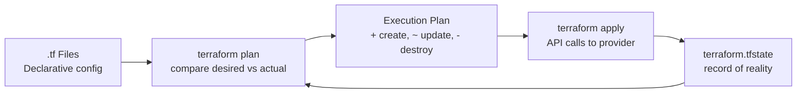

# Terraform Basics

Module structure, state management, workspaces, and patterns for managing infrastructure as code.

---

## How Terraform Works



---

## Module Structure

```
infrastructure/
├── modules/                    # Reusable modules
│   ├── vpc/
│   │   ├── main.tf
│   │   ├── variables.tf
│   │   └── outputs.tf
│   ├── ecs-service/
│   │   ├── main.tf
│   │   ├── variables.tf
│   │   └── outputs.tf
│   └── rds/
│       ├── main.tf
│       ├── variables.tf
│       └── outputs.tf
├── environments/               # Environment-specific configs
│   ├── dev/
│   │   ├── main.tf            # calls modules with dev values
│   │   ├── terraform.tfvars
│   │   └── backend.tf
│   ├── staging/
│   └── production/
├── .terraform.lock.hcl         # provider version lock
└── README.md
```

---

## Core Concepts

### Resources

```hcl
resource "aws_instance" "web" {
  ami           = "ami-0c55b159cbfafe1f0"
  instance_type = "t3.micro"

  tags = {
    Name        = "web-server"
    Environment = var.environment
  }
}
```

### Variables

```hcl
# variables.tf
variable "environment" {
  type        = string
  description = "Deployment environment"
  validation {
    condition     = contains(["dev", "staging", "production"], var.environment)
    error_message = "Must be dev, staging, or production."
  }
}

variable "instance_count" {
  type    = number
  default = 2
}
```

### Outputs

```hcl
output "instance_ip" {
  value       = aws_instance.web.public_ip
  description = "Public IP of the web server"
}
```

### Modules

```hcl
# environments/production/main.tf
module "vpc" {
  source = "../../modules/vpc"

  cidr_block  = "10.0.0.0/16"
  environment = "production"
}

module "api" {
  source = "../../modules/ecs-service"

  cluster_id    = module.vpc.ecs_cluster_id
  image         = "ghcr.io/org/api:v1.2.3"
  cpu           = 512
  memory        = 1024
  desired_count = 3
}
```

---

## State Management

```mermaid
graph TD
    subgraph Local State ⚠️
        LOCAL[terraform.tfstate\non disk\nno locking\nno sharing]
    end
    
    subgraph Remote State ✅
        S3[(S3 Bucket\nencrypted\nversioned)] --> LOCK[DynamoDB\nstate locking]
    end
```

### Remote Backend (S3 + DynamoDB)

```hcl
# backend.tf
terraform {
  backend "s3" {
    bucket         = "myorg-terraform-state"
    key            = "production/api/terraform.tfstate"
    region         = "us-east-1"
    encrypt        = true
    dynamodb_table = "terraform-locks"
  }
}
```

**Rules:**
- Never commit `terraform.tfstate` to git
- Always use remote state in teams
- Enable versioning on S3 bucket (rollback)
- DynamoDB table prevents concurrent applies

---

## Workspaces

```bash
terraform workspace new staging
terraform workspace new production
terraform workspace select production
terraform workspace list
```

```hcl
# Use workspace name in config
resource "aws_instance" "web" {
  instance_type = terraform.workspace == "production" ? "t3.large" : "t3.micro"
  
  tags = {
    Environment = terraform.workspace
  }
}
```

**When to use workspaces vs directories:**
- Workspaces: same config, different state (dev/staging/prod with minor differences)
- Directories: different configs per environment (recommended for large differences)

---

## Lifecycle Rules

```hcl
resource "aws_instance" "web" {
  # ...

  lifecycle {
    create_before_destroy = true  # zero-downtime replacement
    prevent_destroy       = true  # safety net for databases
    ignore_changes        = [tags] # don't drift on auto-applied tags
  }
}
```

---

## Data Sources (Read Existing Resources)

```hcl
# Look up existing VPC (not managed by this config)
data "aws_vpc" "main" {
  filter {
    name   = "tag:Name"
    values = ["main-vpc"]
  }
}

resource "aws_subnet" "app" {
  vpc_id = data.aws_vpc.main.id
  # ...
}
```

---

## Common Patterns

### Deploying a Go Service to ECS

```hcl
module "api_service" {
  source = "./modules/ecs-service"

  name          = "my-go-api"
  image         = "ghcr.io/org/api:${var.image_tag}"
  port          = 8080
  cpu           = 256
  memory        = 512
  desired_count = var.environment == "production" ? 3 : 1

  environment_variables = {
    DATABASE_URL = module.rds.connection_string
    REDIS_URL    = module.redis.endpoint
    LOG_LEVEL    = "info"
  }

  health_check_path = "/healthz"
}
```

---

## Best Practices

| Practice | Why |
|----------|-----|
| Pin provider versions | Reproducible builds |
| Use modules for reuse | DRY, tested patterns |
| Remote state + locking | Team collaboration |
| `terraform plan` in CI | Catch drift before apply |
| Tag everything | Cost allocation, ownership |
| Small blast radius | One service per state file |
| `terraform fmt` | Consistent formatting |
