# Projects

Standalone mini-projects — each is a separate Go module with its own `README.md`, `docs/`, and `Makefile`.

---

## Learning Path

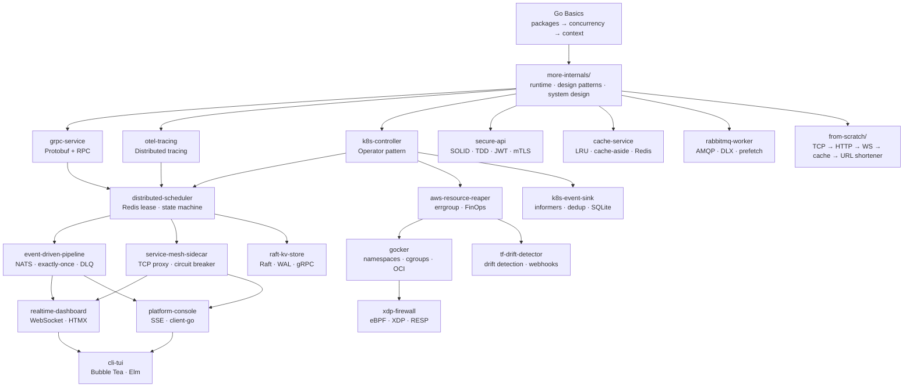

---

## Project Index

| # | Project | What you build | Key concepts |
|---|---------|---------------|--------------|
| 1 | [`grpc-service`](./grpc-service/) | gRPC server + client | Protobuf, unary RPC, server streaming |
| 2 | [`otel-tracing`](./otel-tracing/) | Distributed tracing across 2 HTTP services | OpenTelemetry, trace propagation, spans |
| 3 | [`k8s-controller`](./k8s-controller/) | Kubernetes operator (CRD + controller) | controller-runtime, reconciliation loop, CRDs |
| 4 | [`distributed-scheduler`](./distributed-scheduler/) | Production distributed job scheduler | Redis lease, concurrency manager, Bleve search, state machine |
| 5 | [`event-driven-pipeline`](./event-driven-pipeline/) | Event processing pipeline | NATS JetStream, exactly-once, circuit breaker, DLQ |
| 6 | [`service-mesh-sidecar`](./service-mesh-sidecar/) | TCP proxy sidecar | Connection pooling, token bucket, circuit breaking, Prometheus |
| 7 | [`realtime-dashboard`](./realtime-dashboard/) | Live ops dashboard | HTMX, WebSocket, html/template, server-rendered UI |
| 8 | [`platform-console`](./platform-console/) | K8s resource browser | html/template, Tailwind, SSE, client-go dynamic client |
| 9 | [`cli-tui`](./cli-tui/) | Terminal dashboard | Bubble Tea, lipgloss, Elm architecture, TUI |
| 10 | [`aws-resource-reaper`](./aws-resource-reaper/) | Concurrent FinOps CLI | AWS SDK v2, STS AssumeRole, errgroup + semaphore, log/slog |
| 11 | [`gocker`](./gocker/) | Mini container runtime | Linux namespaces, OverlayFS, cgroups v1/v2, OCI pull, chroot |
| 12 | [`tf-drift-detector`](./tf-drift-detector/) | Terraform drift detection daemon | errgroup, sync.Mutex, time.Ticker, stateful tracker, webhooks |
| 13 | [`raft-kv-store`](./raft-kv-store/) | Distributed KV store via Raft | Leader election, log replication, WAL, gRPC, quorum commit |
| 14 | [`xdp-firewall`](./xdp-firewall/) | Kernel-level XDP packet filter | eBPF LPM trie, XDP_DROP, PERCPU_ARRAY, hexagonal architecture |
| 15 | [`k8s-event-sink`](./k8s-event-sink/) | Kubernetes event vacuum daemon | SharedIndexInformer, leaky bucket dedup, SQLite, Bleve, Slack |
| 16 | [`secure-api`](./secure-api/) | JWT + OAuth2 + mTLS HTTP API | SOLID principles, TDD, immutable value objects, JWT, bcrypt, mTLS |
| 17 | [`cache-service`](./cache-service/) | In-memory + Redis caching layer | LRU eviction, TTL reaper, cache-aside, write-through, singleflight |
| 18 | [`rabbitmq-worker`](./rabbitmq-worker/) | RabbitMQ task worker system | AMQP, durable queues, DLX, prefetch/QoS, manual ack, graceful shutdown |

### From Scratch Series

| # | Project | What you build | Key concepts |
|---|---------|---------------|--------------|
| FS-01 | [`from-scratch/01-tcp-server`](./from-scratch/01-tcp-server/) | Raw TCP echo server | `net.Listener`, goroutine-per-conn, `io.Copy` |
| FS-02 | [`from-scratch/02-http-server`](./from-scratch/02-http-server/) | HTTP/1.1 parser on TCP + stdlib | Request line parsing, routing, response writing |
| FS-03 | [`from-scratch/03-websocket-chat`](./from-scratch/03-websocket-chat/) | Multi-room WebSocket chat | Hub pattern, broadcast, room isolation |
| FS-04 | [`from-scratch/04-rate-limiter`](./from-scratch/04-rate-limiter/) | All 4 rate limiting algorithms | Token bucket, leaky bucket, fixed window, sliding window |
| FS-05 | [`from-scratch/05-load-balancer`](./from-scratch/05-load-balancer/) | L7 reverse proxy | Round-robin, least-connections, health checks |
| FS-06 | [`from-scratch/06-message-queue`](./from-scratch/06-message-queue/) | In-memory pub/sub + TCP server | Broker, topics, fan-out, custom text protocol |
| FS-07 | [`from-scratch/07-distributed-cache`](./from-scratch/07-distributed-cache/) | Redis-compatible KV store | RESP protocol, TTL eviction, `redis-cli` compatible |
| FS-08 | [`from-scratch/08-log-aggregator`](./from-scratch/08-log-aggregator/) | Log tail → ship → aggregate → query | File tailer, TCP shipper, in-memory store, HTTP search |
| FS-09 | [`from-scratch/09-task-scheduler`](./from-scratch/09-task-scheduler/) | Cron-like task scheduler | Cron parser, tick loop, HTTP API |
| FS-10 | [`from-scratch/10-url-shortener`](./from-scratch/10-url-shortener/) | URL shortener (capstone) | Integrates FS-04 + FS-07 + FS-06 + FS-09 |

---

## Project Architectures

### 1. grpc-service

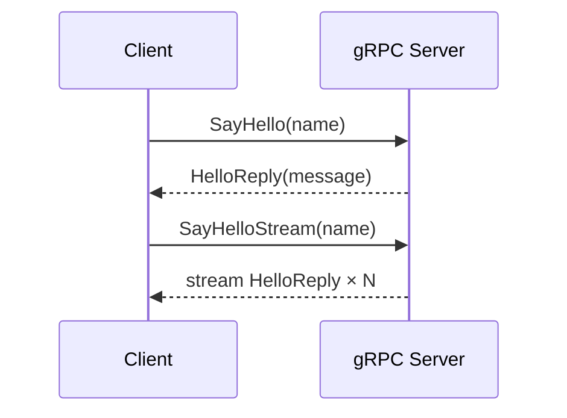

Protobuf-defined service with unary and server-streaming RPCs. The client demonstrates both call patterns.

---

### 2. otel-tracing

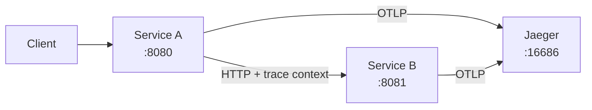

Two HTTP services propagate trace context via W3C `traceparent` headers. Both export spans to Jaeger via OTLP.

---

### 3. k8s-controller

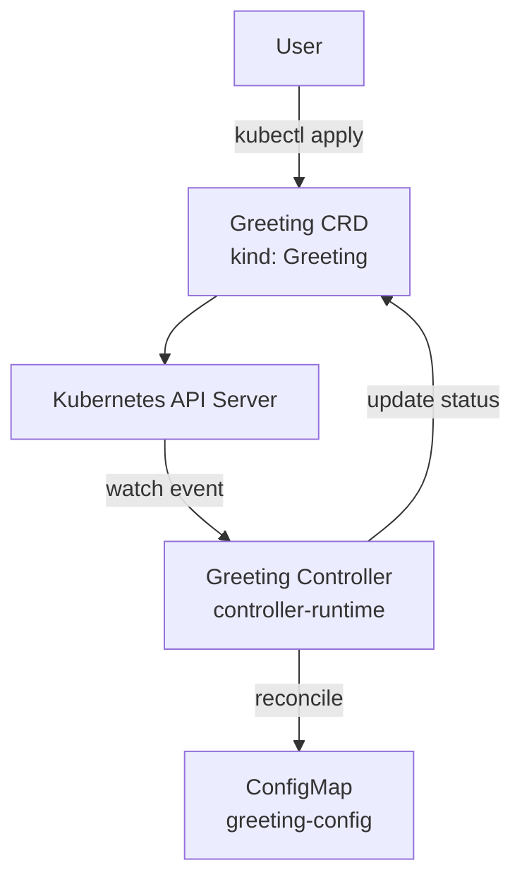

Custom Resource Definition + controller that reconciles `Greeting` objects into ConfigMaps. Demonstrates the operator pattern with controller-runtime.

---

### 4. distributed-scheduler

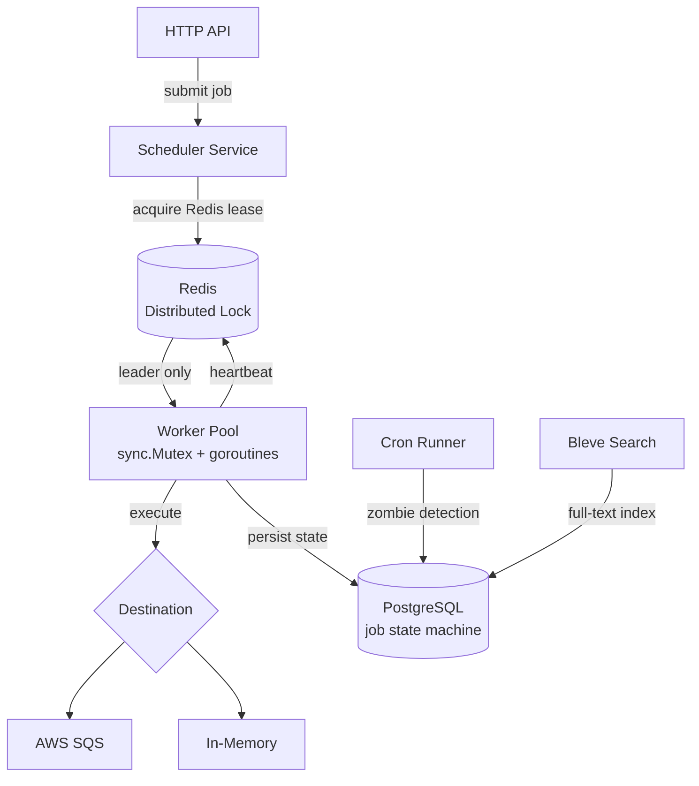

Production-grade job scheduler with Redis-based leader election, state machine (Pending → Running → Done/Failed), zombie detection, and full-text search.

---

### 5. event-driven-pipeline

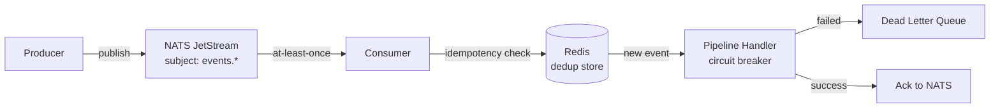

Event processing pipeline with NATS JetStream for durable messaging, Redis-based idempotency (exactly-once semantics), circuit breaker, and DLQ for failed events.

---

### 6. service-mesh-sidecar

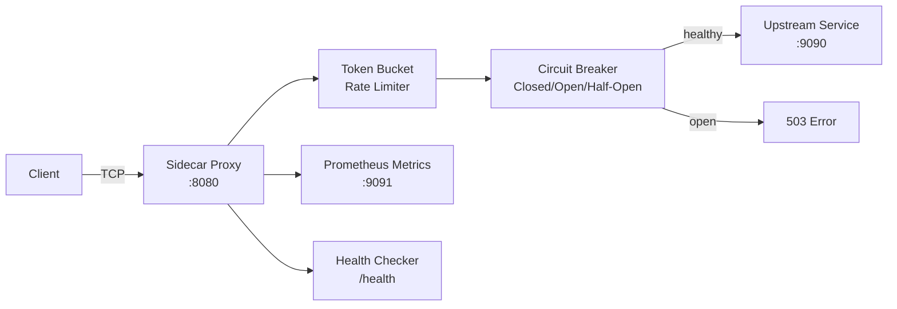

TCP reverse proxy sidecar with token bucket rate limiting, circuit breaker (3 states), connection pooling, Prometheus metrics, and health checks.

---

### 7. realtime-dashboard

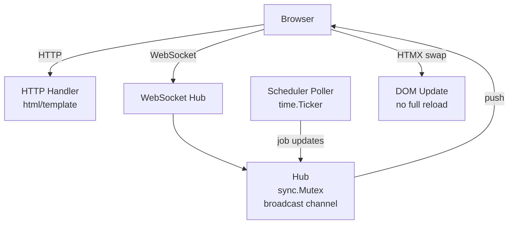

Live ops dashboard for the distributed scheduler. WebSocket hub broadcasts job state changes to all connected browsers. HTMX swaps DOM fragments without a full page reload.

---

### 8. platform-console

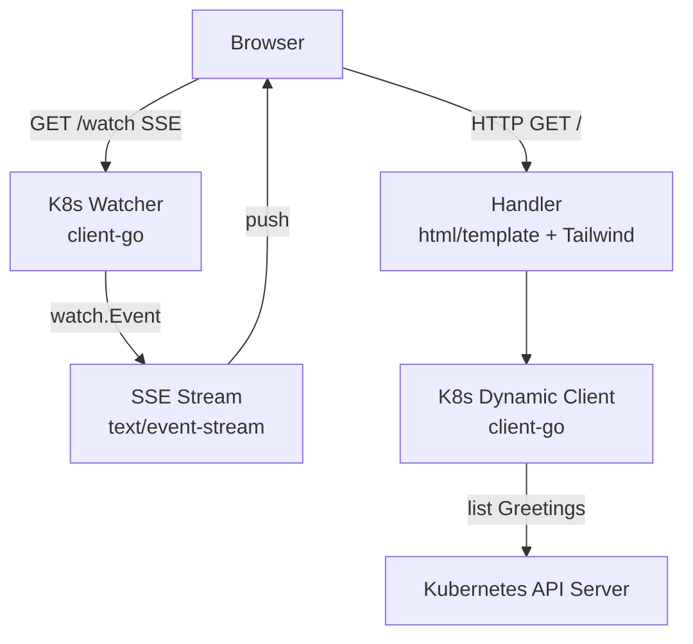

Web console for browsing `Greeting` custom resources. Uses client-go's dynamic client for CRD listing and a Server-Sent Events stream for live updates.

---

### 9. cli-tui

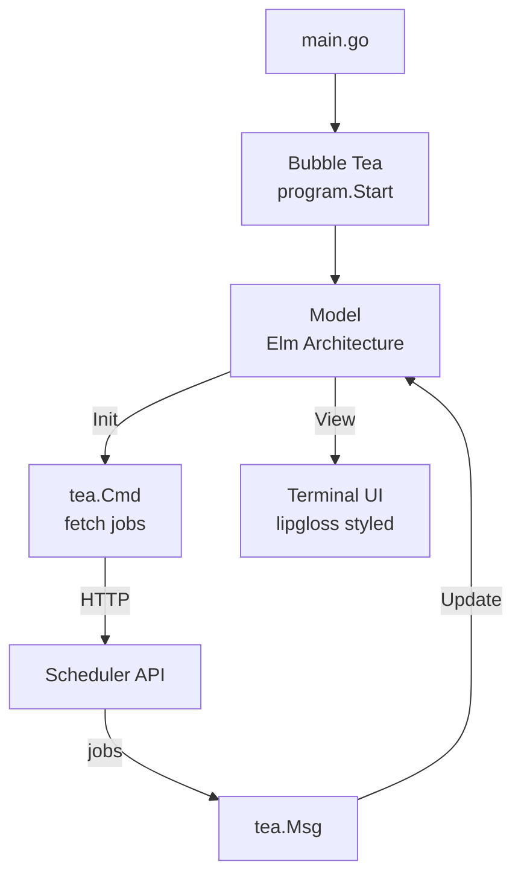

Terminal dashboard for the distributed scheduler using Bubble Tea's Elm-inspired architecture (Model → Update → View). lipgloss handles styling and layout.

---

### 10. aws-resource-reaper

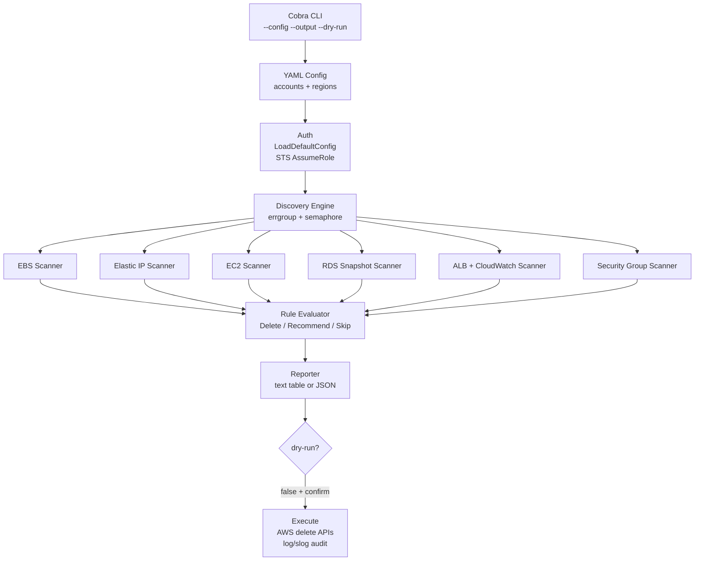

Concurrent FinOps CLI. Runs on EC2/ECS with an instance profile, assumes roles into target accounts, scans 6 resource types across all regions in parallel, and reports or removes idle resources.

---

### 11. gocker

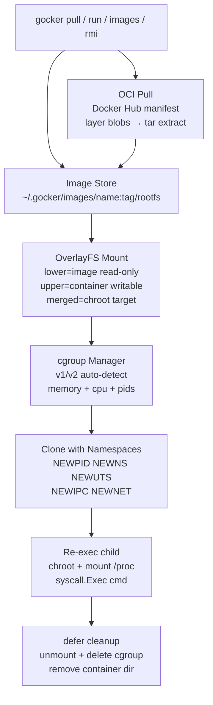

Mini Docker from scratch. Pulls real Alpine images via OCI spec, mounts OverlayFS for copy-on-write isolation, enforces resource limits via cgroups, and isolates processes with Linux namespaces.

---

### 12. tf-drift-detector

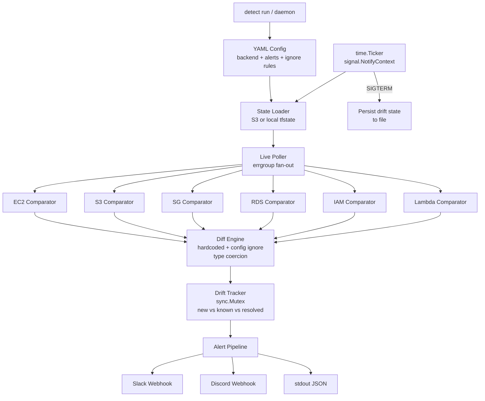

Daemon that compares Terraform state against live AWS infrastructure. Stateful tracking alerts only on new/resolved drift. Hardcoded + config-driven false-positive suppression.

---

### 13. raft-kv-store

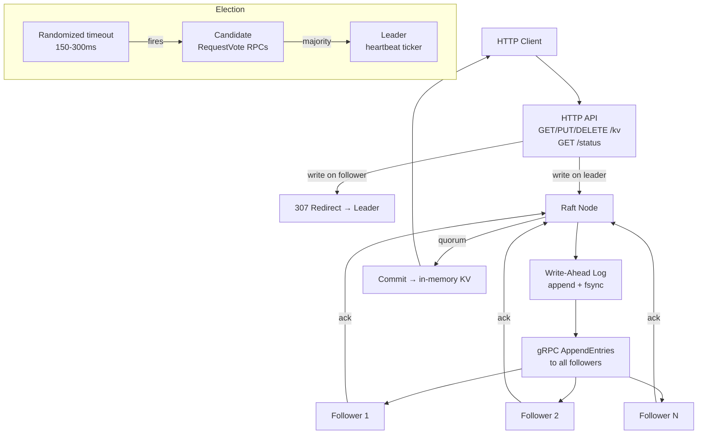

Distributed KV store implementing the Raft consensus algorithm from scratch. Leader election with randomized timeouts, log replication with quorum-based commits, WAL durability, and HTTP REST API.

---

### 14. xdp-firewall

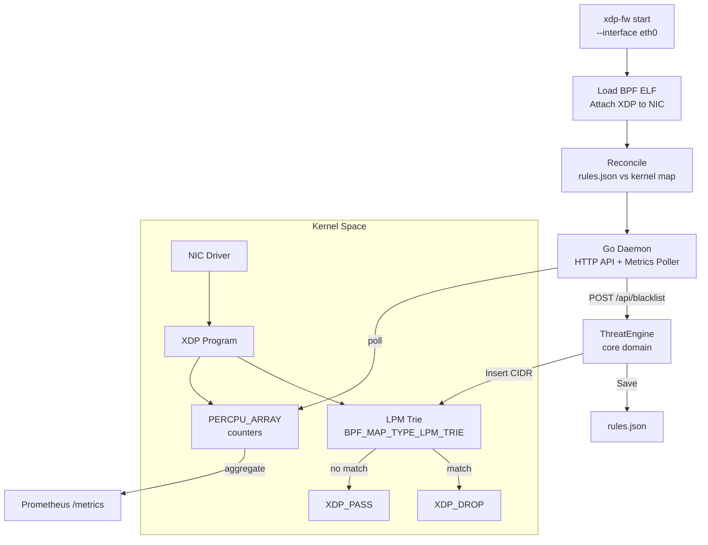

Kernel-level XDP firewall. Drops packets from blacklisted CIDRs at the NIC driver level using an eBPF LPM trie — before the Linux networking stack allocates memory. Hexagonal architecture with HTTP admin API, atomic file persistence, and Prometheus metrics.

---

### 15. k8s-event-sink

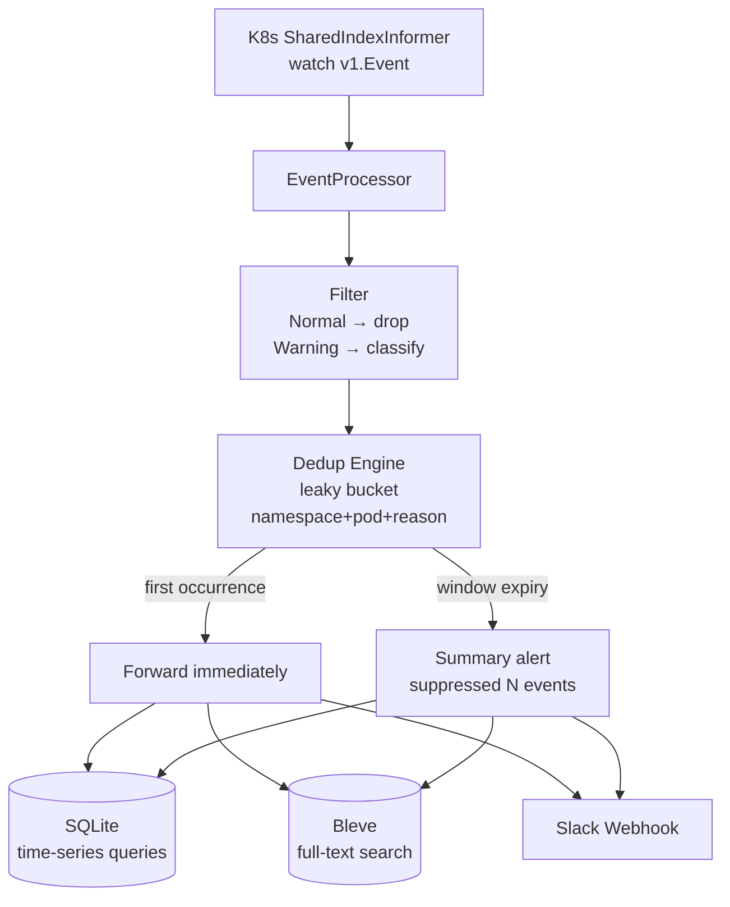

Kubernetes event vacuum daemon. Streams cluster events via informers, deduplicates with leaky bucket (first occurrence forwarded immediately, summary on window expiry), classifies severity, persists to embedded SQLite + Bleve. Single binary, zero external dependencies.

---

### 16. secure-api

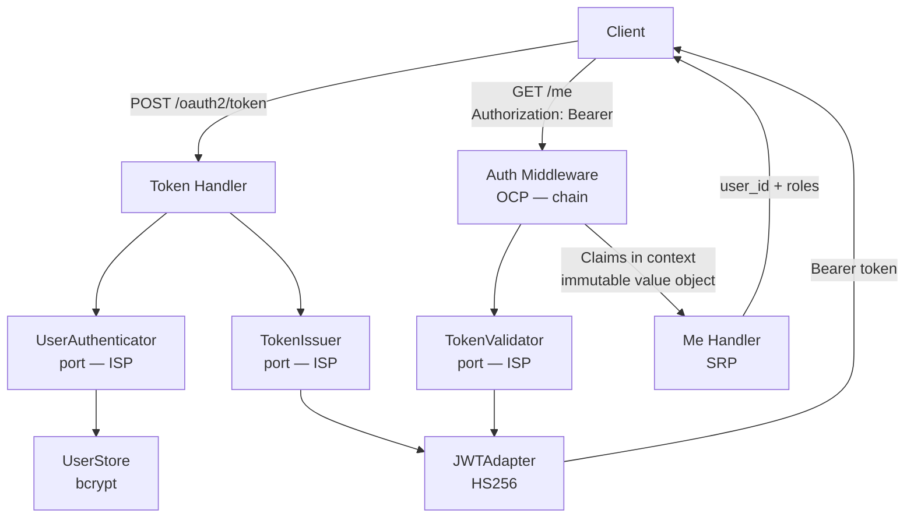

JWT + OAuth2 password grant + optional mTLS HTTP API. Built with SOLID principles, TDD (table-driven tests), and immutable value objects.

---

### 17. cache-service

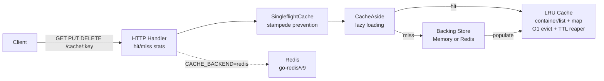

In-memory + Redis caching layer. Hand-rolled LRU cache with O(1) eviction and background TTL reaper. Three strategies: cache-aside, write-through, and singleflight stampede prevention.

---

### 18. rabbitmq-worker

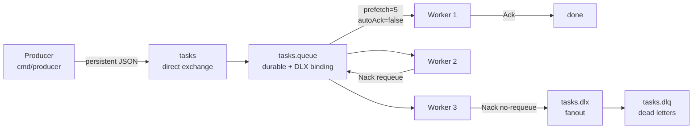

RabbitMQ task worker system. Durable exchange, DLX for failed messages after 3 retries, QoS prefetch for backpressure, graceful SIGTERM shutdown.
