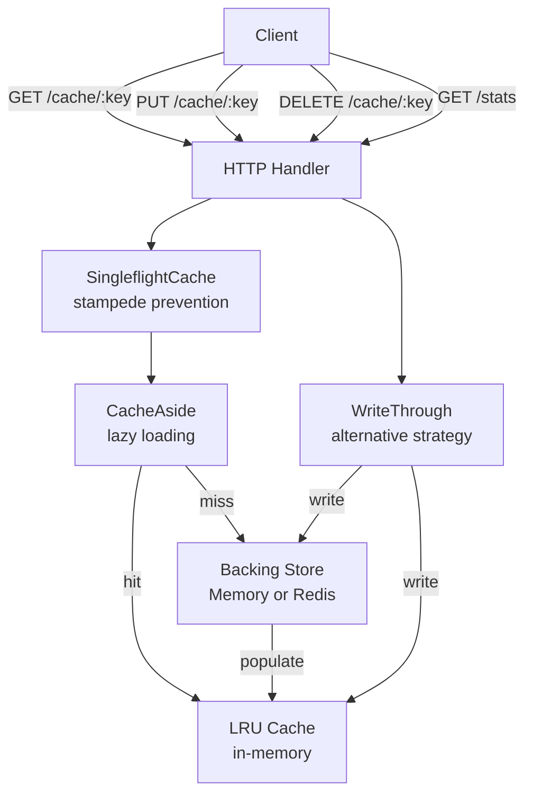
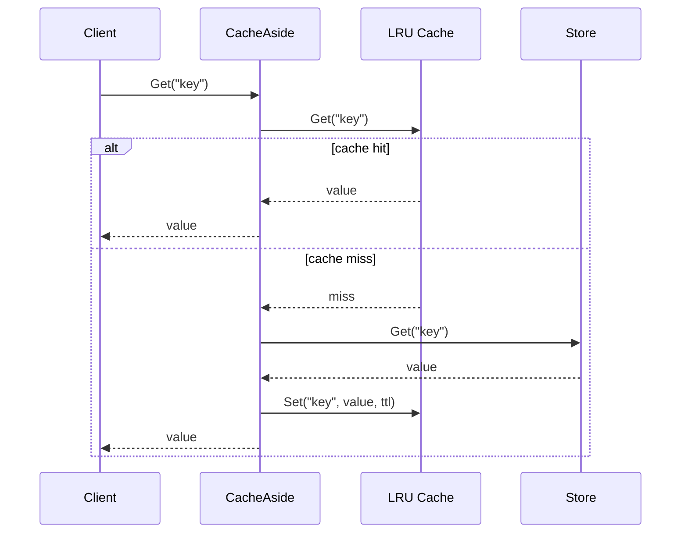

# cache-service

An HTTP caching layer demonstrating **LRU eviction**, **TTL-based expiry**, **cache-aside**, **write-through**, and **singleflight stampede prevention** — with pluggable in-memory LRU or Redis backends.

---

## Architecture



## Cache-Aside Flow



## Key Concepts

| Strategy | Write path | Read path | Trade-off |
|---|---|---|---|
| **Cache-aside** | Write to store only | Check cache → miss → fetch store → populate | Stale reads possible; cache populated lazily |
| **Write-through** | Write to cache + store atomically | Always hits cache | No stale reads; write latency slightly higher |
| **Singleflight** | Passthrough | Deduplicates concurrent misses | Prevents thundering herd; adds slight latency for first caller |

### LRU Eviction
Uses a doubly-linked list (`container/list`) + hash map for O(1) get/set/evict. The most-recently-used entry is at the front; the least-recently-used is at the back and evicted when capacity is exceeded.

### TTL Reaper
A background goroutine ticks every second and scans the list from back to front, removing expired entries. Per-entry `expiresAt` is checked on `Get` as well for immediate expiry.

### Singleflight
`golang.org/x/sync/singleflight` ensures that if 1000 goroutines simultaneously miss the same key, only one backing-store fetch is issued. The other 999 wait and share the result.

## Quick Start

```bash
# In-memory LRU (default)
make run

# With Redis backend
make docker-up
CACHE_BACKEND=redis make run

# Set a value
curl -s -X PUT http://localhost:8081/cache/foo \
  -H 'Content-Type: application/json' \
  -d '{"value":"bar"}' 

# Get it back
curl -s http://localhost:8081/cache/foo | jq .

# Stats
curl -s http://localhost:8081/stats | jq .
```

## Docs

- [`docs/deep-dive.md`](./docs/deep-dive.md)
- [`docs/adr/001-lru-over-lfu.md`](./docs/adr/001-lru-over-lfu.md)
