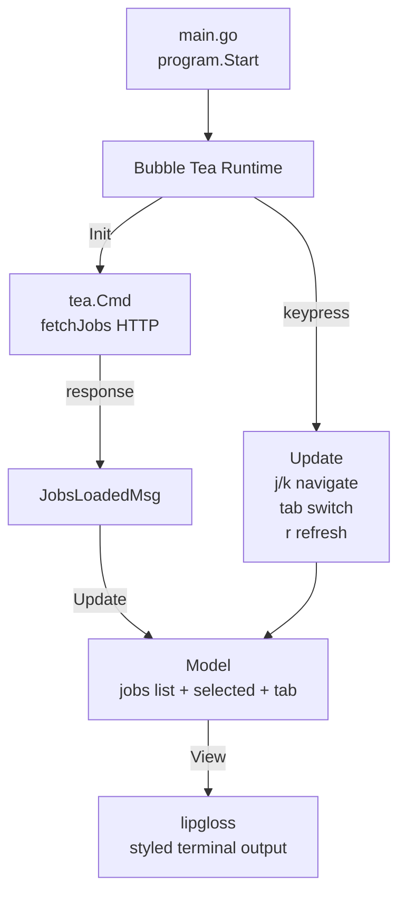
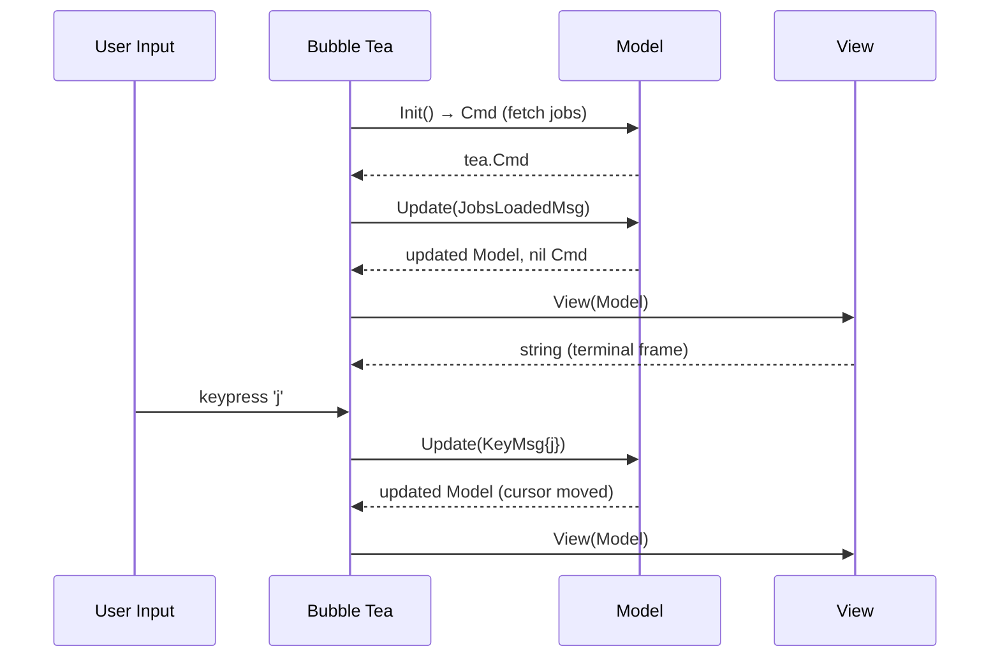

# cli-tui

A terminal dashboard for the distributed scheduler built with Bubble Tea — demonstrating the Elm architecture (Model/Update/View) in a Go TUI.

---

## Architecture



## Elm Architecture in Go



## Key Concepts

- **Model** — immutable snapshot of all UI state: job list, selected index, active tab, loading flag.
- **Update** — pure function `(Model, Msg) → (Model, Cmd)`. No side effects — all I/O happens in `Cmd`.
- **View** — pure function `Model → string`. lipgloss applies colors, borders, and layout.
- **Cmd** — a function that runs asynchronously and returns a `Msg`. Used for HTTP calls, tickers, etc.

## Key Bindings

| Key | Action |
|-----|--------|
| `j` / `↓` | Move cursor down |
| `k` / `↑` | Move cursor up |
| `tab` | Switch tab |
| `r` | Refresh jobs |
| `q` / `ctrl+c` | Quit |

## Quick Start

```bash
# Requires the distributed-scheduler to be running on :8080
make run
```
