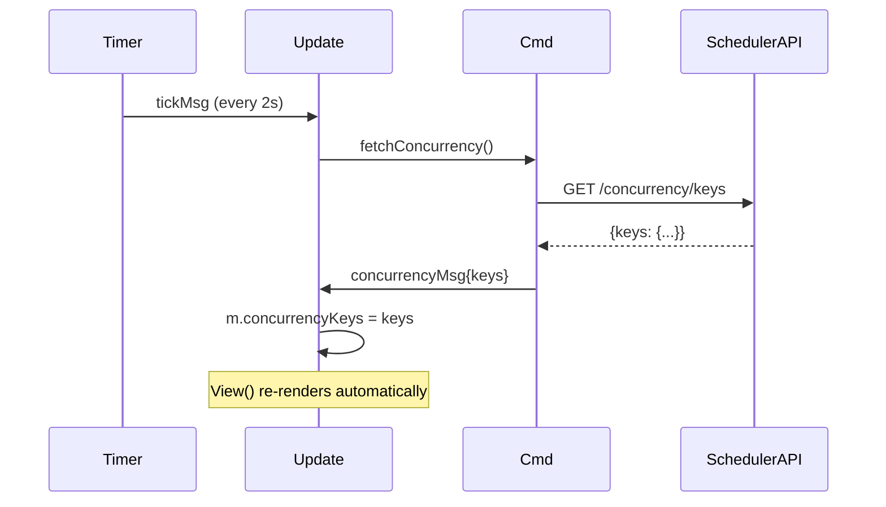

# CLI TUI: Deep Dive

A terminal dashboard for the distributed-scheduler using Bubble Tea (Elm architecture).

## Elm Architecture in Go

```
┌─────────────────────────────────────────────────────┐
│                    Bubble Tea Loop                   │
│                                                      │
│  Init() ──► Cmd ──► goroutine ──► Msg               │
│                                    │                 │
│  Update(Model, Msg) ──► (Model, Cmd)                │
│                │                                     │
│                └──► View(Model) ──► terminal string  │
└─────────────────────────────────────────────────────┘
```

## Message Flow



## Key Patterns

### Commands for Async Operations
HTTP calls run in goroutines via `tea.Cmd`:
```go
func fetchConcurrency(sched Client) tea.Cmd {
    return func() tea.Msg {          // runs in goroutine
        keys, err := sched.GetConcurrencyKeys(ctx)
        return concurrencyMsg{keys}  // returned as message
    }
}
```

### Pure View Function
`View()` is a pure function — same Model always produces the same string. No DOM, no diffing, just string rendering with lipgloss styles.

## Keyboard Shortcuts

| Key | Action |
|-----|--------|
| `tab` | Switch between Concurrency / Submit views |
| `r` | Force refresh from scheduler |
| `↑/↓` or `j/k` | Navigate form fields |
| `enter` | Submit job (on Submit tab) |
| `q` | Quit |

## How to Run

```shell
# Start the distributed-scheduler first
cd ../distributed-scheduler && make docker-up && make run

# Then run the TUI
make run
```
